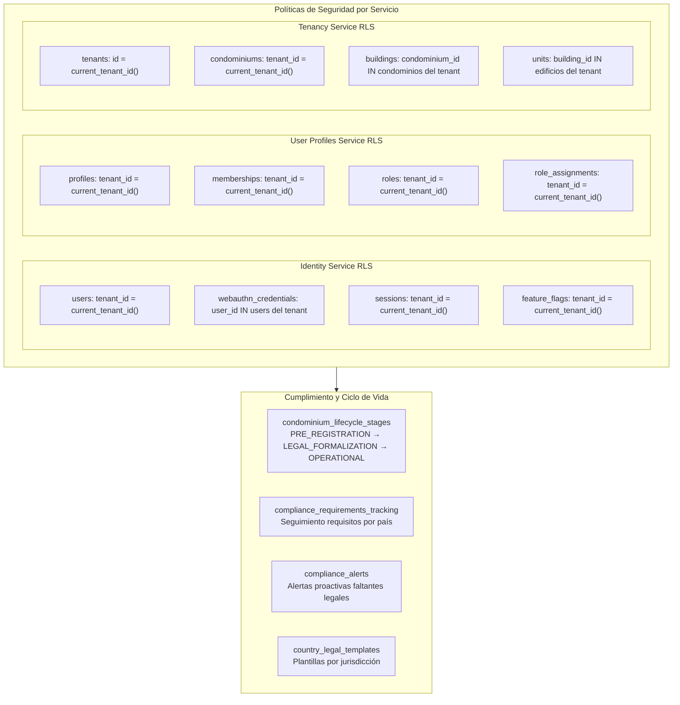
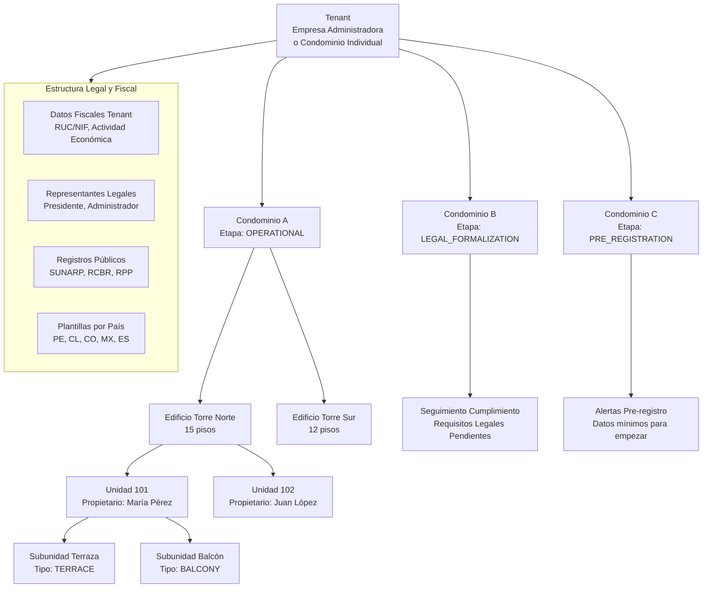
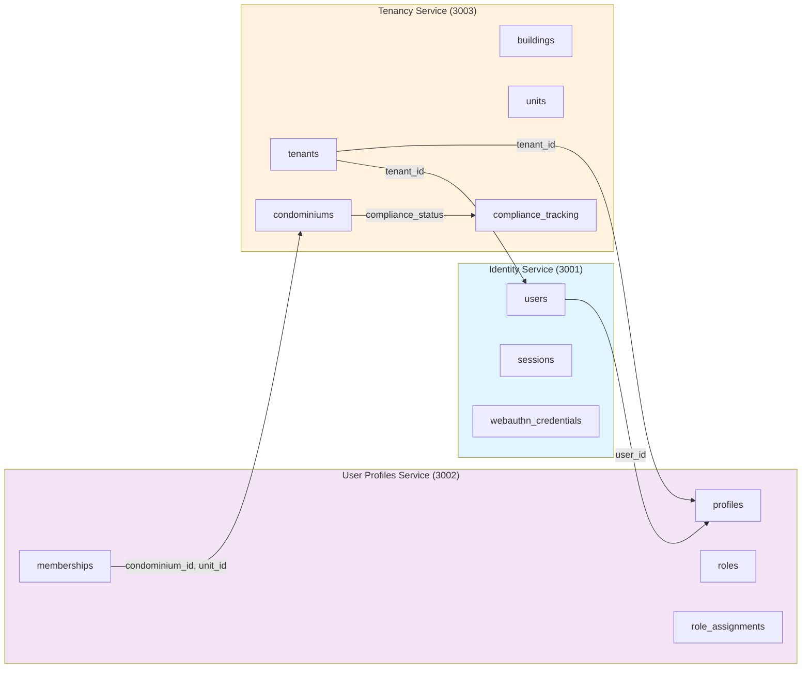

# Representación Gráfica Completa de las Bases de Datos SmartEdify

## 🗂️ **Diagrama de Base de Datos por Servicio**

```mermaid
erDiagram
    %% =============================================
    %% IDENTITY SERVICE (3001) - Núcleo de Autenticación
    %% =============================================
    users {
        uuid id PK "UUID v4 generado al crear usuario"
        uuid tenant_id "ID del tenant seleccionado en login"
        text username "Nombre de usuario elegido"
        text email "Email ingresado en registro"
        text phone "Teléfono con código de país"
        text status "ACTIVE, SUSPENDED, DELETED"
        timestamptz email_verified_at "Timestamp verificación email"
        timestamptz created_at "Fecha creación registro"
    }

    webauthn_credentials {
        uuid id PK "UUID v4 interno"
        uuid user_id FK "Relación con users.id"
        bytea credential_id "ID binario credencial WebAuthn"
        bytea public_key "Clave pública formato COSE"
        bigint sign_count "Contador de firmas"
        text rp_id "Relying Party ID"
        text origin "Origen HTTPS del cliente"
        timestamptz last_used_at "Último uso credencial"
        timestamptz created_at "Fecha registro credencial"
    }

    refresh_tokens {
        uuid id PK "UUID v4 token refresco"
        text token_hash "Hash SHA-256 token refresco"
        uuid user_id FK "Usuario dueño token"
        text jkt "DPoP JWK Thumbprint"
        uuid family_id "ID familia tokens"
        text device_id "Identificador dispositivo"
        uuid session_id FK "Sesión asociada token"
        timestamptz expires_at "Fecha expiración"
        boolean revoked "Indica si fue revocado"
        timestamptz created_at "Momento emisión token"
        uuid replaced_by_id "ID nuevo token que invalidó"
    }

    sessions {
        uuid id PK "UUID v4 sesión"
        uuid user_id FK "Usuario asociado"
        uuid tenant_id "Tenant activo en sesión"
        text device_id "Device_id usado en refresh_tokens"
        text cnf_jkt "DPoP confirmation thumbprint"
        timestamptz not_after "Invalida sesión después fecha"
        timestamptz revoked_at "Timestamp revocación"
        integer version "Para optimistic locking"
        boolean storage_validation_passed "Validaciones almacenamiento seguro"
    }

    feature_flags {
        uuid id PK "UUID v4 flag"
        uuid tenant_id "ID tenant aplica"
        text name "Nombre técnico flag"
        text description "Descripción legible"
        boolean enabled "Estado actual flag"
        timestamptz created_at "Fecha creación flag"
        timestamptz updated_at "Última modificación"
    }

    %% =============================================
    %% USER PROFILES SERVICE (3002) - Identidad Funcional
    %% =============================================
    profiles {
        uuid id PK
        uuid tenant_id
        text email "unique"
        text phone
        text full_name
        text status "PENDING_VERIFICATION, ACTIVE, etc."
        text country_code
        timestamptz created_at
        timestamptz updated_at
        timestamptz deleted_at
    }

    memberships {
        uuid id PK
        uuid tenant_id
        uuid profile_id FK
        uuid condominium_id "Referencia a condominiums tenancy-service"
        uuid unit_id "Referencia a units tenancy-service"
        text relation "OWNER, TENANT, CONVIVIENTE, STAFF, etc."
        text tenant_type "ARRENDATARIO, CONVIVIENTE"
        jsonb privileges "default: {}"
        uuid responsible_profile_id FK
        timestamptz since "default: now()"
        timestamptz until
        text status "Columna generada: ACTIVE o ENDED"
    }

    roles {
        uuid id PK
        uuid tenant_id
        uuid condominium_id
        text name
        jsonb permissions "default: []"
    }

    role_assignments {
        uuid id PK
        uuid tenant_id
        uuid profile_id FK
        uuid condominium_id
        uuid role_id FK
        timestamptz granted_at "default: now()"
        timestamptz revoked_at
    }

    profile_entitlements {
        uuid id PK
        uuid tenant_id
        uuid profile_id FK
        uuid condominium_id
        text service_code
        text entitlement_key
        timestamptz granted_at "default: now()"
        timestamptz revoked_at
    }

    communication_consents {
        uuid id PK
        uuid tenant_id
        uuid profile_id FK
        text channel
        text purpose
        boolean allowed
        text policy_version
        timestamptz updated_at "default: now()"
    }

    policy_bindings {
        uuid id PK
        uuid tenant_id
        uuid condominium_id
        uuid policy_id
        text policy_version
        text scope
    }

    %% =============================================
    %% TENANCY SERVICE (3003) - Raíz Organizacional
    %% =============================================
    tenants {
        uuid id PK
        text name
        text legal_name
        text tenant_type "ADMIN_COMPANY | INDIVIDUAL_CONDOMINIUM"
        text jurisdiction_root
        text status "default: ACTIVE"
        text data_residency "Código región residencia datos"

        %% Datos Fiscales
        text tax_identification_type "RUC, NIF, CIF, EIN, etc."
        text tax_identification_number
        text economic_activity_code "Código actividad económica"
        text tax_residency_country
        text tax_regime_type "Régimen fiscal"
        text business_entity_type "Sociedad Anónima, SL, SA de CV, Ltda., etc."
        text commercial_registry_number
        text commercial_registry_office
        date constitution_date
        text legal_representative_tax_id "DNI/NIE representante legal"
        text legal_representative_name
        text legal_representative_nationality

        %% Datos Contacto Legal
        jsonb legal_address "Dirección legal notificaciones"
        jsonb fiscal_address "Dirección fiscal"
        jsonb authorized_signatories "Lista firmantes autorizados"

        timestamptz created_at
        timestamptz updated_at
    }

    condominiums {
        uuid id PK
        uuid tenant_id FK
        text name
        jsonb address "{street, city, country, postal_code}"
        text jurisdiction "Código país: PE, BR, CL"
        text timezone
        text currency
        text status "default: ACTIVE"

        %% Ciclo de Vida y Cumplimiento
        text current_stage "PRE_REGISTRATION, LEGAL_FORMALIZATION, OPERATIONAL, INACTIVE"
        timestamptz stage_started_at "default: now()"
        boolean is_primary "TRUE para condominios individuales"
        text compliance_status "default: PENDING_REVIEW"
        timestamptz last_compliance_check
        date next_compliance_deadline

        %% Datos Legales (Pueden ser NULL en pre-registro)
        text legal_registry_number "Número registro propiedad"
        text property_deed_number "Número escritura pública"
        date property_deed_date "Fecha escritura"
        text property_deed_notary "Notaría/autoridad registro"
        text cadastral_reference "Referencia catastral"
        integer construction_year "Año construcción"
        decimal total_land_area "Área total terreno m²"
        decimal total_built_area "Área construida total m²"
        decimal total_common_areas "Área común total m²"
        boolean horizontal_property_regime "default: true"
        text registry_office "Oficina registral"
        text registry_entry "Asiento registral"
        text legal_representative_id "DNI/RUC representante legal"
        text legal_representative_name "Nombre representante legal"
        text legal_representative_role "Cargo representante legal"
        date constitution_date "Fecha constitución condominio"
        date statutes_approval_date "Fecha aprobación estatutos"
        date last_assembly_date "Fecha última asamblea"

        timestamptz created_at
        timestamptz updated_at
    }

    buildings {
        uuid id PK
        uuid condominium_id FK
        text name
        integer floors
        jsonb address_override "Dirección específica si diferente"
        timestamptz created_at
        timestamptz updated_at
    }

    units {
        uuid id PK
        uuid building_id FK
        text unit_number
        text owner_user_id "Referencia ID perfil user-profiles-service"
        text type "RESIDENTIAL, COMMERCIAL, PARKING, STORAGE"
        decimal area_sqm
        integer bedrooms
        integer bathrooms
        text status "default: ACTIVE"
        timestamptz created_at
        timestamptz updated_at
    }

    subunits {
        uuid id PK
        uuid unit_id FK
        text subunit_number
        text description
        decimal area_sqm
        text type "INTERNAL, BALCONY, TERRACE, PATIO"
        timestamptz created_at
        timestamptz updated_at
    }

    %% =============================================
    %% NUEVAS TABLAS PARA CICLO DE VIDA Y CUMPLIMIENTO
    %% =============================================
    condominium_lifecycle_stages {
        uuid id PK
        uuid condominium_id FK
        text stage_type "PRE_REGISTRATION, LEGAL_FORMALIZATION, OPERATIONAL, INACTIVE"
        date start_date
        date target_completion_date
        date actual_completion_date
        text status "IN_PROGRESS, COMPLETED, BLOCKED"
        jsonb required_legal_milestones "Lista hitos legales"
        timestamptz created_at
        timestamptz updated_at
    }

    country_legal_templates {
        uuid id PK
        text country_code "PE, CL, CO, MX, ES, etc."
        text template_type "CONDOMINIUM_REGISTRATION, TAX_OBLIGATIONS, LEGAL_REPRESENTATION"
        jsonb pre_registration_requirements "default: []"
        jsonb legal_formalization_requirements "default: []"
        jsonb operational_requirements "default: []"
        integer max_pre_registration_duration "Días máximos pre-registro"
        integer legal_formalization_deadline "Días completar formalización"
        jsonb compliance_alerts "Configuración alertas requisitos faltantes"
        date effective_from
        date effective_until
        text version
        timestamptz created_at
        timestamptz updated_at
    }

    compliance_requirements_tracking {
        uuid id PK
        uuid condominium_id FK
        uuid country_template_id FK
        text requirement_name
        text requirement_description
        text required_stage
        text current_status "PENDING, IN_PROGRESS, COMPLETED, OVERDUE"
        timestamptz date_identified "default: now()"
        date date_due
        timestamptz date_completed
        boolean blocking_requirement "default: false"
        text compliance_risk_level "LOW, MEDIUM, HIGH, CRITICAL"
        uuid assigned_to_profile_id "Persona responsable"
        text notes
        timestamptz created_at
        timestamptz updated_at
    }

    compliance_alerts {
        uuid id PK
        uuid tenant_id
        uuid condominium_id FK
        text alert_type "MISSING_DATA, DEADLINE_APPROACHING, REGULATORY_CHANGE"
        text alert_severity "INFO, WARNING, ERROR, CRITICAL"
        text requirement_description
        text missing_field "Campo específico faltante"
        text current_stage
        text target_stage
        date deadline
        integer days_until_deadline
        text required_action
        text action_url "URL completar acción"
        text assigned_to_role "ADMIN, LEGAL_REPRESENTATIVE, etc."
        text status "ACTIVE, ACKNOWLEDGED, RESOLVED"
        timestamptz acknowledged_at
        timestamptz resolved_at
        timestamptz created_at
        timestamptz updated_at
    }

    legal_representatives {
        uuid id PK
        uuid tenant_id
        uuid condominium_id FK "NULL si representante tenant"
        text identification_type "DNI, RUC, Pasaporte, NIE, etc."
        text identification_number
        text full_name
        text nationality
        text representative_role "Presidente, Administrador, Apoderado, etc."
        text powers_description "Descripción poderes otorgados"
        text powers_limitations "Limitaciones poderes"
        date appointment_date
        date appointment_end_date
        text appointment_act_reference "Referencia acta nombramiento"
        text email
        text phone
        jsonb address
        text status "default: ACTIVE"
        timestamptz created_at
        timestamptz updated_at
    }

    condominium_legal_records {
        uuid id PK
        uuid condominium_id FK
        uuid tenant_id "Para RLS"
        text registry_type "SUNARP, RCBR, RPP, etc."
        text registry_number
        text registry_volume
        text registry_sheet
        text registry_entry
        date registry_date
        text registration_number
        text notary_office
        text notary_name
        text notary_protocol_number
        date notary_date
        text cadastral_reference
        text cadastral_parcel
        text cadastral_sector
        date effective_from
        date effective_until
        boolean is_current "default: true"
        timestamptz created_at
        timestamptz updated_at
    }

    %% =============================================
    %% RELACIONES PRINCIPALES
    %% =============================================
    users ||--o{ webauthn_credentials : "tiene"
    users ||--o{ refresh_tokens : "posee"
    users ||--o{ sessions : "mantiene"
    tenants ||--o{ feature_flags : "configura"
    tenants ||--o{ condominiums : "administra"
    condominiums ||--o{ buildings : "contiene"
    buildings ||--o{ units : "compone"
    units ||--o{ subunits : "divide"
    
    profiles ||--o{ memberships : "pertenece"
    profiles ||--o{ role_assignments : "asignado"
    profiles ||--o{ profile_entitlements : "otorgado"
    profiles ||--o{ communication_consents : "consiente"
    
    roles ||--o{ role_assignments : "asignado_en"
    
    condominiums ||--o{ condominium_lifecycle_stages : "evoluciona"
    condominiums ||--o{ compliance_requirements_tracking : "requiere"
    condominiums ||--o{ compliance_alerts : "notifica"
    condominiums ||--o{ legal_representatives : "representado_por"
    condominiums ||--o{ condominium_legal_records : "registrado_en"
    
    country_legal_templates ||--o{ compliance_requirements_tracking : "define"
```



## 🔐 **Esquema de Seguridad y RLS (Row Level Security)**



## 📊 **Estructura Jerárquica Completa**



## 🗃️ **Índices Críticos por Rendimiento**

```sql
-- Identity Service
CREATE UNIQUE INDEX idx_users_tenant_email ON users(tenant_id, email);
CREATE INDEX idx_sessions_tenant_user ON sessions(tenant_id, user_id);
CREATE UNIQUE INDEX idx_feature_flags_tenant_name ON feature_flags(tenant_id, name);

-- User Profiles Service  
CREATE UNIQUE INDEX idx_profiles_tenant_email ON profiles(tenant_id, email);
CREATE UNIQUE INDEX idx_memberships_profile_condominium_unit ON memberships(profile_id, condominium_id, unit_id);
CREATE UNIQUE INDEX idx_roles_tenant_condominium_name ON roles(tenant_id, condominium_id, name);
CREATE UNIQUE INDEX idx_role_assignments_profile_condominium_role ON role_assignments(profile_id, condominium_id, role_id);

-- Tenancy Service
CREATE INDEX idx_condominiums_tenant_stage ON condominiums(tenant_id, current_stage);
CREATE INDEX idx_condominiums_compliance_status ON condominiums(compliance_status, next_compliance_deadline);
CREATE INDEX idx_buildings_condominium ON buildings(condominium_id);
CREATE INDEX idx_units_building ON units(building_id);
CREATE INDEX idx_subunits_unit ON subunits(unit_id);

-- Cumplimiento y Ciclo de Vida
CREATE INDEX idx_compliance_tracking_condominium_status ON compliance_requirements_tracking(condominium_id, current_status);
CREATE INDEX idx_compliance_alerts_condominium_severity ON compliance_alerts(condominium_id, alert_severity, status);
CREATE INDEX idx_legal_representatives_tenant_condominium ON legal_representatives(tenant_id, condominium_id, status);
CREATE INDEX idx_country_templates_country_type ON country_legal_templates(country_code, template_type, effective_from);
```

## 🔄 **Flujo de Datos entre Servicios**



## 🎯 **Resumen de Consideraciones Implementadas**

### ✅ **Correcciones Aplicadas:**
1. **Estandarización UUID**: Todos los IDs son `uuid` (corregido Tenancy Service)
2. **Consistencia Temporal**: Todos los timestamps son `timestamptz`
3. **RLS Completado**: Todas las tablas con políticas de aislamiento por `tenant_id`
4. **Datos Legales**: Estructura completa para validez jurídica multijurisdiccional
5. **Ciclo de Vida**: Soporte para etapas progresivas de formalización
6. **Cumplimiento Proactivo**: Sistema de alertas y seguimiento de requisitos

### 🛡️ **Características de Seguridad:**
- **Aislamiento Multi-tenant**: RLS en todas las tablas
- **Integridad Referencial**: Claves foráneas consistentes entre servicios
- **Auditoría Completa**: Timestamps de creación y actualización
- **Cumplimiento Legal**: Datos para validez jurídica por país

### 🌍 **Escalabilidad Global:**
- **Plantillas por País**: Configuración específica por jurisdicción
- **Data Residency**: Metadatos de residencia de datos
- **Multi-moneda**: Soporte para diferentes divisas
- **Multi-jurisdicción**: Estructura adaptable a diferentes marcos legales

Esta estructura proporciona una base sólida, segura y escalable para la plataforma SmartEdify, cumpliendo con todos los requisitos funcionales, legales y de seguridad identificados.
