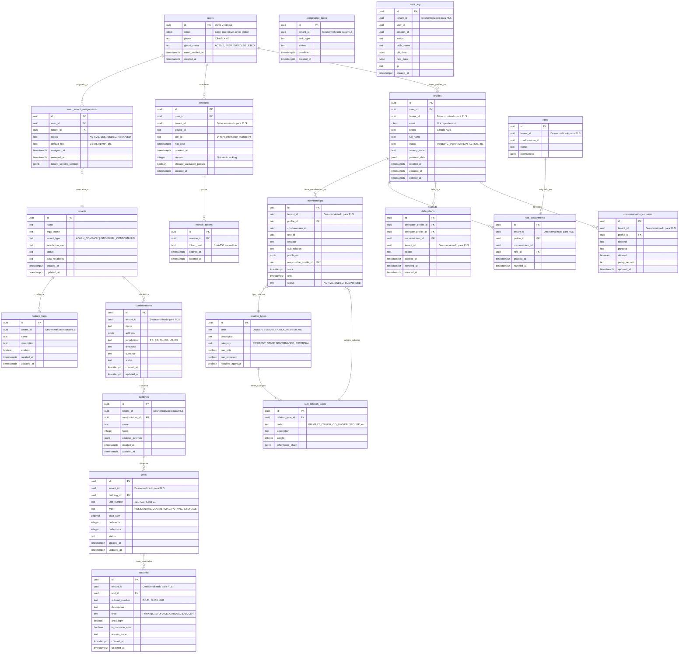
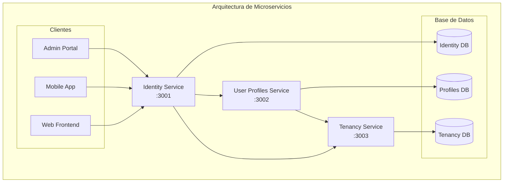
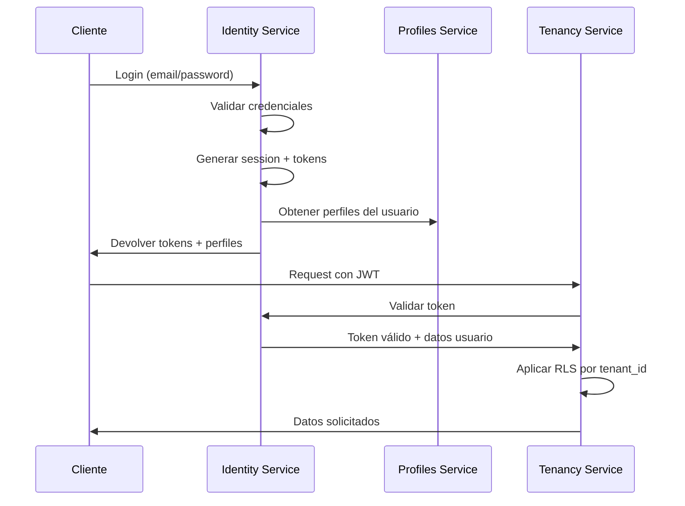
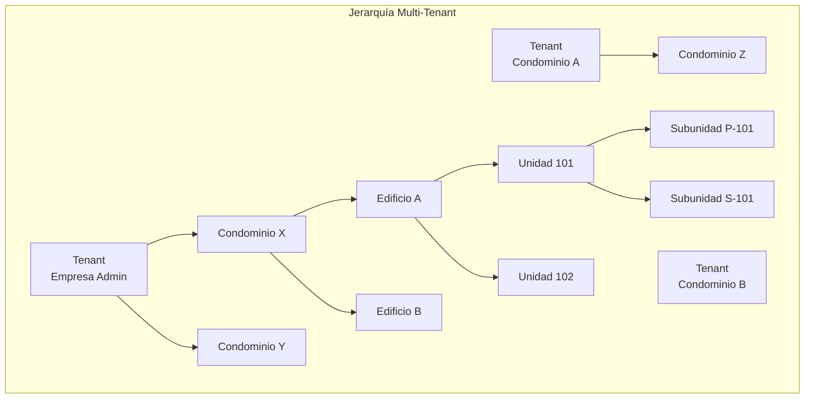

# Representación Gráfica del Modelo de Base de Datos



## Diagrama de Arquitectura de Microservicios



## Flujo de Autenticación y Autorización



## Jerarquía Organizacional



## Características Clave Visualizadas:

1. **Separación por Servicios**: Cada microservicio tiene su propio contexto
2. **Multi-tenancy**: `tenant_id` presente en todas las tablas principales
3. **Seguridad en Capas**: 
   - Identity (autenticación)
   - Profiles (autorización funcional)
   - RLS (seguridad a nivel de fila)
4. **Jerarquía Flexible**: Tenant → Condominio → Edificio → Unidad → Subunidad
5. **Sistema de Relaciones Complejo**: Tipos y subtipos de membresías

---

# Mockup con Datos Reales del Sistema de Gestión de Condominios

## 1. Identity Service (3001) - Datos de Autenticación

### Tabla: users
```json
{
  "id": "a1b2c3d4-e5f6-7890-abcd-ef1234567890",
  "email": "maria.gonzalez@email.com",
  "phone": "encrypted:kms:abc123encrypteddata456",
  "global_status": "ACTIVE",
  "email_verified_at": "2024-01-15T10:30:00Z",
  "created_at": "2024-01-10T08:15:23Z"
}
```

### Tabla: user_tenant_assignments
```json
{
  "id": "b2c3d4e5-f6g7-8901-bcde-f23456789012",
  "user_id": "a1b2c3d4-e5f6-7890-abcd-ef1234567890",
  "tenant_id": "t1e2n3a4-n5t6-7890-tenant-00123456789",
  "status": "ACTIVE",
  "default_role": "ADMIN",
  "assigned_at": "2024-01-10T08:20:00Z",
  "removed_at": null,
  "tenant_specific_settings": {
    "language": "es",
    "timezone": "America/Lima",
    "notifications": {
      "email": true,
      "push": true,
      "sms": false
    }
  }
}
```

### Tabla: sessions
```json
{
  "id": "s1e2s3s4-i5o6-7890-sess-00123456789",
  "user_id": "a1b2c3d4-e5f6-7890-abcd-ef1234567890",
  "tenant_id": "t1e2n3a4-n5t6-7890-tenant-00123456789",
  "device_id": "iPhone14,3-iOS-17.2",
  "cnf_jkt": "abc123jwkthumbprint456def",
  "not_after": "2024-06-10T08:15:23Z",
  "revoked_at": null,
  "version": 3,
  "storage_validation_passed": true,
  "created_at": "2024-05-10T08:15:23Z"
}
```

## 2. Tenancy Service (3003) - Estructura Organizacional

### Tabla: tenants
```json
{
  "id": "t1e2n3a4-n5t6-7890-tenant-00123456789",
  "name": "Residencial Las Gardenias",
  "legal_name": "Comunidad de Propietarios Residencial Las Gardenias S.A.",
  "tenant_type": "INDIVIDUAL_CONDOMINIUM",
  "jurisdiction_root": "PE",
  "status": "ACTIVE",
  "data_residency": "PE-LIM",
  "created_at": "2023-05-15T00:00:00Z",
  "updated_at": "2024-05-01T14:20:00Z"
}
```

### Tabla: condominiums
```json
{
  "id": "c1o2n3d4-o5m6-7890-condo-001234567",
  "tenant_id": "t1e2n3a4-n5t6-7890-tenant-00123456789",
  "name": "Torre Principal - Las Gardenias",
  "address": {
    "street": "Av. Las Gardenias 1234",
    "district": "Miraflores",
    "city": "Lima",
    "region": "Lima Metropolitana",
    "country": "PE",
    "postal_code": "15074",
    "coordinates": {
      "lat": -12.119163,
      "lng": -77.034904
    }
  },
  "jurisdiction": "PE",
  "timezone": "America/Lima",
  "currency": "PEN",
  "status": "ACTIVE",
  "created_at": "2023-05-15T00:00:00Z",
  "updated_at": "2024-05-01T14:20:00Z"
}
```

### Tabla: buildings
```json
{
  "id": "b1u2i3d4-i5n6-7890-build-001234567",
  "tenant_id": "t1e2n3a4-n5t6-7890-tenant-00123456789",
  "condominium_id": "c1o2n3d4-o5m6-7890-condo-001234567",
  "name": "Torre A",
  "floors": 12,
  "address_override": null,
  "created_at": "2023-05-15T00:00:00Z",
  "updated_at": "2024-01-10T09:00:00Z"
}
```

### Tabla: units
```json
{
  "id": "u1n2i3t4-u5n6-7890-unit-0012345678",
  "tenant_id": "t1e2n3a4-n5t6-7890-tenant-00123456789",
  "building_id": "b1u2i3d4-i5n6-7890-build-001234567",
  "unit_number": "1201",
  "type": "RESIDENTIAL",
  "area_sqm": 145.5,
  "bedrooms": 3,
  "bathrooms": 2,
  "status": "OCCUPIED",
  "created_at": "2023-05-15T00:00:00Z",
  "updated_at": "2024-03-15T10:30:00Z"
}
```

### Tabla: subunits
```json
{
  "id": "s1u2b3u4-n5i6-7890-subunit-012345",
  "tenant_id": "t1e2n3a4-n5t6-7890-tenant-00123456789",
  "unit_id": "u1n2i3t4-u5n6-7890-unit-0012345678",
  "subunit_number": "P-1201",
  "description": "Estacionamiento cubierto para unidad 1201",
  "type": "PARKING",
  "area_sqm": 12.5,
  "is_common_area": false,
  "access_code": "P1201-2024",
  "created_at": "2023-05-15T00:00:00Z",
  "updated_at": "2024-03-15T10:30:00Z"
}
```

## 3. User Profiles Service (3002) - Identidad Funcional

### Tabla: profiles
```json
{
  "id": "p1r2o3f4-i5l6-7890-prof-0012345678",
  "user_id": "a1b2c3d4-e5f6-7890-abcd-ef1234567890",
  "tenant_id": "t1e2n3a4-n5t6-7890-tenant-00123456789",
  "email": "maria.gonzalez@lasgardenias.com",
  "phone": "encrypted:kms:xyz987encrypteddata654",
  "full_name": "María Elena González Ruiz",
  "status": "ACTIVE",
  "country_code": "PE",
  "personal_data": {
    "document_type": "DNI",
    "document_number": "71234567",
    "birth_date": "1985-08-20",
    "emergency_contact": {
      "name": "Carlos González",
      "relationship": "Esposo",
      "phone": "+51987654321"
    },
    "preferences": {
      "communication_language": "es",
      "receive_newsletters": true,
      "allowed_visitors": 3
    }
  },
  "created_at": "2024-01-10T08:25:00Z",
  "updated_at": "2024-05-15T16:45:00Z",
  "deleted_at": null
}
```

### Tabla: relation_types
```json
{
  "id": "r1e2l3t4-y5p6-7890-reltype-01234",
  "code": "OWNER",
  "description": "Propietario de la unidad",
  "category": "RESIDENT",
  "can_vote": true,
  "can_represent": true,
  "requires_approval": false
}
```

### Tabla: sub_relation_types
```json
{
  "id": "s1u2b3r4-e5l6-7890-subrel-012345",
  "relation_type_id": "r1e2l3t4-y5p6-7890-reltype-01234",
  "code": "PRIMARY_OWNER",
  "description": "Propietario principal y responsable",
  "weight": 100,
  "inheritance_chain": ["OWNER", "RESIDENT"]
}
```

### Tabla: memberships
```json
{
  "id": "m1e2m3b4-e5r6-7890-memb-001234567",
  "tenant_id": "t1e2n3a4-n5t6-7890-tenant-00123456789",
  "profile_id": "p1r2o3f4-i5l6-7890-prof-0012345678",
  "condominium_id": "c1o2n3d4-o5m6-7890-condo-001234567",
  "unit_id": "u1n2i3t4-u5n6-7890-unit-0012345678",
  "relation": "OWNER",
  "sub_relation": "PRIMARY_OWNER",
  "privileges": {
    "voting_rights": true,
    "assembly_participation": true,
    "common_area_access": "full",
    "guest_registration": true,
    "package_reception": true,
    "facility_booking": {
      "pool": true,
      "gym": true,
      "party_room": true,
      "bbq_area": true
    }
  },
  "responsible_profile_id": "p1r2o3f4-i5l6-7890-prof-0012345678",
  "since": "2024-01-10T00:00:00Z",
  "until": null,
  "status": "ACTIVE"
}
```

### Tabla: roles
```json
{
  "id": "r1o2l3e4-r5o6-7890-role-00123456",
  "tenant_id": "t1e2n3a4-n5t6-7890-tenant-00123456789",
  "condominium_id": "c1o2n3d4-o5m6-7890-condo-001234567",
  "name": "Administrador de Condominio",
  "permissions": {
    "financial": {
      "view_budgets": true,
      "approve_expenses": true,
      "generate_reports": true
    },
    "operations": {
      "manage_staff": true,
      "approve_maintenance": true,
      "manage_facilities": true
    },
    "resident_management": {
      "view_profiles": true,
      "manage_visitors": true,
      "send_announcements": true
    }
  }
}
```

### Tabla: role_assignments
```json
{
  "id": "r1o2l3e4-a5s6-7890-roleass-01234",
  "tenant_id": "t1e2n3a4-n5t6-7890-tenant-00123456789",
  "profile_id": "p1r2o3f4-i5l6-7890-prof-0012345678",
  "condominium_id": "c1o2n3d4-o5m6-7890-condo-001234567",
  "role_id": "r1o2l3e4-r5o6-7890-role-00123456",
  "granted_at": "2024-01-15T09:00:00Z",
  "revoked_at": null
}
```

## 4. Datos de Soporte del Sistema

### Tabla: feature_flags
```json
{
  "id": "f1e2a3t4-f5l6-7890-flag-001234567",
  "tenant_id": "t1e2n3a4-n5t6-7890-tenant-00123456789",
  "name": "digital_payments",
  "description": "Habilitar sistema de pagos digitales",
  "enabled": true,
  "created_at": "2024-03-01T10:00:00Z",
  "updated_at": "2024-05-01T14:30:00Z"
}
```

### Tabla: communication_consents
```json
{
  "id": "c1o2m3m4-c5o6-7890-consent-0123",
  "tenant_id": "t1e2n3a4-n5t6-7890-tenant-00123456789",
  "profile_id": "p1r2o3f4-i5l6-7890-prof-0012345678",
  "channel": "EMAIL",
  "purpose": "FINANCIAL_NOTIFICATIONS",
  "allowed": true,
  "policy_version": "v2.1-2024",
  "updated_at": "2024-05-10T11:20:00Z"
}
```

### Tabla: compliance_tasks
```json
{
  "id": "c1o2m3p4-l5i6-7890-task-0012345",
  "tenant_id": "t1e2n3a4-n5t6-7890-tenant-00123456789",
  "task_type": "DATA_RETENTION_REVIEW",
  "status": "PENDING",
  "deadline": "2024-06-30T23:59:59Z",
  "created_at": "2024-05-01T09:00:00Z"
}
```

### Tabla: audit_log
```json
{
  "id": "a1u2d3i4-t5l6-7890-audit-001234",
  "tenant_id": "t1e2n3a4-n5t6-7890-tenant-00123456789",
  "user_id": "a1b2c3d4-e5f6-7890-abcd-ef1234567890",
  "session_id": "s1e2s3s4-i5o6-7890-sess-00123456789",
  "action": "UPDATE",
  "table_name": "profiles",
  "old_data": {
    "full_name": "María González",
    "personal_data": {
      "emergency_contact": {
        "name": "Carlos González",
        "relationship": "Esposo", 
        "phone": "+51987654320"
      }
    }
  },
  "new_data": {
    "full_name": "María Elena González Ruiz",
    "personal_data": {
      "emergency_contact": {
        "name": "Carlos González",
        "relationship": "Esposo",
        "phone": "+51987654321"
      }
    }
  },
  "ip": "192.168.1.100",
  "created_at": "2024-05-15T16:45:00Z"
}
```

## 5. Ejemplo de Usuario Adicional - Residente Regular

### Usuario: Carlos Mendoza (Inquilino)
```json
{
  "users": {
    "id": "c1a2r3l4-o5s6-7890-user-001234567",
    "email": "carlos.mendoza@email.com",
    "phone": "encrypted:kms:ijk654encrypteddata321",
    "global_status": "ACTIVE",
    "email_verified_at": "2024-02-20T14:25:00Z",
    "created_at": "2024-02-15T11:30:00Z"
  },
  "profiles": {
    "id": "p1r2o3f4-c5a6-7890-prof-001234567",
    "user_id": "c1a2r3l4-o5s6-7890-user-001234567",
    "tenant_id": "t1e2n3a4-n5t6-7890-tenant-00123456789",
    "email": "carlos.mendoza@lasgardenias.com",
    "full_name": "Carlos Alberto Mendoza Torres",
    "status": "ACTIVE",
    "country_code": "PE",
    "personal_data": {
      "document_type": "DNI",
      "document_number": "86543210",
      "birth_date": "1990-03-15",
      "occupation": "Ingeniero de Software"
    }
  },
  "memberships": {
    "id": "m1e2m3b4-c5a6-7890-memb-001234567",
    "profile_id": "p1r2o3f4-c5a6-7890-prof-001234567",
    "unit_id": "u1n2i3t4-u5n6-7890-unit-0012345678",
    "relation": "TENANT",
    "sub_relation": "RENTING_TENANT",
    "privileges": {
      "voting_rights": false,
      "assembly_participation": false,
      "common_area_access": "restricted",
      "guest_registration": true,
      "package_reception": true,
      "facility_booking": {
        "pool": true,
        "gym": true,
        "party_room": false,
        "bbq_area": false
      }
    },
    "since": "2024-03-01T00:00:00Z",
    "until": "2025-02-28T23:59:59Z",
    "status": "ACTIVE"
  }
}
```

## Resumen del Escenario Mockup:

**Contexto**: 
- **Condominio**: "Residencial Las Gardenias" en Miraflores, Lima
- **Estructura**: 1 edificio (Torre A) de 12 pisos
- **Unidad**: 1201 (145.5 m², 3 dormitorios)

**Personas**:
1. **María González** - Propietaria principal y Administradora del condominio
2. **Carlos Mendoza** - Inquilino de la unidad 1201

**Relaciones**:
- María tiene rol de OWNER (PRIMARY_OWNER) con todos los privilegios
- Carlos tiene rol de TENANT (RENTING_TENANT) con privilegios limitados
- María también tiene el rol administrativo "Administrador de Condominio"

Este mockup representa un escenario realista con datos consistentes que muestran cómo funcionaría el sistema en producción.
