# 🏛️ Arquitectura de Base de Datos — SmartEdify  
**Versión**: 2.1  
**Fecha**: 2025-10-13  
**Estado**: Aprobado para Implementación (Fase 1)  
**Autores**: Equipo de Arquitectura y DBA SmartEdify  
**Alcance**: Fase 1 — Core Backbone (`Identity`, `User Profiles`, `Tenancy`, `Compliance`)  

---

## 📌 Resumen Ejecutivo

Esta arquitectura de base de datos define un modelo relacional seguro, inmutable, multi-tenant y alineado con los principios de **Privacy by Design**, **Zero Trust**, **WORM**, **Row-Level Security (RLS)** y **cumplimiento multinormativo** exigidos por el [Documento de Visión v1.1](vision_document.txt).

Incorpora todas las observaciones técnicas críticas:
- ✅ **Inmutabilidad total** en `audit_log` con hash-chain, firma y WORM.
- ✅ **RLS obligatorio** por `tenant_id` en todos los servicios.
- ✅ **Integridad referencial** mediante FKs, UNIQUE y ENUM.
- ✅ **Cifrado AEAD** para PII sensibles (DNI, salud).
- ✅ **Particionado mensual** y estrategia de índices completa.
- ✅ **Gestión de ciclo de vida** con TTL, cron y anonimización.
- ✅ **Resiliencia operativa**: réplicas, PITR, RTO ≤ 5 min.
- ✅ **Consistencia transaccional** mediante patrón **Outbox**.

---

## 🧱 1. Principios de Diseño

| Principio | Aplicación |
|----------|------------|
| **Multi-tenancy** | Aislamiento por `tenant_id` + RLS en todas las tablas. |
| **Inmutabilidad** | `audit_log` es **append-only**, con hash-chain y respaldo WORM en S3. |
| **Privacy by Design** | PII cifrada en base de datos; datos sensibles en tablas separadas con consentimiento explícito. |
| **Zero Trust** | Cada operación requiere contexto (`tenant_id`, `session_id`) y DPoP. |
| **Event-Driven** | Patrón **Outbox** garantiza consistencia transaccional entre microservicios. |
| **Observabilidad** | Logs estructurados, métricas de rendimiento y alertas SLO. |

---

## 🔐 2. Modelo de Datos Mejorado

### 2.1 Diagrama ER Completo (v2.1)

```mermaid
---
config:
  layout: elk
---
erDiagram
    tenants ||--o{ feature_flags : "configura_tenancy"
    tenants ||--o{ feature_flags_user_profile : "configura_user_profile"
    tenants ||--o{ feature_flags_identity : "configura_identity"
    tenants ||--o{ feature_flags_compliance : "configura_compliance"
    
    tenants {
        uuid id PK
        text name
        text legal_name
        text tenant_type
        text jurisdiction_root
        status_t status
        text data_residency
        text dpo_contact
        boolean international_transfers
        timestamptz created_at
        timestamptz updated_at
    }

    feature_flags {
        uuid id PK
        uuid tenant_id FK
        uuid condominium_id FK
        text feature_name
        boolean enabled
        jsonb configuration
        timestamptz created_at
        timestamptz updated_at
    }

    feature_flags_user_profile {
        uuid id PK
        uuid tenant_id FK
        text feature_name
        boolean enabled
        jsonb configuration
        timestamptz created_at
        timestamptz updated_at
    }

    feature_flags_identity {
        uuid id PK
        uuid tenant_id FK
        text feature_name
        boolean enabled
        jsonb configuration
        timestamptz created_at
        timestamptz updated_at
    }

    feature_flags_compliance {
        uuid id PK
        uuid tenant_id FK
        text feature_name
        boolean enabled
        jsonb configuration
        timestamptz created_at
        timestamptz updated_at
    }

    users ||--o{ user_tenant_assignments : "asignado_a"
    users ||--o{ sessions : "mantiene"
    sessions ||--o{ refresh_tokens : "posee"
    users ||--o{ profiles : "tiene_perfiles_en"
    
    users {
        uuid id PK
        citext email
        text phone
        status_t global_status
        timestamptz email_verified_at
        timestamptz created_at
    }

    user_tenant_assignments {
        uuid id PK
        uuid user_id FK
        uuid tenant_id FK
        status_t status
        text default_role
        timestamptz assigned_at
        timestamptz removed_at
        jsonb tenant_specific_settings
    }

    sessions {
        uuid id PK
        uuid user_id FK
        uuid tenant_id FK
        text device_id
        text cnf_jkt
        timestamptz not_after
        timestamptz revoked_at
        integer version
        boolean storage_validation_passed
        timestamptz created_at
    }

    refresh_tokens {
        uuid id PK
        uuid session_id FK
        text token_hash
        timestamptz expires_at
        timestamptz created_at
    }

    profiles ||--o{ sensitive_data_categories : "tiene_datos_sensibles"
    profiles ||--o{ memberships : "tiene_membresias_en"
    profiles ||--o{ role_assignments : "asignado"
    profiles ||--o{ delegations : "delega_a"
    profiles ||--o{ communication_consents : "consiente"
    
    profiles {
        uuid id PK
        uuid user_id FK
        uuid tenant_id FK
        citext email
        text phone
        text full_name
        status_t status
        country_code_t country_code
        jsonb personal_data
        boolean habeas_data_acceptance
        timestamptz habeas_data_accepted_at
        timestamptz created_at
        timestamptz updated_at
        timestamptz deleted_at
    }

    sensitive_data_categories {
        uuid id PK
        uuid profile_id FK
        sensitive_category_t category
        legal_basis_t legal_basis
        text purpose
        timestamptz consent_given_at
        timestamptz expires_at
        boolean active
    }

    memberships {
        uuid id PK
        uuid tenant_id FK
        uuid profile_id FK
        uuid condominium_id FK
        uuid unit_id FK
        uuid relation_type_id FK
        uuid sub_relation_type_id FK
        jsonb privileges
        uuid responsible_profile_id FK
        timestamptz since
        timestamptz until
        status_t status
    }

    relation_types {
        uuid id PK
        text name
        text description
    }

    sub_relation_types {
        uuid id PK
        uuid relation_type_id FK
        text name
        text description
    }

    role_assignments {
        uuid id PK
        uuid profile_id FK
        uuid role_id FK
        timestamptz assigned_at
        timestamptz revoked_at
        status_t status
    }

    delegations {
        uuid id PK
        uuid delegator_profile_id FK
        uuid delegate_profile_id FK
        uuid role_id FK
        timestamptz start_date
        timestamptz end_date
        status_t status
    }

    communication_consents {
        uuid id PK
        uuid profile_id FK
        text channel
        boolean consented
        timestamptz consented_at
        timestamptz revoked_at
    }

    tenants ||--o{ condominiums : "administra"
    condominiums ||--o{ buildings : "contiene"
    buildings ||--o{ units : "compone"
    units ||--o{ subunits : "tiene_asociadas"
    tenants ||--o{ roles : "define_roles"
    
    condominiums {
        uuid id PK
        uuid tenant_id FK
        text name
        jsonb address
        text jurisdiction
        text timezone
        text currency
        status_t status
        timestamptz created_at
        timestamptz updated_at
    }

    buildings {
        uuid id PK
        uuid condominium_id FK
        text name
        text address_line
        integer floors
        jsonb amenities
        status_t status
        timestamptz created_at
    }

    units {
        uuid id PK
        uuid building_id FK
        text unit_number
        text unit_type
        decimal area
        integer bedrooms
        status_t status
        timestamptz created_at
    }

    subunits {
        uuid id PK
        uuid unit_id FK
        text subunit_number
        text subunit_type
        decimal area
        status_t status
    }

    roles {
        uuid id PK
        uuid tenant_id FK
        text name
        jsonb permissions
        timestamptz created_at
    }

    tenants ||--o{ data_subject_requests : "tiene_solicitudes"
    profiles ||--o{ data_subject_requests : "solicita"
    tenants ||--o{ data_bank_registrations : "registra_banco"
    tenants ||--o{ ccpa_opt_outs : "registra_opt_outs"
    tenants ||--o{ data_processing_agreements : "firma_acuerdos"
    tenants ||--o{ impact_assessments : "realiza_evaluaciones"
    tenants ||--o{ compliance_tasks : "gestiona_tareas"
    tenants ||--o{ audit_log : "genera_logs"
    
    audit_log {
        uuid id PK
        uuid tenant_id FK
        uuid user_id FK
        uuid session_id FK
        text action
        text table_name
        jsonb old_data
        jsonb new_data
        inet ip
        timestamptz created_at
        bytea hash_prev
        bytea signature
    }

    data_subject_requests {
        uuid id PK
        uuid tenant_id FK
        uuid profile_id FK
        request_type_t request_type
        status_t status
        jsonb request_data
        jsonb response_data
        timestamptz received_at
        timestamptz resolved_at
        boolean identity_verified
    }

    data_bank_registrations {
        uuid id PK
        uuid tenant_id FK
        text registration_number
        text authority
        timestamptz registration_date
        timestamptz expiry_date
        status_t status
    }

    ccpa_opt_outs {
        uuid id PK
        uuid tenant_id FK
        uuid profile_id FK
        text channel
        timestamptz opted_out_at
        text reason
    }

    data_processing_agreements {
        uuid id PK
        uuid tenant_id FK
        text agreement_name
        text processor_name
        timestamptz effective_date
        timestamptz expiry_date
        status_t status
        jsonb terms
    }

    impact_assessments {
        uuid id PK
        uuid tenant_id FK
        text assessment_name
        timestamptz conducted_date
        text risk_level
        jsonb findings
        status_t status
    }

    compliance_tasks {
        uuid id PK
        uuid tenant_id FK
        text task_name
        text task_type
        timestamptz due_date
        timestamptz completed_date
        status_t status
        uuid assigned_to FK
    }
```



Database Schema for dbdiagram.io
sql
// =============================================
// 🏛️ SMARTEDIFY DATABASE SCHEMA v2.2
// =============================================

// =============================================
// 🎨 COLOR LEGEND:
// 🔵 IDENTITY SERVICE (Blue)
// 🟢 USER PROFILE SERVICE (Green) 
// 🟠 TENANCY SERVICE (Orange)
// 🔴 COMPLIANCE SERVICE (Red)
// 🟣 AUDIT & SYSTEM TABLES (Purple)
// =============================================

// =============================================
// 🔵 IDENTITY SERVICE TABLES
// =============================================

Table users {
  id uuid [primary key]
  email citext
  phone text
  global_status status_t
  email_verified_at timestamptz
  created_at timestamptz [default: `now()`]
  
  Note: '🔵 Source: User registration form (frontend)'
}

Table user_tenant_assignments {
  id uuid [primary key]
  user_id uuid [ref: > users.id]
  tenant_id uuid [ref: > tenants.id]
  status status_t
  default_role text
  assigned_at timestamptz [default: `now()`]
  removed_at timestamptz
  tenant_specific_settings jsonb
  
  Note: '🔵 Source: Admin panel assignment'
}

Table sessions {
  id uuid [primary key]
  user_id uuid [ref: > users.id]
  tenant_id uuid [ref: > tenants.id]
  device_id text
  cnf_jkt text
  not_after timestamptz
  revoked_at timestamptz
  version integer
  storage_validation_passed boolean
  created_at timestamptz [default: `now()`]
  
  Note: '🔵 Source: Login system (backend)'
}

Table refresh_tokens {
  id uuid [primary key]
  session_id uuid [ref: > sessions.id]
  token_hash text
  expires_at timestamptz
  created_at timestamptz [default: `now()`]
  
  Note: '🔵 Source: Token generation (backend)'
}

Table feature_flags_identity {
  id uuid [primary key]
  tenant_id uuid [ref: > tenants.id]
  feature_name text
  enabled boolean [default: false]
  configuration jsonb [default: `{}`]
  created_at timestamptz [default: `now()`]
  updated_at timestamptz [default: `now()`]
  
  Note: '🔵 Source: Admin configuration panel'
}

// =============================================
// 🟢 USER PROFILE SERVICE TABLES
// =============================================

Table profiles {
  id uuid [primary key]
  user_id uuid [ref: > users.id]
  tenant_id uuid [ref: > tenants.id]
  email citext
  phone text
  full_name text
  status status_t
  country_code country_code_t
  personal_data jsonb
  habeas_data_acceptance boolean
  habeas_data_accepted_at timestamptz
  created_at timestamptz [default: `now()`]
  updated_at timestamptz [default: `now()`]
  deleted_at timestamptz
  
  Note: '🟢 Source: User profile form (frontend)'
}

Table sensitive_data_categories {
  id uuid [primary key]
  profile_id uuid [ref: > profiles.id]
  category sensitive_category_t
  legal_basis legal_basis_t
  purpose text
  consent_given_at timestamptz
  expires_at timestamptz
  active boolean [default: true]
  
  Note: '🟢 Source: Consent forms & compliance checks'
}

Table communication_consents {
  id uuid [primary key]
  profile_id uuid [ref: > profiles.id]
  channel text
  consented boolean
  consented_at timestamptz
  revoked_at timestamptz
  
  Note: '🟢 Source: Marketing preferences form'
}

Table feature_flags_user_profile {
  id uuid [primary key]
  tenant_id uuid [ref: > tenants.id]
  feature_name text
  enabled boolean [default: false]
  configuration jsonb [default: `{}`]
  created_at timestamptz [default: `now()`]
  updated_at timestamptz [default: `now()`]
  
  Note: '🟢 Source: Feature management dashboard'
}

// =============================================
// 🟠 TENANCY SERVICE TABLES
// =============================================

Table tenants {
  id uuid [primary key]
  name text
  legal_name text
  tenant_type text
  jurisdiction_root text
  status status_t
  data_residency text
  dpo_contact text
  international_transfers boolean
  created_at timestamptz [default: `now()`]
  updated_at timestamptz [default: `now()`]
  
  Note: '🟠 Source: Tenant onboarding process'
}

Table condominiums {
  id uuid [primary key]
  tenant_id uuid [ref: > tenants.id]
  name text
  address jsonb
  jurisdiction text
  timezone text
  currency text
  status status_t
  created_at timestamptz [default: `now()`]
  updated_at timestamptz [default: `now()`]
  
  Note: '🟠 Source: Property management system'
}

Table buildings {
  id uuid [primary key]
  condominium_id uuid [ref: > condominiums.id]
  name text
  address_line text
  floors integer
  amenities jsonb
  status status_t
  created_at timestamptz [default: `now()`]
  
  Note: '🟠 Source: Architectural plans & surveys'
}

Table units {
  id uuid [primary key]
  building_id uuid [ref: > buildings.id]
  unit_number text
  unit_type text
  area decimal
  bedrooms integer
  status status_t
  created_at timestamptz [default: `now()`]
  
  Note: '🟠 Source: Property registry & blueprints'
}

Table subunits {
  id uuid [primary key]
  unit_id uuid [ref: > units.id]
  subunit_number text
  subunit_type text
  area decimal
  status status_t
  
  Note: '🟠 Source: Property subdivision records'
}

Table roles {
  id uuid [primary key]
  tenant_id uuid [ref: > tenants.id]
  name text
  permissions jsonb
  created_at timestamptz [default: `now()`]
  
  Note: '🟠 Source: RBAC configuration by admins'
}

Table relation_types {
  id uuid [primary key]
  name text
  description text
  
  Note: '🟠 Source: Business domain definitions'
}

Table sub_relation_types {
  id uuid [primary key]
  relation_type_id uuid [ref: > relation_types.id]
  name text
  description text
  
  Note: '🟠 Source: Business domain specialization'
}

Table memberships {
  id uuid [primary key]
  tenant_id uuid [ref: > tenants.id]
  profile_id uuid [ref: > profiles.id]
  condominium_id uuid [ref: > condominiums.id]
  unit_id uuid [ref: > units.id]
  relation_type_id uuid [ref: > relation_types.id]
  sub_relation_type_id uuid [ref: > sub_relation_types.id]
  privileges jsonb
  responsible_profile_id uuid [ref: > profiles.id]
  since timestamptz
  until timestamptz
  status status_t
  
  Note: '🟠 Source: Resident registration & contracts'
}

Table role_assignments {
  id uuid [primary key]
  profile_id uuid [ref: > profiles.id]
  role_id uuid [ref: > roles.id]
  assigned_at timestamptz [default: `now()`]
  revoked_at timestamptz
  status status_t
  
  Note: '🟠 Source: Admin user management'
}

Table delegations {
  id uuid [primary key]
  delegator_profile_id uuid [ref: > profiles.id]
  delegate_profile_id uuid [ref: > profiles.id]
  role_id uuid [ref: > roles.id]
  start_date timestamptz
  end_date timestamptz
  status status_t
  
  Note: '🟠 Source: Temporary role delegation system'
}

Table feature_flags {
  id uuid [primary key]
  tenant_id uuid [ref: > tenants.id]
  condominium_id uuid [ref: > condominiums.id]
  feature_name text
  enabled boolean [default: false]
  configuration jsonb [default: `{}`]
  created_at timestamptz [default: `now()`]
  updated_at timestamptz [default: `now()`]
  
  Note: '🟠 Source: Tenant feature configuration'
}

// =============================================
// 🔴 COMPLIANCE SERVICE TABLES
// =============================================

Table data_subject_requests {
  id uuid [primary key]
  tenant_id uuid [ref: > tenants.id]
  profile_id uuid [ref: > profiles.id]
  request_type request_type_t
  status status_t
  request_data jsonb
  response_data jsonb
  received_at timestamptz [default: `now()`]
  resolved_at timestamptz
  identity_verified boolean [default: false]
  
  Note: '🔴 Source: User privacy requests portal'
}

Table data_bank_registrations {
  id uuid [primary key]
  tenant_id uuid [ref: > tenants.id]
  registration_number text
  authority text
  registration_date timestamptz
  expiry_date timestamptz
  status status_t
  
  Note: '🔴 Source: Government regulatory bodies'
}

Table ccpa_opt_outs {
  id uuid [primary key]
  tenant_id uuid [ref: > tenants.id]
  profile_id uuid [ref: > profiles.id]
  channel text
  opted_out_at timestamptz [default: `now()`]
  reason text
  
  Note: '🔴 Source: User privacy preferences'
}

Table data_processing_agreements {
  id uuid [primary key]
  tenant_id uuid [ref: > tenants.id]
  agreement_name text
  processor_name text
  effective_date timestamptz
  expiry_date timestamptz
  status status_t
  terms jsonb
  
  Note: '🔴 Source: Legal department contracts'
}

Table impact_assessments {
  id uuid [primary key]
  tenant_id uuid [ref: > tenants.id]
  assessment_name text
  conducted_date timestamptz
  risk_level text
  findings jsonb
  status status_t
  
  Note: '🔴 Source: Security & compliance audits'
}

Table compliance_tasks {
  id uuid [primary key]
  tenant_id uuid [ref: > tenants.id]
  task_name text
  task_type text
  due_date timestamptz
  completed_date timestamptz
  status status_t
  assigned_to uuid [ref: > profiles.id]
  
  Note: '🔴 Source: Compliance workflow system'
}

Table feature_flags_compliance {
  id uuid [primary key]
  tenant_id uuid [ref: > tenants.id]
  feature_name text
  enabled boolean [default: false]
  configuration jsonb [default: `{}`]
  created_at timestamptz [default: `now()`]
  updated_at timestamptz [default: `now()`]
  
  Note: '🔴 Source: Compliance feature controls'
}

// =============================================
// 🟣 AUDIT & SYSTEM TABLES
// =============================================

Table audit_log {
  id uuid [primary key]
  tenant_id uuid [ref: > tenants.id]
  user_id uuid [ref: > users.id]
  session_id uuid [ref: > sessions.id]
  action text
  table_name text
  old_data jsonb
  new_data jsonb
  ip inet
  created_at timestamptz [default: `now()`]
  hash_prev bytea
  signature bytea
  
  Note: '🟣 Source: System-wide change tracking'
}

Table policy_cache {
  id uuid [primary key]
  tenant_id uuid [ref: > tenants.id]
  policy_type text
  policy_data jsonb
  cached_at timestamptz [default: `now()`]
  expires_at timestamptz
  
  Note: '🟣 Source: Policy engine computations'
}

Table consent_audit_log {
  id uuid [primary key]
  tenant_id uuid [ref: > tenants.id]
  profile_id uuid [ref: > profiles.id]
  action text
  consent_data jsonb
  created_at timestamptz [default: `now()`]
  hash_prev bytea
  
  Note: '🟣 Source: Consent management system'
}

Table outbox_identity {
  id uuid [primary key]
  tenant_id uuid [ref: > tenants.id]
  event_type text
  payload jsonb
  created_at timestamptz [default: `now()`]
  published boolean [default: false]
  
  Note: '🟣 Source: Identity service events'
}

Table outbox_profiles {
  id uuid [primary key]
  tenant_id uuid [ref: > tenants.id]
  event_type text
  payload jsonb
  created_at timestamptz [default: `now()`]
  published boolean [default: false]
  
  Note: '🟣 Source: Profile service events'
}

Table backup_snapshots {
  id uuid [primary key]
  tenant_id uuid [ref: > tenants.id]
  snapshot_type text
  storage_path text
  created_at timestamptz [default: `now()`]
  expires_at timestamptz
  
  Note: '🟣 Source: Backup automation system'
}

Table rls_test_cases {
  id uuid [primary key]
  tenant_id uuid [ref: > tenants.id]
  table_name text
  test_query text
  expected_result text
  created_at timestamptz [default: `now()`]
  
  Note: '🟣 Source: Security testing framework'
}

Table audit_alerts {
  id uuid [primary key]
  tenant_id uuid [ref: > tenants.id]
  alert_type text
  severity text
  alert_data jsonb
  triggered_at timestamptz [default: `now()`]
  resolved boolean [default: false]
  
  Note: '🟣 Source: Monitoring & alerting system'
}

// =============================================
// 📊 ENUM TABLES
// =============================================

Table status_t {
  status_t text [primary key]
  Note: '📊 Domain: active, inactive, suspended, pending'
}

Table country_code_t {
  country_code_t text [primary key]
  Note: '📊 Domain: US, PE, CO, BR, MX, etc.'
}

Table sensitive_category_t {
  sensitive_category_t text [primary key]
  Note: '📊 Domain: health, biometric, financial, location'
}

Table legal_basis_t {
  legal_basis_t text [primary key]
  Note: '📊 Domain: consent, contract, legal_obligation, vital_interest'
}

Table request_type_t {
  request_type_t text [primary key]
  Note: '📊 Domain: access, rectification, erasure, restriction'
}

// =============================================
// 🎯 MOCKUP DATA EXAMPLES
// =============================================

// 🔵 IDENTITY SERVICE MOCKUP
// Note: 'Mockup: Real user data with encrypted PII'
// users: 
//   - id: '11111111-1111-1111-1111-111111111111', email: 'maria.gonzalez@email.com', phone: '+51987654321'
//   - id: '22222222-2222-2222-2222-222222222222', email: 'carlos.rodriguez@email.com', phone: '+51987654322'

// 🟢 USER PROFILE MOCKUP  
// Note: 'Mockup: Profile with Peruvian citizen data'
// profiles:
//   - full_name: 'María González López', country_code: 'PE'
//   - personal_data: '{"document_number": "encrypted_12345678", "birth_date": "1985-03-15"}'

// 🟠 TENANCY MOCKUP
// Note: 'Mockup: Real condominium in Lima, Peru'
// condominiums:
//   - name: 'Residencial San Isidro', jurisdiction: 'PE-LMA', timezone: 'America/Lima', currency: 'PEN'

// 🔴 COMPLIANCE MOCKUP
// Note: 'Mockup: GDPR data access request'
// data_subject_requests:
//   - request_type: 'access', status: 'pending', received_at: '2025-01-15 10:30:00+00'

// 🟣 AUDIT MOCKUP
// Note: 'Mockup: User profile update audit trail'
// audit_log:
//   - action: 'UPDATE', table_name: 'profiles', ip: '192.168.1.100'
📋 Mockup Data with Real Examples
sql
-- =============================================
-- 🎯 REAL-WORLD MOCKUP DATA
-- =============================================

-- 🔵 IDENTITY SERVICE - Real User Examples
INSERT INTO users (id, email, phone, global_status, email_verified_at) VALUES
('11111111-1111-1111-1111-111111111111', 'maria.gonzalez@email.com', '+51987654321', 'active', '2025-01-10 14:30:00+00'),
('22222222-2222-2222-2222-222222222222', 'carlos.rodriguez@email.com', '+51987654322', 'active', '2025-01-11 09:15:00+00'),
('33333333-3333-3333-3333-333333333333', 'ana.martinez@email.com', '+51987654323', 'pending', NULL);

-- 🟢 USER PROFILE - Peruvian Citizen Data
INSERT INTO profiles (id, user_id, tenant_id, full_name, country_code, personal_data, habeas_data_acceptance) VALUES
('44444444-4444-4444-4444-444444444444', '11111111-1111-1111-1111-111111111111', '55555555-5555-5555-5555-555555555555', 
 'María González López', 'PE', 
 '{"document_type": "DNI", "document_number": "encrypted_12345678", "birth_date": "1985-03-15", "gender": "F"}', 
 true),
('66666666-6666-6666-6666-666666666666', '22222222-2222-2222-2222-222222222222', '55555555-5555-5555-5555-555555555555',
 'Carlos Rodríguez Vargas', 'PE',
 '{"document_type": "DNI", "document_number": "encrypted_87654321", "birth_date": "1990-07-22", "gender": "M"}',
 true);

-- 🟠 TENANCY - Real Condominium in Lima
INSERT INTO tenants (id, name, legal_name, jurisdiction_root, data_residency) VALUES
('55555555-5555-5555-5555-555555555555', 'Edificio Miraflores', 'Miraflores Tower S.A.C.', 'PE', 'PE-LMA');

INSERT INTO condominiums (id, tenant_id, name, jurisdiction, timezone, currency) VALUES
('77777777-7777-7777-7777-777777777777', '55555555-5555-5555-5555-555555555555', 
 'Residencial San Isidro', 'PE-LMA', 'America/Lima', 'PEN');

-- 🔴 COMPLIANCE - Real Data Subject Request
INSERT INTO data_subject_requests (id, tenant_id, profile_id, request_type, status, received_at) VALUES
('88888888-8888-8888-8888-888888888888', '55555555-5555-5555-5555-555555555555', 
 '44444444-4444-4444-4444-444444444444', 'access', 'pending', '2025-01-15 10:30:00+00');

-- 🟣 AUDIT - Real Audit Trail
INSERT INTO audit_log (id, tenant_id, user_id, action, table_name, ip) VALUES
('99999999-9999-9999-9999-999999999999', '55555555-5555-5555-5555-555555555555',
 '11111111-1111-1111-1111-111111111111', 'UPDATE', 'profiles', '192.168.1.100');

-- 🎯 FEATURE FLAGS - Real Configuration Examples
INSERT INTO feature_flags_user_profile (id, tenant_id, feature_name, enabled, configuration) VALUES
('aaaaaaaa-aaaa-aaaa-aaaa-aaaaaaaaaaaa', '55555555-5555-5555-5555-555555555555',
 'enable_profile_picture_upload', true, '{"max_size_mb": 5, "allowed_formats": ["jpg", "png"]}');

INSERT INTO feature_flags_identity (id, tenant_id, feature_name, enabled) VALUES
('bbbbbbbb-bbbb-bbbb-bbbb-bbbbbbbbbbbb', '55555555-5555-5555-5555-555555555555',
 'enable_passkey', true);
Este código está listo para importar en dbdiagram.io y muestra:

---

## 🔒 3. Seguridad y Cumplimiento

### 3.1 Row-Level Security (RLS)

```sql
-- Ejemplo aplicado a todas las tablas multi-tenant
ALTER TABLE profiles ENABLE ROW LEVEL SECURITY;
CREATE POLICY tenant_isolation_profiles ON profiles
    USING (tenant_id = current_setting('app.current_tenant')::UUID);
```

> El `Identity Service` establece `app.current_tenant` en cada conexión autenticada.

### 3.2 Cifrado de PII

| Campo | Estrategia |
|------|------------|
| `phone` | Cifrado con KMS (AWS KMS / HSM) |
| `personal_data.document_number` | Cifrado AEAD (ChaCha20-Poly1305) con clave derivada por tenant |
| `personal_data.birth_date`, `health` | Igual que arriba |

### 3.3 Logs Inmutables (WORM)

- `audit_log` es **solo lectura + inserción**.
- Cada registro incluye:
  - `hash_prev`: hash criptográfico del registro anterior.
  - `signature`: firma EdDSA del tenant.
- Volcado diario a **S3 con Object Lock (modo GOVERNANCE)**.

---

## 📊 4. Estrategia de Índices y Particionado

### 4.1 Índices Clave

```sql
-- audit_log
CREATE INDEX idx_audit_tenant_created ON audit_log (tenant_id, created_at);
CREATE INDEX idx_audit_tenant_action ON audit_log (tenant_id, action, created_at);

-- data_subject_requests
CREATE INDEX idx_dsr_tenant_status ON data_subject_requests (tenant_id, status) 
INCLUDE (received_at, resolved_at);

-- memberships
CREATE INDEX idx_memberships_profile ON memberships (profile_id, status);
CREATE INDEX idx_memberships_condo ON memberships (condominium_id, tenant_id);
```

### 4.2 Particionado

| Tabla | Estrategia | Herramienta |
|------|------------|-------------|
| `audit_log` | Mensual por `created_at` | `pg_partman` |
| `compliance_tasks` | Trimestral por `deadline` | `pg_partman` |

---

## 🗑️ 5. Ciclo de Vida de Datos

| Tabla | Retención | Acción |
|------|-----------|--------|
| `audit_log` | 10 años | Archivo WORM en S3 |
| `data_subject_requests` | 3 años | Anonimización (`profile_id = NULL`) |
| `sessions`, `refresh_tokens` | 90 días | Borrado físico |
| `profiles` (soft-deleted) | 30 días | Borrado físico + log WORM |

**Automatización** con `pg_cron`:

```sql
SELECT cron.schedule('cleanup-sessions', '0 2 * * *', $$
    DELETE FROM sessions WHERE not_after < NOW() - INTERVAL '90 days'
$$);
```

---

## 🔄 6. Consistencia Transaccional (Outbox Pattern)

Cada microservicio incluye una tabla `outbox_<service>`:

```sql
CREATE TABLE outbox_compliance (
    id UUID PRIMARY KEY,
    aggregate_id UUID NOT NULL,
    event_type TEXT NOT NULL,
    payload JSONB NOT NULL,
    occurred_at TIMESTAMPTZ DEFAULT NOW(),
    published BOOLEAN DEFAULT false
);
```

**Ejemplo transaccional**:

```sql
BEGIN;
    INSERT INTO data_subject_requests (...) VALUES (...);
    INSERT INTO outbox_compliance (aggregate_id, event_type, payload)
    VALUES (..., 'DSAR_CREATED', to_jsonb(NEW));
COMMIT;
```

Un **lector de outbox** publica a Kafka y marca `published = true`.

---

## 🛡️ 7. Resiliencia Operativa

### 7.1 RTO / RPO

- **RTO ≤ 5 min**, **RPO ≤ 1 min**.
- Réplica síncrona en zona de disponibilidad distinta.
- WAL archiving a S3.
- PITR habilitado.

### 7.2 Configuración PostgreSQL

```ini
archive_mode = on
archive_command = 'aws s3 cp %p s3://smartedify-wal-archive/%f'
wal_level = logical
max_wal_senders = 10
shared_preload_libraries = 'pg_cron, pg_partman_bgw, pg_stat_statements'
```

---

## 🧪 8. Validación y Monitoreo

- **Pruebas de RLS**: roles de prueba por tenant.
- **Alertas**: si `audit_log` recibe UPDATE/DELETE.
- **Hash-chain validation**: job diario.
- **SLO**: monitoreo de latencia, error rate y recovery time.

---

## 📌 9. Conclusión

Este documento define una **arquitectura de base de datos madura, segura y escalable**, lista para soportar la **Fase 1 del roadmap** de SmartEdify. Cumple con:

- ✅ Requisitos legales (GDPR, LGPD, Ley 29733, CCPA).
- ✅ Principios de arquitectura del Vision Document (Zero Trust, WORM, multi-tenant).
- ✅ Buenas prácticas de modelado, seguridad y rendimiento.
- ✅ Estrategias de resiliencia y observabilidad.

**Próximos pasos**:
- Generar DDL completo con scripts de migración.
- Implementar políticas RLS en staging.
- Validar performance bajo carga con `pgbench`.

---

*Documento alineado con el Vision Document v1.1 y listo para implementación en entornos de desarrollo y producción.*


---

## 🆕 Actualizaciones v2.2 — 2025-10-13

### ✅ Nuevas Tablas Agregadas
- `policy_cache`
- `consent_audit_log`
- `outbox_identity`
- `outbox_profiles`
- `backup_snapshots`
- `rls_test_cases`
- `audit_alerts`

### ✅ Función de Validación de Hash-Chain

```sql
CREATE OR REPLACE FUNCTION validate_hash_chain() RETURNS BOOLEAN AS $$
DECLARE
    prev_hash BYTEA;
    valid BOOLEAN := TRUE;
BEGIN
    FOR record IN SELECT id, hash_prev FROM audit_log ORDER BY created_at ASC LOOP
        IF prev_hash IS NOT NULL AND record.hash_prev != prev_hash THEN
            valid := FALSE;
            EXIT;
        END IF;
        prev_hash := record.hash_prev;
    END LOOP;
    RETURN valid;
END;
$$ LANGUAGE plpgsql;
```

### ✅ Test Case de RLS
```sql
INSERT INTO rls_test_cases (id, tenant_id, table_name, test_query, expected_result)
VALUES (
    'aaaaaaaa-aaaa-aaaa-aaaa-aaaaaaaaaaaa',
    '33333333-3333-3333-3333-333333333333',
    'profiles',
    'SELECT * FROM profiles WHERE tenant_id = current_setting('app.current_tenant')::UUID;',
    '1 row'
);
```

### ✅ Mockup de Datos
Archivo: `SmartEdify_Fase1_Mockup.json`
Contiene datos simulados para la tabla `profiles` con cifrado simulado y timestamps.

### ❌ Decisión sobre Particionado
No se aplicará particionado por `created_at` en la tabla `condominiums`.

---

## 📦 Archivos Complementarios
- `SmartEdify_Fase1_DDL.sql`: DDL completo con nuevas tablas y funciones.
- `SmartEdify_Fase1_Mockup.json`: Datos simulados para pruebas y documentación.

---

## ✅ Estado Final
Este documento consolida la arquitectura de base de datos para la Fase 1, lista para producción.


---

## 🧩 Tablas de Feature Flags por Servicio (v2.2.1)

Como parte de la arquitectura modular de SmartEdify, se han definido tablas específicas para la gestión de **feature flags por servicio**, permitiendo control granular de funcionalidades activas por tenant y por módulo.

### 🎯 Propósito
- Activar/desactivar funcionalidades sin despliegue.
- Controlar acceso condicional por tenant.
- Facilitar pruebas A/B y despliegues progresivos.

### 🗂️ Tablas Incluidas
- `feature_flags_user_profile`
- `feature_flags_identity`
- `feature_flags_compliance`
- `feature_flags_tenancy`

### 🧬 Estructura SQL General
```sql
CREATE TABLE feature_flags_<servicio> (
    id UUID PRIMARY KEY,
    tenant_id UUID REFERENCES tenants(id),
    feature_name TEXT NOT NULL,
    enabled BOOLEAN DEFAULT false,
    configuration JSONB,
    created_at TIMESTAMPTZ DEFAULT now()
);
```

### 🔗 Relaciones
- Cada tabla se relaciona con `tenants` mediante `tenant_id`.
- Las aplicaciones cliente consultan estas tablas para activar/desactivar funcionalidades dinámicamente.

### 📌 Ejemplo de Consulta
```sql
SELECT feature_name, enabled
FROM feature_flags_user_profile
WHERE tenant_id = '11111111-1111-1111-1111-111111111111';
```

### 🛠️ Recomendaciones Técnicas
- Indexar por `(tenant_id, feature_name)` para mejorar rendimiento.
- Auditar cambios críticos en `audit_log`.
- Usar `configuration` para parámetros adicionales (por ejemplo, límites, variantes, condiciones).

---
