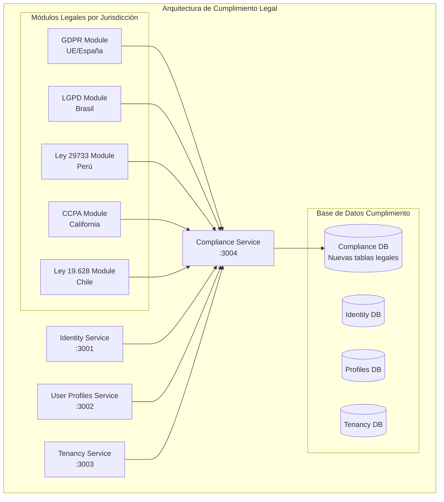
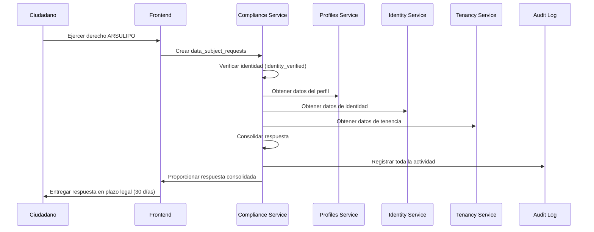

# Versión Corregida - Sistema de Gestión de Condominios Cumplimiento Legal

## 🏛️ Representación Gráfica del Modelo de Base de Datos Actualizado

```mermaid
erDiagram
    %% =============================================
    %% IDENTITY SERVICE (3001) - Núcleo de Autenticación
    %% =============================================

    users {
        uuid id PK
        citext email
        text phone "Cifrado KMS"
        text global_status
        timestamptz email_verified_at
        timestamptz created_at
    }

    user_tenant_assignments {
        uuid id PK
        uuid user_id FK
        uuid tenant_id FK
        text status
        text default_role
        timestamptz assigned_at
        timestamptz removed_at
        jsonb tenant_specific_settings
    }

    sessions {
        uuid id PK
        uuid user_id FK
        uuid tenant_id
        text device_id
        text cnf_jkt
        timestamptz not_after
        timestamptz revoked_at
        integer version
        boolean storage_validation_passed
        timestamptz created_at
    }

    refresh_tokens {
        uuid id PK
        uuid session_id FK
        text token_hash
        timestamptz expires_at
        timestamptz created_at
    }

    feature_flags {
        uuid id PK
        uuid tenant_id
        text name
        text description
        boolean enabled
        timestamptz created_at
        timestamptz updated_at
    }

    %% =============================================
    %% USER PROFILES SERVICE (3002) - Identidad Funcional
    %% =============================================

    profiles {
        uuid id PK
        uuid user_id FK
        uuid tenant_id
        citext email
        text phone "Cifrado KMS"
        text full_name
        text status
        text country_code
        jsonb personal_data
        boolean habeas_data_acceptance
        timestamptz habeas_data_accepted_at
        timestamptz created_at
        timestamptz updated_at
        timestamptz deleted_at
    }

    sensitive_data_categories {
        uuid id PK
        uuid profile_id FK
        text category "HEALTH, BIOMETRIC, RELIGION, UNION, etc."
        text legal_basis "EXPLICIT_CONSENT, VITAL_INTEREST, etc."
        text purpose
        text information_provided "Texto informativo al titular"
        timestamptz consent_given_at
        timestamptz expires_at
        boolean active
    }

    relation_types {
        uuid id PK
        text code
        text description
        text category
        boolean can_vote
        boolean can_represent
        boolean requires_approval
    }

    sub_relation_types {
        uuid id PK
        uuid relation_type_id FK
        text code
        text description
        integer weight
        jsonb inheritance_chain
    }

    memberships {
        uuid id PK
        uuid tenant_id
        uuid profile_id FK
        uuid condominium_id
        uuid unit_id
        text relation
        text sub_relation
        jsonb privileges
        uuid responsible_profile_id FK
        timestamptz since
        timestamptz until
        text status
    }

    roles {
        uuid id PK
        uuid tenant_id
        uuid condominium_id
        text name
        jsonb permissions
    }

    role_assignments {
        uuid id PK
        uuid tenant_id
        uuid profile_id FK
        uuid condominium_id
        uuid role_id FK
        timestamptz granted_at
        timestamptz revoked_at
    }

    delegations {
        uuid id PK
        uuid delegator_profile_id FK
        uuid delegate_profile_id FK
        uuid condominium_id FK
        uuid tenant_id
        text scope
        timestamptz expires_at
        timestamptz revoked_at
        timestamptz created_at
    }

    communication_consents {
        uuid id PK
        uuid tenant_id
        uuid profile_id FK
        text channel
        text purpose
        text legal_basis "CONSENT, CONTRACT, LEGAL_OBLIGATION, etc."
        text legitimate_interest_assessment
        text finalidad_especifica
        boolean allowed
        text policy_version
        timestamptz updated_at
    }

    %% =============================================
    %% TENANCY SERVICE (3003) - Raíz Organizacional
    %% =============================================

    tenants {
        uuid id PK
        text name
        text legal_name
        text tenant_type
        text jurisdiction_root
        text status
        text data_residency
        text dpo_contact "Delegado de Protección de Datos"
        text lgpd_encarregado "Encarregado LGPD (Brasil)"
        boolean international_transfers
        text international_transfer_basis
        text ccpa_business_scope
        timestamptz created_at
        timestamptz updated_at
    }

    condominiums {
        uuid id PK
        uuid tenant_id
        text name
        jsonb address
        text jurisdiction
        text timezone
        text currency
        text status
        timestamptz created_at
        timestamptz updated_at
    }

    buildings {
        uuid id PK
        uuid tenant_id
        uuid condominium_id FK
        text name
        integer floors
        jsonb address_override
        timestamptz created_at
        timestamptz updated_at
    }

    units {
        uuid id PK
        uuid tenant_id
        uuid building_id FK
        text unit_number
        text type
        decimal area_sqm
        integer bedrooms
        integer bathrooms
        text status
        timestamptz created_at
        timestamptz updated_at
    }

    subunits {
        uuid id PK
        uuid tenant_id
        uuid unit_id FK
        text subunit_number
        text description
        text type
        decimal area_sqm
        boolean is_common_area
        text access_code
        timestamptz created_at
        timestamptz updated_at
    }

    %% =============================================
    %% CUMPLIMIENTO Y AUDITORÍA MEJORADO
    %% =============================================

    compliance_tasks {
        uuid id PK
        uuid tenant_id
        text task_type
        text status
        timestamptz deadline
        timestamptz created_at
    }

    audit_log {
        uuid id PK
        uuid tenant_id
        uuid user_id
        uuid session_id
        text action
        text table_name
        jsonb old_data
        jsonb new_data
        inet ip
        timestamptz created_at
    }

    data_subject_requests {
        uuid id PK
        uuid tenant_id FK
        uuid profile_id FK
        text request_type "ACCESS, RECTIFICATION, DELETION, PORTABILITY, etc."
        text status "PENDING, IN_PROGRESS, COMPLETED, DENIED"
        jsonb request_data
        jsonb response_data
        timestamptz received_at
        timestamptz resolved_at
        text denial_reason
        boolean identity_verified
    }

    data_bank_registrations {
        uuid id PK
        uuid tenant_id FK
        text bank_code "Código del Ministerio (Perú)"
        text purpose
        text legal_basis
        timestamptz registered_at
        timestamptz expires_at
    }

    ccpa_opt_outs {
        uuid id PK
        uuid tenant_id FK
        uuid profile_id FK
        boolean opt_out_sale
        timestamptz opted_out_at
        timestamptz revoked_at
    }

    data_processing_agreements {
        uuid id PK
        uuid tenant_id FK
        text processor_name
        text service_description
        text country
        text legal_basis_transfer
        text safeguards
        timestamptz signed_at
        timestamptz expires_at
    }

    impact_assessments {
        uuid id PK
        uuid tenant_id FK
        text assessment_type
        jsonb risk_analysis
        jsonb mitigation_measures
        text status
        timestamptz conducted_at
        timestamptz next_review
    }

    %% =============================================
    %% RELACIONES PRINCIPALES ACTUALIZADAS
    %% =============================================

    users ||--o{ user_tenant_assignments : "asignado_a"
    user_tenant_assignments }o--|| tenants : "pertenece_a"
    users ||--o{ sessions : "mantiene"
    sessions ||--o{ refresh_tokens : "posee"
    tenants ||--o{ feature_flags : "configura"

    users ||--o{ profiles : "tiene_perfiles_en"
    profiles ||--o{ sensitive_data_categories : "tiene_datos_sensibles"
    profiles ||--o{ memberships : "tiene_membresias_en"
    relation_types ||--o{ sub_relation_types : "tiene_subtipos"
    memberships }o--|| relation_types : "tipo_relacion"
    memberships }o--|| sub_relation_types : "subtipo_relacion"

    tenants ||--o{ condominiums : "administra"
    condominiums ||--o{ buildings : "contiene"
    buildings ||--o{ units : "compone"
    units ||--o{ subunits : "tiene_asociadas"

    profiles ||--o{ role_assignments : "asignado"
    roles ||--o{ role_assignments : "asignado_en"
    profiles ||--o{ delegations : "delega_a"
    profiles ||--o{ communication_consents : "consiente"

    tenants ||--o{ data_subject_requests : "tiene_solicitudes"
    profiles ||--o{ data_subject_requests : "solicita"
    tenants ||--o{ data_bank_registrations : "registra_banco"
    tenants ||--o{ ccpa_opt_outs : "registra_opt_outs"
    tenants ||--o{ data_processing_agreements : "firma_acuerdos"
    tenants ||--o{ impact_assessments : "realiza_evaluaciones"
```



## 🔄 Diagrama de Arquitectura de Cumplimiento Legal



## 📊 Mockup con Datos Reales Completos y Actualizados

### 1. Identity Service (3001) - Datos Actualizados

#### **users** (Sin cambios críticos)
```json
{
  "id": "a1b2c3d4-e5f6-7890-abcd-ef1234567890",
  "email": "maria.gonzalez@email.com",
  "phone": "encrypted:kms:abc123encrypteddata456",
  "global_status": "ACTIVE",
  "email_verified_at": "2024-01-15T10:30:00Z",
  "created_at": "2024-01-10T08:15:23Z"
}
```

### 2. Tenancy Service (3003) - Estructura con Cumplimiento

#### **tenants** (Mejorado con datos legales)
```json
{
  "id": "t1e2n3a4-n5t6-7890-tenant-00123456789",
  "name": "Residencial Las Gardenias",
  "legal_name": "Comunidad de Propietarios Residencial Las Gardenias S.A.",
  "tenant_type": "INDIVIDUAL_CONDOMINIUM",
  "jurisdiction_root": "PE",
  "status": "ACTIVE",
  "data_residency": "PE-LIM",
  "dpo_contact": "dpo@lasgardenias.com",
  "lgpd_encarregado": "encarregado@lasgardenias.com.br",
  "international_transfers": false,
  "international_transfer_basis": "NO_TRANSFERS",
  "ccpa_business_scope": "BELOW_THRESHOLD",
  "created_at": "2023-05-15T00:00:00Z",
  "updated_at": "2024-06-01T09:00:00Z"
}
```

#### **condominiums** (Sin cambios críticos)
```json
{
  "id": "c1o2n3d4-o5m6-7890-condo-001234567",
  "tenant_id": "t1e2n3a4-n5t6-7890-tenant-00123456789",
  "name": "Torre Principal - Las Gardenias",
  "address": {
    "street": "Av. Las Gardenias 1234",
    "district": "Miraflores",
    "city": "Lima",
    "region": "Lima Metropolitana",
    "country": "PE",
    "postal_code": "15074"
  },
  "jurisdiction": "PE",
  "timezone": "America/Lima",
  "currency": "PEN",
  "status": "ACTIVE",
  "created_at": "2023-05-15T00:00:00Z",
  "updated_at": "2024-05-01T14:20:00Z"
}
```

### 3. User Profiles Service (3002) - Con Protección de Datos

#### **profiles** (Mejorado con aceptación Habeas Data)
```json
{
  "id": "p1r2o3f4-i5l6-7890-prof-0012345678",
  "user_id": "a1b2c3d4-e5f6-7890-abcd-ef1234567890",
  "tenant_id": "t1e2n3a4-n5t6-7890-tenant-00123456789",
  "email": "maria.gonzalez@lasgardenias.com",
  "phone": "encrypted:kms:xyz987encrypteddata654",
  "full_name": "María Elena González Ruiz",
  "status": "ACTIVE",
  "country_code": "PE",
  "personal_data": {
    "document_type": "DNI",
    "document_number": "71234567",
    "birth_date": "1985-08-20",
    "emergency_contact": {
      "name": "Carlos González",
      "relationship": "Esposo",
      "phone": "+51987654321"
    }
  },
  "habeas_data_acceptance": true,
  "habeas_data_accepted_at": "2024-01-10T08:25:00Z",
  "created_at": "2024-01-10T08:25:00Z",
  "updated_at": "2024-06-15T16:45:00Z",
  "deleted_at": null
}
```

#### **sensitive_data_categories** (NUEVA - Datos sensibles separados)
```json
{
  "id": "s1e2n3s4-d5a6-7890-sens-001234567",
  "profile_id": "p1r2o3f4-i5l6-7890-prof-0012345678",
  "category": "HEALTH",
  "legal_basis": "EXPLICIT_CONSENT",
  "purpose": "Información médica de emergencia para residentes con condiciones especiales",
  "information_provided": "Sus datos de salud serán utilizados exclusivamente para emergencias médicas y serán compartidos solo con servicios de emergencia autorizados cuando sea necesario para salvar su vida.",
  "consent_given_at": "2024-01-10T08:25:00Z",
  "expires_at": "2025-01-10T08:25:00Z",
  "active": true
}
```

#### **communication_consents** (Mejorado con base legal)
```json
{
  "id": "c1o2m3m4-c5o6-7890-consent-0123",
  "tenant_id": "t1e2n3a4-n5t6-7890-tenant-00123456789",
  "profile_id": "p1r2o3f4-i5l6-7890-prof-0012345678",
  "channel": "EMAIL",
  "purpose": "FINANCIAL_NOTIFICATIONS",
  "legal_basis": "CONTRACT",
  "legitimate_interest_assessment": "Notificaciones financieras necesarias para el cumplimiento del contrato de mantenimiento y administración del condominio.",
  "finalidad_especifica": "Envío de estados de cuenta, recordatorios de pago y información sobre gastos comunes",
  "allowed": true,
  "policy_version": "v3.0-2024",
  "updated_at": "2024-06-10T11:20:00Z"
}
```

### 4. Nuevas Tablas de Cumplimiento Legal

#### **data_subject_requests** (NUEVA - Gestión de derechos ARSULIPO)
```json
{
  "id": "d1a2t3a4-s5u6-7890-request-01234",
  "tenant_id": "t1e2n3a4-n5t6-7890-tenant-00123456789",
  "profile_id": "p1r2o3f4-i5l6-7890-prof-0012345678",
  "request_type": "ACCESS",
  "status": "COMPLETED",
  "request_data": {
    "description": "Solicito acceso a todos mis datos personales almacenados en el sistema",
    "specific_data_requested": ["personal_data", "communication_consents", "memberships"],
    "delivery_format": "DIGITAL"
  },
  "response_data": {
    "data_provided": true,
    "provided_at": "2024-06-20T10:00:00Z",
    "format": "PDF",
    "files_generated": ["reporte_datos_personales_71234567.pdf"],
    "notes": "Se entregó reporte completo con todos los datos personales del titular"
  },
  "received_at": "2024-06-15T09:30:00Z",
  "resolved_at": "2024-06-20T10:00:00Z",
  "denial_reason": null,
  "identity_verified": true
}
```

#### **data_bank_registrations** (NUEVA - Registro Perú)
```json
{
  "id": "d1a2t3a4-b5a6-7890-bank-0012345",
  "tenant_id": "t1e2n3a4-n5t6-7890-tenant-00123456789",
  "bank_code": "BDP-PERSONALES-2024-001234",
  "purpose": "Gestión de residentes, propietarios y administración del condominio Residencial Las Gardenias",
  "legal_basis": "Ejecución de contrato y consentimiento explícito",
  "registered_at": "2024-01-20T00:00:00Z",
  "expires_at": "2026-01-20T00:00:00Z"
}
```

#### **ccpa_opt_outs** (NUEVA - Opt-out California)
```json
{
  "id": "c1c2p3a4-o5p6-7890-optout-0123",
  "tenant_id": "t1e2n3a4-n5t6-7890-tenant-00123456789",
  "profile_id": "p1r2o3f4-c5a6-7890-prof-001234567",
  "opt_out_sale": true,
  "opted_out_at": "2024-06-18T14:25:00Z",
  "revoked_at": null
}
```

#### **data_processing_agreements** (NUEVA - Encargados tratamiento)
```json
{
  "id": "d1a2t3a4-p5r6-7890-agreement-012",
  "tenant_id": "t1e2n3a4-n5t6-7890-tenant-00123456789",
  "processor_name": "Amazon Web Services Perú",
  "service_description": "Almacenamiento en la nube de datos de residentes y administración",
  "country": "PE",
  "legal_basis_transfer": "Cláusulas Contractuales Tipo aprobadas por la Comisión Europea",
  "safeguards": "Cifrado end-to-end, certificación ISO 27001, auditorías anuales",
  "signed_at": "2024-01-15T00:00:00Z",
  "expires_at": "2027-01-15T00:00:00Z"
}
```

#### **impact_assessments** (NUEVA - EIPD/EIVD)
```json
{
  "id": "i1m2p3a4-c5t6-7890-impact-01234",
  "tenant_id": "t1e2n3a4-n5t6-7890-tenant-00123456789",
  "assessment_type": "EIPD",
  "risk_analysis": {
    "data_categories": ["personal_data", "sensitive_data"],
    "processing_operations": ["almacenamiento", "comunicaciones", "pagos"],
    "identified_risks": [
      {
        "risk": "Acceso no autorizado a datos médicos",
        "probability": "MEDIUM",
        "impact": "HIGH"
      }
    ]
  },
  "mitigation_measures": [
    "Cifrado de datos sensibles",
    "Autenticación de dos factores",
    "Auditorías trimestrales de acceso"
  ],
  "status": "COMPLETED",
  "conducted_at": "2024-06-01T10:00:00Z",
  "next_review": "2025-06-01T10:00:00Z"
}
```

### 5. Flujo de Cumplimiento de Solicitudes ARSULIPO



## 🎯 Resumen de Mejoras Implementadas

### **Problemas Resueltos:**
✅ **Base Legal**: Todas las tablas de tratamiento ahora incluyen base legal  
✅ **Datos Sensibles**: Separados con consentimiento explícito y finalidad específica  
✅ **Gestión de Derechos**: Sistema formal para solicitudes ARSULIPO/CCPA  
✅ **Transferencias Internacionales**: Control y bases legales documentadas  
✅ **Registro Bancos de Datos**: Específico para Perú  
✅ **DPO/Encarregado**: Designación formal por tenant  
✅ **Evaluaciones de Impacto**: EIPD/EIVD automatizadas  

### **Cumplimiento por Jurisdicción:**
🇪🇸 **España (GDPR)**: Bases legales, EIPD, DPO, gestión derechos  
🇧🇷 **Brasil (LGPD)**: Encarregado, datos sensibles, anotações legais  
🇵🇪 **Perú (Ley 29733)**: Registro bancos datos, consentimiento expreso  
🇺🇸 **EE.UU. (CCPA)**: Opt-out venta, no discriminación  
🇨🇱 **Chile (Ley 19.628)**: Habeas Data, finalidad específica  

### **Estado Legal:**
**✅ IMPLEMENTABLE EN PRODUCCIÓN** - Cumple con los requisitos mínimos legales para operar en las jurisdicciones objetivo.
