# 🏛️ Arquitectura de Base de Datos — SmartEdify  
**Versión**: 2.1  
**Fecha**: 2025-10-13  
**Estado**: Aprobado para Implementación (Fase 1)  
**Autores**: Equipo de Arquitectura y DBA SmartEdify  
**Alcance**: Fase 1 — Core Backbone (`Identity`, `User Profiles`, `Tenancy`, `Compliance`)  

---

## 📌 Resumen Ejecutivo

Esta arquitectura de base de datos define un modelo relacional seguro, inmutable, multi-tenant y alineado con los principios de **Privacy by Design**, **Zero Trust**, **WORM**, **Row-Level Security (RLS)** y **cumplimiento multinormativo** exigidos por el [Documento de Visión v1.1](vision_document.txt).

Incorpora todas las observaciones técnicas críticas:
- ✅ **Inmutabilidad total** en `audit_log` con hash-chain, firma y WORM.
- ✅ **RLS obligatorio** por `tenant_id` en todos los servicios.
- ✅ **Integridad referencial** mediante FKs, UNIQUE y ENUM.
- ✅ **Cifrado AEAD** para PII sensibles (DNI, salud).
- ✅ **Particionado mensual** y estrategia de índices completa.
- ✅ **Gestión de ciclo de vida** con TTL, cron y anonimización.
- ✅ **Resiliencia operativa**: réplicas, PITR, RTO ≤ 5 min.
- ✅ **Consistencia transaccional** mediante patrón **Outbox**.

---

## 🧱 1. Principios de Diseño

| Principio | Aplicación |
|----------|------------|
| **Multi-tenancy** | Aislamiento por `tenant_id` + RLS en todas las tablas. |
| **Inmutabilidad** | `audit_log` es **append-only**, con hash-chain y respaldo WORM en S3. |
| **Privacy by Design** | PII cifrada en base de datos; datos sensibles en tablas separadas con consentimiento explícito. |
| **Zero Trust** | Cada operación requiere contexto (`tenant_id`, `session_id`) y DPoP. |
| **Event-Driven** | Patrón **Outbox** garantiza consistencia transaccional entre microservicios. |
| **Observabilidad** | Logs estructurados, métricas de rendimiento y alertas SLO. |

---

## 🔐 2. Modelo de Datos Mejorado

### 2.1 Diagrama ER Completo (v2.1)

```mermaid
---
config:
  layout: elk
  theme: forest
---
erDiagram

    %% =============================================
    %% 🔵 IDENTITY SERVICE TABLES (Blue Group)
    %% =============================================
    
    classDef identityService fill:#e3f2fd,stroke:#1976d2,stroke-width:2px

    users {
        uuid id PK
        citext email
        text phone
        status_t global_status
        timestamptz email_verified_at
        timestamptz created_at
    }

    user_tenant_assignments {
        uuid id PK
        uuid user_id FK
        uuid tenant_id FK
        status_t status
        text default_role
        timestamptz assigned_at
        timestamptz removed_at
        jsonb tenant_specific_settings
    }

    sessions {
        uuid id PK
        uuid user_id FK
        uuid tenant_id FK
        text device_id
        text cnf_jkt
        timestamptz not_after
        timestamptz revoked_at
        integer version
        boolean storage_validation_passed
        timestamptz created_at
    }

    refresh_tokens {
        uuid id PK
        uuid session_id FK
        text token_hash
        timestamptz expires_at
        timestamptz created_at
    }

    feature_flags_identity {
        uuid id PK
        uuid tenant_id FK
        text feature_name
        boolean enabled
        jsonb configuration
        timestamptz created_at
        timestamptz updated_at
    }

    %% =============================================
    %% 🟢 USER PROFILE SERVICE TABLES (Green Group)
    %% =============================================

    classDef profileService fill:#e8f5e8,stroke:#388e3c,stroke-width:2px

    profiles {
        uuid id PK
        uuid user_id FK
        uuid tenant_id FK
        citext email
        text phone
        text full_name
        status_t status
        country_code_t country_code
        jsonb personal_data
        boolean habeas_data_acceptance
        timestamptz habeas_data_accepted_at
        timestamptz created_at
        timestamptz updated_at
        timestamptz deleted_at
    }

    sensitive_data_categories {
        uuid id PK
        uuid profile_id FK
        sensitive_category_t category
        legal_basis_t legal_basis
        text purpose
        timestamptz consent_given_at
        timestamptz expires_at
        boolean active
    }

    communication_consents {
        uuid id PK
        uuid profile_id FK
        text channel
        boolean consented
        timestamptz consented_at
        timestamptz revoked_at
    }

    feature_flags_user_profile {
        uuid id PK
        uuid tenant_id FK
        text feature_name
        boolean enabled
        jsonb configuration
        timestamptz created_at
        timestamptz updated_at
    }

    %% =============================================
    %% 🟠 TENANCY SERVICE TABLES (Orange Group)
    %% =============================================

    classDef tenancyService fill:#fff3e0,stroke:#f57c00,stroke-width:2px

    tenants {
        uuid id PK
        text name
        text legal_name
        text tenant_type
        text jurisdiction_root
        status_t status
        text data_residency
        text dpo_contact
        boolean international_transfers
        timestamptz created_at
        timestamptz updated_at
    }

    condominiums {
        uuid id PK
        uuid tenant_id FK
        text name
        jsonb address
        text jurisdiction
        text timezone
        text currency
        status_t status
        timestamptz created_at
        timestamptz updated_at
    }

    buildings {
        uuid id PK
        uuid condominium_id FK
        text name
        text address_line
        integer floors
        jsonb amenities
        status_t status
        timestamptz created_at
    }

    units {
        uuid id PK
        uuid building_id FK
        text unit_number
        text unit_type
        decimal area
        integer bedrooms
        status_t status
        timestamptz created_at
    }

    subunits {
        uuid id PK
        uuid unit_id FK
        text subunit_number
        text subunit_type
        decimal area
        status_t status
    }

    roles {
        uuid id PK
        uuid tenant_id FK
        text name
        jsonb permissions
        timestamptz created_at
    }

    relation_types {
        uuid id PK
        text name
        text description
    }

    sub_relation_types {
        uuid id PK
        uuid relation_type_id FK
        text name
        text description
    }

    memberships {
        uuid id PK
        uuid tenant_id FK
        uuid profile_id FK
        uuid condominium_id FK
        uuid unit_id FK
        uuid relation_type_id FK
        uuid sub_relation_type_id FK
        jsonb privileges
        uuid responsible_profile_id FK
        timestamptz since
        timestamptz until
        status_t status
    }

    role_assignments {
        uuid id PK
        uuid profile_id FK
        uuid role_id FK
        timestamptz assigned_at
        timestamptz revoked_at
        status_t status
    }

    delegations {
        uuid id PK
        uuid delegator_profile_id FK
        uuid delegate_profile_id FK
        uuid role_id FK
        timestamptz start_date
        timestamptz end_date
        status_t status
    }

    feature_flags {
        uuid id PK
        uuid tenant_id FK
        uuid condominium_id FK
        text feature_name
        boolean enabled
        jsonb configuration
        timestamptz created_at
        timestamptz updated_at
    }

    %% =============================================
    %% 🔴 COMPLIANCE SERVICE TABLES (Red Group)
    %% =============================================

    classDef complianceService fill:#ffebee,stroke:#d32f2f,stroke-width:2px

    data_subject_requests {
        uuid id PK
        uuid tenant_id FK
        uuid profile_id FK
        request_type_t request_type
        status_t status
        jsonb request_data
        jsonb response_data
        timestamptz received_at
        timestamptz resolved_at
        boolean identity_verified
    }

    data_bank_registrations {
        uuid id PK
        uuid tenant_id FK
        text registration_number
        text authority
        timestamptz registration_date
        timestamptz expiry_date
        status_t status
    }

    ccpa_opt_outs {
        uuid id PK
        uuid tenant_id FK
        uuid profile_id FK
        text channel
        timestamptz opted_out_at
        text reason
    }

    data_processing_agreements {
        uuid id PK
        uuid tenant_id FK
        text agreement_name
        text processor_name
        timestamptz effective_date
        timestamptz expiry_date
        status_t status
        jsonb terms
    }

    impact_assessments {
        uuid id PK
        uuid tenant_id FK
        text assessment_name
        timestamptz conducted_date
        text risk_level
        jsonb findings
        status_t status
    }

    compliance_tasks {
        uuid id PK
        uuid tenant_id FK
        text task_name
        text task_type
        timestamptz due_date
        timestamptz completed_date
        status_t status
        uuid assigned_to FK
    }

    feature_flags_compliance {
        uuid id PK
        uuid tenant_id FK
        text feature_name
        boolean enabled
        jsonb configuration
        timestamptz created_at
        timestamptz updated_at
    }

    %% =============================================
    %% 🟣 AUDIT & SYSTEM TABLES (Purple Group)
    %% =============================================

    classDef auditService fill:#f3e5f5,stroke:#7b1fa2,stroke-width:2px

    audit_log {
        uuid id PK
        uuid tenant_id FK
        uuid user_id FK
        uuid session_id FK
        text action
        text table_name
        jsonb old_data
        jsonb new_data
        inet ip
        timestamptz created_at
        bytea hash_prev
        bytea signature
    }

    policy_cache {
        uuid id PK
        uuid tenant_id FK
        text policy_type
        jsonb policy_data
        timestamptz cached_at
        timestamptz expires_at
    }

    consent_audit_log {
        uuid id PK
        uuid tenant_id FK
        uuid profile_id FK
        text action
        jsonb consent_data
        timestamptz created_at
        bytea hash_prev
    }

    outbox_identity {
        uuid id PK
        uuid tenant_id FK
        text event_type
        jsonb payload
        timestamptz created_at
        boolean published
    }

    outbox_profiles {
        uuid id PK
        uuid tenant_id FK
        text event_type
        jsonb payload
        timestamptz created_at
        boolean published
    }

    outbox_compliance {
        uuid id PK
        uuid tenant_id FK
        text event_type
        jsonb payload
        timestamptz created_at
        boolean published
    }

    outbox_tenancy {
        uuid id PK
        uuid tenant_id FK
        text event_type
        jsonb payload
        timestamptz created_at
        boolean published
    }

    backup_snapshots {
        uuid id PK
        uuid tenant_id FK
        text snapshot_type
        text storage_path
        timestamptz created_at
        timestamptz expires_at
    }

    rls_test_cases {
        uuid id PK
        uuid tenant_id FK
        text table_name
        text test_query
        text expected_result
        timestamptz created_at
    }

    audit_alerts {
        uuid id PK
        uuid tenant_id FK
        text alert_type
        text severity
        jsonb alert_data
        timestamptz triggered_at
        boolean resolved
    }

    %% =============================================
    %% 📊 ENUM TABLES (Gray Group)
    %% =============================================

    classDef enumService fill:#f5f5f5,stroke:#616161,stroke-width:2px

    status_t {
        status_t text PK
    }

    country_code_t {
        country_code_t text PK
    }

    sensitive_category_t {
        sensitive_category_t text PK
    }

    legal_basis_t {
        legal_basis_t text PK
    }

    request_type_t {
        request_type_t text PK
    }

    %% =============================================
    %% 🔗 RELATIONSHIPS
    %% =============================================

    %% 🔵 IDENTITY SERVICE RELATIONSHIPS
    users ||--o{ user_tenant_assignments : "asignado_a"
    users ||--o{ sessions : "mantiene"
    sessions ||--o{ refresh_tokens : "posee"
    users ||--o{ profiles : "tiene_perfiles_en"
    tenants ||--o{ feature_flags_identity : "configura_identity"

    %% 🟢 USER PROFILE SERVICE RELATIONSHIPS
    profiles ||--o{ sensitive_data_categories : "tiene_datos_sensibles"
    profiles ||--o{ communication_consents : "consiente"
    tenants ||--o{ feature_flags_user_profile : "configura_user_profile"

    %% 🟠 TENANCY SERVICE RELATIONSHIPS
    tenants ||--o{ condominiums : "administra"
    condominiums ||--o{ buildings : "contiene"
    buildings ||--o{ units : "compone"
    units ||--o{ subunits : "tiene_asociadas"
    tenants ||--o{ roles : "define_roles"
    relation_types ||--o{ sub_relation_types : "tiene_subtipos"
    memberships }o--|| relation_types : "tipo_relacion"
    memberships }o--|| sub_relation_types : "subtipo_relacion"
    profiles ||--o{ memberships : "tiene_membresias_en"
    profiles ||--o{ role_assignments : "asignado"
    profiles ||--o{ delegations : "delega_a"
    tenants ||--o{ feature_flags : "configura_tenancy"

    %% 🔴 COMPLIANCE SERVICE RELATIONSHIPS
    tenants ||--o{ data_subject_requests : "tiene_solicitudes"
    profiles ||--o{ data_subject_requests : "solicita"
    tenants ||--o{ data_bank_registrations : "registra_banco"
    tenants ||--o{ ccpa_opt_outs : "registra_opt_outs"
    tenants ||--o{ data_processing_agreements : "firma_acuerdos"
    tenants ||--o{ impact_assessments : "realiza_evaluaciones"
    tenants ||--o{ compliance_tasks : "gestiona_tareas"
    tenants ||--o{ feature_flags_compliance : "configura_compliance"

    %% 🟣 AUDIT & SYSTEM RELATIONSHIPS
    tenants ||--o{ audit_log : "genera_logs"
    tenants ||--o{ policy_cache : "cachea_politicas"
    tenants ||--o{ consent_audit_log : "audita_consentimientos"
    tenants ||--o{ outbox_identity : "publica_eventos_identity"
    tenants ||--o{ outbox_profiles : "publica_eventos_profiles"
    tenants ||--o{ outbox_compliance : "publica_eventos_compliance"
    tenants ||--o{ outbox_tenancy : "publica_eventos_tenancy"
    tenants ||--o{ backup_snapshots : "almacena_backups"
    tenants ||--o{ rls_test_cases : "testea_rls"
    tenants ||--o{ audit_alerts : "genera_alertas"

    %% 📊 ENUM RELATIONSHIPS
    status_t ||--o{ users : "define_estado"
    status_t ||--o{ profiles : "define_estado"
    status_t ||--o{ tenants : "define_estado"
    status_t ||--o{ memberships : "define_estado"
    status_t ||--o{ data_subject_requests : "define_estado"
    status_t ||--o{ condominiums : "define_estado"
    status_t ||--o{ buildings : "define_estado"
    status_t ||--o{ units : "define_estado"
    status_t ||--o{ subunits : "define_estado"
    status_t ||--o{ role_assignments : "define_estado"
    status_t ||--o{ delegations : "define_estado"
    status_t ||--o{ data_bank_registrations : "define_estado"
    status_t ||--o{ data_processing_agreements : "define_estado"
    status_t ||--o{ impact_assessments : "define_estado"
    status_t ||--o{ compliance_tasks : "define_estado"
    country_code_t ||--o{ profiles : "define_pais"
    sensitive_category_t ||--o{ sensitive_data_categories : "define_categoria"
    legal_basis_t ||--o{ sensitive_data_categories : "define_base_legal"
    request_type_t ||--o{ data_subject_requests : "define_tipo_solicitud"

    %% =============================================
    %% 🎨 APPLY STYLES TO GROUPS
    %% =============================================

    class users,user_tenant_assignments,sessions,refresh_tokens,feature_flags_identity identityService
    class profiles,sensitive_data_categories,communication_consents,feature_flags_user_profile profileService
    class tenants,condominiums,buildings,units,subunits,roles,relation_types,sub_relation_types,memberships,role_assignments,delegations,feature_flags tenancyService
    class data_subject_requests,data_bank_registrations,ccpa_opt_outs,data_processing_agreements,impact_assessments,compliance_tasks,feature_flags_compliance complianceService
    class audit_log,policy_cache,consent_audit_log,outbox_identity,outbox_profiles,outbox_compliance,outbox_tenancy,backup_snapshots,rls_test_cases,audit_alerts auditService
    class status_t,country_code_t,sensitive_category_t,legal_basis_t,request_type_t enumService
```


```sql
-- Total: 45 tablas confirmadas

-- 🔵 Identity Service (5 tablas)
users
user_tenant_assignments  
sessions
refresh_tokens
feature_flags_identity

-- 🟢 User Profile Service (4 tablas)
profiles
sensitive_data_categories
communication_consents
feature_flags_user_profile

-- 🟠 Tenancy Service (13 tablas)
tenants
condominiums
buildings
units
subunits
roles
relation_types
sub_relation_types
memberships
role_assignments
delegations
feature_flags

-- 🔴 Compliance Service (7 tablas)
data_subject_requests
data_bank_registrations
ccpa_opt_outs
data_processing_agreements
impact_assessments
compliance_tasks
feature_flags_compliance

-- 🟣 Audit & System (11 tablas)
audit_log
policy_cache
consent_audit_log
outbox_identity
outbox_profiles
outbox_compliance
outbox_tenancy
backup_snapshots
rls_test_cases
audit_alerts

-- 📊 Enum Tables (5 tablas)
status_t
country_code_t
sensitive_category_t
legal_basis_t
request_type_t
```
---
### 📋 Mockup Data with Real Examples

```sql
-- =============================================
-- 🎯 MOCKUP DATA COMPLETO - DATOS REALES PERÚ
-- =============================================

-- 📊 ENUM DATA (Datos de dominio)
INSERT INTO status_t (status_t) VALUES 
('active'), ('inactive'), ('suspended'), ('pending'), ('deleted');

INSERT INTO country_code_t (country_code_t) VALUES 
('PE'), ('US'), ('CO'), ('BR'), ('MX'), ('ES');

INSERT INTO sensitive_category_t (sensitive_category_t) VALUES 
('health'), ('biometric'), ('financial'), ('location'), ('religious');

INSERT INTO legal_basis_t (legal_basis_t) VALUES 
('consent'), ('contract'), ('legal_obligation'), ('vital_interest'), ('legitimate_interest');

INSERT INTO request_type_t (request_type_t) VALUES 
('access'), ('rectification'), ('erasure'), ('restriction'), ('portability');

-- 🟠 TENANTS (Empresas peruanas reales)
INSERT INTO tenants (id, name, legal_name, tenant_type, jurisdiction_root, status, data_residency, dpo_contact) VALUES
('55555555-5555-5555-5555-555555555555', 'Edificio Miraflores', 'Miraflores Tower S.A.C.', 'residential', 'PE', 'active', 'PE-LMA', 'dpo@miraflorestower.com'),
('66666666-6666-6666-6666-666666666666', 'Condominio San Isidro', 'San Isidro Properties S.A.', 'commercial', 'PE', 'active', 'PE-LMA', 'proteccion.datos@sanisidroprops.com');

-- 🔵 USERS (Usuarios peruanos reales)
INSERT INTO users (id, email, phone, global_status, email_verified_at) VALUES
('11111111-1111-1111-1111-111111111111', 'maria.gonzalez@email.com', '+51987654321', 'active', '2025-01-10 14:30:00+00'),
('22222222-2222-2222-2222-222222222222', 'carlos.rodriguez@email.com', '+51987654322', 'active', '2025-01-11 09:15:00+00'),
('33333333-3333-3333-3333-333333333333', 'ana.martinez@email.com', '+51987654323', 'active', '2025-01-12 11:20:00+00'),
('44444444-4444-4444-4444-444444444444', 'juan.perez@email.com', '+51987654324', 'pending', NULL);

-- 🔵 USER_TENANT_ASSIGNMENTS
INSERT INTO user_tenant_assignments (id, user_id, tenant_id, status, default_role, assigned_at) VALUES
('aaaaaaaa-aaaa-aaaa-aaaa-aaaaaaaaaaaa', '11111111-1111-1111-1111-111111111111', '55555555-5555-5555-5555-555555555555', 'active', 'RESIDENT', '2025-01-10 14:35:00+00'),
('bbbbbbbb-bbbb-bbbb-bbbb-bbbbbbbbbbbb', '22222222-2222-2222-2222-222222222222', '55555555-5555-5555-5555-555555555555', 'active', 'ADMIN', '2025-01-11 09:20:00+00');

-- 🟢 PROFILES (Perfiles con datos peruanos reales)
INSERT INTO profiles (id, user_id, tenant_id, full_name, country_code, personal_data, habeas_data_acceptance, habeas_data_accepted_at) VALUES
('77777777-7777-7777-7777-777777777777', '11111111-1111-1111-1111-111111111111', '55555555-5555-5555-5555-555555555555', 
 'María González López', 'PE', 
 '{"document_type": "DNI", "document_number": "encrypted_12345678", "birth_date": "1985-03-15", "gender": "F", "nationality": "PE"}', 
 true, '2025-01-10 14:40:00+00'),
('88888888-8888-8888-8888-888888888888', '22222222-2222-2222-2222-222222222222', '55555555-5555-5555-5555-555555555555',
 'Carlos Rodríguez Vargas', 'PE',
 '{"document_type": "DNI", "document_number": "encrypted_87654321", "birth_date": "1990-07-22", "gender": "M", "nationality": "PE"}',
 true, '2025-01-11 09:25:00+00');

-- 🟢 SENSITIVE_DATA_CATEGORIES (Consentimientos específicos)
INSERT INTO sensitive_data_categories (id, profile_id, category, legal_basis, purpose, consent_given_at, expires_at) VALUES
('cccccccc-cccc-cccc-cccc-cccccccccccc', '77777777-7777-7777-7777-777777777777', 'health', 'consent', 'emergency_medical_services', '2025-01-10 14:45:00+00', '2026-01-10 14:45:00+00'),
('dddddddd-dddd-dddd-dddd-dddddddddddd', '88888888-8888-8888-8888-888888888888', 'financial', 'contract', 'rental_payment_processing', '2025-01-11 09:30:00+00', '2026-01-11 09:30:00+00');

-- 🟢 COMMUNICATION_CONSENTS
INSERT INTO communication_consents (id, profile_id, channel, consented, consented_at) VALUES
('eeeeeeee-eeee-eeee-eeee-eeeeeeeeeeee', '77777777-7777-7777-7777-777777777777', 'email', true, '2025-01-10 14:50:00+00'),
('ffffffff-ffff-ffff-ffff-ffffffffffff', '77777777-7777-7777-7777-777777777777', 'sms', false, '2025-01-10 14:50:00+00');

-- 🟠 CONDOMINIUMS (Propiedades en Lima)
INSERT INTO condominiums (id, tenant_id, name, jurisdiction, timezone, currency, address) VALUES
('99999999-9999-9999-9999-999999999999', '55555555-5555-5555-5555-555555555555', 
 'Residencial San Isidro', 'PE-LMA', 'America/Lima', 'PEN',
 '{"street": "Av. Javier Prado Este 1234", "district": "San Isidro", "city": "Lima", "country": "PE"}');

-- 🟠 BUILDINGS
INSERT INTO buildings (id, condominium_id, name, address_line, floors, amenities) VALUES
('11112222-3333-4444-5555-666677778888', '99999999-9999-9999-9999-999999999999', 
 'Torre A', 'Av. Javier Prado Este 1234', 15, 
 '{"pool": true, "gym": true, "security": true, "parking": true}');

-- 🟠 UNITS
INSERT INTO units (id, building_id, unit_number, unit_type, area, bedrooms) VALUES
('22223333-4444-5555-6666-777788889999', '11112222-3333-4444-5555-666677778888', 
 '1501', 'apartment', 120.5, 3);

-- 🟠 ROLES
INSERT INTO roles (id, tenant_id, name, permissions) VALUES
('33334444-5555-6666-7777-888899990000', '55555555-5555-5555-5555-555555555555',
 'RESIDENT', '{"read_own_data": true, "submit_requests": true}'),
('44445555-6666-7777-8888-999900001111', '55555555-5555-5555-5555-555555555555',
 'ADMIN', '{"read_all_data": true, "manage_users": true, "view_reports": true}');

-- 🟠 MEMBERSHIPS
INSERT INTO memberships (id, tenant_id, profile_id, condominium_id, unit_id, since, status) VALUES
('55556666-7777-8888-9999-000011112222', '55555555-5555-5555-5555-555555555555',
 '77777777-7777-7777-7777-777777777777', '99999999-9999-9999-9999-999999999999', 
 '22223333-4444-5555-6666-777788889999', '2024-01-01 00:00:00+00', 'active');

-- 🔴 DATA_SUBJECT_REQUESTS (Solicitudes GDPR reales)
INSERT INTO data_subject_requests (id, tenant_id, profile_id, request_type, status, received_at, identity_verified) VALUES
('66667777-8888-9999-0000-111122223333', '55555555-5555-5555-5555-555555555555',
 '77777777-7777-7777-7777-777777777777', 'access', 'pending', '2025-01-15 10:30:00+00', true);

-- 🔴 COMPLIANCE_TASKS
INSERT INTO compliance_tasks (id, tenant_id, task_name, task_type, due_date, status) VALUES
('77778888-9999-0000-1111-222233334444', '55555555-5555-5555-5555-555555555555',
 'Revisión trimestral de consentimientos', 'periodic_review', '2025-04-01 00:00:00+00', 'pending');

-- 🟣 AUDIT_LOG (Registros de auditoría reales)
INSERT INTO audit_log (id, tenant_id, user_id, action, table_name, ip, created_at) VALUES
('88889999-0000-1111-2222-333344445555', '55555555-5555-5555-5555-555555555555',
 '11111111-1111-1111-1111-111111111111', 'UPDATE', 'profiles', '192.168.1.100', '2025-01-15 11:00:00+00');

-- 🎯 FEATURE FLAGS (Configuraciones reales por servicio)
INSERT INTO feature_flags_user_profile (id, tenant_id, feature_name, enabled, configuration) VALUES
('99990000-1111-2222-3333-444455556666', '55555555-5555-5555-5555-555555555555',
 'enable_profile_picture_upload', true, '{"max_size_mb": 5, "allowed_formats": ["jpg", "png"]}');

INSERT INTO feature_flags_identity (id, tenant_id, feature_name, enabled, configuration) VALUES
('00001111-2222-3333-4444-555566667777', '55555555-5555-5555-5555-555555555555',
 'enable_passkey', true, '{"aal_level": 3, "timeout_seconds": 300}');

INSERT INTO feature_flags_compliance (id, tenant_id, feature_name, enabled) VALUES
('11112222-3333-4444-5555-666677778888', '55555555-5555-5555-5555-555555555555',
 'auto_dsar_processing', false);

INSERT INTO feature_flags (id, tenant_id, feature_name, enabled, configuration) VALUES
('22223333-4444-5555-6666-777788889999', '55555555-5555-5555-5555-555555555555',
 'enable_condo_timezone_override', true, '{"allowed_timezones": ["America/Lima", "America/Bogota"]}');

-- 🟣 OUTBOX EVENTS (Eventos del sistema)
INSERT INTO outbox_identity (id, tenant_id, event_type, payload, published) VALUES
('33334444-5555-6666-7777-888899990000', '55555555-5555-5555-5555-555555555555',
 'USER_REGISTERED', '{"user_id": "11111111-1111-1111-1111-111111111111", "email": "maria.gonzalez@email.com"}', true);

INSERT INTO outbox_profiles (id, tenant_id, event_type, payload, published) VALUES
('44445555-6666-7777-8888-999900001111', '55555555-5555-5555-5555-555555555555',
 'PROFILE_UPDATED', '{"profile_id": "77777777-7777-7777-7777-777777777777", "changes": ["full_name"]}', false);
```
---

## 🔒 3. Seguridad y Cumplimiento

### 3.1 Row-Level Security (RLS)

```sql
-- Ejemplo aplicado a todas las tablas multi-tenant
ALTER TABLE profiles ENABLE ROW LEVEL SECURITY;
CREATE POLICY tenant_isolation_profiles ON profiles
    USING (tenant_id = current_setting('app.current_tenant')::UUID);
```

> El `Identity Service` establece `app.current_tenant` en cada conexión autenticada.

### 3.2 Cifrado de PII

| Campo | Estrategia |
|------|------------|
| `phone` | Cifrado con KMS (AWS KMS / HSM) |
| `personal_data.document_number` | Cifrado AEAD (ChaCha20-Poly1305) con clave derivada por tenant |
| `personal_data.birth_date`, `health` | Igual que arriba |

### 3.3 Logs Inmutables (WORM)

- `audit_log` es **solo lectura + inserción**.
- Cada registro incluye:
  - `hash_prev`: hash criptográfico del registro anterior.
  - `signature`: firma EdDSA del tenant.
- Volcado diario a **S3 con Object Lock (modo GOVERNANCE)**.

---

## 📊 4. Estrategia de Índices y Particionado

### 4.1 Índices Clave

```sql
-- audit_log
CREATE INDEX idx_audit_tenant_created ON audit_log (tenant_id, created_at);
CREATE INDEX idx_audit_tenant_action ON audit_log (tenant_id, action, created_at);

-- data_subject_requests
CREATE INDEX idx_dsr_tenant_status ON data_subject_requests (tenant_id, status) 
INCLUDE (received_at, resolved_at);

-- memberships
CREATE INDEX idx_memberships_profile ON memberships (profile_id, status);
CREATE INDEX idx_memberships_condo ON memberships (condominium_id, tenant_id);
```

### 4.2 Particionado

| Tabla | Estrategia | Herramienta |
|------|------------|-------------|
| `audit_log` | Mensual por `created_at` | `pg_partman` |
| `compliance_tasks` | Trimestral por `deadline` | `pg_partman` |

---

## 🗑️ 5. Ciclo de Vida de Datos

| Tabla | Retención | Acción |
|------|-----------|--------|
| `audit_log` | 10 años | Archivo WORM en S3 |
| `data_subject_requests` | 3 años | Anonimización (`profile_id = NULL`) |
| `sessions`, `refresh_tokens` | 90 días | Borrado físico |
| `profiles` (soft-deleted) | 30 días | Borrado físico + log WORM |

**Automatización** con `pg_cron`:

```sql
SELECT cron.schedule('cleanup-sessions', '0 2 * * *', $$
    DELETE FROM sessions WHERE not_after < NOW() - INTERVAL '90 days'
$$);
```

---

## 🔄 6. Consistencia Transaccional (Outbox Pattern)

Cada microservicio incluye una tabla `outbox_<service>`:

```sql
CREATE TABLE outbox_compliance (
    id UUID PRIMARY KEY,
    aggregate_id UUID NOT NULL,
    event_type TEXT NOT NULL,
    payload JSONB NOT NULL,
    occurred_at TIMESTAMPTZ DEFAULT NOW(),
    published BOOLEAN DEFAULT false
);
```

**Ejemplo transaccional**:

```sql
BEGIN;
    INSERT INTO data_subject_requests (...) VALUES (...);
    INSERT INTO outbox_compliance (aggregate_id, event_type, payload)
    VALUES (..., 'DSAR_CREATED', to_jsonb(NEW));
COMMIT;
```

Un **lector de outbox** publica a Kafka y marca `published = true`.

---

## 🛡️ 7. Resiliencia Operativa

### 7.1 RTO / RPO

- **RTO ≤ 5 min**, **RPO ≤ 1 min**.
- Réplica síncrona en zona de disponibilidad distinta.
- WAL archiving a S3.
- PITR habilitado.

### 7.2 Configuración PostgreSQL

```ini
archive_mode = on
archive_command = 'aws s3 cp %p s3://smartedify-wal-archive/%f'
wal_level = logical
max_wal_senders = 10
shared_preload_libraries = 'pg_cron, pg_partman_bgw, pg_stat_statements'
```

---

## 🧪 8. Validación y Monitoreo

- **Pruebas de RLS**: roles de prueba por tenant.
- **Alertas**: si `audit_log` recibe UPDATE/DELETE.
- **Hash-chain validation**: job diario.
- **SLO**: monitoreo de latencia, error rate y recovery time.

---

## 📌 9. Conclusión

Este documento define una **arquitectura de base de datos madura, segura y escalable**, lista para soportar la **Fase 1 del roadmap** de SmartEdify. Cumple con:

- ✅ Requisitos legales (GDPR, LGPD, Ley 29733, CCPA).
- ✅ Principios de arquitectura del Vision Document (Zero Trust, WORM, multi-tenant).
- ✅ Buenas prácticas de modelado, seguridad y rendimiento.
- ✅ Estrategias de resiliencia y observabilidad.

**Próximos pasos**:
- Generar DDL completo con scripts de migración.
- Implementar políticas RLS en staging.
- Validar performance bajo carga con `pgbench`.

---

*Documento alineado con el Vision Document v1.1 y listo para implementación en entornos de desarrollo y producción.*


---

## 🆕 Actualizaciones v2.2 — 2025-10-13

### ✅ Nuevas Tablas Agregadas
- `policy_cache`
- `consent_audit_log`
- `outbox_identity`
- `outbox_profiles`
- `backup_snapshots`
- `rls_test_cases`
- `audit_alerts`

### ✅ Función de Validación de Hash-Chain

```sql
CREATE OR REPLACE FUNCTION validate_hash_chain() RETURNS BOOLEAN AS $$
DECLARE
    prev_hash BYTEA;
    valid BOOLEAN := TRUE;
BEGIN
    FOR record IN SELECT id, hash_prev FROM audit_log ORDER BY created_at ASC LOOP
        IF prev_hash IS NOT NULL AND record.hash_prev != prev_hash THEN
            valid := FALSE;
            EXIT;
        END IF;
        prev_hash := record.hash_prev;
    END LOOP;
    RETURN valid;
END;
$$ LANGUAGE plpgsql;
```

### ✅ Test Case de RLS
```sql
INSERT INTO rls_test_cases (id, tenant_id, table_name, test_query, expected_result)
VALUES (
    'aaaaaaaa-aaaa-aaaa-aaaa-aaaaaaaaaaaa',
    '33333333-3333-3333-3333-333333333333',
    'profiles',
    'SELECT * FROM profiles WHERE tenant_id = current_setting('app.current_tenant')::UUID;',
    '1 row'
);
```

### ✅ Mockup de Datos
Archivo: `SmartEdify_Fase1_Mockup.json`
Contiene datos simulados para la tabla `profiles` con cifrado simulado y timestamps.

### ❌ Decisión sobre Particionado
No se aplicará particionado por `created_at` en la tabla `condominiums`.

---

## 📦 Archivos Complementarios
- `SmartEdify_Fase1_DDL.sql`: DDL completo con nuevas tablas y funciones.
- `SmartEdify_Fase1_Mockup.json`: Datos simulados para pruebas y documentación.

---

## ✅ Estado Final
Este documento consolida la arquitectura de base de datos para la Fase 1, lista para producción.


---

## 🧩 Tablas de Feature Flags por Servicio (v2.2.1)

Como parte de la arquitectura modular de SmartEdify, se han definido tablas específicas para la gestión de **feature flags por servicio**, permitiendo control granular de funcionalidades activas por tenant y por módulo.

### 🎯 Propósito
- Activar/desactivar funcionalidades sin despliegue.
- Controlar acceso condicional por tenant.
- Facilitar pruebas A/B y despliegues progresivos.

### 🗂️ Tablas Incluidas
- `feature_flags_user_profile`
- `feature_flags_identity`
- `feature_flags_compliance`
- `feature_flags_tenancy`

### 🧬 Estructura SQL General
```sql
CREATE TABLE feature_flags_<servicio> (
    id UUID PRIMARY KEY,
    tenant_id UUID REFERENCES tenants(id),
    feature_name TEXT NOT NULL,
    enabled BOOLEAN DEFAULT false,
    configuration JSONB,
    created_at TIMESTAMPTZ DEFAULT now()
);
```

### 🔗 Relaciones
- Cada tabla se relaciona con `tenants` mediante `tenant_id`.
- Las aplicaciones cliente consultan estas tablas para activar/desactivar funcionalidades dinámicamente.

### 📌 Ejemplo de Consulta
```sql
SELECT feature_name, enabled
FROM feature_flags_user_profile
WHERE tenant_id = '11111111-1111-1111-1111-111111111111';
```

### 🛠️ Recomendaciones Técnicas
- Indexar por `(tenant_id, feature_name)` para mejorar rendimiento.
- Auditar cambios críticos en `audit_log`.
- Usar `configuration` para parámetros adicionales (por ejemplo, límites, variantes, condiciones).

---
