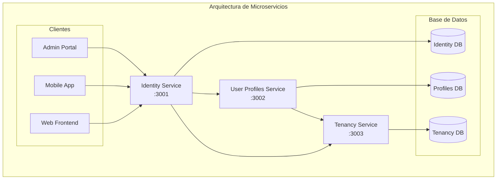
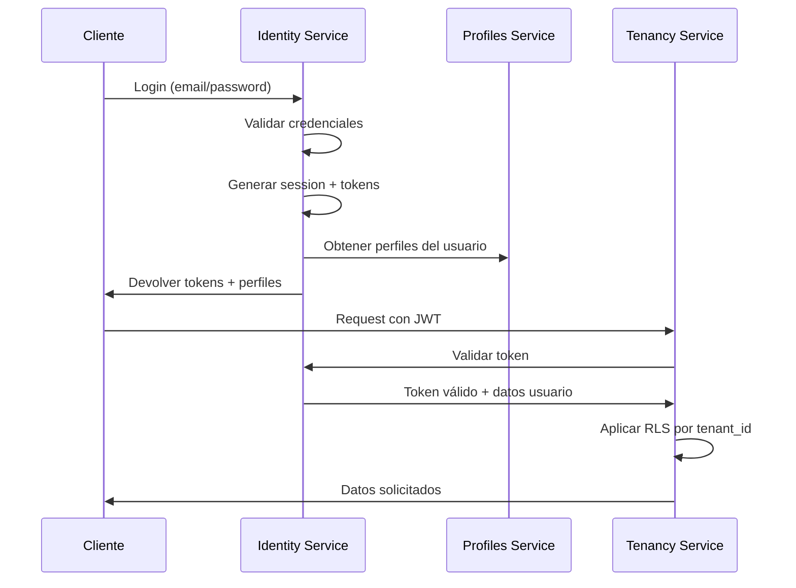
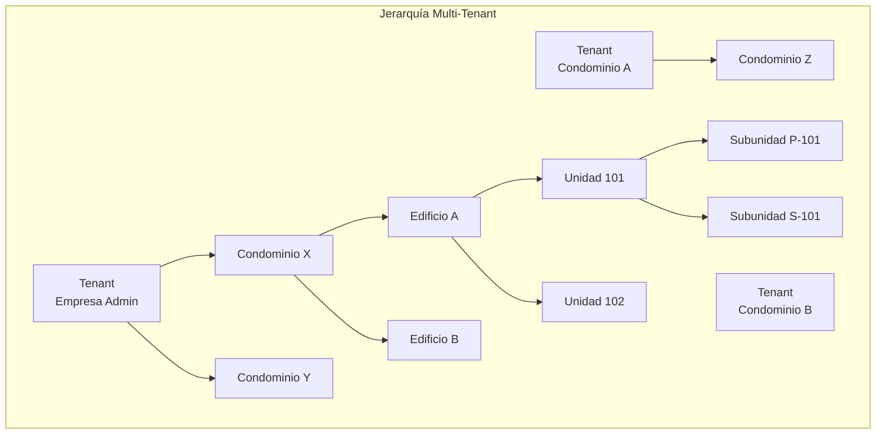

# Representación Gráfica del Modelo de Base de Datos

## Diagrama de Arquitectura de Microservicios

## Flujo de Autenticación y Autorización

## Jerarquía Organizacional

## Características Clave Visualizadas:

1. **Separación por Servicios**: Cada microservicio tiene su propio contexto
2. **Multi-tenancy**: `tenant_id` presente en todas las tablas principales
3. **Seguridad en Capas**: 
   - Identity (autenticación)
   - Profiles (autorización funcional)
   - RLS (seguridad a nivel de fila)
4. **Jerarquía Flexible**: Tenant → Condominio → Edificio → Unidad → Subunidad
5. **Sistema de Relaciones Complejo**: Tipos y subtipos de membresías
