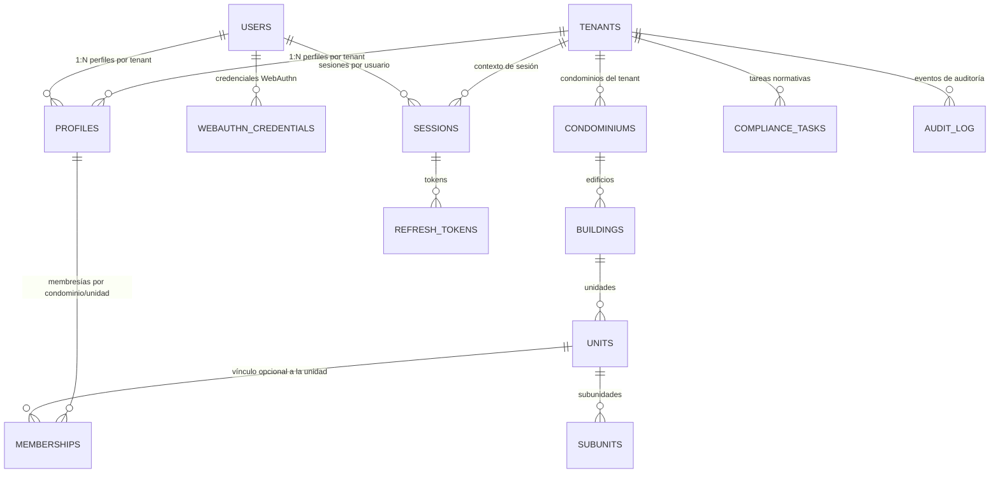
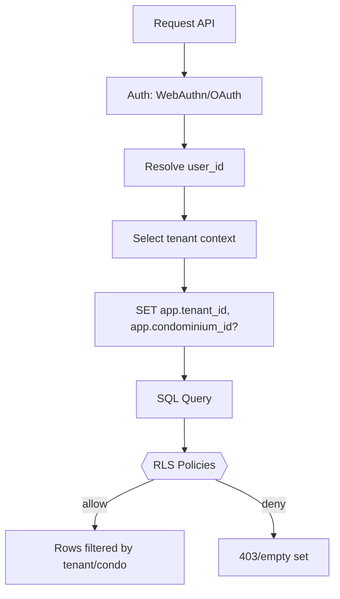

# SmartEdify · Arquitectura de Datos (versión revisada)
**Fecha:** 2025-10-11  
**Ámbito:** Modelo multi-tenant B2B2C, pertenencia multi-condominio por usuario, RLS por `tenant_id` y opcional por `condominium_id`, cifrado de columnas sensibles, particionado de tablas de alta rotación.

> Este documento reemplaza y actualiza `database_arq_1` con representaciones gráficas corregidas y unificadas. Integra los ajustes derivados del análisis DBA previo: desnormalización de `tenant_id` en tablas de acceso, RLS sin joins, unicidad condicional, y políticas de retención.

---

## 1. Modelo conceptual de entidades (ER revisado)



**Claves y relaciones mínimas**
- `profiles(user_id, tenant_id)` único por usuario-tenant.  
- `memberships(profile_id, tenant_id, condominium_id, unit_id?, relation, sub_relation, status)` con integridad `tenant_id == condominiums.tenant_id`.  
- `sessions(user_id, tenant_id)` define el contexto activo. Cambiar de tenant implica nueva sesión.  
- `tenants(tenant_type ∈ {ADMIN_COMPANY, INDIVIDUAL_CONDOMINIUM}, data_residency)`.  

---

## 2. Vista lógica con `tenant_id` desnormalizado

```mermaid
erDiagram
    TENANTS {{uuid id}} o{--|| CONDOMINIUMS : owns
    CONDOMINIUMS {{uuid id, uuid tenant_id}} o{--|| BUILDINGS : has
    BUILDINGS {{uuid id, uuid tenant_id, uuid condominium_id}} o{--|| UNITS : has
    UNITS {{uuid id, uuid tenant_id, uuid building_id}} o{--|| SUBUNITS : has
    PROFILES {{uuid id, uuid user_id, uuid tenant_id, citext email}}
    MEMBERSHIPS {{uuid id, uuid tenant_id, uuid profile_id, uuid condominium_id, uuid unit_id?,
                  text relation, text sub_relation, text status}}
    SESSIONS {{uuid id, uuid user_id, uuid tenant_id, timestamptz not_after, timestamptz revoked_at?}}
    REFRESH_TOKENS {{uuid id, uuid session_id, bytea token_hash, timestamptz expires_at}}
    WEBAUTHN_CREDENTIALS {{uuid id, uuid user_id, bytea credential_id, bytea public_key}}
```

Razonamiento: mover `tenant_id` a todas las tablas consultadas por usuarios reduce joins en políticas RLS y simplifica índices y filtros.

---

## 3. Políticas RLS sin joins (patrón)

```sql
-- Variables de sesión inyectadas por el backend
-- SELECT set_config('app.tenant_id', :tenant, true);
-- SELECT set_config('app.condominium_id', :condo, true); -- opcional

ALTER TABLE profiles    ENABLE ROW LEVEL SECURITY;
ALTER TABLE memberships ENABLE ROW LEVEL SECURITY;

CREATE POLICY rls_profiles_by_tenant ON profiles
USING (tenant_id = current_setting('app.tenant_id')::uuid)
WITH CHECK (tenant_id = current_setting('app.tenant_id')::uuid);

CREATE POLICY rls_memberships_by_scope ON memberships
USING (
  tenant_id = current_setting('app.tenant_id')::uuid
  AND ( current_setting('app.condominium_id', true) IS NULL
        OR condominium_id = current_setting('app.condominium_id')::uuid )
)
WITH CHECK (
  tenant_id = current_setting('app.tenant_id')::uuid
  AND ( current_setting('app.condominium_id', true) IS NULL
        OR condominium_id = current_setting('app.condominium_id')::uuid )
);
```

---

## 4. Diagrama de flujo de control de acceso



---

## 5. Integridad y unicidad

- `UNIQUE (user_id, tenant_id) WHERE deleted_at IS NULL` en `profiles`.  
- `UNIQUE (tenant_id, email) WHERE deleted_at IS NULL` en `profiles` y `citext` para email case-insensitive.  
- `UNIQUE (unit_id) WHERE relation='OWNER' AND sub_relation='PRIMARY_OWNER' AND status='ACTIVE'` en `memberships`.  
- Trigger `BEFORE INSERT/UPDATE` en `memberships` para validar `tenant_id == (SELECT tenant_id FROM condominiums WHERE id=condominium_id)`.  

---

## 6. Índices y particionado

- `sessions`: índice `(user_id, not_after DESC) WHERE revoked_at IS NULL`. Particionado RANGE mensual por `not_after`.  
- `refresh_tokens`: `UNIQUE(token_hash)` e índice por `expires_at`. Particionado mensual por `expires_at`.  
- `compliance_tasks`: índices en `(tenant_id, status, deadline)` y particionado por `created_at`.  
- Ajustar `autovacuum_analyze_scale_factor` y `autovacuum_vacuum_scale_factor` bajo para tablas de alta rotación.  

---

## 7. Seguridad de datos

- Cifrar columnas sensibles con KMS: `users.phone`, `webauthn_credentials.public_key`.  
- Mantener `token_hash` como hash irrevertible.  
- `pgaudit` para operaciones DML y DDL críticas.  
- `audit_log(tenant_id, user_id, session_id, action, table, old, new, ip, ts)` con retención definida por normativa del tenant.  
- `data_residency`: clusters por región o etiqueta de `region_code` por fila si es multi-región en un único cluster.  

---

## 8. Escenarios multi-tenant y multi-condominio

- Un usuario puede pertenecer a varios tenants con perfiles separados.  
- Un perfil puede tener múltiples membresías en varios condominios del mismo tenant.  
- `sessions.tenant_id` fija el contexto. Cambio de tenant requiere nueva sesión.  

---

## 9. Diferencias clave respecto a la versión anterior

1. `tenant_id` desnormalizado en `buildings/units/subunits` para RLS simple.  
2. Reglas de unicidad por tenant y por unidad para propietarios primarios.  
3. Particionado recomendado para `sessions`, `refresh_tokens`, y `compliance_*`.  
4. Diagramas unificados y consistentes con el flujo de acceso.  

---

## 10. Apéndice: DDL mínimo sugerido

```sql
CREATE EXTENSION IF NOT EXISTS citext;

-- Unicidad de perfiles por usuario-tenant
CREATE UNIQUE INDEX IF NOT EXISTS profiles_user_tenant_uniq
  ON profiles(user_id, tenant_id) WHERE deleted_at IS NULL;

-- Email por tenant
ALTER TABLE profiles ALTER COLUMN email TYPE citext;
CREATE UNIQUE INDEX IF NOT EXISTS profiles_tenant_email_uniq
  ON profiles(tenant_id, email) WHERE deleted_at IS NULL;

-- Integridad membership-condominium
CREATE OR REPLACE FUNCTION trg_membership_tenant_check()
RETURNS trigger AS $$
BEGIN
  IF NEW.tenant_id IS DISTINCT FROM (SELECT tenant_id FROM condominiums WHERE id = NEW.condominium_id) THEN
    RAISE EXCEPTION 'Membership tenant_id no coincide con condominium.tenant_id';
  END IF;
  RETURN NEW;
END$$ LANGUAGE plpgsql;

DROP TRIGGER IF EXISTS membership_tenant_check ON memberships;
CREATE TRIGGER membership_tenant_check
BEFORE INSERT OR UPDATE ON memberships
FOR EACH ROW EXECUTE FUNCTION trg_membership_tenant_check();

-- Propietario primario único por unidad
CREATE UNIQUE INDEX IF NOT EXISTS one_primary_owner_per_unit
  ON memberships(unit_id)
  WHERE relation='OWNER' AND sub_relation='PRIMARY_OWNER' AND status='ACTIVE';
```
