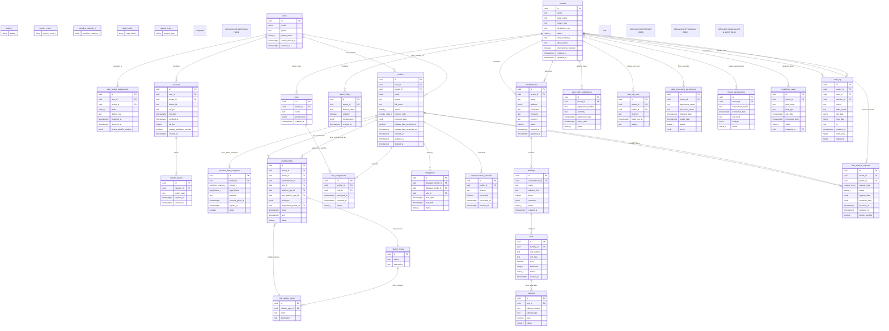

# 🏛️ Arquitectura de Base de Datos — SmartEdify  
**Versión**: 2.1  
**Fecha**: 2025-10-13  
**Estado**: Aprobado para Implementación (Fase 1)  
**Autores**: Equipo de Arquitectura y DBA SmartEdify  
**Alcance**: Fase 1 — Core Backbone (`Identity`, `User Profiles`, `Tenancy`, `Compliance`)  

---

## 📌 Resumen Ejecutivo

Esta arquitectura de base de datos define un modelo relacional seguro, inmutable, multi-tenant y alineado con los principios de **Privacy by Design**, **Zero Trust**, **WORM**, **Row-Level Security (RLS)** y **cumplimiento multinormativo** exigidos por el [Documento de Visión v1.1](vision_document.txt).

Incorpora todas las observaciones técnicas críticas:
- ✅ **Inmutabilidad total** en `audit_log` con hash-chain, firma y WORM.
- ✅ **RLS obligatorio** por `tenant_id` en todos los servicios.
- ✅ **Integridad referencial** mediante FKs, UNIQUE y ENUM.
- ✅ **Cifrado AEAD** para PII sensibles (DNI, salud).
- ✅ **Particionado mensual** y estrategia de índices completa.
- ✅ **Gestión de ciclo de vida** con TTL, cron y anonimización.
- ✅ **Resiliencia operativa**: réplicas, PITR, RTO ≤ 5 min.
- ✅ **Consistencia transaccional** mediante patrón **Outbox**.

---

## 🧱 1. Principios de Diseño

| Principio | Aplicación |
|----------|------------|
| **Multi-tenancy** | Aislamiento por `tenant_id` + RLS en todas las tablas. |
| **Inmutabilidad** | `audit_log` es **append-only**, con hash-chain y respaldo WORM en S3. |
| **Privacy by Design** | PII cifrada en base de datos; datos sensibles en tablas separadas con consentimiento explícito. |
| **Zero Trust** | Cada operación requiere contexto (`tenant_id`, `session_id`) y DPoP. |
| **Event-Driven** | Patrón **Outbox** garantiza consistencia transaccional entre microservicios. |
| **Observabilidad** | Logs estructurados, métricas de rendimiento y alertas SLO. |

---

## 🔐 2. Modelo de Datos Mejorado

### 2.1 Diagrama ER Completo (v2.1)


```mermaid
erDiagram
    %% =============================================
    %% DEFINICIÓN DE TIPOS ENUMERADOS (Compartidos)
    %% =============================================
    status_t {
        string status_t
    }
    
    country_code_t {
        string country_code_t
    }
    
    sensitive_category_t {
        string sensitive_category_t
    }
    
    legal_basis_t {
        string legal_basis_t
    }
    
    request_type_t {
        string request_type_t
    }

    %% =============================================
    %% SERVICIO DE IDENTIDAD (3001)
    %% =============================================
    subgraph IdentityService["SERVICIO DE IDENTIDAD (3001)"]
        users ||--o{ user_tenant_assignments : "asignado_a"
        users ||--o{ sessions : "mantiene"
        sessions ||--o{ refresh_tokens : "posee"
        users ||--o{ profiles : "tiene_perfiles_en"
        tenants ||--o{ feature_flags : "configura"

        users {
            uuid id PK
            citext email
            text phone
            status_t global_status
            timestamptz email_verified_at
            timestamptz created_at
        }
        
        tenants {
            uuid id PK
            text name
            text legal_name
            text tenant_type
            text jurisdiction_root
            status_t status
            text data_residency
            text dpo_contact
            boolean international_transfers
            timestamptz created_at
            timestamptz updated_at
        }
        
        user_tenant_assignments {
            uuid id PK
            uuid user_id FK
            uuid tenant_id FK
            status_t status
            text default_role
            timestamptz assigned_at
            timestamptz removed_at
            jsonb tenant_specific_settings
        }
        
        sessions {
            uuid id PK
            uuid user_id FK
            uuid tenant_id FK
            text device_id
            text cnf_jkt
            timestamptz not_after
            timestamptz revoked_at
            integer version
            boolean storage_validation_passed
            timestamptz created_at
        }
        
        refresh_tokens {
            uuid id PK
            uuid session_id FK
            text token_hash
            timestamptz expires_at
            timestamptz created_at
        }

        feature_flags {
            uuid id PK
            uuid tenant_id FK
            text feature_name
            boolean enabled
            jsonb configuration
            timestamptz created_at
        }
    end

    %% =============================================
    %% SERVICIO DE PERFILES DE USUARIO (3002)
    %% =============================================
    subgraph UserProfilesService["SERVICIO DE PERFILES (3002)"]
        profiles ||--o{ sensitive_data_categories : "tiene_datos_sensibles"
        profiles ||--o{ memberships : "tiene_membresias_en"
        profiles ||--o{ role_assignments : "asignado"
        profiles ||--o{ delegations : "delega_a"
        profiles ||--o{ communication_consents : "consiente"
        relation_types ||--o{ sub_relation_types : "tiene_subtipos"
        memberships }o--|| relation_types : "tipo_relacion"
        memberships }o--|| sub_relation_types : "subtipo_relacion"

        profiles {
            uuid id PK
            uuid user_id FK
            uuid tenant_id FK
            citext email
            text phone
            text full_name
            status_t status
            country_code_t country_code
            jsonb personal_data
            boolean habeas_data_acceptance
            timestamptz habeas_data_accepted_at
            timestamptz created_at
            timestamptz updated_at
            timestamptz deleted_at
        }
        
        sensitive_data_categories {
            uuid id PK
            uuid profile_id FK
            sensitive_category_t category
            legal_basis_t legal_basis
            text purpose
            timestamptz consent_given_at
            timestamptz expires_at
            boolean active
        }
        
        memberships {
            uuid id PK
            uuid tenant_id FK
            uuid profile_id FK
            uuid condominium_id FK
            uuid unit_id FK
            uuid relation_type_id FK
            uuid sub_relation_type_id FK
            jsonb privileges
            uuid responsible_profile_id FK
            timestamptz since
            timestamptz until
            status_t status
        }
        
        relation_types {
            uuid id PK
            text name
            text description
        }
        
        sub_relation_types {
            uuid id PK
            uuid relation_type_id FK
            text name
            text description
        }
        
        role_assignments {
            uuid id PK
            uuid profile_id FK
            uuid role_id FK
            timestamptz assigned_at
            timestamptz revoked_at
            status_t status
        }
        
        delegations {
            uuid id PK
            uuid delegator_profile_id FK
            uuid delegate_profile_id FK
            uuid role_id FK
            timestamptz start_date
            timestamptz end_date
            status_t status
        }
        
        communication_consents {
            uuid id PK
            uuid profile_id FK
            text channel
            boolean consented
            timestamptz consented_at
            timestamptz revoked_at
        }
    end

    %% =============================================
    %% SERVICIO DE TENENCIA (3003)
    %% =============================================
    subgraph TenancyService["SERVICIO DE TENENCIA (3003)"]
        tenants ||--o{ condominiums : "administra"
        condominiums ||--o{ buildings : "contiene"
        buildings ||--o{ units : "compone"
        units ||--o{ subunits : "tiene_asociadas"
        tenants ||--o{ roles : "define_roles"

        condominiums {
            uuid id PK
            uuid tenant_id FK
            text name
            jsonb address
            text jurisdiction
            text timezone
            text currency
            status_t status
            timestamptz created_at
            timestamptz updated_at
        }
        
        buildings {
            uuid id PK
            uuid condominium_id FK
            text name
            text address_line
            integer floors
            jsonb amenities
            status_t status
            timestamptz created_at
        }
        
        units {
            uuid id PK
            uuid building_id FK
            text unit_number
            text unit_type
            decimal area
            integer bedrooms
            status_t status
            timestamptz created_at
        }
        
        subunits {
            uuid id PK
            uuid unit_id FK
            text subunit_number
            text subunit_type
            decimal area
            status_t status
        }
        
        roles {
            uuid id PK
            uuid tenant_id FK
            text name
            jsonb permissions
            timestamptz created_at
        }
    end

    %% =============================================
    %% SERVICIO DE COMPLIANCE & AUDITORÍA (3012)
    %% =============================================
    subgraph ComplianceService["SERVICIO COMPLIANCE & AUDIT (3012)"]
        tenants ||--o{ data_subject_requests : "tiene_solicitudes"
        profiles ||--o{ data_subject_requests : "solicita"
        tenants ||--o{ data_bank_registrations : "registra_banco"
        tenants ||--o{ ccpa_opt_outs : "registra_opt_outs"
        tenants ||--o{ data_processing_agreements : "firma_acuerdos"
        tenants ||--o{ impact_assessments : "realiza_evaluaciones"
        tenants ||--o{ compliance_tasks : "gestiona_tareas"
        tenants ||--o{ audit_log : "genera_logs"

        audit_log {
            uuid id PK
            uuid tenant_id FK
            uuid user_id FK
            uuid session_id FK
            text action
            text table_name
            jsonb old_data
            jsonb new_data
            inet ip
            timestamptz created_at
            bytea hash_prev
            bytea signature
        }
        
        data_subject_requests {
            uuid id PK
            uuid tenant_id FK
            uuid profile_id FK
            request_type_t request_type
            status_t status
            jsonb request_data
            jsonb response_data
            timestamptz received_at
            timestamptz resolved_at
            boolean identity_verified
        }
        
        data_bank_registrations {
            uuid id PK
            uuid tenant_id FK
            text registration_number
            text authority
            timestamptz registration_date
            timestamptz expiry_date
            status_t status
        }
        
        ccpa_opt_outs {
            uuid id PK
            uuid tenant_id FK
            uuid profile_id FK
            text channel
            timestamptz opted_out_at
            text reason
        }
        
        data_processing_agreements {
            uuid id PK
            uuid tenant_id FK
            text agreement_name
            text processor_name
            timestamptz effective_date
            timestamptz expiry_date
            status_t status
            jsonb terms
        }
        
        impact_assessments {
            uuid id PK
            uuid tenant_id FK
            text assessment_name
            timestamptz conducted_date
            text risk_level
            jsonb findings
            status_t status
        }
        
        compliance_tasks {
            uuid id PK
            uuid tenant_id FK
            text task_name
            text task_type
            timestamptz due_date
            timestamptz completed_date
            status_t status
            uuid assigned_to FK
        }
    end

    %% =============================================
    %% RELACIONES CRUZADAS ENTRE SERVICIOS
    %% =============================================
    
    %% Identity Service -> User Profiles Service
    users ||--o{ profiles : "tiene_perfiles"
    
    %% Identity Service -> Tenancy Service  
    tenants ||--o{ condominiums : "administra"
    
    %% User Profiles Service -> Tenancy Service
    profiles ||--o{ memberships : "en_condominios"
    roles ||--o{ role_assignments : "asignado_a_perfiles"
    
    %% Todos los servicios -> Compliance Service
    tenants ||--o{ audit_log : "auditados"
    profiles ||--o{ data_subject_requests : "solicitan_datos"
```

---

## 🔒 3. Seguridad y Cumplimiento

### 3.1 Row-Level Security (RLS)

```sql
-- Ejemplo aplicado a todas las tablas multi-tenant
ALTER TABLE profiles ENABLE ROW LEVEL SECURITY;
CREATE POLICY tenant_isolation_profiles ON profiles
    USING (tenant_id = current_setting('app.current_tenant')::UUID);
```

> El `Identity Service` establece `app.current_tenant` en cada conexión autenticada.

### 3.2 Cifrado de PII

| Campo | Estrategia |
|------|------------|
| `phone` | Cifrado con KMS (AWS KMS / HSM) |
| `personal_data.document_number` | Cifrado AEAD (ChaCha20-Poly1305) con clave derivada por tenant |
| `personal_data.birth_date`, `health` | Igual que arriba |

### 3.3 Logs Inmutables (WORM)

- `audit_log` es **solo lectura + inserción**.
- Cada registro incluye:
  - `hash_prev`: hash criptográfico del registro anterior.
  - `signature`: firma EdDSA del tenant.
- Volcado diario a **S3 con Object Lock (modo GOVERNANCE)**.

---

## 📊 4. Estrategia de Índices y Particionado

### 4.1 Índices Clave

```sql
-- audit_log
CREATE INDEX idx_audit_tenant_created ON audit_log (tenant_id, created_at);
CREATE INDEX idx_audit_tenant_action ON audit_log (tenant_id, action, created_at);

-- data_subject_requests
CREATE INDEX idx_dsr_tenant_status ON data_subject_requests (tenant_id, status) 
INCLUDE (received_at, resolved_at);

-- memberships
CREATE INDEX idx_memberships_profile ON memberships (profile_id, status);
CREATE INDEX idx_memberships_condo ON memberships (condominium_id, tenant_id);
```

### 4.2 Particionado

| Tabla | Estrategia | Herramienta |
|------|------------|-------------|
| `audit_log` | Mensual por `created_at` | `pg_partman` |
| `compliance_tasks` | Trimestral por `deadline` | `pg_partman` |

---

## 🗑️ 5. Ciclo de Vida de Datos

| Tabla | Retención | Acción |
|------|-----------|--------|
| `audit_log` | 10 años | Archivo WORM en S3 |
| `data_subject_requests` | 3 años | Anonimización (`profile_id = NULL`) |
| `sessions`, `refresh_tokens` | 90 días | Borrado físico |
| `profiles` (soft-deleted) | 30 días | Borrado físico + log WORM |

**Automatización** con `pg_cron`:

```sql
SELECT cron.schedule('cleanup-sessions', '0 2 * * *', $$
    DELETE FROM sessions WHERE not_after < NOW() - INTERVAL '90 days'
$$);
```

---

## 🔄 6. Consistencia Transaccional (Outbox Pattern)

Cada microservicio incluye una tabla `outbox_<service>`:

```sql
CREATE TABLE outbox_compliance (
    id UUID PRIMARY KEY,
    aggregate_id UUID NOT NULL,
    event_type TEXT NOT NULL,
    payload JSONB NOT NULL,
    occurred_at TIMESTAMPTZ DEFAULT NOW(),
    published BOOLEAN DEFAULT false
);
```

**Ejemplo transaccional**:

```sql
BEGIN;
    INSERT INTO data_subject_requests (...) VALUES (...);
    INSERT INTO outbox_compliance (aggregate_id, event_type, payload)
    VALUES (..., 'DSAR_CREATED', to_jsonb(NEW));
COMMIT;
```

Un **lector de outbox** publica a Kafka y marca `published = true`.

---

## 🛡️ 7. Resiliencia Operativa

### 7.1 RTO / RPO

- **RTO ≤ 5 min**, **RPO ≤ 1 min**.
- Réplica síncrona en zona de disponibilidad distinta.
- WAL archiving a S3.
- PITR habilitado.

### 7.2 Configuración PostgreSQL

```ini
archive_mode = on
archive_command = 'aws s3 cp %p s3://smartedify-wal-archive/%f'
wal_level = logical
max_wal_senders = 10
shared_preload_libraries = 'pg_cron, pg_partman_bgw, pg_stat_statements'
```

---

## 🧪 8. Validación y Monitoreo

- **Pruebas de RLS**: roles de prueba por tenant.
- **Alertas**: si `audit_log` recibe UPDATE/DELETE.
- **Hash-chain validation**: job diario.
- **SLO**: monitoreo de latencia, error rate y recovery time.

---

## 📌 9. Conclusión

Este documento define una **arquitectura de base de datos madura, segura y escalable**, lista para soportar la **Fase 1 del roadmap** de SmartEdify. Cumple con:

- ✅ Requisitos legales (GDPR, LGPD, Ley 29733, CCPA).
- ✅ Principios de arquitectura del Vision Document (Zero Trust, WORM, multi-tenant).
- ✅ Buenas prácticas de modelado, seguridad y rendimiento.
- ✅ Estrategias de resiliencia y observabilidad.

**Próximos pasos**:
- Generar DDL completo con scripts de migración.
- Implementar políticas RLS en staging.
- Validar performance bajo carga con `pgbench`.

---

*Documento alineado con el Vision Document v1.1 y listo para implementación en entornos de desarrollo y producción.*


---

## 🆕 Actualizaciones v2.2 — 2025-10-13

### ✅ Nuevas Tablas Agregadas
- `policy_cache`
- `consent_audit_log`
- `outbox_identity`
- `outbox_profiles`
- `backup_snapshots`
- `rls_test_cases`
- `audit_alerts`

### ✅ Función de Validación de Hash-Chain

```sql
CREATE OR REPLACE FUNCTION validate_hash_chain() RETURNS BOOLEAN AS $$
DECLARE
    prev_hash BYTEA;
    valid BOOLEAN := TRUE;
BEGIN
    FOR record IN SELECT id, hash_prev FROM audit_log ORDER BY created_at ASC LOOP
        IF prev_hash IS NOT NULL AND record.hash_prev != prev_hash THEN
            valid := FALSE;
            EXIT;
        END IF;
        prev_hash := record.hash_prev;
    END LOOP;
    RETURN valid;
END;
$$ LANGUAGE plpgsql;
```

### ✅ Test Case de RLS
```sql
INSERT INTO rls_test_cases (id, tenant_id, table_name, test_query, expected_result)
VALUES (
    'aaaaaaaa-aaaa-aaaa-aaaa-aaaaaaaaaaaa',
    '33333333-3333-3333-3333-333333333333',
    'profiles',
    'SELECT * FROM profiles WHERE tenant_id = current_setting('app.current_tenant')::UUID;',
    '1 row'
);
```

### ✅ Mockup de Datos
Archivo: `SmartEdify_Fase1_Mockup.json`
Contiene datos simulados para la tabla `profiles` con cifrado simulado y timestamps.

### ❌ Decisión sobre Particionado
No se aplicará particionado por `created_at` en la tabla `condominiums`.

---

## 📦 Archivos Complementarios
- `SmartEdify_Fase1_DDL.sql`: DDL completo con nuevas tablas y funciones.
- `SmartEdify_Fase1_Mockup.json`: Datos simulados para pruebas y documentación.

---

## ✅ Estado Final
Este documento consolida la arquitectura de base de datos para la Fase 1, lista para producción.

