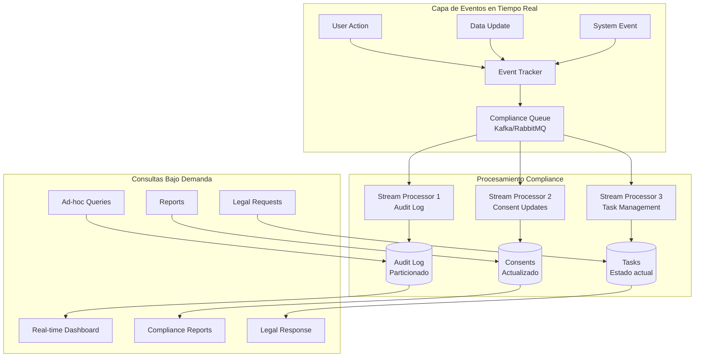

## 🏛️ Representación Gráfica del Modelo de Base de Datos

```mermaid
erDiagram
    %% =============================================
    %% IDENTITY SERVICE (3001) - Núcleo de Autenticación
    %% =============================================

    users {
        uuid id PK
        citext email
        text phone "Cifrado KMS"
        text global_status
        timestamptz email_verified_at
        timestamptz created_at
    }

    user_tenant_assignments {
        uuid id PK
        uuid user_id FK
        uuid tenant_id FK
        text status
        text default_role
        timestamptz assigned_at
        timestamptz removed_at
        jsonb tenant_specific_settings
    }

    sessions {
        uuid id PK
        uuid user_id FK
        uuid tenant_id
        text device_id
        text cnf_jkt
        timestamptz not_after
        timestamptz revoked_at
        integer version
        boolean storage_validation_passed
        timestamptz created_at
    }

    refresh_tokens {
        uuid id PK
        uuid session_id FK
        text token_hash
        timestamptz expires_at
        timestamptz created_at
    }

    feature_flags {
        uuid id PK
        uuid tenant_id
        text name
        text description
        boolean enabled
        timestamptz created_at
        timestamptz updated_at
    }

    %% =============================================
    %% USER PROFILES SERVICE (3002) - Identidad Funcional
    %% =============================================

    profiles {
        uuid id PK
        uuid user_id FK
        uuid tenant_id
        citext email
        text phone "Cifrado KMS"
        text full_name
        text status
        text country_code
        jsonb personal_data
        boolean habeas_data_acceptance
        timestamptz habeas_data_accepted_at
        timestamptz created_at
        timestamptz updated_at
        timestamptz deleted_at
    }

    sensitive_data_categories {
        uuid id PK
        uuid profile_id FK
        text category "HEALTH, BIOMETRIC, RELIGION, UNION, etc."
        text legal_basis "EXPLICIT_CONSENT, VITAL_INTEREST, etc."
        text purpose
        text information_provided "Texto informativo al titular"
        timestamptz consent_given_at
        timestamptz expires_at
        boolean active
    }

    relation_types {
        uuid id PK
        text code
        text description
        text category
        boolean can_vote
        boolean can_represent
        boolean requires_approval
    }

    sub_relation_types {
        uuid id PK
        uuid relation_type_id FK
        text code
        text description
        integer weight
        jsonb inheritance_chain
    }

    memberships {
        uuid id PK
        uuid tenant_id
        uuid profile_id FK
        uuid condominium_id
        uuid unit_id
        text relation
        text sub_relation
        jsonb privileges
        uuid responsible_profile_id FK
        timestamptz since
        timestamptz until
        text status
    }

    roles {
        uuid id PK
        uuid tenant_id
        uuid condominium_id
        text name
        jsonb permissions
    }

    role_assignments {
        uuid id PK
        uuid tenant_id
        uuid profile_id FK
        uuid condominium_id
        uuid role_id FK
        timestamptz granted_at
        timestamptz revoked_at
    }

    delegations {
        uuid id PK
        uuid delegator_profile_id FK
        uuid delegate_profile_id FK
        uuid condominium_id FK
        uuid tenant_id
        text scope
        timestamptz expires_at
        timestamptz revoked_at
        timestamptz created_at
    }

    communication_consents {
        uuid id PK
        uuid tenant_id
        uuid profile_id FK
        text channel
        text purpose
        text legal_basis "CONSENT, CONTRACT, LEGAL_OBLIGATION, etc."
        text legitimate_interest_assessment
        text finalidad_especifica
        boolean allowed
        text policy_version
        timestamptz updated_at
    }

    %% =============================================
    %% TENANCY SERVICE (3003) - Raíz Organizacional
    %% =============================================

    tenants {
        uuid id PK
        text name
        text legal_name
        text tenant_type
        text jurisdiction_root
        text status
        text data_residency
        text dpo_contact "Delegado de Protección de Datos"
        text lgpd_encarregado "Encarregado LGPD (Brasil)"
        boolean international_transfers
        text international_transfer_basis
        text ccpa_business_scope
        timestamptz created_at
        timestamptz updated_at
    }

    condominiums {
        uuid id PK
        uuid tenant_id
        text name
        jsonb address
        text jurisdiction
        text timezone
        text currency
        text status
        timestamptz created_at
        timestamptz updated_at
    }

    buildings {
        uuid id PK
        uuid tenant_id
        uuid condominium_id FK
        text name
        integer floors
        jsonb address_override
        timestamptz created_at
        timestamptz updated_at
    }

    units {
        uuid id PK
        uuid tenant_id
        uuid building_id FK
        text unit_number
        text type
        decimal area_sqm
        integer bedrooms
        integer bathrooms
        text status
        timestamptz created_at
        timestamptz updated_at
    }

    subunits {
        uuid id PK
        uuid tenant_id
        uuid unit_id FK
        text subunit_number
        text description
        text type
        decimal area_sqm
        boolean is_common_area
        text access_code
        timestamptz created_at
        timestamptz updated_at
    }

    %% =============================================
    %% CUMPLIMIENTO Y AUDITORÍA MEJORADO
    %% =============================================

    compliance_tasks {
        uuid id PK
        uuid tenant_id
        text task_type
        text status
        timestamptz deadline
        timestamptz created_at
    }

    audit_log {
        uuid id PK
        uuid tenant_id
        uuid user_id
        uuid session_id
        text action
        text table_name
        jsonb old_data
        jsonb new_data
        inet ip
        timestamptz created_at
    }

    data_subject_requests {
        uuid id PK
        uuid tenant_id FK
        uuid profile_id FK
        text request_type "ACCESS, RECTIFICATION, DELETION, PORTABILITY, etc."
        text status "PENDING, IN_PROGRESS, COMPLETED, DENIED"
        jsonb request_data
        jsonb response_data
        timestamptz received_at
        timestamptz resolved_at
        text denial_reason
        boolean identity_verified
    }

    data_bank_registrations {
        uuid id PK
        uuid tenant_id FK
        text bank_code "Código del Ministerio (Perú)"
        text purpose
        text legal_basis
        timestamptz registered_at
        timestamptz expires_at
    }

    ccpa_opt_outs {
        uuid id PK
        uuid tenant_id FK
        uuid profile_id FK
        boolean opt_out_sale
        timestamptz opted_out_at
        timestamptz revoked_at
    }

    data_processing_agreements {
        uuid id PK
        uuid tenant_id FK
        text processor_name
        text service_description
        text country
        text legal_basis_transfer
        text safeguards
        timestamptz signed_at
        timestamptz expires_at
    }

    impact_assessments {
        uuid id PK
        uuid tenant_id FK
        text assessment_type
        jsonb risk_analysis
        jsonb mitigation_measures
        text status
        timestamptz conducted_at
        timestamptz next_review
    }

    %% =============================================
    %% RELACIONES PRINCIPALES ACTUALIZADAS
    %% =============================================

    users ||--o{ user_tenant_assignments : "asignado_a"
    user_tenant_assignments }o--|| tenants : "pertenece_a"
    users ||--o{ sessions : "mantiene"
    sessions ||--o{ refresh_tokens : "posee"
    tenants ||--o{ feature_flags : "configura"

    users ||--o{ profiles : "tiene_perfiles_en"
    profiles ||--o{ sensitive_data_categories : "tiene_datos_sensibles"
    profiles ||--o{ memberships : "tiene_membresias_en"
    relation_types ||--o{ sub_relation_types : "tiene_subtipos"
    memberships }o--|| relation_types : "tipo_relacion"
    memberships }o--|| sub_relation_types : "subtipo_relacion"

    tenants ||--o{ condominiums : "administra"
    condominiums ||--o{ buildings : "contiene"
    buildings ||--o{ units : "compone"
    units ||--o{ subunits : "tiene_asociadas"

    profiles ||--o{ role_assignments : "asignado"
    roles ||--o{ role_assignments : "asignado_en"
    profiles ||--o{ delegations : "delega_a"
    profiles ||--o{ communication_consents : "consiente"

    tenants ||--o{ data_subject_requests : "tiene_solicitudes"
    profiles ||--o{ data_subject_requests : "solicita"
    tenants ||--o{ data_bank_registrations : "registra_banco"
    tenants ||--o{ ccpa_opt_outs : "registra_opt_outs"
    tenants ||--o{ data_processing_agreements : "firma_acuerdos"
    tenants ||--o{ impact_assessments : "realiza_evaluaciones"
```



## 🔄 Diagrama de Arquitectura de Cumplimiento Legal


## 📊 Mockup con Datos Reales Completos y Actualizados

### 1. Identity Service (3001) - Datos Actualizados

#### **users** (Sin cambios críticos)
```json
{
  "id": "a1b2c3d4-e5f6-7890-abcd-ef1234567890",
  "email": "maria.gonzalez@email.com",
  "phone": "encrypted:kms:abc123encrypteddata456",
  "global_status": "ACTIVE",
  "email_verified_at": "2024-01-15T10:30:00Z",
  "created_at": "2024-01-10T08:15:23Z"
}
```

### 2. Tenancy Service (3003) - Estructura con Cumplimiento

#### **tenants** (Mejorado con datos legales)
```json
{
  "id": "t1e2n3a4-n5t6-7890-tenant-00123456789",
  "name": "Residencial Las Gardenias",
  "legal_name": "Comunidad de Propietarios Residencial Las Gardenias S.A.",
  "tenant_type": "INDIVIDUAL_CONDOMINIUM",
  "jurisdiction_root": "PE",
  "status": "ACTIVE",
  "data_residency": "PE-LIM",
  "dpo_contact": "dpo@lasgardenias.com",
  "lgpd_encarregado": "encarregado@lasgardenias.com.br",
  "international_transfers": false,
  "international_transfer_basis": "NO_TRANSFERS",
  "ccpa_business_scope": "BELOW_THRESHOLD",
  "created_at": "2023-05-15T00:00:00Z",
  "updated_at": "2024-06-01T09:00:00Z"
}
```

#### **condominiums** (Sin cambios críticos)
```json
{
  "id": "c1o2n3d4-o5m6-7890-condo-001234567",
  "tenant_id": "t1e2n3a4-n5t6-7890-tenant-00123456789",
  "name": "Torre Principal - Las Gardenias",
  "address": {
    "street": "Av. Las Gardenias 1234",
    "district": "Miraflores",
    "city": "Lima",
    "region": "Lima Metropolitana",
    "country": "PE",
    "postal_code": "15074"
  },
  "jurisdiction": "PE",
  "timezone": "America/Lima",
  "currency": "PEN",
  "status": "ACTIVE",
  "created_at": "2023-05-15T00:00:00Z",
  "updated_at": "2024-05-01T14:20:00Z"
}
```

### 3. User Profiles Service (3002) - Con Protección de Datos

#### **profiles** (Mejorado con aceptación Habeas Data)
```json
{
  "id": "p1r2o3f4-i5l6-7890-prof-0012345678",
  "user_id": "a1b2c3d4-e5f6-7890-abcd-ef1234567890",
  "tenant_id": "t1e2n3a4-n5t6-7890-tenant-00123456789",
  "email": "maria.gonzalez@lasgardenias.com",
  "phone": "encrypted:kms:xyz987encrypteddata654",
  "full_name": "María Elena González Ruiz",
  "status": "ACTIVE",
  "country_code": "PE",
  "personal_data": {
    "document_type": "DNI",
    "document_number": "71234567",
    "birth_date": "1985-08-20",
    "emergency_contact": {
      "name": "Carlos González",
      "relationship": "Esposo",
      "phone": "+51987654321"
    }
  },
  "habeas_data_acceptance": true,
  "habeas_data_accepted_at": "2024-01-10T08:25:00Z",
  "created_at": "2024-01-10T08:25:00Z",
  "updated_at": "2024-06-15T16:45:00Z",
  "deleted_at": null
}
```

#### **sensitive_data_categories** (NUEVA - Datos sensibles separados)
```json
{
  "id": "s1e2n3s4-d5a6-7890-sens-001234567",
  "profile_id": "p1r2o3f4-i5l6-7890-prof-0012345678",
  "category": "HEALTH",
  "legal_basis": "EXPLICIT_CONSENT",
  "purpose": "Información médica de emergencia para residentes con condiciones especiales",
  "information_provided": "Sus datos de salud serán utilizados exclusivamente para emergencias médicas y serán compartidos solo con servicios de emergencia autorizados cuando sea necesario para salvar su vida.",
  "consent_given_at": "2024-01-10T08:25:00Z",
  "expires_at": "2025-01-10T08:25:00Z",
  "active": true
}
```

#### **communication_consents** (Mejorado con base legal)
```json
{
  "id": "c1o2m3m4-c5o6-7890-consent-0123",
  "tenant_id": "t1e2n3a4-n5t6-7890-tenant-00123456789",
  "profile_id": "p1r2o3f4-i5l6-7890-prof-0012345678",
  "channel": "EMAIL",
  "purpose": "FINANCIAL_NOTIFICATIONS",
  "legal_basis": "CONTRACT",
  "legitimate_interest_assessment": "Notificaciones financieras necesarias para el cumplimiento del contrato de mantenimiento y administración del condominio.",
  "finalidad_especifica": "Envío de estados de cuenta, recordatorios de pago y información sobre gastos comunes",
  "allowed": true,
  "policy_version": "v3.0-2024",
  "updated_at": "2024-06-10T11:20:00Z"
}
```

### 4. Nuevas Tablas de Cumplimiento Legal

#### **data_subject_requests** (NUEVA - Gestión de derechos ARSULIPO)
```json
{
  "id": "d1a2t3a4-s5u6-7890-request-01234",
  "tenant_id": "t1e2n3a4-n5t6-7890-tenant-00123456789",
  "profile_id": "p1r2o3f4-i5l6-7890-prof-0012345678",
  "request_type": "ACCESS",
  "status": "COMPLETED",
  "request_data": {
    "description": "Solicito acceso a todos mis datos personales almacenados en el sistema",
    "specific_data_requested": ["personal_data", "communication_consents", "memberships"],
    "delivery_format": "DIGITAL"
  },
  "response_data": {
    "data_provided": true,
    "provided_at": "2024-06-20T10:00:00Z",
    "format": "PDF",
    "files_generated": ["reporte_datos_personales_71234567.pdf"],
    "notes": "Se entregó reporte completo con todos los datos personales del titular"
  },
  "received_at": "2024-06-15T09:30:00Z",
  "resolved_at": "2024-06-20T10:00:00Z",
  "denial_reason": null,
  "identity_verified": true
}
```

#### **data_bank_registrations** (NUEVA - Registro Perú)
```json
{
  "id": "d1a2t3a4-b5a6-7890-bank-0012345",
  "tenant_id": "t1e2n3a4-n5t6-7890-tenant-00123456789",
  "bank_code": "BDP-PERSONALES-2024-001234",
  "purpose": "Gestión de residentes, propietarios y administración del condominio Residencial Las Gardenias",
  "legal_basis": "Ejecución de contrato y consentimiento explícito",
  "registered_at": "2024-01-20T00:00:00Z",
  "expires_at": "2026-01-20T00:00:00Z"
}
```

#### **ccpa_opt_outs** (NUEVA - Opt-out California)
```json
{
  "id": "c1c2p3a4-o5p6-7890-optout-0123",
  "tenant_id": "t1e2n3a4-n5t6-7890-tenant-00123456789",
  "profile_id": "p1r2o3f4-c5a6-7890-prof-001234567",
  "opt_out_sale": true,
  "opted_out_at": "2024-06-18T14:25:00Z",
  "revoked_at": null
}
```

#### **data_processing_agreements** (NUEVA - Encargados tratamiento)
```json
{
  "id": "d1a2t3a4-p5r6-7890-agreement-012",
  "tenant_id": "t1e2n3a4-n5t6-7890-tenant-00123456789",
  "processor_name": "Amazon Web Services Perú",
  "service_description": "Almacenamiento en la nube de datos de residentes y administración",
  "country": "PE",
  "legal_basis_transfer": "Cláusulas Contractuales Tipo aprobadas por la Comisión Europea",
  "safeguards": "Cifrado end-to-end, certificación ISO 27001, auditorías anuales",
  "signed_at": "2024-01-15T00:00:00Z",
  "expires_at": "2027-01-15T00:00:00Z"
}
```

#### **impact_assessments** (NUEVA - EIPD/EIVD)
```json
{
  "id": "i1m2p3a4-c5t6-7890-impact-01234",
  "tenant_id": "t1e2n3a4-n5t6-7890-tenant-00123456789",
  "assessment_type": "EIPD",
  "risk_analysis": {
    "data_categories": ["personal_data", "sensitive_data"],
    "processing_operations": ["almacenamiento", "comunicaciones", "pagos"],
    "identified_risks": [
      {
        "risk": "Acceso no autorizado a datos médicos",
        "probability": "MEDIUM",
        "impact": "HIGH"
      }
    ]
  },
  "mitigation_measures": [
    "Cifrado de datos sensibles",
    "Autenticación de dos factores",
    "Auditorías trimestrales de acceso"
  ],
  "status": "COMPLETED",
  "conducted_at": "2024-06-01T10:00:00Z",
  "next_review": "2025-06-01T10:00:00Z"
}
```

### 5. Flujo de Cumplimiento de Solicitudes ARSULIPO

```mermaid
sequenceDiagram
    participant C as Ciudadano
    participant F as Frontend
    participant CMP as Compliance Service
    participant PRF as Profiles Service
    participant ID as Identity Service
    participant TNY as Tenancy Service
    participant AUD as Audit Log
    
    C->>F: Ejercer derecho ARSULIPO
    F->>CMP: Crear data_subject_requests
    CMP->>CMP: Verificar identidad (identity_verified)
    CMP->>PRF: Obtener datos del perfil
    CMP->>ID: Obtener datos de identidad
    CMP->>TNY: Obtener datos de tenencia
    CMP->>CMP: Consolidar respuesta
    CMP->>AUD: Registrar toda la actividad
    CMP->>F: Proporcionar respuesta consolidada
    F->>C: Entregar respuesta en plazo legal (30 días)
```



# Análisis de Patrones de Consulta para Compliance: Bajo Demanda vs Actualización

## 🔍 **Evaluación de Patrones de Acceso a Datos de Compliance**

### **1. Consultas BAJO DEMANDA (On-Demand)**
```sql
-- Ejemplos de consultas bajo demanda
SELECT * FROM data_subject_requests 
WHERE tenant_id = ? AND status = 'PENDING';

SELECT COUNT(*) FROM audit_log 
WHERE tenant_id = ? AND created_at BETWEEN ? AND ?;

SELECT * FROM impact_assessments 
WHERE tenant_id = ? AND next_review < NOW();
```

### **2. Consultas por ACTUALIZACIÓN (Event-Driven)**
```sql
-- Ejemplos disparados por eventos
INSERT INTO audit_log 
SELECT ... FROM users WHERE id = ?; -- Trigger después de modificación

UPDATE compliance_tasks SET status = 'OVERDUE'
WHERE deadline < NOW() AND status = 'PENDING'; -- Job programado
```

## 📊 **Análisis de Performance por Tabla de Compliance**

### **Tablas Optimizadas para Bajo Demanda:**

| **Tabla** | **Volumen** | **Patrón Acceso** | **Indexación Recomendada** |
|-----------|-------------|-------------------|----------------------------|
| `data_subject_requests` | Bajo-Medio | Búsquedas ad-hoc | `(tenant_id, status, received_at)` |
| `impact_assessments` | Bajo | Consultas puntuales | `(tenant_id, next_review)` |
| `data_bank_registrations` | Muy Bajo | Lecturas esporádicas | `(tenant_id, expires_at)` |

### **Tablas que Requieren Actualización en Tiempo Real:**

| **Tabla** | **Volumen** | **Patrón Acceso** | **Estrategia** |
|-----------|-------------|-------------------|----------------|
| `audit_log` | Muy Alto | Escritura continua + consultas | Particionado por tiempo |
| `compliance_tasks` | Medio | Updates frecuentes | Índices covering |

## 🚀 **Arquitectura Híbrida Propuesta**



## ⚡ **Implementación Técnica - Patrones Mixtos**

### **Caso 1: Audit Log - Alto Volumen, Consultas Bajo Demanda**
```sql
-- Particionado mensual para performance
CREATE TABLE audit_log (
    uuid id PK,
    uuid tenant_id,
    timestamptz created_at,
    -- otros campos
) PARTITION BY RANGE (created_at);

-- Crear particiones mensuales
CREATE TABLE audit_log_2024_06 PARTITION OF audit_log
    FOR VALUES FROM ('2024-06-01') TO ('2024-07-01');

-- Índices optimizados para consultas bajo demanda
CREATE INDEX CONCURRENTLY idx_audit_tenant_date 
ON audit_log (tenant_id, created_at) 
WHERE created_at > NOW() - INTERVAL '1 year';
```

### **Caso 2: Data Subject Requests - Bajo Volumen, Mixto**
```sql
-- Tabla con triggers para actualizaciones en tiempo real
CREATE TABLE data_subject_requests (
    uuid id PK,
    uuid tenant_id,
    text status,
    timestamptz received_at,
    timestamptz resolved_at,
    -- otros campos
);

-- Trigger para actualizar métricas en tiempo real
CREATE OR REPLACE FUNCTION update_compliance_metrics()
RETURNS TRIGGER AS $$
BEGIN
    -- Actualizar dashboard en tiempo real
    PERFORM pg_notify('compliance_update', 
        json_build_object(
            'tenant_id', NEW.tenant_id,
            'request_type', NEW.request_type,
            'status', NEW.status
        )::text
    );
    RETURN NEW;
END;
$$ LANGUAGE plpgsql;

CREATE TRIGGER compliance_metrics_trigger
    AFTER INSERT OR UPDATE ON data_subject_requests
    FOR EACH ROW EXECUTE FUNCTION update_compliance_metrics();
```

### **Caso 3: Compliance Tasks - Actualización Programada + Bajo Demanda**
```sql
-- Job programado para actualizaciones
CREATE OR REPLACE FUNCTION update_overdue_tasks()
RETURNS void AS $$
BEGIN
    UPDATE compliance_tasks 
    SET status = 'OVERDUE'
    WHERE deadline < NOW() 
      AND status = 'PENDING'
      AND tenant_id IN (
          SELECT id FROM tenants WHERE status = 'ACTIVE'
      );
END;
$$ LANGUAGE plpgsql;

-- Programar ejecución cada hora
-- SELECT cron.schedule('0 * * * *', 'SELECT update_overdue_tasks();');
```

## 📈 **Estrategias de Optimización por Tipo de Consulta**

### **Para Consultas Bajo Demanda:**
```sql
-- Materialized Views para reports complejos
CREATE MATERIALIZED VIEW compliance_dashboard AS
SELECT 
    t.id as tenant_id,
    t.name as tenant_name,
    COUNT(DISTINCT dsr.id) as pending_requests,
    COUNT(DISTINCT ct.id) as overdue_tasks,
    MAX(audit.last_activity) as last_audit_activity
FROM tenants t
LEFT JOIN data_subject_requests dsr 
    ON dsr.tenant_id = t.id AND dsr.status = 'PENDING'
LEFT JOIN compliance_tasks ct 
    ON ct.tenant_id = t.id AND ct.status = 'OVERDUE'
LEFT JOIN (
    SELECT tenant_id, MAX(created_at) as last_activity
    FROM audit_log 
    GROUP BY tenant_id
) audit ON audit.tenant_id = t.id
WHERE t.status = 'ACTIVE'
GROUP BY t.id, t.name;

-- Refresh programado cada 15 minutos
-- SELECT cron.schedule('*/15 * * * *', 'REFRESH MATERIALIZED VIEW CONCURRENTLY compliance_dashboard;');
```

### **Para Actualizaciones en Tiempo Real:**
```sql
-- Tablas de resumen actualizadas por triggers
CREATE TABLE real_time_compliance_metrics (
    uuid tenant_id PK,
    integer active_requests_count,
    integer overdue_tasks_count,
    timestamptz last_metric_update,
    jsonb alert_status
);

-- Función para mantener métricas actualizadas
CREATE OR REPLACE FUNCTION maintain_realtime_metrics()
RETURNS TRIGGER AS $$
BEGIN
    -- Actualizar métricas en tiempo real
    INSERT INTO real_time_compliance_metrics (tenant_id, active_requests_count, last_metric_update)
    VALUES (NEW.tenant_id, 1, NOW())
    ON CONFLICT (tenant_id) 
    DO UPDATE SET 
        active_requests_count = real_time_compliance_metrics.active_requests_count + 1,
        last_metric_update = NOW();
    
    RETURN NEW;
END;
$$ LANGUAGE plpgsql;
```

## 🔄 **Flujo Completo de Consultas Híbridas**

```mermaid
sequenceDiagram
    participant U as Usuario
    participant A as API Gateway
    participant C as Compliance Service
    participant Q as Query Engine
    participant R as Real-time Cache
    participant D as Database
    
    U->>A: Solicitar reporte compliance
    A->>C: /api/compliance/reports
    
    alt Consulta Bajo Demanda Compleja
        C->>Q: Ejecutar query compleja
        Q->>D: SELECT ... JOIN múltiples tablas
        D->>Q: Resultados
        Q->>C: Datos consolidados
        C->>U: Reporte generado (2-5 segundos)
    
    else Consulta Estado Actual
        C->>R: Obtener métricas tiempo real
        R->>C: Datos cacheados (<100ms)
        C->>U: Estado actual inmediato
    
    else Actualización por Evento
        U->>A: Acción (ej: nuevo consentimiento)
        A->>C: Procesar evento
        C->>D: INSERT/UPDATE tabla compliance
        D->>R: Invalidar cache / actualizar métricas
        C->>U: Confirmación inmediata
    end
```



## 🎯 **Recomendaciones de Implementación**

### **1. Estrategias para Alto Rendimiento:**

```yaml
consultas_bajo_demanda:
  optimizaciones:
    - "Materialized views para reports complejos"
    - "Índices covering para consultas frecuentes"
    - "Particionado de tablas de alto volumen"
    - "Connection pooling para múltiples consultas"

actualizaciones_tiempo_real:
  optimizaciones:
    - "Triggers para métricas automáticas"
    - "Message queue para procesamiento async"
    - "Cache Redis para datos frecuentes"
    - "Batch updates para operaciones masivas"
```

### **2. Plan de Escalabilidad:**

```sql
-- Configuración recomendada PostgreSQL
ALTER SYSTEM SET shared_preload_libraries = 'pg_stat_statements';
ALTER SYSTEM SET work_mem = '256MB';
ALTER SYSTEM SET maintenance_work_mem = '1GB';
ALTER SYSTEM SET effective_cache_size = '8GB';

-- Índices críticos para performance mixta
CREATE INDEX CONCURRENTLY idx_compliance_tenant_status 
ON data_subject_requests (tenant_id, status) 
INCLUDE (received_at, request_type);

CREATE INDEX CONCURRENTLY idx_audit_tenant_action 
ON audit_log (tenant_id, action, created_at);
```


