# Representación Gráfica Completa Actualizada - SmartEdify Databases

## 🗂️ **Diagrama ERD Completo Actualizado**


## 🏗️ **Diagrama de Jerarquía Organizacional**

```mermaid
flowchart TB
    subgraph GLOBAL["Nivel Global - Identity Service"]
        U1[Usuario: carlos.rodriguez@empresa.com]
        U2[Usuario: elena.garcia@email.com]
        U3[Usuario: miguel.rodriguez@email.com]
    end

    subgraph TENANTS["Tenants - Multi-Organización"]
        T1[Administradora Primavera SA<br/>Tenant Type: ADMIN_COMPANY]
        T2[Condominio Vista Alegre<br/>Tenant Type: INDIVIDUAL_CONDOMINIUM]
        T3[Sky Towers Management<br/>Tenant Type: ADMIN_COMPANY]
    end

    subgraph C1["Condominio: Edificio Aurora"]
        B1A[Torre Principal<br/>15 pisos]
        B1B[Torre Secundaria<br/>12 pisos]
        
        B1A --> U101[Unidad 101<br/>Tipo: RESIDENTIAL]
        U101 --> S101P[Subunidad P-101<br/>Tipo: PARKING]
        U101 --> S101D[Subunidad D-101<br/>Tipo: STORAGE]
        
        B1A --> U115[Unidad 1501<br/>Tipo: PENTHOUSE]
        U115 --> S115P1[Subunidad P-1501<br/>Tipo: PARKING]
        U115 --> S115P2[Subunidad P-1502<br/>Tipo: PARKING]
    end

    subgraph C2["Condominio: Vista Alegre"]
        B2A[Edificio Único<br/>5 pisos]
        B2A --> U201[Unidad Casa 01<br/>Tipo: RESIDENTIAL]
        U201 --> S201J[Subunidad J-01<br/>Tipo: GARDEN]
    end

    subgraph C3["Condominio: Sky Tower Miami"]
        B3A[Main Tower<br/>25 pisos]
        B3A --> U301[Unidad 3201<br/>Tipo: COMMERCIAL]
    end

    %% Relaciones de usuarios con tenants
    U1 --> T1
    U1 --> T2
    U1 --> T3
    U2 --> T1
    U2 --> T2
    U3 --> T1

    %% Relaciones de tenants con condominios
    T1 --> C1
    T1 --> C2
    T2 --> C2
    T3 --> C3

    %% Estilos
    classDef user fill:#e1f5fe,stroke:#01579b
    classDef tenant fill:#f3e5f5,stroke:#4a148c
    classDef condominium fill:#fff3e0,stroke:#e65100
    classDef building fill:#f1f8e9,stroke:#33691e
    classDef unit fill:#e0f2f1,stroke:#004d40
    classDef subunit fill:#fce4ec,stroke:#880e4f
    
    class U1,U2,U3 user
    class T1,T2,T3 tenant
    class C1,C2,C3 condominium
    class B1A,B1B,B2A,B3A building
    class U101,U115,U201,U301 unit
    class S101P,S101D,S115P1,S115P2,S201J subunit
```



## 🔐 **Esquema de Seguridad Multi-Tenant**


## 🔄 **Flujo de Datos entre Servicios**


## 📊 **Mockup de Datos - Escenario Real Completo**

```sql
-- =============================================
-- IDENTITY SERVICE - Usuarios Globales
-- =============================================
INSERT INTO users (id, email, phone, global_status, created_at) VALUES
('u001', 'carlos.rodriguez@empresa.com', '+51987654321', 'ACTIVE', '2023-05-10 09:00:00'),
('u002', 'elena.garcia@email.com', '+51987654322', 'ACTIVE', '2023-05-10 09:00:00'),
('u003', 'miguel.rodriguez@email.com', '+51987654323', 'ACTIVE', '2023-08-15 14:30:00'),
('u004', 'ana.lopez@proveedor.com', '+51987654324', 'ACTIVE', '2024-01-20 11:00:00');

-- =============================================
-- TENANTS - Organizaciones
-- =============================================
INSERT INTO tenants (id, name, legal_name, tenant_type, tax_identification_number, jurisdiction_root) VALUES
('t001', 'Administradora Primavera SA', 'Administradora Primavera Sociedad Anónima', 'ADMIN_COMPANY', '20123456781', 'PE'),
('t002', 'Condominio Vista Alegre', 'Condominio Vista Alegre', 'INDIVIDUAL_CONDOMINIUM', '20123456782', 'PE'),
('t003', 'Sky Towers Management', 'Sky Towers Management LLC', 'ADMIN_COMPANY', '123456789', 'US');

-- =============================================
-- ASIGNACIONES MULTI-TENANT
-- =============================================
INSERT INTO user_tenant_assignments (id, user_id, tenant_id, status, default_role) VALUES
-- Carlos Rodríguez en 3 tenants diferentes
('uta001', 'u001', 't001', 'ACTIVE', 'USER'),
('uta002', 'u001', 't002', 'ACTIVE', 'USER'),
('uta003', 'u001', 't003', 'ACTIVE', 'ADMIN'),

-- Elena García en 2 tenants
('uta004', 'u002', 't001', 'ACTIVE', 'USER'),
('uta005', 'u002', 't002', 'ACTIVE', 'USER'),

-- Miguel Rodríguez en 1 tenant
('uta006', 'u003', 't001', 'ACTIVE', 'USER'),

-- Ana López como proveedor
('uta007', 'u004', 't001', 'ACTIVE', 'VENDOR');

-- =============================================
-- USER PROFILES - Perfiles por Tenant
-- =============================================
INSERT INTO profiles (id, user_id, tenant_id, email, full_name, status) VALUES
-- Carlos en diferentes tenants
('p001', 'u001', 't001', 'carlos.rodriguez@empresa.com', 'Carlos Rodríguez', 'ACTIVE'),
('p002', 'u001', 't002', 'carlos.rodriguez@empresa.com', 'Carlos Rodríguez', 'ACTIVE'),
('p003', 'u001', 't003', 'carlos@sky-towers.com', 'Carlos Rodríguez - Director', 'ACTIVE'),

-- Elena en diferentes tenants
('p004', 'u002', 't001', 'elena.garcia@email.com', 'Elena García de Rodríguez', 'ACTIVE'),
('p005', 'u002', 't002', 'elena.garcia@email.com', 'Elena García', 'ACTIVE'),

-- Miguel en un tenant
('p006', 'u003', 't001', 'miguel.rodriguez@email.com', 'Miguel Rodríguez García', 'ACTIVE'),

-- Ana como proveedor
('p007', 'u004', 't001', 'ana.lopez@proveedor.com', 'Ana López - Limpieza Profesional', 'ACTIVE');

-- =============================================
-- TIPOS DE RELACIÓN
-- =============================================
INSERT INTO relation_types (id, code, description, category, can_vote, can_represent) VALUES
('rt001', 'OWNER', 'Propietario', 'RESIDENT', true, true),
('rt002', 'TENANT', 'Inquilino', 'RESIDENT', true, false),
('rt003', 'FAMILY_MEMBER', 'Familiar', 'RESIDENT', false, false),
('rt004', 'BOARD_MEMBER', 'Miembro Junta Directiva', 'GOVERNANCE', true, true),
('rt005', 'VENDOR', 'Proveedor', 'EXTERNAL', false, false);

INSERT INTO sub_relation_types (id, relation_type_id, code, description, weight) VALUES
-- Para OWNER
('srt001', 'rt001', 'PRIMARY_OWNER', 'Propietario Principal', 100),
('srt002', 'rt001', 'CO_OWNER', 'Co-Propietario', 90),

-- Para TENANT
('srt003', 'rt002', 'PRIMARY_TENANT', 'Inquilino Principal', 80),

-- Para FAMILY_MEMBER
('srt004', 'rt003', 'SPOUSE', 'Cónyuge', 60),
('srt005', 'rt003', 'CHILD', 'Hijo', 50),

-- Para BOARD_MEMBER
('srt006', 'rt004', 'PRESIDENT', 'Presidente', 200),
('srt007', 'rt004', 'TREASURER', 'Tesorero', 180);

-- =============================================
-- ESTRUCTURA FÍSICA
-- =============================================
INSERT INTO condominiums (id, tenant_id, name, jurisdiction, current_stage) VALUES
('c001', 't001', 'Edificio Aurora', 'PE', 'OPERATIONAL'),
('c002', 't001', 'Residencial Sol', 'PE', 'OPERATIONAL'),
('c003', 't002', 'Condominio Vista Alegre', 'PE', 'OPERATIONAL'),
('c004', 't003', 'Sky Tower Miami', 'US', 'LEGAL_FORMALIZATION');

INSERT INTO buildings (id, condominium_id, name, floors) VALUES
('b001', 'c001', 'Torre Principal', 15),
('b002', 'c001', 'Torre Secundaria', 12),
('b003', 'c003', 'Edificio Único', 5);

INSERT INTO units (id, building_id, unit_number, type, area_sqm, status) VALUES
-- Edificio Aurora
('u00101', 'b001', '101', 'RESIDENTIAL', 85.5, 'ACTIVE'),
('u00102', 'b001', '102', 'RESIDENTIAL', 75.0, 'ACTIVE'),
('u00115', 'b001', '1501', 'PENTHOUSE', 180.0, 'ACTIVE'),

-- Residencial Sol
('u00201', 'b002', '201', 'RESIDENTIAL', 90.0, 'ACTIVE'),

-- Vista Alegre
('u00301', 'b003', 'Casa 01', 'RESIDENTIAL', 120.0, 'ACTIVE');

INSERT INTO subunits (id, unit_id, subunit_number, type, description, area_sqm, is_common_area) VALUES
-- Estacionamientos y depósitos para Dept 101
('s001', 'u00101', 'P-101', 'PARKING', 'Estacionamiento cubierto #1', 12.5, false),
('s002', 'u00101', 'D-101', 'STORAGE', 'Depósito en sótano', 8.0, false),

-- Estacionamientos para Penthouse
('s003', 'u00115', 'P-1501', 'PARKING', 'Estacionamiento VIP #1', 15.0, false),
('s004', 'u00115', 'P-1502', 'PARKING', 'Estacionamiento VIP #2', 15.0, false),

-- Jardín privado para casa en Vista Alegre
('s005', 'u00301', 'J-01', 'GARDEN', 'Jardín privado', 45.0, false);

-- =============================================
-- MEMBRESÍAS COMPLEJAS
-- =============================================
INSERT INTO memberships (id, tenant_id, profile_id, condominium_id, unit_id, relation, sub_relation, status, since) VALUES
-- Carlos: Propietario Principal en Edificio Aurora
('m001', 't001', 'p001', 'c001', 'u00101', 'OWNER', 'PRIMARY_OWNER', 'ACTIVE', '2020-03-15'),
('m002', 't001', 'p001', 'c001', 's001', 'OWNER', 'PRIMARY_OWNER', 'ACTIVE', '2020-03-15'),
('m003', 't001', 'p001', 'c001', 's002', 'OWNER', 'PRIMARY_OWNER', 'ACTIVE', '2020-03-15'),

-- Carlos: Inquilino Principal en Residencial Sol
('m004', 't001', 'p001', 'c002', 'u00201', 'TENANT', 'PRIMARY_TENANT', 'ACTIVE', '2023-01-01'),

-- Carlos: Propietario Principal en Vista Alegre
('m005', 't002', 'p002', 'c003', 'u00301', 'OWNER', 'PRIMARY_OWNER', 'ACTIVE', '2018-07-20'),
('m006', 't002', 'p002', 'c003', 's005', 'OWNER', 'PRIMARY_OWNER', 'ACTIVE', '2018-07-20'),

-- Elena: Co-Propietaria en Edificio Aurora
('m007', 't001', 'p004', 'c001', 'u00101', 'OWNER', 'CO_OWNER', 'ACTIVE', '2020-03-15'),

-- Elena: Co-Propietaria en Vista Alegre
('m008', 't002', 'p005', 'c003', 'u00301', 'OWNER', 'CO_OWNER', 'ACTIVE', '2018-07-20'),

-- Miguel: Familiar (Hijo) en Edificio Aurora
('m009', 't001', 'p006', 'c001', 'u00101', 'FAMILY_MEMBER', 'CHILD', 'ACTIVE', '2020-03-15'),

-- Carlos: Presidente Junta Directiva en Sky Tower Miami
('m010', 't003', 'p003', 'c004', NULL, 'BOARD_MEMBER', 'PRESIDENT', 'ACTIVE', '2022-11-01'),

-- Ana: Proveedor de servicios en Edificio Aurora
('m011', 't001', 'p007', 'c001', NULL, 'VENDOR', NULL, 'ACTIVE', '2024-01-20');
```

## 🎯 **Consultas de Ejemplo para Escenarios Complejos**

### **1. Encontrar todas las propiedades de un usuario multi-tenant:**
```sql
SELECT 
    u.email as "Usuario Global",
    t.name as "Tenant",
    t.tenant_type as "Tipo Tenant",
    c.name as "Condominio",
    b.name as "Edificio",
    un.unit_number as "Unidad",
    s.subunit_number as "Subunidad",
    s.type as "Tipo Subunidad",
    m.relation as "Relación",
    m.sub_relation as "Sub-Relación",
    rt.can_vote as "Puede Votar",
    rt.can_represent as "Puede Representar"
FROM users u
JOIN user_tenant_assignments uta ON u.id = uta.user_id
JOIN tenants t ON uta.tenant_id = t.id
JOIN profiles p ON u.id = p.user_id AND t.id = p.tenant_id
JOIN memberships m ON p.id = m.profile_id
LEFT JOIN condominiums c ON m.condominium_id = c.id
LEFT JOIN buildings b ON c.id = b.condominium_id
LEFT JOIN units un ON m.unit_id = un.id
LEFT JOIN subunits s ON m.unit_id = s.unit_id
JOIN relation_types rt ON m.relation = rt.code
WHERE u.email = 'carlos.rodriguez@empresa.com'
AND m.status = 'ACTIVE'
ORDER BY t.name, c.name, un.unit_number;
```

### **2. Miembros con capacidad de voto por condominio:**
```sql
SELECT 
    c.name as "Condominio",
    p.full_name as "Nombre",
    m.relation as "Relación",
    m.sub_relation as "Sub-Relación",
    un.unit_number as "Unidad",
    rt.can_vote as "Puede Votar",
    rt.can_represent as "Puede Representar"
FROM memberships m
JOIN profiles p ON m.profile_id = p.id
JOIN condominiums c ON m.condominium_id = c.id
JOIN relation_types rt ON m.relation = rt.code
LEFT JOIN units un ON m.unit_id = un.id
WHERE c.id = 'c001'
AND m.status = 'ACTIVE'
AND rt.can_vote = true
ORDER BY rt.can_represent DESC, p.full_name;
```

### **3. Resumen de propiedades por usuario:**
```sql
SELECT 
    u.email,
    COUNT(DISTINCT uta.tenant_id) as "Tenants Activos",
    COUNT(DISTINCT m.condominium_id) as "Condominios",
    COUNT(DISTINCT CASE WHEN m.relation = 'OWNER' THEN m.unit_id END) as "Propiedades Propias",
    COUNT(DISTINCT CASE WHEN m.relation = 'TENANT' THEN m.unit_id END) as "Propiedades Alquiladas",
    COUNT(DISTINCT s.id) as "Subunidades"
FROM users u
JOIN user_tenant_assignments uta ON u.id = uta.user_id AND uta.status = 'ACTIVE'
JOIN profiles p ON u.id = p.user_id AND uta.tenant_id = p.tenant_id
JOIN memberships m ON p.id = m.profile_id AND m.status = 'ACTIVE'
LEFT JOIN subunits s ON m.unit_id = s.unit_id
GROUP BY u.id, u.email
ORDER BY "Propiedades Propias" DESC;
```

Esta representación gráfica actualizada incorpora todas las mejoras identificadas:
- ✅ **Subunidades como propiedades independientes** (estacionamientos, depósitos, jardines)
- ✅ **Soporte completo para usuarios multi-tenant y multi-condominio**
- ✅ **Sistema de tipos y sub-tipos de relación complejos**
- ✅ **Estructura legal y fiscal completa**
- ✅ **Ciclo de vida y cumplimiento progresivo**
- ✅ **Escenarios reales con datos de ejemplo**
- ✅ **Consultas útiles para operaciones complejas**
