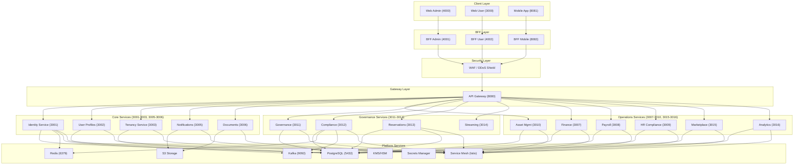

# Software Architecture Document (SAD) - SmartEdify

## Document Information
| Field | Value |
|-------|-------|
| **Document ID** | SAD-SMARTEDIFY-1.2 |
| **Project** | SmartEdify |
| **Version** | 1.2 |
| **Status** | Approved |
| **Authors** | Architecture Team |
| **Reviewers** | CTO / Software Architect / Security Lead |
| **Created** | 2025-09-01 |
| **Last Updated** | 2025-10-08 |

---

## 1. Document Overview

### 1.1 Purpose
This document describes the software architecture of the SmartEdify platform, a SaaS solution for comprehensive community and condominium management with mobile-first approach, Zero Trust security, transnational compliance, and end-to-end observability.

### 1.2 Scope
This document covers:
- High-level system architecture
- Service decomposition and boundaries
- Data flow and integration patterns
- Security architecture
- Deployment architecture
- Quality attributes and constraints

### 1.3 Intended Audience
- Software Architects
- Development Teams
- Security Teams
- DevOps Engineers
- Product Management
- Quality Assurance Teams

---

## 2. Architectural Vision and Constraints

### 2.1 Vision Statement
SmartEdify will become the digital operating system for communities by providing transparent governance with immutable traceability, adaptive legal compliance, intelligent community participation, and unified user experience with Zero Trust security and transnational regulatory compliance.

### 2.2 Key Constraints
- **Zero Trust Architecture**: No implicit trust based on network location
- **Multi-Tenancy**: Complete data isolation between tenants
- **Multi-Jurisdiction**: Support for varying legal requirements per region
- **Mobile-First**: Critical flows optimized for mobile experience
- **WORM Compliance**: Immutable audit trails for legal evidence
- **Real-time Compliance**: Runtime validation against regulations (GDPR, LGPD, eIDAS, etc.)

---

## 3. System Context

### 3.1 Business Context
SmartEdify serves multiple stakeholder types:
- Tenant Administrators
- Condominium Managers
- Board Members
- Residents/Property Owners
- Service Providers
- Auditors

### 3.2 Technical Context
The system integrates with:
- Regulatory APIs (SUNAT, IVSS, SII, DIAN, etc.)
- Payment Processors
- Identity Providers
- Email/SMS/GCM Services
- Third-party Security Systems

---

## 4. Architecture Decomposition

### 4.1 Domain Decomposition
The system is divided into the following domains:

#### Core Domain
- Identity Service (3001)
- User Profiles Service (3002)
- Tenancy Service (3003)
- Notifications Service (3005)
- Documents Service (3006)

#### Governance Domain
- Governance Service (3011)
- Compliance Service (3012)
- Reservations Service (3013)
- Streaming Service (3014)

#### Operations Domain
- Asset Management Service (3010)
- Finance Service (3007)
- Payroll Service (3008)
- HR Compliance Service (3009)
- Physical Security Service (3004) - Future

#### Business Domain
- Marketplace Service (3015)
- Analytics Service (3016)

### 4.2 Service Responsibilities

#### Identity Service (3001)
- Central identity authority with WebAuthn/Passkeys
- DPoP token issuance
- Legal QR generation with WORM logging
- Session management with device binding
- JWKS rotation and cache invalidation
- Attestation validation (FIDO2/SafetyNet/DeviceCheck)

#### User Profiles Service (3002)
- Functional identity and relationships
- Role and official position assignment
- Hierarchical modeling (user → unit → condominium → tenant)
- Consent and delegation management

#### Tenancy Service (3003)
- Tenant/condominium hierarchy management
- RLS implementation
- Jurisdiction mapping
- Cross-service integration point
- Tenant-level encryption key management

#### Compliance Service (3012)
- Real-time policy evaluation
- Regulatory validation (GDPR, LGPD, eIDAS, etc.)
- Dynamic policy distribution with signed OPA bundles
- Emergency mode operation with 24h recovery SLA

---

## 5. Architecture Views

### 5.1 Logical View

### 5.2 Frontend Architecture
**Communication Patterns:**
- **REST APIs**: For most service interactions
- **GraphQL**: For complex data fetching via BFF layer
- **WebSocket**: For real-time notifications and streaming

**Authentication Patterns:**
- **PKCE Flow**: For mobile and public clients (OAuth2.1)
- **OIDC Authorization Code**: For web applications with backend
- **WebAuthn**: For strong authentication at Identity Service
- **Device Attestation**: For mobile apps (SafetyNet/DeviceCheck)

**Mobile-First Implementation:**
- Progressive Web App (PWA) capabilities for web versions
- Offline-first approach for critical flows (voting, reservations)
- Optimized payload sizes with compression techniques
- Adaptive UI layouts for various screen sizes

### 5.3 Process View
**Synchronous Flows:**
- Authentication requests to Identity Service
- Profile queries to User Profiles Service
- Policy evaluations to Compliance Service
- Real-time QR validation

**Asynchronous Flows:**
- Event-driven communication via Kafka
- Audit logging to WORM storage
- Notification dispatching
- Policy bundle distribution

### 5.4 Development View
**Technology Stack:**
- **Runtime**: Java Spring Boot with Kotlin (for performance and JVM stability)
- **Database**: PostgreSQL with Row Level Security
- **Message Queue**: Apache Kafka
- **Cache**: Redis with regional clusters and multi-layer caching
- **Storage**: AWS S3 with WORM support
- **Security**: HSM for key management, WebAuthn for authentication
- **Service Mesh**: Istio for mTLS, traffic management, and observability

### 5.5 Physical View
**Deployment Architecture:**
- Multi-region deployment for high availability
- Regional service clusters with cross-region failover
- CDN distribution for policy bundles and static assets
- Regional KMS/HSM clusters for data residency compliance

---

## 6. Cross-Cutting Concerns

### 6.1 Security Architecture
- **Authentication**: WebAuthn/Passkeys with DPoP
- **Authorization**: PBAC with OPA and signed policy bundles
- **Encryption**: AES-256 at rest, TLS 1.3 in transit
- **Key Management**: HSM with 90-day rotation + 7-day rollover window
- **Auditing**: WORM logs with hash-chain integrity
- **Device Attestation**: FIDO2 attestation for mobile clients
- **Federated Identity**: OIDC/OAuth2.1 for external IdP integration
- **Rate Limiting**: Per-IP and per-tenant rate limiting with optional proof-of-work for high-risk operations

### 6.2 Data Architecture
- **Multi-Tenancy**: RLS with tenant_id and condominium_id
- **Data Isolation**: Complete separation of tenant data with cryptographic boundary
- **Data Retention**: Configurable policies per jurisdiction with declarative policies
- **PII Protection**: Encryption and access controls
- **Data Residency**: Per-region storage with metadata tags for compliance

### 6.3 Integration Architecture
- **Event-Driven**: Kafka for asynchronous communication
- **API-First**: OpenAPI 3.1 specifications
- **Schema Evolution**: Backward compatibility guarantees
- **Service Mesh**: Istio for cross-service communication with mTLS

### 6.4 Cache Layer Strategy
**JWKS Cache**:
- Regional Redis clusters
- 1-hour TTL for keys
- Pre-rotation with 7-day window
- Cache invalidation via webhook on rotation events

**Tenant Context Cache**:
- Local memory cache with 10-minute TTL
- Session refresh triggers
- Distributed Redis for cross-instance sharing

**Compliance Policy Cache**:
- Regional Redis with 5-minute TTL
- Event-driven invalidation via Kafka
- Fallback to cached policies during service unavailability
- Emergency mode operation with 24-hour window

**QR Pre-compute Cache**:
- Regional Redis with 24-hour TTL
- Event cancellation invalidation
- Batch generation for high-volume scenarios

---

## 7. Quality Attributes

### 7.1 Performance Requirements
- **Global Availability**: ≥ 99.95%
- **Authentication Latency**: ≤ 3s (P95)
- **Session Revocation**: ≤ 30s
- **Audit Compliance**: 100%
- **WebAuthn Adoption**: ≥ 80%
- **JWKS Refresh Latency**: ≤ 500ms (P95)
- **Cache Hit Rate**: ≥ 90% for compliance policies

### 7.2 Security Requirements
- **Zero Trust**: No implicit trust
- **DPoP Mandatory**: Prevents replay attacks
- **WORM Compliance**: Immutable audit trails
- **Device Attestation**: Mandatory for sensitive operations
- **Token Error Rate**: ≤ 0.01%
- **DPoP Replay Block Rate**: ≥ 99.99%

### 7.3 Scalability Requirements
- **Horizontal Scaling**: Services must be stateless where possible
- **Elastic Capacity**: Auto-scaling based on demand
- **Data Partitioning**: By tenant and condominium
- **Regional Distribution**: Per-jurisdiction deployment

### 7.4 Compliance Requirements
- **Compliance Audit Time**: ≤ 24 hours
- **DSAR Response Time**: ≤ 72 hours
- **Data Residency**: Per-region compliance checking
- **Legal Evidence Chain**: Immutable with hash-chain verification

---

## 8. Architecture Decisions

| ADR ID | Title | Status | Date |
|--------|-------|--------|------|
| ADR-001 | Architecture of Distributed Identity | Approved | [Date] |
| ADR-002 | Passkey Recovery and MFA Handling | Approved | [Date] |
| ADR-003 | Service Mesh Implementation (Istio) | Approved | [Date] |
| ADR-004 | OPA Bundle Signing | Approved | [Date] |
| ADR-005 | ES256/EdDSA Support | Approved | [Date] |
| ADR-006 | API Gateway Authentication Patterns | Approved | [Date] |
| ADR-007 | Cache Strategy and Layering | Approved | [Date] |
| ADR-008 | Data Residency and Encryption Strategy | Approved | [Date] |
| ADR-009 | Federated Identity Integration | Approved | [Date] |
| ADR-010 | Attestation and Device Binding Controls | Approved | [Date] |
| ADR-011 | Validation Metrics | Approved | [Date] |
| ADR-012 | Compliance Degraded Mode Operation | Approved | [Date] |
| ADR-013 | Observability Metrics Standardization | Approved | [Date] |
| ADR-014 | QR Use-Cases and Security Levels | Approved | [Date] |
| ADR-015 | Physical Security Service Architecture | Approved | [Date] |
| ADR-016 | Condominium Entity Model | Approved | [Date] |
| ADR-017 | Proof-of-Work Rate Limiting and Anti-Enumeration | Approved | [Date] |

---

## 9. Security Architecture

### 9.1 Zero Trust Principles
- Verify explicitly (authentication and authorization)
- Least privileged access (RBAC and PBAC)
- Assume breach (encrypt everything, log everything)
- Verify endpoint integrity (device attestation)

### 9.2 Identity and Access Management
- **Identity Provider**: Identity Service with WebAuthn
- **Token Format**: JWT with DPoP for replay protection
- **Key Rotation**: JWKS rotation every 90 days with 7-day rollover window
- **Session Management**: Device-bound sessions with short TTL
- **Federated Identity**: OIDC discovery endpoint `/issuer/{tenant_id}/.well-known/openid-configuration`
- **Attestation**: FIDO2 attestation for WebAuthn credentials with attestation statement verification

### 9.3 Data Protection
- **At Rest**: AES-256 encryption with KMS/HSM
- **In Transit**: TLS 1.3 with mTLS for service-to-service
- **PII Handling**: Encryption and access logging
- **WORM Storage**: Immutable logs for legal evidence
- **Tenant Isolation**: Key segmentation by tenant_id with KMS key policies
- **Device Binding**: Cryptographic binding of sessions to attested devices

### 9.4 Attestation and Device Binding
- **Mobile**: SafetyNet Attestation (Android) / DeviceCheck (iOS)
- **Web**: FIDO2 Attestation during registration
- **Metrics**: `device_attestation_failure_rate`, `session_device_mismatch_rate`
- **Recovery**: Manual approval flow for failed attestation

---

## 10. Compliance Framework

### 10.1 Regulatory Compliance
- **GDPR**: Privacy by Design, consent management, right to erasure
- **LGPD**: Brazilian privacy law compliance
- **eIDAS**: Electronic identification and trust services
- **Local Regulations**: Country-specific compliance requirements

### 10.2 Compliance Service
- Real-time policy evaluation
- Dynamic policy updates
- Jurisdiction-specific rule engine
- Emergency mode operation with 24-hour SLA for recovery
- **Degraded Mode Behavior**: 
  - Block legal operations requiring compliance validation
  - Log to WORM with `compliance_mode=degraded`
  - Allow read operations with warning
  - Resume normal operation within 24 hours maximum

### 10.3 OPA Policy Bundles
- **Signing Algorithm**: Ed25519 for bundle signing
- **Distribution**: Regional CDN with signed bundles
- **TTL**: 5-minute cache with event-driven updates
- **Rollback Prevention**: Version-based validation with signed metadata
- **Validation**: Cryptographic verification before policy application

### 10.4 Data Residency Policy
- **Declarative Policies**: Defined in CI/CD pipeline
- **Metadata Tags**: `data_residency={region}` on all data objects
- **Validation**: Automated compliance checking before deployment
- **Monitoring**: Real-time residency compliance metrics

---

## 11. Operations Architecture

### 11.1 Observability Stack
- **Metrics**: Prometheus with custom business metrics
  - `jwks_refresh_latency_p95`: JWKS refresh latency
  - `token_validation_error_rate`: Token validation error rate
  - `dpop_replay_block_rate`: DPoP replay block rate
  - `compliance_audit_time`: Compliance audit time
  - `dsar_response_time`: DSAR response time
  - `policy_version_skew`: Difference between latest policy version and cached version
  - `revocation_latency_p95`: Session/device revocation latency (P95)
- **Logs**: OpenSearch/ELK stack with structured logging
- **Tracing**: Jaeger/Tempo for distributed tracing
- **Alerting**: Alert Manager with SLO monitoring
- **Business Metrics**: 
  - Legal QR generation latency
  - Device attestation success rate
  - Compliance validation success rate

### 11.2 Deployment Architecture
- **CI/CD**: Automated pipelines with security scanning and compliance validation
- **Blue-Green Deployment**: Zero-downtime deployments
- **Canary Releases**: Gradual service rollouts
- **Infrastructure as Code**: Terraform with policy validation
- **Chaos Engineering**: Regular failure testing and resilience validation using Gremlin framework for controlled experiments

### 11.3 Disaster Recovery
- **RTO/RPO by service**:
  - Identity Service: RTO ≤ 5 min, RPO ≤ 1 min
  - Governance Service: RTO ≤ 15 min, RPO ≤ 5 min
  - Other services: RTO ≤ 30 min, RPO ≤ 10 min
- **Backup Strategy**: Automated region-specific backups with encryption
- **Recovery Testing**: Quarterly DR validation exercises

---

## 12. Risk Assessment

### 12.1 Architectural Risks
| Risk | Impact | Mitigation |
|------|--------|------------|
| Service dependencies causing cascading failures | High | Circuit breakers, bulkheads, fallbacks |
| Regulatory changes requiring architecture modifications | Medium | Pluggable compliance engine, event-driven design |
| Performance degradation under high load | High | Auto-scaling, caching, load balancing |
| Security vulnerabilities in third-party dependencies | High | Regular security scanning, dependency management |
| JWKS rotation failure blocking authentication | High | Rollover window, cache fallback, monitoring |
| Compliance service unavailability affecting legal operations | High | Degraded mode with 24h recovery SLA |
| Device attestation failures affecting security | Medium | Manual approval workflow |

---

## 13. Technology Decisions

### 13.1 Technology Stack Summary
- **Backend**: Java Spring Boot with Kotlin (for performance and JVM stability)
- **Database**: PostgreSQL with RLS
- **Message Queue**: Apache Kafka
- **Cache**: Redis (multiple tiers)
- **Storage**: AWS S3 with WORM
- **Service Mesh**: Istio
- **Security**: WebAuthn, DPoP, HSM, FIDO2 Attestation
- **API Gateway**: Kong or AWS API Gateway
- **Observability**: OpenTelemetry, Prometheus, Grafana

### 13.2 Tooling and Frameworks
- **API Specification**: OpenAPI 3.1
- **Database Modeling**: DBML
- **Infrastructure**: Terraform with AWS
- **Security Testing**: OWASP ZAP, Snyk, SonarQube
- **CI/CD**: GitLab CI/CD or GitHub Actions

### 13.3 API Communication Patterns
- **REST APIs**: Standard HTTP APIs for most interactions
- **GraphQL**: For complex data fetching via BFF layer
- **gRPC**: For high-performance service-to-service communication
- **Event Streaming**: Apache Kafka for asynchronous communication

---

## 14. Evolution and Migration Strategy

### 14.1 Implementation Roadmap
- **Phase 1**: Core backbone (Identity, Profiles, Tenancy, Compliance)
- **Phase 2**: Governance and operations (Governance, Reservations, Asset Mgmt)
- **Phase 3**: Finance and payroll modules
- **Phase 4**: Business and analytics services
- **Phase 5**: Stabilization and global release

### 14.2 Versioning Strategy
- **API Versioning**: URL-based versioning (e.g., /v1/, /v2/)
- **Event Schema Versioning**: Backward-compatible schema evolution
- **Database Migration**: Automated migration with rollback capability
- **Policy Versioning**: Semantic versioning with backward compatibility

### 14.3 QR Use-Cases Clarification
**Identity QRs (Legal Use)**:
- COSE/JWS signed with temporal validity (TTL ≤ 300s)
- Device-bound with attestation requirements
- Immutable logging to WORM storage
- Used for legal assembly access with role verification

**Asset Management QRs (Operational Use)**:
- Simple identifiers without encryption
- Used for physical asset identification
- Linked to asset management workflows
- Scanned by Asset Management Service for location tracking

---

## 15. Physical Security Integration (Future)

### 15.1 Physical Security Service Overview
The Physical Security Service (PSS) is planned as a future enhancement to integrate with the broader SmartEdify ecosystem. It will include:
- Access control system (ACS) integration
- Computer vision for physical security
- Integration with Streaming and Governance for hybrid monitoring
- Video analytics for automated security events
- Integration with Asset Management for physical asset tracking

### 15.2 Integration Points
- **Streaming**: For real-time video feeds during hybrid assemblies
- **Governance**: For attendance verification during legal proceedings
- **Asset Management**: For physical asset monitoring and location tracking
- **Identity**: For physical access based on digital identities and roles

---

## 16. Appendices

### 16.1 Glossary
- **Data Residency**: The practice of storing data in a specific geographic location or region to comply with local regulations and legal requirements. In SmartEdify, data residency is enforced through metadata tags and region-specific storage policies.
- **Degraded Mode**: A system operational state where certain non-critical functions are disabled to maintain core functionality during service unavailability. In SmartEdify, compliance service degraded mode allows read operations while blocking legal operations requiring real-time compliance validation, with recovery required within 24 hours.
[Definitions of key terms used in this document]

### 16.2 Acronyms
| Acronym | Full Form |
|---------|-----------|
| WORM | Write Once, Read Many |
| DPoP | Demonstration of Proof-of-Possession |
| RLS | Row Level Security |
| PBAC | Policy-Based Access Control |
| SLO | Service Level Objective |
| PII | Personally Identifiable Information |
| HSM | Hardware Security Module |
| KMS | Key Management Service |
| OIDC | OpenID Connect |
| PKCE | Proof Key for Code Exchange |
| FIDO2 | Fast Identity Online 2 |
| JWKS | JSON Web Key Set |
| RTO | Recovery Time Objective |
| RPO | Recovery Point Objective |

### 16.3 References
- SmartEdify Vision Document
- Security Policies Document
- Compliance Framework Document
- ADR Repository
- Team Software Development Guidelines
- OAuth 2.1 Specification
- FIDO2/WebAuthn Standards
- NIST Cybersecurity Framework

---

## 17. Document Change History

| Version | Date | Author | Changes |
|---------|------|--------|---------|
| 1.0 | [Date] | [Author] | Initial version |
| 1.1 | [Date] | [Author] | Enhanced with service mesh, cache strategy, attestation, compliance degraded mode, observability metrics, and QR use-case clarification |
| 1.2 | [Date] | [Author] | Added proof-of-work rate limiting, policy_version_skew and revocation_latency_p95 metrics, chaos engineering integration (Gremlin), ADR-017 for anti-enumeration, and glossary definitions for Data Residency and Degraded Mode |
| [Next] | [Date] | [Author] | [Changes] |