# 🧱 **SmartEdify — Documento de Arquitectura Global (SAD.md)**

**Versión:** 1.0
**Fecha:** 2025-10-08T22:00:00-05:00
**Responsables:** CTO / Software Architect / Product Owner
**Estado:** En elaboración — Fase 1: *Estructura Base del Sistema*

---

## **1. Propósito**

Definir la estructura arquitectónica de alto nivel de la plataforma **SmartEdify**, sus capas, dependencias y topología técnica, sirviendo como referencia para diseño, implementación y mantenimiento.

---

## **2. Estructura Base del Sistema**

SmartEdify adopta una **arquitectura de microservicios desacoplados**, basada en los principios de:

* *Clean Architecture*
* *Domain-Driven Design (DDD)*
* *Zero Trust Architecture*
* *Privacy by Design*
* *Observability by Design*

### **2.1 Capas Arquitectónicas**

| Capa                      | Función                                                                | Servicios incluidos                                                                                                                            |
| ------------------------- | ---------------------------------------------------------------------- | ---------------------------------------------------------------------------------------------------------------------------------------------- |
| **Frontend Applications** | Interfaz del usuario, *mobile-first* (PWA y apps nativas).             | Web Admin (4000), Web User (3000), Mobile App (8081)                                                                                           |
| **BFF Layer**             | Adaptación de API y agregación contextual por rol.                     | BFF Admin (4001), BFF User (3007), BFF Mobile (8082)                                                                                           |
| **Edge Security**         | Protección perimetral y mitigación DDoS.                               | WAF / DDoS Shield                                                                                                                              |
| **API Gateway**           | PEP (Policy Enforcement Point), autenticación, rate-limits, auditoría. | Gateway Service (8080)                                                                                                                         |
| **Core Services**         | Autenticación, identidad, perfil, tenant, notificaciones, documentos.  | Identity (3001), User Profiles (3002), Tenancy (3003), Notifications (3005), Documents (3006)                                                  |
| **Governance Services**   | Gobernanza, cumplimiento, reservas, streaming de asambleas.            | Governance (3011), Compliance (3012), Reservations (3013), Streaming (3014)                                                                    |
| **Operations Services**   | Gestión de activos, finanzas, nómina, RRHH, seguridad física.          | Asset Mgmt (3010), Finance (3007), Payroll (3008), HR Compliance (3009), Physical Security (3004 – futuro)                                     |
| **Business Services**     | Analítica e intercambio comercial.                                     | Marketplace (3015), Analytics (3016)                                                                                                           |
| **Platform Services**     | Observabilidad, mensajería, almacenamiento y cripto.                   | Prometheus (9090), Grafana (3000), OTel Collector (4317), Kafka (9092), Redis (6379), PostgreSQL (5432), S3 / WORM, KMS / HSM, Secrets Manager |

---

## **3. Dependencias Principales**

### **3.1 Relación entre servicios**

* **Identity ↔ User Profiles ↔ Tenancy** forman el *core backbone* de identidad y acceso.
* **Compliance** provee decisiones normativas a todos los demás servicios.
* **Governance** orquesta asambleas híbridas y actas legales, usando **Streaming** como transporte.
* **Reservations ↔ Finance ↔ Asset Mgmt** gestionan recursos físicos y económicos.
* **Documents** mantiene evidencias y registros WORM.
* **Notifications** entrega mensajes transaccionales multicanal.

### **3.2 Topología**

* Despliegue *multi-región activo-activo*.
* **PostgreSQL** y **Redis** con replicación regional.
* **Kafka** federado con **Schema Registry** y **DLQ**.
* **KMS/HSM** regionales (aislamiento por jurisdicción).
* **OPA Bundles firmados** distribuidos vía **Policy CDN**.
* Monitoreo y trazabilidad completa via **Prometheus + Grafana + OTel + Jaeger/Tempo + OpenSearch (Logs)**.

---

## **4. Diagrama de Topología (Mermaid)**

```mermaid
flowchart TB
  subgraph Frontend["Frontend Applications"]
    WA["Web Admin (4000)"]
    WU["Web User (3000)"]
    MA["Mobile App (8081)"]
  end
  subgraph BFF["BFF Layer"]
    BFFA["BFF Admin (4001)"]
    BFFU["BFF User (3007)"]
    BFFM["BFF Mobile (8082)"]
  end
  subgraph Edge["Edge Security"]
    WAF["WAF / DDoS Shield"]
  end
  subgraph Gateway["API Gateway"]
    GW["Gateway Service (8080)"]
  end
  subgraph Core["Core Services"]
    IS["Identity (3001)"]
    UPS["User Profiles (3002)"]
    TS["Tenancy (3003)"]
    NS["Notifications (3005)"]
    DS["Documents (3006)"]
  end
  subgraph Governance["Governance Services"]
    GS["Governance (3011)"]
    CS["Compliance (3012)"]
    RS["Reservations (3013)"]
    SS["Streaming (3014)"]
  end
  subgraph Ops["Operations Services"]
    AMS["Asset Mgmt (3010)"]
    FS["Finance (3007)"]
    PS["Payroll (3008)"]
    HCS["HR Compliance (3009)"]
    PSS["Physical Security (3004 – futuro)"]
  end
  subgraph Biz["Business Services"]
    MS["Marketplace (3015)"]
    AS["Analytics (3016)"]
  end
  subgraph Platform["Platform Services"]
    PROM["Prometheus (9090)"]
    GRAF["Grafana (3000)"]
    OTEL["OTel Collector (4317)"]
    KAFKA["Kafka (9092)"]
    REDIS["Redis (6379)"]
    PG["PostgreSQL (5432)"]
    S3["S3 Storage / WORM"]
    KMS["KMS / HSM"]
    SEC["Secrets Manager"]
  end
  WA --> BFFA
  WU --> BFFU
  MA --> BFFM
  BFFA --> WAF --> GW
  BFFU --> WAF
  BFFM --> WAF
  WAF --> GW
  GW --> IS & UPS & TS & NS & DS & GS & CS & RS & SS & AMS & FS & PS & HCS & PSS & MS & AS
  IS --> PG & REDIS & KAFKA
  UPS --> PG
  TS --> PG
  CS --> PG
  FS --> PG
  DS --> S3
  SS --> S3
  IS --- KMS
  GW -.-> PROM
  OTEL --> GRAF
```

---

## **5. Consideraciones**

* **Resiliencia multi-región:** JWKS, OPA bundles y tokens revocados se sincronizan via Redis y Kafka.
* **Cumplimiento legal:** cada tenant/condominio se rige por jurisdicción y estatutos propios.
* **Seguridad integrada:** DPoP, WebAuthn, ES256/EdDSA, rotación 90 días + rollover 7 días.
* **Observabilidad total:** todas las llamadas trazadas con OTel y métricas exportadas a Prometheus.

