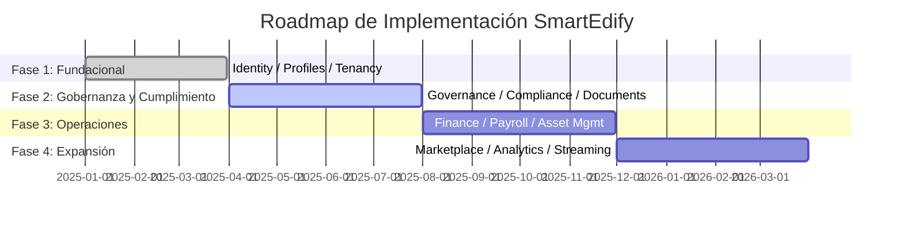

  
  
<em>Gestión integral de condominios</em>

---
# 📘 Documento de Visión — SmartEdify

**Versión:** 0  
**Fecha:** 2025-10-08  
**Estado:** Aprobado  
**Autor:** Equipo de Producto y Arquitectura SmartEdify  
**Revisión:** CTO / Software Architect / Product Manager  

---

## 🧭 1. Visión General

SmartEdify es una plataforma SaaS multi-tenant diseñada para la gestión integral de comunidades y condominios, con enfoque mobile-first, Zero Trust, cumplimiento normativo transnacional y observabilidad end-to-end.
Su propósito es **transformar la gobernanza, administración, seguridad y prestación de servicios comunes en entornos residenciales y comerciales mediante una solución digital unificada, segura y escalable.**
La visión estratégica se centra en convertir a SmartEdify en el sistema operativo digital para comunidades, garantizando:
Transparencia operativa con trazabilidad inmutable (logs WORM, firma electrónica y actas con respaldo jurídico).
Cumplimiento legal adaptativo mediante un `Compliance-Service` que valida en tiempo real regulaciones locales e internacionales (GDPR, LGPD, eIDAS, SUNAT, etc.).
Participación comunitaria inteligente, con asambleas digitales híbridas, votaciones seguras y reservas automatizadas.
Experiencia de usuario unificada para propietarios, administradores, trabajadores y auditores, accesible por web y móvil.
Cada tenant puede administrar múltiples condominios, con reglas de cumplimiento y políticas jurídicas independientes.
La arquitectura se basa en microservicios modulares bajo principios de Clean Architecture, API-First y Privacy by Design, priorizando resiliencia, seguridad criptográfica (WebAuthn, DPoP, ES256/EdDSA), eficiencia en costos y despliegue multi-región.
SmartEdify no solo digitaliza la gestión condominial, sino que redefine la gobernanza comunitaria con estándares de seguridad, legalidad y usabilidad comparables a las infraestructuras críticas modernas.
En su madurez plena, cada acción dentro de SmartEdify será auditable, legalmente defendible y medible en términos de confianza, eficiencia y cumplimiento.

---

## 🏗️ 2. Arquitectura Global del Sistema

```mermaid


flowchart TB
 subgraph FE["Frontend Applications (Mobile-First)"]
        WA["Web Admin 
        (4000)"]
        WU["Web User 
        (3000)"]
        MA["Mobile App 
        (8081)"]
  end
 subgraph BFF["BFF Layer"]
        BFF_A["BFF Admin 
        (4001)"]
        BFF_U["BFF User 
        (3007)"]
        BFF_M["BFF Mobile 
        (8082)"]
  end
 subgraph EDGE["Edge Security"]
        WAF["WAF / DDoS Shield"]
  end
 subgraph GWY["API Gateway (8080)"]
        GW["Gateway Service + PEP (DPoP/JWT/JWKS Cache)"]
  end
 subgraph CORE["Core Services"]
        IS["Identity Service:
        (3001)
        OIDC/OAuth2.1 
        WebAuthn 
        DPoP"]
        UPS["User Profiles Service :
        (3002)
        Atributos 
        Grupos 
        Cargos oficiales"]
        TS["Tenancy Service :
        (3003)
        Tenants
        Condominiums 
        Jurisdicciones"]
        NS["Notifications Service :
        (3005)
        Email-SMS-Push
        Plantillas"]
        DS["Documents Service :(3006)
        PDF • WORM • Firma electrónica
        (cuando aplica)"]
  end
 subgraph GOV["Governance Services"]
        GS["Governance Service 
        (3011)
        Convocatorias
        Quórum
        Votos
        Actas"]
        CS["Compliance Service 
        (3012)
        Modo Consulta (runtime)
        Boletines (updates)"]
        RS["Reservation Service 
        (3013)
        Espacios
        Reglas
        Tarifas efectivas"]
        SS["Streaming Service 
        (3014)
        Asambleas híbridas • Presencia/Marcas de tiempo"]
  end
 subgraph OPS["Operations Services"]
        AMS["Asset Mgmt Service 
        (3010)
        Activos
        Incidencias
        OT
        Asset-QR (no cifrado)"]
        FS["Finance Service 
        (3007)
        GL 
        AR/AP 
        FX 
        NIC + Fiscal"]
        PS["Payroll Service 
        (3008)
        Cálculo 
        Payslips 
        Exportes regulatorios"]
        HCS["HR Compliance Service
        (3009)
        Reglas laborales por país
        Elegibilidad"]
        PSS["Physical Security (Futuro)
        (3004)
        ACS 
        Visión por computador"]
  end
 subgraph BUS["Business Services"]
        MS["Marketplace Service (3015)
        Proveedores 
        Pagos integrados"]
        AS["Analytics Service (3016)
        KPIs
        Dashboards
        Anonimización"]
  end
 subgraph MSG["Messaging & Streaming"]
        KAFKA["Apache Kafka 
        (9092)"]
        SR["Schema Registry"]
        KC["Kafka Connect / CDC"]
        DLQ["Dead Letter Queue"]
        REDIS["Redis (Regional) (6379)
        JWKS • DPoP-Nonce • Antireplay • Caches políticas"]
  end
 subgraph DATA["Storage & Crypto"]
        PG[("PostgreSQL 
        (5432)
        RLS {tenant, condominium}")]
        S3[("S3 Object Storage")]
        WORM[("S3 Object Lock / WORM\nHash-chain / Evidencias")]
        KMS[("KMS / HSM\nRotación 90d + Rollover 7d")]
        SEC[("Secrets Manager")]
  end
 subgraph POLI["Policy Distribution"]
        POL["Policy CDN (OPA bundles firmados)"]
  end
 subgraph OBS["Observability"]
        OTEL["OTel Collector 
        (4317)"]
        TRC["Tracing Backend (Tempo/Jaeger)"]
        LOGS["Logs Backend (OpenSearch/ELK)"]
        PROM["Prometheus 
        (9090)"]
        GRAF["Grafana 
        (3000)"]
  end
 subgraph PLT["Platform Layer"]
        MSG
        DATA
        POLI
        OBS
  end
    WA --> BFF_A
    BFF_A --> WAF
    WAF --> GW & GW
    WU --> BFF_U
    BFF_U --> WAF
    MA --> BFF_M
    BFF_M --> WAF
    GW --> IS & UPS & TS & NS & DS & GS & CS & RS & SS & AMS & FS & PS & HCS & MS & AS
    IS --> PG & REDIS
    IS -.-> KAFKA & OTEL
    IS --- KMS & POL
    UPS --> PG
    TS --> PG
    GS --> PG
    FS --> PG
    RS --> PG
    AMS --> PG
    DS --> S3
    DS --- WORM
    KAFKA --- SR & DLQ
    KC -.-> KAFKA
    TS -.-> KC
    OTEL --- TRC & LOGS
    PROM --- GRAF
    GW -.-> PROM
    GW --- SEC
    CS -. Boletines: RoleUpdate / TariffSchedule / EligibilityRule .-> KAFKA
    KAFKA -.-> GS & RS & FS & HCS & AMS
    GS -. "Solicita Identity-QR (COSE/JWS, TTL≤300s, kid)" .-> IS
    AMS -. "Escanea Asset-QR (no cifrado)" .-> AMS
     WA:::frontend
     WU:::frontend
     MA:::frontend
     BFF_A:::bff
     BFF_U:::bff
     BFF_M:::bff
     WAF:::edge
     GW:::gateway
     IS:::core
     UPS:::core
     TS:::core
     NS:::core
     DS:::core
     GS:::governance
     CS:::governance
     RS:::governance
     SS:::governance
     AMS:::operations
     FS:::operations
     PS:::operations
     HCS:::operations
     PSS:::operations
     MS:::business
     AS:::business
     KAFKA:::platform
     SR:::platform
     KC:::platform
     DLQ:::platform
     REDIS:::platform
     PG:::platform
     S3:::platform
     WORM:::platform
     KMS:::platform
     SEC:::platform
     POL:::platform
     OTEL:::platform
     TRC:::platform
     LOGS:::platform
     PROM:::platform
     GRAF:::platform
    classDef frontend fill:#e1f5fe,stroke:#01579b,color:#000
    classDef bff fill:#f3e5f5,stroke:#4a148c,color:#000
    classDef edge fill:#fff8e1,stroke:#ef6c00,color:#000
    classDef gateway fill:#e8f5e8,stroke:#1b5e20,color:#000
    classDef core fill:#fff3e0,stroke:#e65100,color:#000
    classDef governance fill:#fce4ec,stroke:#880e4f,color:#000
    classDef operations fill:#f1f8e9,stroke:#33691e,color:#000
    classDef business fill:#e0f2f1,stroke:#004d40,color:#000
    classDef platform fill:#f5f5f5,stroke:#424242,color:#000
    style MSG fill:#FFD600
    style DATA fill:#757575,color:#FFFFFF
    style OBS fill:#FF6D00
    style CORE fill:#BBDEFB
    style OPS fill:#FFCDD2
    style GOV fill:#C8E6C9
    style FE fill:#00C853,stroke:#2962FF



```

---

## 👥 3. Usuarios y Personas

| Rol / Persona                           | Descripción funcional                                                                   | Método de acceso principal                 |
| --------------------------------------- | --------------------------------------------------------------------------------------- | ------------------------------------------ |
| **Administrador General del Tenant**    | Superusuario que gestiona múltiples condominios y políticas globales del tenant.        | Web Admin (Passkey + MFA)                  |
| **Administrador de Condominio**         | Responsable operativo y legal de un condominio. Gestiona asambleas, tarifas y reservas. | Web Admin / Mobile (Passkey o TOTP)        |
| **Miembro de Junta (Cargo Oficial)**    | Representante legal que firma actas y resoluciones.                                     | Web Admin (Passkey con attestation)        |
| **Residente / Propietario**             | Usuario final que participa en asambleas, realiza reservas y pagos.                     | **Mobile App** / Web User (Passkey o TOTP) |
| **Usuario Delegado / Apoderado**        | Persona autorizada temporalmente para representar a un residente.                       | Mobile / Web (Passkey o TOTP)              |
| **Técnico de Mantenimiento**            | Personal interno o tercerizado que ejecuta órdenes de trabajo.                          | Mobile (TOTP / Passkey)                    |
| **Proveedor / Prestador de Servicios**  | Entidad externa que ejecuta tareas o factura servicios.                                 | Web / Mobile (OAuth2 B2B o Passkey)        |
| **Analista de Finanzas**                | Responsable de conciliaciones, cargos y reportes fiscales.                              | Web Admin (Passkey + MFA)                  |
| **Especialista de RRHH / Nómina**       | Administra nóminas, obligaciones laborales y exportes regulatorios.                     | Web Admin (Passkey + MFA)                  |
| **Oficial de Cumplimiento / Legal**     | Supervisa cumplimiento legal, genera boletines y valida documentos.                     | Web Admin (Passkey con attestation)        |
| **Auditor / Fiscalizador Externo**      | Entidad independiente que revisa evidencias y cumplimiento.                             | Web (Acceso federado o temporal read-only) |
| **Operador de Soporte / Mesa de Ayuda** | Da soporte técnico y revoca sesiones bajo procedimientos auditados.                     | Web Admin (Passkey)                        |
| **Integrador Externo (API/B2B)**        | Sistema externo que interactúa mediante integraciones seguras.                          | API (OAuth2.1 + mTLS + DPoP opcional)      |

---

## 📦 4. Microservicios y Alcance Funcional

### 4.1. `Identity-Service` (3001)

El **Identity Service** es la autoridad central de identidad de SmartEdify, diseñado bajo los principios de **Zero Trust**, **multi-tenancy** y **cumplimiento normativo transnacional**. Va más allá de la autenticación tradicional: actúa como pilar de **validez jurídica y trazabilidad criptográfica** para todas las acciones en la plataforma.

Ofrece **autenticación fuerte (WebAuthn/Passkeys)**, emite **tokens con Proof-of-Possession (DPoP)** y genera **evidencia inmutable (WORM + hash-chain)** para auditorías. Además, produce **QR jurídicos efímeros** para asambleas, validación documental y acceso a salas virtuales.

Se integra estrechamente con `Compliance-service`, `Governance-Service`, `User-Profiles-Service` y `Tenancy-Service`, y cumple con estándares como **GDPR, LGPD, eIDAS, NIST 800-63-4** y normativas locales de Latinoamérica.

Sus métricas clave incluyen **≥99.95% de disponibilidad**, **<3s de latencia en autenticación** y **revocación global en ≤60s**, garantizando seguridad, usabilidad y cumplimiento al más alto nivel. En esencia, es el **fundamento de confianza digital** sobre el que se construye toda la gobernanza comunitaria en SmartEdify.

### 4.2. User Profiles (3002)
Gestión de atributos, roles, relaciones jerárquicas y asociaciones con tenants y unidades residenciales.

### 4.3. Tenancy Service (3003)
Define condominios, unidades, espacios y relación entre tenants y jurisdicciones legales.  
Soporta residencia por país y RLS criptográfico.

### 4.4. Governance Service (3011)
Gestión de asambleas, actas, quórum, votaciones, mandatos y resoluciones con respaldo jurídico.  
Integrado con Compliance para validación legal en tiempo de ejecución.

### 4.5. Compliance Service (3012)
Valida políticas legales, roles vigentes y parámetros normativos.  
Opera en dos modos: **consulta bajo demanda** y **emisión de boletines de actualización** (ej. nombramientos o tarifas).

### 4.6. Reservations Service (3013)
Gestión de reservas de espacios comunes, calendario compartido y cobro automatizado según reglas del Governance Service.

### 4.7. Asset Management Service (3010)
Gestión de activos, incidencias, mantenimiento y trazabilidad mediante QR no encriptados.  
Permite asociar inspecciones y órdenes de trabajo a ubicaciones físicas.

### 4.8. Finance Service (3007)
Contabilidad, flujo de caja, tarifas, cuotas, conciliaciones y reportes fiscales bajo estándares NIC y normativa nacional.

### 4.9. Payroll Service (3008)
Gestión de nóminas, beneficios y obligaciones laborales. Genera recibos de pago y se integra con APIs fiscales (SUNAT, IVSS, etc.).

### 4.10. HR Compliance Service (3009)
Validación de cumplimiento laboral, contratos y normativas por país. Monitoreo continuo de obligaciones legales del empleador.

### 4.11. Notifications Service (3005)
Orquestador de notificaciones push, correo y mensajería interna por tenant.

### 4.12. Documents Service (3006)
Gestión documental con firma electrónica, versionado, cifrado y almacenamiento WORM.  
Firma válida solo en documentos con requerimientos legales.

### 4.13. Streaming Service (3014)
Transmisión en vivo de asambleas híbridas con registro legal de participación y timestamp certificado.

---

## ⚙️ 5. Flujos Principales

### CU-01 — Registro y Activación Delegada
1. Administrador registra usuario en User Profiles.  
2. Se envía enlace de activación vía Notifications.  
3. Identity valida y completa el registro.  
4. Compliance audita consentimiento.

### CU-02 — Autenticación Segura
1. Usuario inicia sesión (WebAuthn o Passkey).  
2. Identity genera JWT + DPoP.  
3. Sesión válida 10 min, asociada al dispositivo.

### CU-03 — Asamblea Digital
1. Governance crea evento con roles firmantes.  
2. Identity genera QR firmado para acceso.  
3. Compliance valida legalidad.  
4. Streaming registra asistencia y votos.

---

## 🛡️ 6. Seguridad y Cumplimiento

| Mecanismo | Descripción |
|------------|-------------|
| TLS 1.3 + mTLS | Canal seguro interservicios. |
| AES-256 at rest | Cifrado en base de datos y backups. |
| DPoP obligatorio | Prevención de replay attacks. |
| JWKS rotación 90d | Claves firmantes actualizadas periódicamente. |
| Logs WORM | Evidencia inmutable de auditoría. |
| GDPR / LGPD / eIDAS | Cumplimiento normativo multinacional. |

---

## 📊 7. Métricas Clave

| Indicador | Objetivo |
|------------|----------|
| Disponibilidad global | ≥ 99.95% |
| Latencia autenticación | ≤ 3 s (P95) |
| Tiempo revocación sesión | ≤ 30 s |
| Cumplimiento auditorías | 100% |
| Adopción WebAuthn | ≥ 80% |

---

## 🗓️ 8. Roadmap Estratégico

---

## 🧩 9. Relación entre Microservicios y Dominios

| Dominio | Servicios Asociados |
|----------|--------------------|
| Core | Identity, User Profiles, Tenancy, Notifications, Documents |
| Governance | Governance, Compliance, Reservations, Streaming |
| Operations | Asset Management, Finance, Payroll, HR Compliance |
| Business | Marketplace, Analytics |
| Platform | Kafka, PostgreSQL, Redis, Prometheus, Grafana, S3 |

---

## 🧾 10. Historial de Cambios

| Versión | Fecha | Descripción |
|----------|--------|-------------|
| 1.0 | 2025-08-01 | Versión inicial del documento de visión. |
| 1.1 | 2025-10-08 | Versión revisada, ampliada y actualizada según arquitectura integral. |

