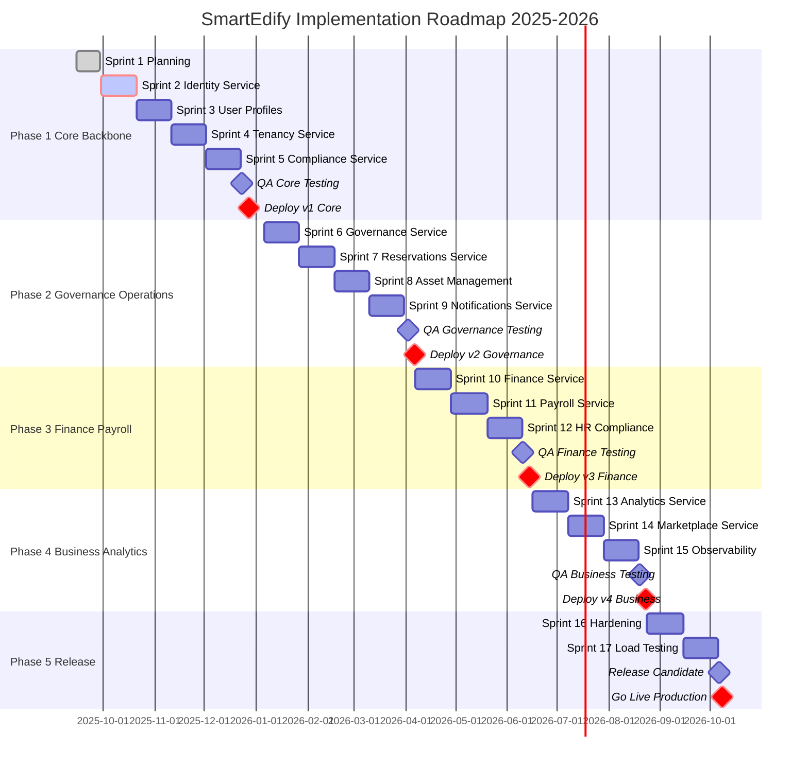

  
  
<em>Construyendo infraestructura crítica para la gobernanza comunitaria del futuro.</em>

---
# 📘 Documento de Visión — SmartEdify

**Versión:** 0  
**Fecha:** 2025-10-08  
**Estado:** Aprobado  
**Autor:** Equipo de Producto y Arquitectura SmartEdify  
**Revisión:** CTO / Software Architect / Product Manager  

---

## 🧭 1. Visión General

SmartEdify es una plataforma SaaS multi-tenant diseñada para la gestión integral de comunidades y condominios, con enfoque mobile-first, Zero Trust, cumplimiento normativo transnacional y observabilidad end-to-end.
Su propósito es **transformar la gobernanza, administración, seguridad y prestación de servicios comunes en entornos residenciales y comerciales mediante una solución digital unificada, segura y escalable.**
La visión estratégica se centra en convertir a SmartEdify en el sistema operativo digital para comunidades, garantizando:
Transparencia operativa con trazabilidad inmutable (logs WORM, firma electrónica avanzada (con respaldo criptográfico y vinculación a cargos oficiales) y actas con respaldo jurídico).
Cumplimiento legal adaptativo mediante un `Compliance-Service` que valida en tiempo real regulaciones locales e internacionales (GDPR, LGPD, eIDAS, SUNAT, etc.).
Participación comunitaria inteligente, con asambleas digitales híbridas, votaciones seguras y reservas automatizadas.
Experiencia de usuario unificada para propietarios, administradores, trabajadores y auditores, accesible por web y móvil.
Cada tenant puede administrar múltiples condominios, con reglas de cumplimiento y políticas jurídicas independientes.
La arquitectura se basa en microservicios modulares bajo principios de Clean Architecture, API-First y Privacy by Design, priorizando resiliencia, seguridad criptográfica (WebAuthn, DPoP, ES256/EdDSA), eficiencia en costos y despliegue multi-región.
SmartEdify no solo digitaliza la gestión condominial, sino que redefine la gobernanza comunitaria con estándares de seguridad, legalidad y usabilidad comparables a las infraestructuras críticas modernas.
En su madurez plena, cada acción dentro de SmartEdify será auditable, legalmente defendible y medible en términos de confianza, eficiencia y cumplimiento.

---

## 🏗️ 2. Arquitectura Global del Sistema

```mermaid


flowchart TB
 subgraph FE["Frontend Applications (Mobile-First)"]
        WA["Web Admin 
        (4000)"]
        WU["Web User 
        (3000)"]
        MA["Mobile App 
        (8081)"]
  end
 subgraph BFF["BFF Layer"]
        BFF_A["BFF Admin 
        (4001)"]
        BFF_U["BFF User 
        (3007)"]
        BFF_M["BFF Mobile 
        (8082)"]
  end
 subgraph EDGE["Edge Security"]
        WAF["WAF / DDoS Shield"]
  end
 subgraph GWY["API Gateway (8080)"]
        GW["Gateway Service + PEP (DPoP/JWT/JWKS Cache)"]
  end
 subgraph CORE["Core Services"]
        IS["Identity Service:
        (3001)
        OIDC/OAuth2.1 
        WebAuthn 
        DPoP"]
        UPS["User Profiles Service :
        (3002)
        Atributos 
        Grupos 
        Cargos oficiales"]
        TS["Tenancy Service :
        (3003)
        Tenants
        Condominiums 
        Jurisdicciones"]
        NS["Notifications Service :
        (3005)
        Email-SMS-Push
        Plantillas"]
        DS["Documents Service :(3006)
        PDF • WORM • Firma electrónica
        (cuando aplica)"]
  end
 subgraph GOV["Governance Services"]
        GS["Governance Service 
        (3011)
        Convocatorias
        Quórum
        Votos
        Actas"]
        CS["Compliance Service 
        (3012)
        Modo Consulta (runtime)
        Boletines (updates)"]
        RS["Reservation Service 
        (3013)
        Espacios
        Reglas
        Tarifas efectivas"]
        SS["Streaming Service 
        (3014)
        Asambleas híbridas • Presencia/Marcas de tiempo"]
  end
 subgraph OPS["Operations Services"]
        AMS["Asset Mgmt Service 
        (3010)
        Activos
        Incidencias
        OT
        Asset-QR (no cifrado)"]
        FS["Finance Service 
        (3007)
        GL 
        AR/AP 
        FX 
        NIC + Fiscal"]
        PS["Payroll Service 
        (3008)
        Cálculo 
        Payslips 
        Exportes regulatorios"]
        HCS["HR Compliance Service
        (3009)
        Reglas laborales por país
        Elegibilidad"]
        PSS["Physical Security (Futuro)
        (3004)
        ACS 
        Visión por computador"]
  end
 subgraph BUS["Business Services"]
        MS["Marketplace Service (3015)
        Proveedores 
        Pagos integrados"]
        AS["Analytics Service (3016)
        KPIs
        Dashboards
        Anonimización"]
  end
 subgraph MSG["Messaging & Streaming"]
        KAFKA["Apache Kafka 
        (9092)"]
        SR["Schema Registry"]
        KC["Kafka Connect / CDC"]
        DLQ["Dead Letter Queue"]
        REDIS["Redis (Regional) (6379)
        JWKS • DPoP-Nonce • Antireplay • Caches políticas"]
  end
 subgraph DATA["Storage & Crypto"]
        PG[("PostgreSQL 
        (5432)
        RLS {tenant, condominium}")]
        S3[("S3 Object Storage")]
        WORM[("S3 Object Lock / WORM\nHash-chain / Evidencias")]
        KMS[("KMS / HSM\nRotación 90d + Rollover 7d")]
        SEC[("Secrets Manager")]
  end
 subgraph POLI["Policy Distribution"]
        POL["Policy CDN (OPA bundles firmados)"]
  end
 subgraph OBS["Observability"]
        OTEL["OTel Collector 
        (4317)"]
        TRC["Tracing Backend (Tempo/Jaeger)"]
        LOGS["Logs Backend (OpenSearch/ELK)"]
        PROM["Prometheus 
        (9090)"]
        GRAF["Grafana 
        (3000)"]
       ALERTS["Alert Manager
       SLO Monitoring
       Business Metrics"]
  end
 subgraph PLT["Platform Layer"]
        MSG
        DATA
        POLI
        OBS
  end
    WA --> BFF_A
    BFF_A --> WAF
    WAF --> GW & GW
    WU --> BFF_U
    BFF_U --> WAF
    MA --> BFF_M
    BFF_M --> WAF
    GW --> IS & UPS & TS & NS & DS & GS & CS & RS & SS & AMS & FS & PS & HCS & MS & AS
    IS --> PG & REDIS
    IS -.-> KAFKA & OTEL
    IS --- KMS & POL
    UPS --> PG
    TS --> PG
    GS --> PG
    FS --> PG
    RS --> PG
    AMS --> PG
    DS --> S3
    DS --- WORM
    KAFKA --- SR & DLQ
    KC -.-> KAFKA
    TS -.-> KC
    OTEL --- TRC & LOGS
    PROM --- GRAF
    GW -.-> PROM
    GW --- SEC
    CS -. Boletines: RoleUpdate / TariffSchedule / EligibilityRule .-> KAFKA
    KAFKA -.-> GS & RS & FS & HCS & AMS
    GS -. "Solicita Identity-QR (COSE/JWS, TTL≤300s, kid)" .-> IS
    AMS -. "Escanea Asset-QR (no cifrado)" .-> AMS
     WA:::frontend
     WU:::frontend
     MA:::frontend
     BFF_A:::bff
     BFF_U:::bff
     BFF_M:::bff
     WAF:::edge
     GW:::gateway
     IS:::core
     UPS:::core
     TS:::core
     NS:::core
     DS:::core
     GS:::governance
     CS:::governance
     RS:::governance
     SS:::governance
     AMS:::operations
     FS:::operations
     PS:::operations
     HCS:::operations
     PSS:::operations
     MS:::business
     AS:::business
     KAFKA:::platform
     SR:::platform
     KC:::platform
     DLQ:::platform
     REDIS:::platform
     PG:::platform
     S3:::platform
     WORM:::platform
     KMS:::platform
     SEC:::platform
     POL:::platform
     OTEL:::platform
     TRC:::platform
     LOGS:::platform
     PROM:::platform
     GRAF:::platform
    classDef frontend fill:#e1f5fe,stroke:#01579b,color:#000
    classDef bff fill:#f3e5f5,stroke:#4a148c,color:#000
    classDef edge fill:#fff8e1,stroke:#ef6c00,color:#000
    classDef gateway fill:#e8f5e8,stroke:#1b5e20,color:#000
    classDef core fill:#fff3e0,stroke:#e65100,color:#000
    classDef governance fill:#fce4ec,stroke:#880e4f,color:#000
    classDef operations fill:#f1f8e9,stroke:#33691e,color:#000
    classDef business fill:#e0f2f1,stroke:#004d40,color:#000
    classDef platform fill:#f5f5f5,stroke:#424242,color:#000
    style MSG fill:#FFD600
    style DATA fill:#757575,color:#FFFFFF
    style OBS fill:#FF6D00
    style CORE fill:#BBDEFB
    style OPS fill:#FFCDD2
    style GOV fill:#C8E6C9
    style FE fill:#00C853,stroke:#2962FF



```

---

## 👥 3. Usuarios y Personas

| Rol / Persona                           | Descripción funcional                                                                   | Método de acceso principal                 |
| --------------------------------------- | --------------------------------------------------------------------------------------- | ------------------------------------------ |
| **Administrador General del Tenant**    | Superusuario que gestiona múltiples condominios y políticas globales del tenant.        | Web Admin (Passkey + MFA)                  |
| **Administrador de Condominio**         | Responsable operativo y legal de un condominio. Gestiona asambleas, tarifas y reservas. | Web Admin / Mobile (Passkey o TOTP)        |
| **Miembro de Junta (Cargo Oficial)**    | Representante legal que firma actas y resoluciones.                                     | Web Admin (Passkey con attestation)        |
| **Residente / Propietario**             | Usuario final que participa en asambleas, realiza reservas y pagos.                     | **Mobile App** / Web User (Passkey o TOTP) |
| **Usuario Delegado / Apoderado**        | Persona autorizada temporalmente para representar a un residente.                       | Mobile / Web (Passkey o TOTP)              |
| **Técnico de Mantenimiento**            | Personal interno o tercerizado que ejecuta órdenes de trabajo.                          | Mobile (TOTP / Passkey)                    |
| **Proveedor / Prestador de Servicios**  | Entidad externa que ejecuta tareas o factura servicios.                                 | Web / Mobile (OAuth2 B2B o Passkey)        |
| **Analista de Finanzas**                | Responsable de conciliaciones, cargos y reportes fiscales.                              | Web Admin (Passkey + MFA)                  |
| **Especialista de RRHH / Nómina**       | Administra nóminas, obligaciones laborales y exportes regulatorios.                     | Web Admin (Passkey + MFA)                  |
| **Oficial de Cumplimiento / Legal**     | Supervisa cumplimiento legal, genera boletines y valida documentos.                     | Web Admin (Passkey con attestation)        |
| **Auditor / Fiscalizador Externo**      | Entidad independiente que revisa evidencias y cumplimiento.                             | Web (Acceso federado o temporal read-only) |
| **Operador de Soporte / Mesa de Ayuda** | Da soporte técnico y revoca sesiones bajo procedimientos auditados.                     | Web Admin (Passkey)                        |
| **Integrador Externo (API/B2B)**        | Sistema externo que interactúa mediante integraciones seguras.                          | API (OAuth2.1 + mTLS + DPoP opcional)      |

---

## 📦 4. Microservicios y Alcance Funcional

### 4.1. `Identity-Service` (3001)

El **Identity Service** es la autoridad central de identidad de SmartEdify, diseñado bajo los principios de **Zero Trust**, **multi-tenancy** y **cumplimiento normativo transnacional**. Va más allá de la autenticación tradicional: actúa como pilar de **validez jurídica y trazabilidad criptográfica** para todas las acciones en la plataforma.

Ofrece **autenticación fuerte (WebAuthn/Passkeys)**, emite **tokens con Proof-of-Possession (DPoP)** y genera **evidencia inmutable (WORM + hash-chain)** para auditorías.

+ **Optimización de QR jurídicos**:
+   - **Cache de claves frecuentes**: Almacena claves de firma para eventos recurrentes (asambleas mensuales)
+   - **Pre-generación batch**: Genera lote de QR para eventos masivos (>100 participantes)
+   - **Compresión JWS**: Reduce tamaño payload en 40% para mobile optimization

+ **Métricas ampliadas**:
+   - **Latencia QR generation**: ≤500ms (P95)
+   - **Throughput auth requests**: ≥1000 RPM por instancia
+   - **Cache hit rate**: ≥85% para JWKS

### 4.2. `User-Profiles-Service` (3002)

El **User Profiles Service (UPS)** es el microservicio que gestiona la **identidad funcional y relacional** de los usuarios en SmartEdify, complementando al `Identity-Service` con información contextual, jerárquica y normativa. Actúa como la **capa organizacional** que vincula a cada usuario con sus roles, unidades, condominios y tenants.
Sus funciones clave incluyen:
- **Gestión de atributos no sensibles** (nombre, preferencias, idioma) y **protección criptográfica de PII** (como DNI).
- **Asignación de roles y cargos oficiales** (`ADMIN`, `BOARD_MEMBER`, etc.), con soporte para **delegaciones temporales** y **grupos funcionales**.
- **Modelado jerárquico** `usuario → unidad → condominio → tenant`, con aislamiento garantizado mediante **Row-Level Security (RLS)**.
- **Registro y auditoría de consentimientos** para cumplir con normativas como **GDPR, LGPD** y leyes locales de Latinoamérica.
Se integra estrechamente con `Identity-Service`, `Tenancy-Service`, `Governance-Service` y `Compliance-Service`, asegurando que toda acción en la plataforma —votar, firmar, reservar, gestionar activos— se realice desde un **contexto legal y organizacional válido**.
En esencia, el UPS es el **puente entre la identidad digital y la gobernanza comunitaria**, garantizando coherencia, trazabilidad y cumplimiento en entornos multi-tenant y multi-jurisdicción.
El modelo de datos incluye una tabla de membresías explícita (memberships) que vincula user_id con múltiples condominium_id y unit_id bajo un mismo tenant_id, garantizando aislamiento mediante RLS y coherencia organizacional.

### 4.3. `Tenancy-Service` (3003)

El **Tenancy Service (TS)** es la **columna vertebral organizacional y jurídica** de SmartEdify. Define y gestiona la jerarquía completa del ecosistema:  
**Tenant → Condominio → Edificio → Unidad → Espacio**,  
proporcionando la estructura sobre la cual operan todos los demás microservicios.
Sus funciones clave incluyen:
- **Creación y gestión de tenants** (como administradoras) y sus múltiples condominios.
- **Modelado detallado de edificios, unidades privadas y espacios comunes**.
- **Aislamiento total de datos** mediante *Row-Level Security (RLS)* por `tenant_id` y `condominium_id`.
- **Asociación con jurisdicciones legales**, permitiendo el cumplimiento normativo local (GDPR, LGPD, leyes de Perú, Chile, etc.).
- **Integración criptográfica y de eventos** con servicios como *Identity*, *User Profiles*, *Governance*, *Finance* y *Asset Management*.
El TS actúa como la **“raíz de confianza organizacional”**, asegurando que cada operación en la plataforma —desde una votación hasta un pago o una orden de mantenimiento— ocurra dentro del **contexto legal, territorial y funcional correcto**.
En resumen, es el fundamento que permite a SmartEdify escalar globalmente mientras mantiene **aislamiento seguro, trazabilidad legal y gobernanza contextual** en entornos multi-condominio y multi-jurisdicción.

### 4.4. `Governance-Service` (3011)

El **`Governance-Service`** es el núcleo de **gobernanza digital** de SmartEdify. Orquesta todo el ciclo de vida de las decisiones comunitarias —desde la convocatoria hasta la publicación del acta— con **validez jurídica, trazabilidad inmutable y cumplimiento en tiempo real**.
Sus funciones esenciales incluyen:
Opera bajo límites claros: **no gestiona identidad, roles, finanzas ni almacenamiento de documentos**, sino que se integra con los servicios especializados correspondientes.
Se apoya en **eventos asíncronos (Kafka)**, **políticas dinámicas (Compliance)** y **controles de seguridad estrictos (DPoP, JWKS, PBAC)** para garantizar que cada decisión sea **procesalmente correcta, auditada y legalmente defendible**. 
 **Manejo de indisponibilidad del Compliance-Service**:
- Para operaciones no críticas, se utiliza una versión cacheadade las políticas (con TTL de 5 minutos).
- Para operaciones críticas (como la convocatoria de asambleas o la validación de quórum), si el Compliance-Service no está disponible, se puede activar un **modo de emergencia** que permite la realización de la asamblea con validación posterior por parte del Compliance-Service (dentro de las 24 horas) y con la obligación de notificar a los participantes de la situación excepcional. Toda operación en modo de emergencia queda registrada en WORM para auditoría.

En resumen, el `Governance-Service` transforma la gobernanza condominial tradicional en un **proceso digital, seguro, transparente y normativamente robusto**.

### 4.5. `Compliance-Service` (3012)

El **Compliance-Service** es el **cerebro normativo central** de SmartEdify. Garantiza que toda operación del ecosistema —desde un login hasta una asamblea, una nómina o una solicitud de privacidad— se ejecute conforme a las leyes, estatutos y políticas vigentes en cada jurisdicción, con **evidencia auditable, trazabilidad inmutable y cumplimiento en tiempo real**.
Sus funciones esenciales incluyen:
**Modo degradado con cache de políticas**: En caso de indisponibilidad del servicio, se puede utilizar una versión cacheadade las políticas (con un TTL de 5 minutos) para operaciones que no sean críticas. Para operaciones críticas (como asambleas o firmas) se requiere una validación en tiempo real y, si el servicio no está disponible, se puede permitir un modo de emergencia con aprobación manual posterior (auditada).
El Compliance-Service **no autentica usuarios, no genera actas, no contabiliza ni almacena documentos**. Opera bajo límites claros: **define reglas, no ejecuta lógica de negocio**. Se integra con todos los dominios mediante **eventos asíncronos (Kafka)**, **políticas firmadas y distribuidas (Policy CDN)** y **consultas síncronas con caché efímero y validación criptográfica**.
**Estrategia de Resiliencia**:
- **Cache local de políticas**: Cada servicio que consume el Compliance-Service mantiene un cache local de las políticas (con TTL de 5 minutos) para operaciones no críticas y para reducir la latencia.
- **Circuit Breaker**: Los clientes del Compliance-Service implementan un circuit breaker para evitar llamadas cuando el servicio está caído.
- **Reintentos con backoff exponencial**: Para errores transitorios.
- **Modo de emergencia**: Para operaciones críticas, si el Compliance-Service no está disponible, se puede activar un modo de emergencia que requiere aprobación manual posterior (registrada en WORM) para operaciones que lo permitan.
Todas sus decisiones incluyen metadatos jurídicos (`policy_version`, `law_ref`, `effective_from`), y se registran en **logs WORM con hash-chain**, asegurando auditoría forense.
En resumen, el **Compliance-Service transforma el cumplimiento legal de una obligación estática en un servicio dinámico, distribuido y técnicamente robusto**, convirtiendo a SmartEdify en una plataforma donde **lo permitido por ley es también lo posible en el sistema**.

### 4.6. `Reservations-Service` (3013)

El **`Reservations-Service`** es el microservicio responsable de la **gestión integral de reservas de espacios y recursos comunes** en SmartEdify. Opera en entornos **multi-tenant y multi-condominio**, garantizando que cada reserva sea **legalmente válida, operativamente coherente y financieramente trazable**.
Sus funciones esenciales incluyen:
- **Catálogo dinámico de espacios**: define capacidad, horarios, fechas bloqueadas y reglas por condominio.
- **Elegibilidad en tiempo real**: consulta al **`Compliance-Service`** para validar límites por unidad, morosidad, aforo, edad o convivencia de eventos.
- **Tarifas efectivas y automáticas**: aplica boletines de tarifas (`TariffScheduleUpdated`) con vigencia y prorrateo, sin lógica hardcodeada.
- **Flujo completo de reserva**: desde búsqueda y *hold* temporal hasta confirmación, cancelación, penalidades y reembolsos, con notificaciones automáticas vía **`Notifications-Service`**.
- **Check-in opcional con token contextual**: genera y valida un token efímero emitido por **`Identity-Service`** para verificar presencia en el slot reservado (sin usar Asset-QR, que pertenece a Asset Management).
- **Auditoría inmutable**: registra todo el ciclo de vida de la reserva (`Requested`, `Confirmed`, `Cancelled`, `CheckedIn`, etc.) en Kafka, con contexto completo `{tenant, condominium, unit, user}`.
El servicio **no autentica usuarios, no cobra directamente ni gestiona activos físicos**. Opera dentro de límites claros:  
- La **identidad** la gestiona **`Identity-Service` (3001)**.  
- El **cobro y reembolso** los ejecuta **`Finance-Service` (3007)**.  
- Las **reglas y tarifas** las define **`Compliance-Service` (3012)**.  
Se integra mediante **eventos asíncronos (Kafka)**, **consultas síncronas con DPoP** y **boletines normativos**, todo bajo principios de **Zero Trust**, **PBAC con OPA** y **Privacidad por Diseño**.
En resumen, el **Reservations Service transforma la gestión de espacios comunes en un proceso digital, justo, auditado y alineado con la normativa vigente**, sin duplicar responsabilidades de otros dominios.

### 4.7. `Asset-Management-Service` (3010)
Gestión de activos, incidencias, mantenimiento y trazabilidad mediante QR no encriptados.  
Permite asociar inspecciones y órdenes de trabajo a ubicaciones físicas.

### 4.8. `Finance-Service` (3007)
Contabilidad, flujo de caja, tarifas, cuotas, conciliaciones y reportes fiscales bajo estándares NIC y normativa nacional.

### 4.9. `Payroll-Service` (3008)
Gestión de nóminas, beneficios y obligaciones laborales. Genera recibos de pago y se integra con APIs fiscales (SUNAT, IVSS, etc.).

### 4.10. `HR-Compliance-Service` (3009)
Validación de cumplimiento laboral, contratos y normativas por país. Monitoreo continuo de obligaciones legales del empleador.

### 4.11. `Notifications-Service` (3005)
Orquestador de notificaciones push, correo y mensajería interna por tenant.

### 4.12. `Documents-Service` (3006)
Gestión documental con firma electrónica avanzada, aplicable únicamente a documentos con requerimientos legales (actas, resoluciones). La firma se vincula a cargos oficiales vigentes (presidente, secretario, etc.) validados por User Profiles y Compliance, y se respalda con hash-chain y almacenamiento WORM, versionado, cifrado y almacenamiento WORM.  
Firma válida solo en documentos con requerimientos legales.

### 4.13. `Streaming-Service` (3014)
Transmisión en vivo de asambleas híbridas con registro legal de participación y timestamp certificado.

---

## ⚙️ 5. Flujos Principales

### CU-01 — Registro y Activación Delegada
1. Administrador registra usuario en User Profiles.  
2. Se envía enlace de activación vía Notifications.  
3. Identity valida y completa el registro.  
4. Compliance audita consentimiento.

### CU-02 — Autenticación Segura
1. Usuario inicia sesión (WebAuthn o Passkey).  
2. Identity genera JWT + DPoP.  
3. Sesión válida 10 min, asociada al dispositivo.

### CU-03 — Asamblea Digital
1. Governance crea evento con roles firmantes.  
2. Identity genera QR firmado para acceso.  
3. Compliance valida legalidad.
- Si Compliance no está disponible, se usa el cache de políticas (para operaciones no críticas) o se activa el modo de emergencia (para operaciones críticas).  
4. Streaming registra asistencia y votos.
5. (Modo de emergencia) Posterior a la asamblea, se debe realizar la validación de cumplimiento por parte del Compliance-Service y, en caso de irregularidades, se notifica a los participantes y se toman las acciones correctivas necesarias, registrándose todo en WORM.

---

## 🛡️ 6. Seguridad y Cumplimiento

| Mecanismo | Descripción |
|------------|-------------|
| TLS 1.3 + mTLS | Canal seguro interservicios. |
| AES-256 at rest | Cifrado en base de datos y backups. |
| DPoP obligatorio | Prevención de replay attacks. |
| JWKS rotación 90d | Claves firmantes actualizadas periódicamente. |
| Logs WORM | Evidencia inmutable de auditoría. |
| GDPR / LGPD / eIDAS | Cumplimiento normativo multinacional. |

### 6.1. Estrategia de Caching y Resiliencia
 
| Capa | Tecnología | TTL | Invalidadción |
|------|------------|-----|---------------|
| **Policy Cache** | Redis Cluster | 5 min | Eventos Kafka + Webhook |
| **JWKS Cache** | Redis Regional | 1 hora | Rotación programada |
| **User Context** | Local Memory | 10 min | Session refresh |
| **QR Pre-compute** | Redis + Local | 24h | Event cancellation |

**Circuit Breaker Patterns**:
- Compliance Service: 3 failures → open → 30s timeout → half-open
- Identity Service: 5 failures → open → 60s timeout → half-open  
- Tenancy Service: 2 failures → open → 15s timeout → half-open

Para garantizar la disponibilidad y robustez del sistema, se implementan las siguientes estrategias:
- **Reintentos con backoff exponencial**: Para manejar errores transitorios.
- **Cache de políticas**: Los servicios que dependen del Compliance-Service mantienen un cache local de políticas con TTL corto (5 minutos) para operaciones no críticas.
- **Modo de emergencia**: Para operaciones críticas, cuando el Compliance-Service no está disponible, se permite un modo de emergencia que requiere validación posterior y queda registrado en WORM.
- **Timeouts y fallas rápidas**: Todas las llamadas interservicios tienen timeouts configurados para evitar bloqueos.
- **Monitorización y alertas**: Se monitoriza la salud de todos los servicios y se alerta cuando un servicio está en estado degradado.

---

## 📊 7. Métricas Clave

| Indicador | Objetivo |
|------------|----------|
| Disponibilidad global | ≥ 99.95% |
| Latencia autenticación | ≤ 3 s (P95) |
| Tiempo revocación sesión | ≤ 30 s |
| Cumplimiento auditorías | 100% |
| Adopción WebAuthn | ≥ 80% |
| **SLO Compliance Service** | ≤ 2s latency, ≥99.9% uptime |
| **Cache Hit Rate Policies** | ≥ 90% |
| **Error Rate Cross-Service** | ≤ 1% |
| **Time to Recovery (TTR)** | ≤ 5 minutos |
| **Circuit Breaker Events** | ≤ 2 por día por servicio |
---

## 🗓️ 8. Roadmap Estratégico
---

| Fase                                  | Objetivo                                               | Servicios                                                                       | Entregables                                         |
| ------------------------------------- | ------------------------------------------------------ | ------------------------------------------------------------------------------- | --------------------------------------------------- |
| **F1: Core Backbone**                 | Base de autenticación, identidad y cumplimiento legal. | Identity (3001), Profiles (3002), Tenancy (3003), Compliance (3012)             | ADRs, DBML, OpenAPI, pruebas SSO, RLS.              |
| **F2: Governance & Operations (PMV)** | Primer MVP funcional del ecosistema.                   | Governance (3011), Asset Mgmt (3010), Reservations (3013), Notifications (3005) | Actas, asambleas híbridas, incidencias, reservas.   |
| **F3: Finance & Payroll**             | Módulos contables y laborales.                         | Finance (3007), Payroll (3008), HR Compliance (3009)                            | Integración fiscal, cálculos multijurisdiccionales. |
| **F4: Business & Observability**      | Inteligencia operativa y ecosistema comercial.         | Marketplace (3015), Analytics (3016), Observabilidad (Prometheus/Grafana)       | KPIs, dashboards, monitoreo global.                 |
| **F5: Stabilization & Release**       | Hardening, optimización y certificaciones.             | Todos los anteriores                                                            | Auditorías, cumplimiento, RC y despliegue global.   |
---

**listado detallado de artefactos por sprint**, estructurado según las fases del roadmap de SmartEdify, incorporando **entregables codificados**, su tipo y propósito según las buenas prácticas de ingeniería de software y DevOps.

## 🧱 **Fase 1 — Core Backbone (Autenticación, Perfiles, Tenants, Compliance)**

| Sprint | Código        | Artefacto                                     | Descripción                                                            |
| ------ | ------------- | --------------------------------------------- | ---------------------------------------------------------------------- |
| 1      | `DOC-001`     | **Documento de Arquitectura Global (SAD.md)** | Estructura base del sistema, capas, dependencias y topología.          |
| 1      | `ADR-001`     | **Arquitectura de Identidad Distribuida**     | Define la adopción de OIDC/OAuth2 + WebAuthn + DPoP.                   |
| 2      | `SRV-3001`    | **Identity-Service**                          | Implementación del microservicio de autenticación y gestión de tokens. |
| 2      | `API-001`     | **OpenAPI Identity 3.1**                      | Especificación completa de endpoints, scopes, claims y flujos.         |
| 2      | `DBML-001`    | **Modelo DB Identity**                        | Estructura DB de usuarios, sesiones, revocaciones, claves y JWKS.      |
| 3      | `SRV-3002`    | **User-Profiles-Service**                     | Gestión de roles, relaciones, consentimientos y delegaciones.          |
| 3      | `API-002`     | **OpenAPI Profiles 3.1**                      | Definición de endpoints CRUD, consentimientos y delegaciones.          |
| 3      | `ADR-002`     | **Recuperación de Passkeys y manejo de MFA**  | Estrategia de recuperación segura y antifraude.                        |
| 4      | `SRV-3003`    | **Tenancy-Service**                           | Definición jerárquica Tenant → Condominio → Unidad → Espacio.          |
| 4      | `DBML-002`    | **Modelo DB Tenancy**                         | Estructura organizacional y relaciones con perfiles.                   |
| 5      | `SRV-3012`    | **Compliance-Service (Básico)**               | Validación legal runtime y políticas DSAR.                             |
| 5      | `ADR-004`     | **Firma de bundles OPA**                      | Seguridad de políticas firmadas distribuidas.                          |
| 5      | `THM-001`     | **Threat Model STRIDE/LINDDUN**               | Evaluación de riesgos y mitigaciones por servicio.                     |
| 5      | `RES-001`     | **Estrategia de Resiliencia**                 | Circuit breakers, cache de políticas y modo de emergencia.             |
| QA     | `DOC-CORE-QA` | **Reporte QA Integrado F1**                   | Pruebas integradas Identity ↔ Profiles ↔ Tenancy ↔ Compliance.         |

---

## ⚙️ **Fase 2 — Governance & Operations (PMV)**

| Sprint | Código        | Artefacto                           | Descripción                                                         |
| ------ | ------------- | ----------------------------------- | ------------------------------------------------------------------- |
| 6      | `SRV-3011`    | **Governance-Service**              | Gestión de asambleas, actas, votaciones híbridas y cargos.          |
| 6      | `DOC-LEG-001` | **Modelo de Acta Electrónica**      | Estructura legal y técnica de actas firmadas digitalmente.          |
| 7      | `SRV-3013`    | **Reservations-Service**            | Gestión de reservas y control de acceso híbrido (QR, contexto).     |
| 7      | `API-003`     | **OpenAPI Reservations 3.1**        | Especificación de flujos de reservas, QR y validaciones.            |
| 8      | `SRV-3010`    | **Asset-Management-Service**        | Control de activos, incidencias, inspecciones y órdenes de trabajo. |
| 8      | `DBML-003`    | **Modelo DB Activos e Incidencias** | Tablas de activos, categorías, incidencias y bitácoras.             |
| 9      | `SRV-3005`    | **Notifications-Service**           | Motor multicanal para notificaciones (correo, móvil, push).         |
| 9      | `ADR-007`     | **Estrategia de colas Kafka/Redis** | Manejo distribuido de eventos asincrónicos.                         |
| QA     | `DOC-QA-PMV`  | **Reporte QA PMV**                  | Validación funcional y legal de flujos de asambleas y reservas.     |

---

## 💰 **Fase 3 — Finance & Payroll**

| Sprint | Código       | Artefacto                                  | Descripción                                                  |
| ------ | ------------ | ------------------------------------------ | ------------------------------------------------------------ |
| 10     | `SRV-3007`   | **Finance-Service**                        | Contabilidad, gastos, presupuestos y conciliaciones.         |
| 10     | `DBML-004`   | **Modelo DB Financiero**                   | Tablas de cuentas, movimientos, presupuestos y reportes.     |
| 11     | `SRV-3008`   | **Payroll-Service**                        | Gestión de nóminas, deducciones, beneficios y pagos legales. |
| 11     | `API-004`    | **OpenAPI Payroll 3.1**                    | Endpoints para nóminas y reportes fiscales.                  |
| 12     | `SRV-3009`   | **HR-Compliance-Service**                  | Validación de cumplimiento laboral y reportes regulatorios.  |
| 12     | `ADR-009`    | **Integración fiscal y APIs regulatorias** | Estrategia de conexión con SUNAT, IVSS, SII, DIAN.           |
| QA     | `DOC-QA-FIN` | **Reporte QA Finance/Payroll**             | Validación contable y pruebas de auditoría cruzada.          |

---

## 📊 **Fase 4 — Business & Observabilidad Avanzada**

| Sprint | Código       | Artefacto                                              | Descripción                                              |
| ------ | ------------ | ------------------------------------------------------ | -------------------------------------------------------- |
| 13     | `SRV-3016`   | **Analytics-Service**                                  | Consolidación de métricas y KPIs de gestión condominial. |
| 13     | `DBML-005`   | **Modelo DB Analytics**                                | Estructura de métricas, agregaciones y eventos.          |
| 14     | `SRV-3015`   | **Marketplace-Service**                                | Integración de proveedores y contratación digital.       |
| 14     | `API-005`    | **OpenAPI Marketplace 3.1**                            | Endpoints para catálogos y órdenes de servicio.          |
| 15     | `OBS-001`    | **Observabilidad Extendida (Grafana/Prometheus/OTel)** | Monitoreo integral con métricas de SLOs.                 |
| 15     | `THM-002`    | **Threat Model Extended**                              | Validación de nuevos riesgos de analítica y marketplace. |
| QA     | `DOC-QA-BIZ` | **Reporte QA Observabilidad/Business**                 | Pruebas de resiliencia y telemetría integral.            |

---

## 🚀 **Fase 5 — Stabilization & Release**

| Sprint | Código         | Artefacto                           | Descripción                                               |
| ------ | -------------- | ----------------------------------- | --------------------------------------------------------- |
| 16     | `DOC-HARD-001` | **Guía de Hardening**               | Checklist de seguridad, rotación de claves y resiliencia. |
| 16     | `DOC-COST-001` | **Plan de Optimización de Costos**  | Estrategia de reducción de consumo y escalado.            |
| 17     | `AUD-001`      | **Auditoría Final de Cumplimiento** | Certificación ISO 27001 / SOC 2.                          |
| 17     | `REL-001`      | **Release Candidate RC-1**          | Versión final de producción auditada y validada.          |
| RC     | `REL-002`      | **Go Live SmartEdify v4.0**         | Entrega global con observabilidad y monitoreo.            |

---

### 🧭 **Notas Estratégicas**

* Cada artefacto con prefijo `SRV-` implica código fuente, contenedores y documentación técnica.
* Los `ADR-` establecen decisiones arquitectónicas verificadas en revisiones CTO/DevSec.
* Los `DBML-` y `API-` conforman los componentes estructurales y de interoperabilidad.
* Los `THM-` y `DOC-QA-` soportan auditorías y aseguramiento de calidad.
* Los **milestones (M#)** están alineados con los hitos de validación integradora y certificación.

---
## 🧩 9. Relación entre Microservicios y Dominios

| Dominio | Servicios Asociados |
|----------|--------------------|
| Core | Identity, User Profiles, Tenancy, Notifications, Documents |
| Governance | Governance, Compliance, Reservations, Streaming |
| Operations | Asset Management, Finance, Payroll, HR Compliance |
| Business | Marketplace, Analytics |
| Platform | Kafka, PostgreSQL, Redis, Prometheus, Grafana, S3 |

---

## 🧾 10. Historial de Cambios

| Versión | Fecha | Descripción |
|----------|--------|-------------|
| 1.0 | 2025-08-01 | Versión inicial del documento de visión. |
| 1.1 | 2025-10-08 | Versión revisada, ampliada y actualizada según arquitectura integral. |

