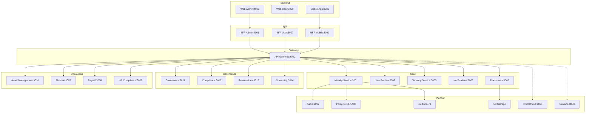
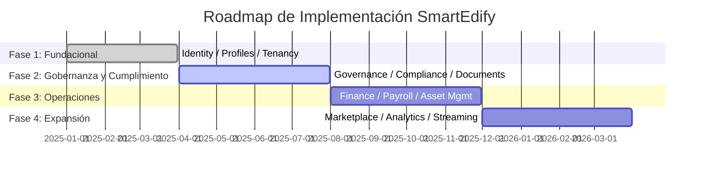

  
  
<em>Gestión integral de condominios</em>

---
# 📘 Documento de Visión — SmartEdify

**Versión:** 1.1  
**Fecha:** 2025-10-08  
**Estado:** Aprobado  
**Autor:** Equipo de Producto y Arquitectura SmartEdify  
**Revisión:** CTO / Software Architect / Product Manager  

---

## 🧭 1. Visión General

SmartEdify es una plataforma integral para la gestión de comunidades y condominios bajo un modelo SaaS multi-tenant, diseñada con un enfoque mobile-first, modular y orientada al cumplimiento normativo transnacional.  
Su objetivo es digitalizar la gobernanza, administración, seguridad y servicios comunes, garantizando trazabilidad, seguridad jurídica y experiencia de usuario unificada.

---

## 🏗️ 2. Arquitectura Global del Sistema

---

## 👥 3. Usuarios y Personas

| Rol | Descripción | Acceso principal |
|-----|--------------|------------------|
| Propietario | Miembro de asamblea con derechos de voto | App móvil / Web User |
| Administrador | Representante legal del condominio | Web Admin |
| Trabajador / Proveedor | Ejecuta servicios o tareas | App móvil |
| Auditor / Legal | Supervisa cumplimiento normativo | Web Admin |
| Sistema externo | Consume APIs autorizadas | OAuth2.1 + mTLS |

---

## 📦 4. Microservicios y Alcance Funcional

### 4.1. Identity Service (3001)
Proveedor central de identidad, autenticación y sesiones con cumplimiento normativo y soporte biométrico.  
Incluye autenticación WebAuthn, DPoP, MFA adaptativo y generación de QR seguros para asambleas.

### 4.2. User Profiles (3002)
Gestión de atributos, roles, relaciones jerárquicas y asociaciones con tenants y unidades residenciales.

### 4.3. Tenancy Service (3003)
Define condominios, unidades, espacios y relación entre tenants y jurisdicciones legales.  
Soporta residencia por país y RLS criptográfico.

### 4.4. Governance Service (3011)
Gestión de asambleas, actas, quórum, votaciones, mandatos y resoluciones con respaldo jurídico.  
Integrado con Compliance para validación legal en tiempo de ejecución.

### 4.5. Compliance Service (3012)
Valida políticas legales, roles vigentes y parámetros normativos.  
Opera en dos modos: **consulta bajo demanda** y **emisión de boletines de actualización** (ej. nombramientos o tarifas).

### 4.6. Reservations Service (3013)
Gestión de reservas de espacios comunes, calendario compartido y cobro automatizado según reglas del Governance Service.

### 4.7. Asset Management Service (3010)
Gestión de activos, incidencias, mantenimiento y trazabilidad mediante QR no encriptados.  
Permite asociar inspecciones y órdenes de trabajo a ubicaciones físicas.

### 4.8. Finance Service (3007)
Contabilidad, flujo de caja, tarifas, cuotas, conciliaciones y reportes fiscales bajo estándares NIC y normativa nacional.

### 4.9. Payroll Service (3008)
Gestión de nóminas, beneficios y obligaciones laborales. Genera recibos de pago y se integra con APIs fiscales (SUNAT, IVSS, etc.).

### 4.10. HR Compliance Service (3009)
Validación de cumplimiento laboral, contratos y normativas por país. Monitoreo continuo de obligaciones legales del empleador.

### 4.11. Notifications Service (3005)
Orquestador de notificaciones push, correo y mensajería interna por tenant.

### 4.12. Documents Service (3006)
Gestión documental con firma electrónica, versionado, cifrado y almacenamiento WORM.  
Firma válida solo en documentos con requerimientos legales.

### 4.13. Streaming Service (3014)
Transmisión en vivo de asambleas híbridas con registro legal de participación y timestamp certificado.

---

## ⚙️ 5. Flujos Principales

### CU-01 — Registro y Activación Delegada
1. Administrador registra usuario en User Profiles.  
2. Se envía enlace de activación vía Notifications.  
3. Identity valida y completa el registro.  
4. Compliance audita consentimiento.

### CU-02 — Autenticación Segura
1. Usuario inicia sesión (WebAuthn o Passkey).  
2. Identity genera JWT + DPoP.  
3. Sesión válida 10 min, asociada al dispositivo.

### CU-03 — Asamblea Digital
1. Governance crea evento con roles firmantes.  
2. Identity genera QR firmado para acceso.  
3. Compliance valida legalidad.  
4. Streaming registra asistencia y votos.

---

## 🛡️ 6. Seguridad y Cumplimiento

| Mecanismo | Descripción |
|------------|-------------|
| TLS 1.3 + mTLS | Canal seguro interservicios. |
| AES-256 at rest | Cifrado en base de datos y backups. |
| DPoP obligatorio | Prevención de replay attacks. |
| JWKS rotación 90d | Claves firmantes actualizadas periódicamente. |
| Logs WORM | Evidencia inmutable de auditoría. |
| GDPR / LGPD / eIDAS | Cumplimiento normativo multinacional. |

---

## 📊 7. Métricas Clave

| Indicador | Objetivo |
|------------|----------|
| Disponibilidad global | ≥ 99.95% |
| Latencia autenticación | ≤ 3 s (P95) |
| Tiempo revocación sesión | ≤ 30 s |
| Cumplimiento auditorías | 100% |
| Adopción WebAuthn | ≥ 80% |

---

## 🗓️ 8. Roadmap Estratégico

---

## 🧩 9. Relación entre Microservicios y Dominios

| Dominio | Servicios Asociados |
|----------|--------------------|
| Core | Identity, User Profiles, Tenancy, Notifications, Documents |
| Governance | Governance, Compliance, Reservations, Streaming |
| Operations | Asset Management, Finance, Payroll, HR Compliance |
| Business | Marketplace, Analytics |
| Platform | Kafka, PostgreSQL, Redis, Prometheus, Grafana, S3 |

---

## 🧾 10. Historial de Cambios

| Versión | Fecha | Descripción |
|----------|--------|-------------|
| 1.0 | 2025-08-01 | Versión inicial del documento de visión. |
| 1.1 | 2025-10-08 | Versión revisada, ampliada y actualizada según arquitectura integral. |

