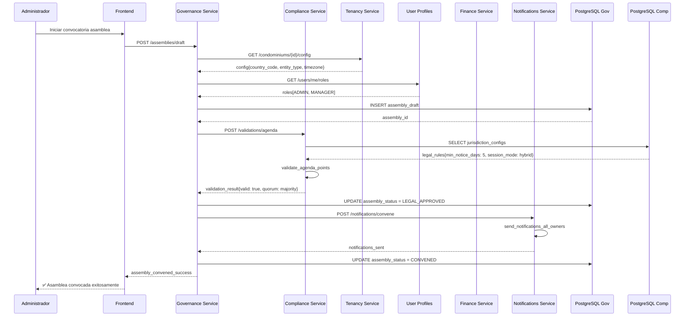
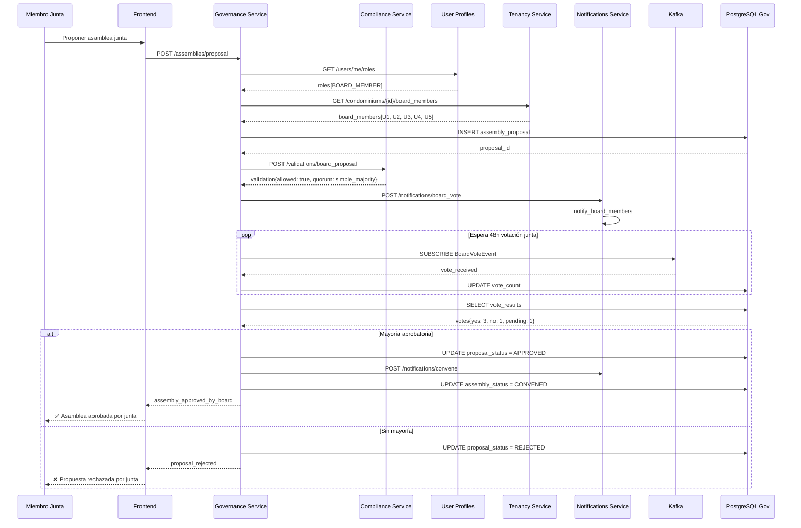
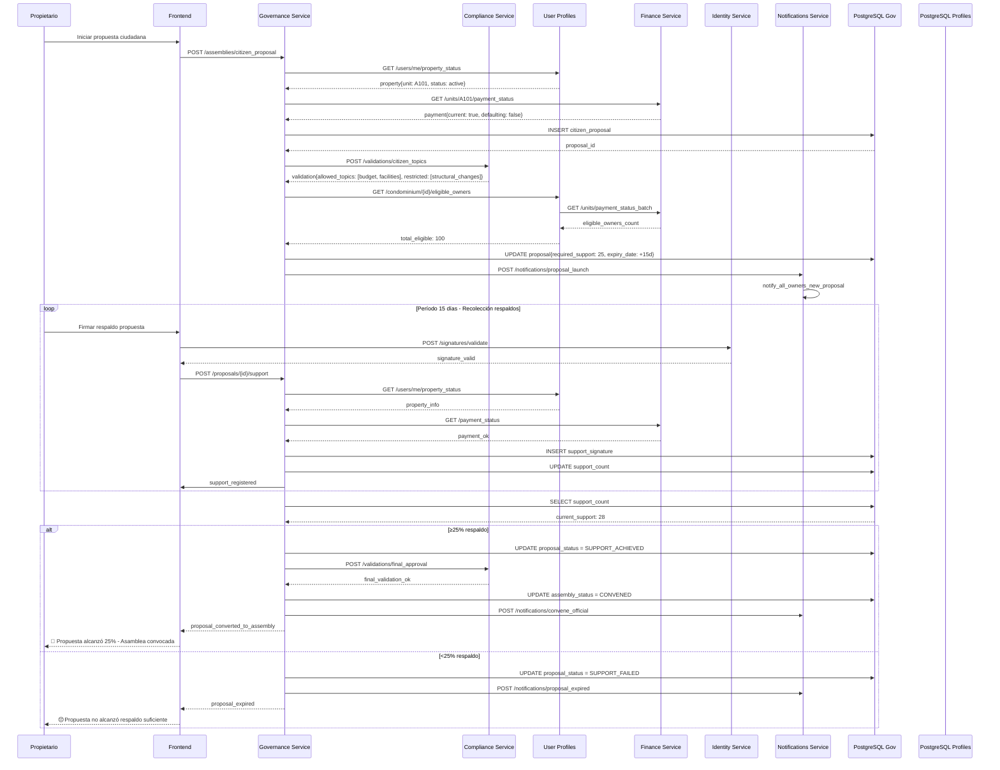
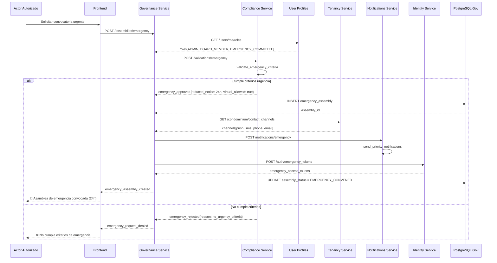
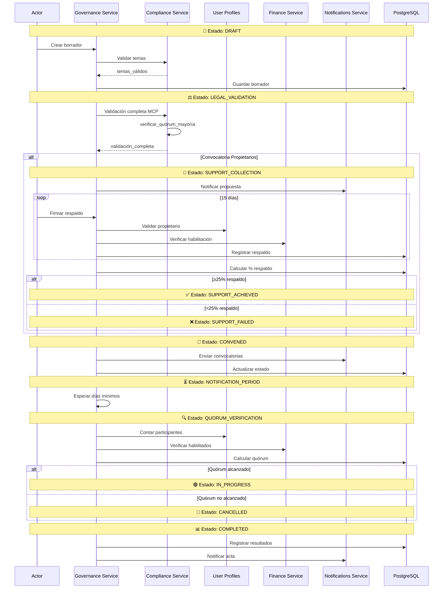

# 🔄 **Diagramas de Secuencia - Ciclo de Vida de Convocatorias**

## 1. **Convocatoria por Administración**



---

## 2. **Convocatoria por Junta Directiva**



---

## 3. **Convocatoria por Propietarios (25% Respaldo)**



---

## 4. **Convocatoria Extraordinaria/Urgente**



---

## 5. **Flujo Unificado - Estados del Ciclo de Vida**



---

## 6. **Validación MCP en Tiempo Real por Punto de Agenda**

```mermaid
sequenceDiagram
    participant G as Governance Service
    participant C as Compliance Service
    participant MCP as Motor Legal MCP
    participant DB_C as PostgreSQL Comp
    participant R as Redis Cache

    loop Por cada punto de agenda
        G->>C: POST /validate/agenda-point
        C->>R: GET cache:legal_rules:{country}:{entity}
        alt Cache Hit
            R-->>C: cached_rules
        else Cache Miss
            C->>MCP: POST /mcp/validate-point
            MCP->>MCP: analizar_marco_legal
            MCP-->>C: validation_result
            C->>DB_C: INSERT legal_validation
            C->>R: SET cache:legal_rules
        end
        
        C->>C: aplicar_validación_específica
        C-->>G: point_validation{
            is_valid: boolean,
            required_quorum: string,
            majority_type: string,
            legal_restrictions: json,
            recommendations: array
        }
        
        G->>G: acumular_resultados_validación
    end
    
    G->>G: determinar_estado_general_agenda
    alt Todos puntos válidos
        G->>G: marcar_agenda_legalmente_aprobada
    else Algunos puntos inválidos
        G->>G: generar_recomendaciones_corrección
    end
```

---

## 🎯 **Resumen de Estados por Tipo de Convocatoria:**

| **Estado** | **Administración** | **Junta** | **Propietarios** | **Emergencia** |
|------------|-------------------|-----------|------------------|----------------|
| **DRAFT** | ✅ | ✅ | ✅ | ✅ |
| **LEGAL_VALIDATION** | ✅ | ✅ | ✅ | ✅ (Acelerado) |
| **BOARD_APPROVAL** | ❌ | ✅ | ❌ | ❌ |
| **SUPPORT_COLLECTION** | ❌ | ❌ | ✅ | ❌ |
| **CONVENED** | ✅ | ✅ | ✅ | ✅ (Inmediato) |
| **NOTIFICATION_PERIOD** | 5-10 días | 5-10 días | 5-10 días | 24-48 horas |
| **QUORUM_VERIFICATION** | ✅ | ✅ | ✅ | ✅ |
| **IN_PROGRESS** | ✅ | ✅ | ✅ | ✅ |

**Cada tipo de convocatoria sigue su propio camino a través del ciclo de vida, con validaciones MCP en tiempo real garantizando el cumplimiento legal en todos los puntos.**

## 📋 Tipos de Roles y Atribuciones

´´´mermaid
mindmap
  root((Roles Organizacionales))
    Junta de Propietarios
      Presidente
        :Firma actas y resoluciones
        :Representación legal
        :Convocatoria asambleas
      Vicepresidente
        :Suple presidente
        :Comisiones especiales
      Secretario
        :Redacción actas
        :Custodia documentación
      Tesorero
        :Fiscalización financiera
        :Informes económicos
    Administración
      Administrador Principal
        :Gestión operativa
        :Ejecución acuerdos
      Administrador Suplente
        :Suple administrador
        :Emergencias operativas
    Comités
      Comité Ética
        :Resolución conflictos
        :Aplicación reglamento
      Comité Emergencia
        :Decisiones urgentes
        :Gestión crisis
    Auditoría
      Auditor Interno
        :Control procesos
        :Verificación cumplimiento
      Revisor Fiscal
        :Auditoría financiera
        :Cumplimiento legal
´´´
