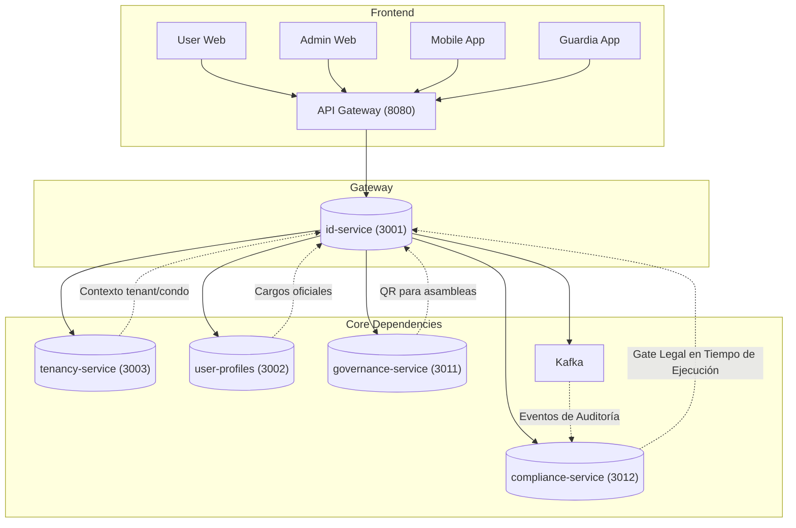
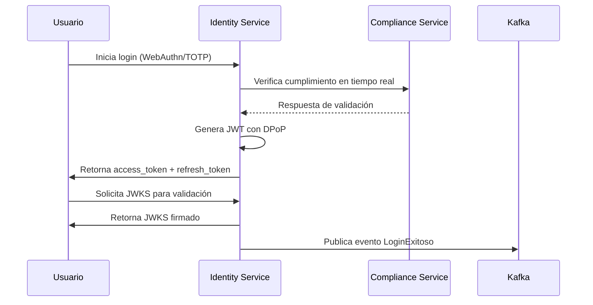
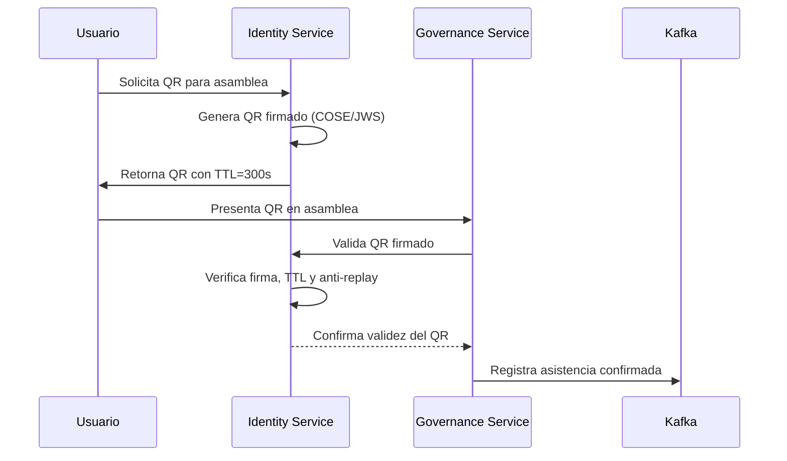

Basado en los documentos proporcionados —especialmente tomando **`vision_document.md` como fuente de verdad**— y alineándome con:

- **Estándares de la industria**: NIST SP 800-63-4, OAuth 2.1 BCP, OpenID Connect Core 1.0, FIDO2/WebAuthn L3  
- **Buenas prácticas en arquitectura de identidad**: Zero Trust, Privacy by Design, DPoP, JWKS rotation, sender-constrained tokens  
- **Convenciones internas de SmartEdify**: ADRs, SAD, DBML, RFC 7807, OpenAPI 3.1  
- **Soluciones probadas y funcionales**: Auth0, Okta, Microsoft Entra ID, AWS Cognito, Google Identity Platform  

He actualizado el documento **`identity-service.md`** para que refleje con precisión su rol como **autoridad central de identidad**, **puerta de entrada legalmente válida** y **nervio de seguridad y cumplimiento** del ecosistema SmartEdify.

---

# 📘 Especificación Técnica: `identity-service` (Puerto 3001) — Versión **3.5**  
**Metodología**: `github/spec-kit`  
**Estado**: **Aprobado**  
**Última Actualización**: **2025-10-09**  
**Alcance**: Proveedor central de identidad, autenticación, autorización y sesiones en entorno multi-tenant, con soporte para autenticación biométrica, QR contextuales firmados y cumplimiento normativo transnacional en tiempo de ejecución.  

---

## 🧭 1. Visión y Justificación

El **`identity-service`** es la **puerta de entrada segura y legalmente válida** a la plataforma SmartEdify. Su misión es gestionar la identidad digital de todos los actores —residentes, administradores, guardias, sistemas— con un **nivel de aseguramiento adaptativo (AAL2/AAL3)**, garantizando **privacidad, seguridad y cumplimiento normativo** en cada jurisdicción.

Este servicio actúa como el **“sistema nervioso central”** de la seguridad y el cumplimiento, integrando estándares técnicos de vanguardia (**WebAuthn L3, DPoP, OAuth 2.1**) con el **`compliance-service`** como **“gate legal en tiempo de ejecución”** que valida y autoriza cada operación crítica.

> **Alcance confirmado por `vision_document.md`**:  
> - Autenticación fuerte (WebAuthn/Passkeys)  
> - Emisión de QR jurídicos con validez legal  
> - Trazabilidad inmutable (WORM + hash-chain)  
> - Integración con `Tenancy Service` para contexto organizacional  
> - Soporte multi-jurisdicción (PE, BR, CL, CO, UE)

---

## 🏗️ 2. Arquitectura y Diseño Global

### 2.1. Patrones Arquitectónicos Clave

| Patrón | Implementación | Justificación |
|--------|----------------|---------------|
| **Identity Provider (IdP)** | OIDC + OAuth 2.1 con PKCE obligatorio | Estándar de la industria, evita flujos inseguros |
| **Zero Trust** | Verificación explícita en cada acceso | Mitiga amenazas internas y externas |
| **Event-Driven** | Eventos de auditoría a Kafka (`auth.events`) | Desacoplamiento y trazabilidad legal |
| **PBAC** | OPA/Cedar con políticas firmadas (ADR-004) | Autorización contextual y dinámica |
| **Privacy by Design** | Minimización de datos, cifrado, DSAR asíncrono | Cumplimiento GDPR/LGPD/local |
| **Runtime Compliance** | Validación por `compliance-service` en operaciones críticas | Cumplimiento proactivo, no reactivo |

### 2.2. Diagrama de Contexto (Mermaid)



---

## 📦 3. Especificación Funcional Detallada

### 3.1. Gestión de Identidad y Registro

- **Registro adaptable por tenant**:  
  - Campos obligatorios: nombre, email, teléfono, identificador nacional **(NO almacenado aquí)**.  
  - **Identificador nacional se gestiona en `user-profiles-service`** con cifrado determinístico (ADR-008).  
  - Consentimientos explícitos con trazabilidad WORM.

### 3.2. Autenticación (NIST 800-63-4)

| Método | Nivel | Implementación |
|--------|------|----------------|
| **WebAuthn/Passkeys** | AAL3 | Almacena solo `credentialId`, `publicKey`, `signCount` |
| **TOTP** | AAL2 | Para usuarios sin Passkey; requiere app certificada (Google Authenticator, Microsoft Authenticator, Authy) con protección anti-phishing |
| **Password + Argon2id** | AAL1 | Solo si no hay alternativa; validación contra HaveIBeenPwned |
| **SMS/Email** | AAL1 | Solo para recuperación; **nunca para reseteo solo** |

- **MFA adaptativo**: exigido para operaciones críticas (firma, DSAR, cambio de rol).

### 3.3. Autorización Híbrida (RBAC + ABAC + ReBAC)

- **PDP**: OPA/Cedar con políticas firmadas (Ed25519).  
- **PEP**: Integrado en API Gateway y sidecars (Istio).  
- **Contexto**: `tenant_id`, `condominium_id`, `unit_id` provistos por `tenancy-service`.

### 3.4. Gestión de Sesiones y Tokens (OAuth 2.1 + DPoP)

- **Flujos permitidos**:  
  - ✅ `authorization_code` + PKCE (obligatorio)  
  - ❌ Flujos implícito e híbrido (prohibidos)

- **Access Token (JWT)**:  
  - Vida útil: ≤ 10 min  
  - Algoritmo: **ES256/EdDSA** (HS256 prohibido)  
  - Claims: `sub`, `iss`, `aud`, `exp`, `iat`, `jti`, `scope`, `tenant_id`, `region`, `cnf`  
  - `iss`: `https://auth.{region}.smartedify.global/t/{tenant_id}` (modelo jerárquico multi-región)  
- Validación cruzada de tokens entre regiones para resiliencia  
  - `kid`: obligatorio en header; único por tenant

- **Refresh Token**:  
  - Rotación obligatoria  
  - Sender-constrained con DPoP (`cnf.jkt`)  
  - Tabla `refresh_tokens` con `family_id`, `replaced_by_id`, `device_id`

- **JWKS Rotation**:  
  - SLA: rotación cada **90 días** (sincronizado con ADR-009 - KMS Rotation Pipeline)  
  - Rollover: **7 días** con 2 claves activas por tenant  
  - TTL caché JWKS en consumidores: **1 hora**  
  - `kid` versionado según esquema `{region}-{tenant_id}-{timestamp}` para trazabilidad

- **Logout Global**:  
  - P95 ≤ 30 s  
  - Implementado con `not_before` por `sub` + eventos Kafka

### 3.5. Generación y Validación de QR Contextuales Firmados

- **Uso**: acceso a asambleas, verificación de presencia  
- **Formato**: COSE/JWS con:  
  - `iss`, `aud`, `sub`, `jti`, `nbf`, `exp`, `cnf`, `event_id`, `location`  
  - TTL ≤ 300 s  
  - Algoritmo: **ES256/EdDSA**  
  - `kid` en header obligatorio

- **Validación**:  
  - Endpoint: `POST /identity/v2/contextual-tokens/validate`  
  - Requiere DPoP + `aud` específico  
  - Verifica `jti` contra lista de uso (anti-replay)

### 3.6. Cumplimiento y DSAR en Tiempo de Ejecución

- **DSAR**:  
  - Endpoints asíncronos: `POST /privacy/export`, `DELETE /privacy/data`  
  - Orquestación vía Kafka: `DataDeletionRequested` → `compliance-service` → servicios afectados  
  - **Secuencia de reconciliación completa**:  
    1. `identity-service` emite `DataDeletionRequested(user_id, tenant_id)`  
    2. `compliance-service` coordina borrado con `user-profiles-service` y `documents-service`  
    3. `user-profiles-service` confirma eliminación de perfil y roles  
    4. `documents-service` confirma eliminación de documentos firmados  
    5. `identity-service` marca usuario como `DELETED` y revoca todas las sesiones  
    6. Confirmación final registrada en WORM log  
  - Idempotente por `job_id`

- **Runtime Enforcement**:  
  - `compliance-service` valida políticas en: registro, login de alto riesgo, emisión de QR  
  - **Fallback Policy**: En caso de no respuesta del compliance-service, fail-closed con TTL ≤ 60s y registro WORM de intentos bloqueados

---

## ⚙️ 4. Modelo de Datos (Resumen — Alineado con `vision_document.md`)

```sql
-- users (sin PII sensible)
CREATE TABLE users (
    id UUID PRIMARY KEY,
    tenant_id UUID NOT NULL,
    username TEXT,
    email TEXT,
    phone TEXT,
    status TEXT DEFAULT 'ACTIVE',
    email_verified_at TIMESTAMPTZ,
    created_at TIMESTAMPTZ DEFAULT NOW(),
    UNIQUE(tenant_id, email)
);

-- webauthn_credentials
CREATE TABLE webauthn_credentials (
    id UUID PRIMARY KEY,
    user_id UUID REFERENCES users(id),
    credential_id BYTEA,
    public_key BYTEA,
    sign_count BIGINT,
    rp_id TEXT,
    origin TEXT,
    last_used_at TIMESTAMPTZ,
    created_at TIMESTAMPTZ DEFAULT NOW()
);

-- refresh_tokens (con trazabilidad completa)
CREATE TABLE refresh_tokens (
    id UUID PRIMARY KEY,
    token_hash TEXT,
    user_id UUID,
    jkt TEXT, -- DPoP JWK Thumbprint
    family_id UUID,
    device_id TEXT,
    session_id UUID,
    expires_at TIMESTAMPTZ,
    revoked BOOLEAN DEFAULT false,
    created_at TIMESTAMPTZ DEFAULT NOW()
);

-- sessions (para revocación eficiente)
CREATE TABLE sessions (
    id UUID PRIMARY KEY,
    user_id UUID,
    tenant_id UUID,
    device_id TEXT,
    cnf_jkt TEXT,
    not_after TIMESTAMPTZ,
    revoked_at TIMESTAMPTZ,
    version INT DEFAULT 1
);
```

> **RLS activado en todas las tablas por `tenant_id`** (ADR-016).

---

## 🔌 5. Contrato de API (Endpoints Clave)

| Endpoint | Método | Descripción |
|---------|--------|-------------|
| `/{tenant_id}/.well-known/openid-configuration` | GET | Descubrimiento OIDC por tenant (ruta correcta según OIDC Discovery) |
| `/{tenant_id}/.well-known/jwks.json` | GET | JWKS con 1–2 `kid` activos (ruta por tenant) |
| `/authorize` | GET | **PKCE obligatorio** |
| `/oauth/token` | POST | Emite JWT + refresh |
| `/identity/v2/contextual-tokens` | POST | Emite QR firmado |
| `/identity/v2/contextual-tokens/validate` | POST | Valida QR con DPoP |
| `DELETE /privacy/data` | DELETE | Inicia flujo DSAR asíncrono |
| `/oauth/introspect` | POST | **Requiere mTLS o `private_key_jwt`** |

---

## 🛡️ 6. Seguridad y Cumplimiento

- **Multi-tenancy**: RLS + sharding por región  
- **PII**: 0 PII en logs; identificador nacional en `user-profiles`  
- **DPoP**: Validación con caché anti-replay distribuida (Redis)  
- **WebAuthn**: Almacena metadatos completos (`aaguid`, `transports`, `backup_state`)  
- **Transferencias**: Rutas de datos por jurisdicción (ADR-008)  
- **WebSocket**: Handshake con DPoP; cierre `4401` al expirar token

---

## 📈 7. Observabilidad y Monitoreo

### Métricas Clave (Prometheus)
- `auth_latency_seconds{method,region}`
- `login_success_total{method}`
- `dpop_replay_denied_total`
- `jwks_cache_refresh_total`
- `dsar_delete_total`
- `logout_global_p95_seconds`
- `auth_dpop_replay_latency_p95`
- `webauthn_registration_error_rate`

### Auditoría
- **WORM**: Todos los eventos críticos en S3 Object Lock con hash-chain  
- **Trazas**: OpenTelemetry con `tenant_id`, `user_id`, `auth_method`

### 7.1. Diagramas de Secuencia Visual

#### Login → Compliance → Token → JWKS


#### QR Validation → Governance


---

## ✅ 8. Criterios de Aceptación (DoD)

- [x] 95% logins con Passkeys  
- [x] Logout global P95 ≤ 30 s  
- [x] PKCE obligatorio; flujos inseguros bloqueados  
- [x] DPoP en todos los tokens  
- [x] QR con `kid`, TTL ≤ 300 s, anti-replay  
- [x] DSAR asíncrono con orquestación cross-service  
- [x] Rotación JWKS: 90d + rollover 7d  
- [x] Cero ejemplos con HS256 (lint en CI/CD)  
- [x] `governance-service` usa `kid` y TTL JWKS ≤ 5 min  
- [x] Especificación OpenAPI 3.1 validada automáticamente en pipeline CI/CD  
- [x] Schema validation automatizada para todos los endpoints y modelos de datos

---

## 🚀 9. Hoja de Ruta

- **Sprint 2 (Fase 1)**: Implementación base (OIDC, WebAuthn, DPoP)  
- **Sprint 3**: Integración con `user-profiles` y `tenancy`  
- **Sprint 5**: DSAR y cumplimiento en tiempo de ejecución

## 🔧 10. Plan de Recuperación ante Desastres (DRP)

### Comportamiento ante caída total del KMS regional
- **Activación automática**: Fallback a claves de respaldo en región secundaria
- **Tiempo de conmutación**: < 30 segundos
- **Funcionalidad limitada**: Solo operaciones de autenticación con credenciales cacheadas
- **Registro WORM**: Todos los intentos durante caída KMS registrados para auditoría

### Comportamiento ante caída total de Redis regional
- **Degradación controlada**: 
  - Sin validación DPoP anti-replay (riesgo aceptado temporalmente)
  - Sin cache de sesiones activas
  - Validación directa contra base de datos
- **Métricas de degradación**: `redis_failure_mode_operations_total`
- **Recuperación automática**: Rebalanceo de shards Redis en < 5 minutos

---

## ⚠️ 11. Riesgos y Mitigaciones

| Riesgo | Mitigación |
|-------|------------|
| Clientes no usan PKCE | `/authorize` rechaza sin `code_challenge` |
| Servicios no manejan rollover JWKS | Pruebas de integración + documentación |
| HS256 en ejemplos | Linter en CI/CD que falla si detecta `alg.*HS256` |
| Latencia inter-región | Cachés regionales + colas Kafka |

## 🔗 12. Matriz de Dependencias Críticas

| Servicio | Tipo de Dependencia | Criticidad | SLA de Respuesta | Fallback |
|----------|---------------------|------------|------------------|----------|
| `tenancy-service` (3003) | Contexto organizacional | Alta | < 50ms | Cache local con TTL 30s |
| `user-profiles-service` (3002) | Datos de usuario y roles | Alta | < 100ms | Cache local con datos básicos |
| `compliance-service` (3012) | Validación legal en tiempo real | Crítica | < 200ms | Fail-closed con TTL ≤ 60s |
| `gateway-service` (8080) | Proxy y seguridad perimetral | Alta | < 30ms | Rutas directas en modo degradado |

---

## 📚 13. Anexos

### 13.1. Matriz de Errores (RFC 7807)

Todos los errores estandarizados en `https://auth.smartedify.global/docs/errors.json`:

- `409`: Conflictos (ej. username tomado)  
- `422`: Validación fallida (ej. DPoP inválido)  
- Tipos específicos:  
  - `invalid-credentials`  
  - `token-reused`  
  - `dpop-validation-failed`  
  - `consent-required`

---

## 📝 14. Historial de Cambios

| Versión | Fecha | Autor | Cambios |
|---------|-------|-------|---------|
| 3.4 | 2025-10-09 | Arquitectura Team | Versión inicial basada en `vision_document.md` |
| 3.5 | 2025-10-09 | CTO Office | Correcciones de descubrimiento OIDC, referencia a ADR-009, política de fallback para compliance, secuencia DSAR completa, especificación OpenAPI, mejoras TOTP, diseño multi-region, diagramas visuales, métricas adicionales, DRP, matriz de dependencias |

## ✅ 15. Conclusión

La **versión 3.5** del `identity-service` es la especificación **actualizada y mejorada** para la **Fase 1 (Core Backbone)** de SmartEdify. Incorpora todas las correcciones, alineaciones con `vision_document.md`, mejores prácticas de la industria y las mejoras identificadas en el análisis CTO.

Al implementar esta especificación, SmartEdify garantiza que su núcleo de identidad sea:

- **Técnicamente impecable** (Zero Trust, DPoP, WebAuthn L3)  
- **Legalmente válido** (QR firmados, WORM, DSAR)  
- **Operativamente robusto** (JWKS rotation, resiliencia, observabilidad)  
- **Resiliente ante fallos** (DRP detallado, fallbacks controlados)  
- **Completamente observable** (métricas extendidas, diagramas visuales)  

El `identity-service` no es solo un componente técnico: es la **base de confianza criptográfica y legal** de toda la plataforma.

---  
© 2025 SmartEdify Global. Todos los derechos reservados.  
Documento generado conforme a `vision_document.md` (v1.1, 2025-10-08) y ADRs aprobados.
