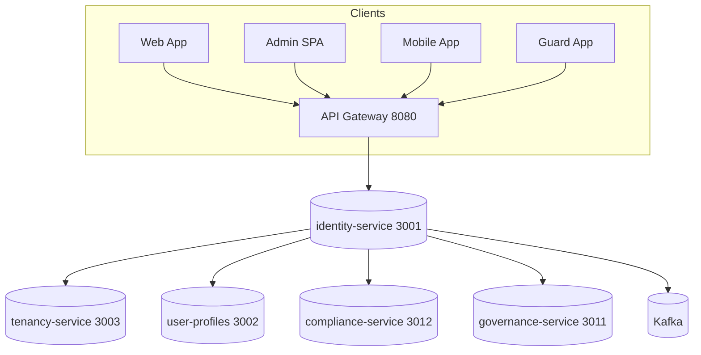
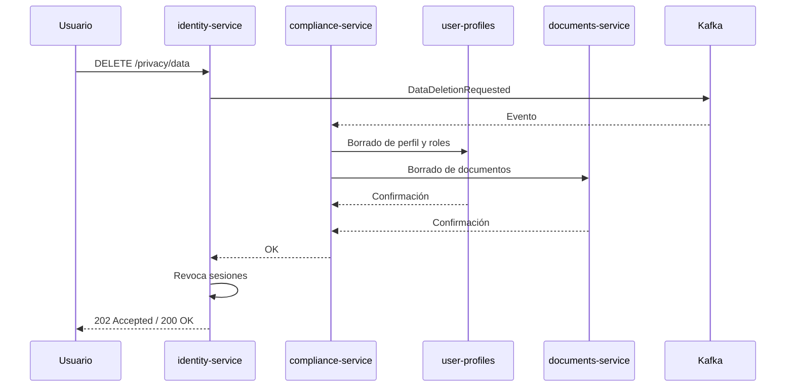
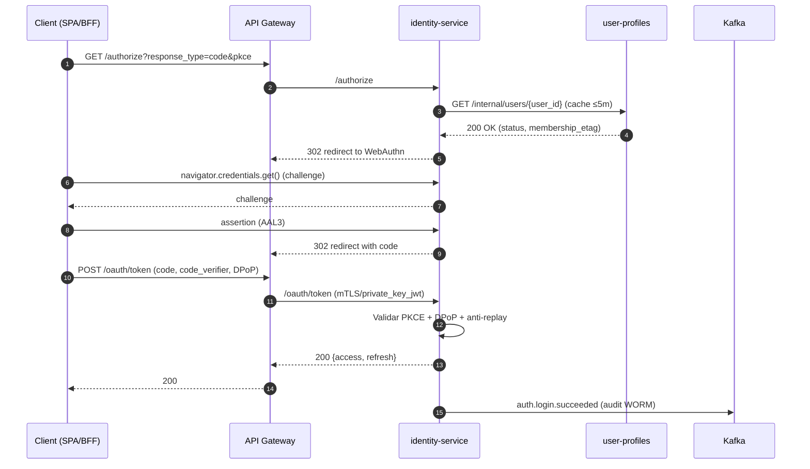
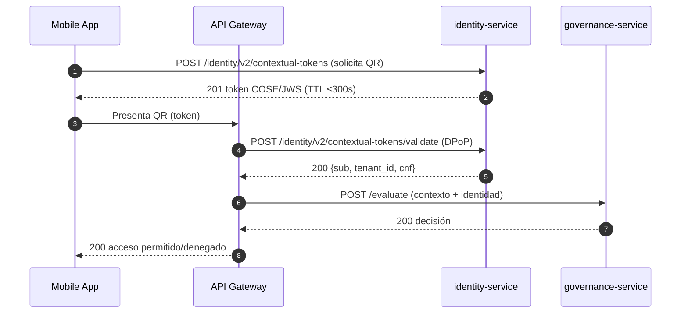

# Especificación Técnica — `identity-service` (SmartEdify)

**Versión:** 3.6  
**Estado:** Aprobado  
**Puerto:** 3001  
**Modelo:** Proveedor central de identidad OIDC/OAuth2.1 multi‑tenant con cumplimiento en tiempo de ejecución

---

## 1. Resumen

El `identity-service` provee autenticación, autorización y sesiones para clientes y servicios internos. Implementa OAuth 2.1, OpenID Connect 1.0, DPoP y WebAuthn. Actúa como IdP multi‑región y coordina cumplimiento normativo en tiempo real con `compliance-service`.

Objetivos:
- Autenticación fuerte por defecto (AAL2/AAL3).
- Tokens sender‑constrained con DPoP y rotación de refresh tokens.
- Multi‑tenancy segura mediante RLS y segmentación por región.
- Auditoría inmutable y DSAR orquestado entre servicios.

---

## 2. Estándares y principios

- **Estándares:** OAuth 2.1, OpenID Connect Core 1.0, PKCE, DPoP, JWK/JWKS, JWS, WebAuthn (FIDO2), RFC 7807, OpenAPI 3.1, mTLS.
- **NIST:** SP 800‑63‑4 (AAL2/AAL3), SP 800‑218 (SSDF) para SDLC.
- **Principios:** Zero Trust, Privacy by Design, Defense in Depth, Fail‑closed, Policy‑as‑Code.

---

## 3. Arquitectura

### 3.1 Diagrama de contexto



### 3.2 Componentes

- **Issuer OIDC** por tenant y región.
- **Token Service**: emisión/rotación de access y refresh con DPoP.
- **Session Service**: revocación global y listas de bloqueo.
- **WebAuthn Service**: registro y verificación de credenciales.
- **Policy Enforcement**: PEP en gateway y sidecars; PDP externo (OPA/Cedar).
- **Auditoría**: eventos críticos a Kafka y WORM storage.

### 3.3 Patrones

- IdP + Zero Trust.  
- Event‑driven para auditoría y DSAR.  
- Autorización híbrida RBAC/ABAC/ReBAC con políticas firmadas.

---

## 4. Interfaces públicas (API)

### 4.1 Descubrimiento y metadatos
- `GET /{tenant}/.well-known/openid-configuration`
- `GET /{tenant}/.well-known/jwks.json`

### 4.2 Autorización y tokens
- `GET  /authorize`  (PKCE obligatorio)
- `POST /oauth/token`  (authorization_code + PKCE; client_auth: mTLS o `private_key_jwt`)
- `POST /oauth/introspect`  (solo clientes de confianza; mTLS)
- `POST /oauth/revoke`  (revocación por `token` o `jti`)

### 4.3 Sesiones y cierre de sesión
- `POST /sessions/logout`  (logout global; efecto P95 ≤ 30 s)
- `POST /sessions/context/switch`  (canjea sesión global por token contextual; requiere `session_id` activa y `ctx` {`tenant_id`, `condominium_id?`, `unit_id?`, `role_id?`}; TTL ≤ 10 min; DPoP obligatorio)

### 4.4 Tokens contextuales (QR)
- `POST /identity/v2/contextual-tokens`  (COSE/JWS; TTL ≤ 300 s)
- `POST /identity/v2/contextual-tokens/validate`  (requiere DPoP; anti‑replay)

### 4.5 Privacidad y DSAR
- `POST /privacy/export` (asíncrono)
- `DELETE /privacy/data` (asíncrono)

### 4.6 Modelo de error
- RFC 7807. Tipo, título, detalle, `trace_id`, `tenant_id`, `timestamp`.

### 4.7 OpenAPI 3.1 (extracto)
```yaml
openapi: 3.1.0
info:
  title: SmartEdify Identity API
  version: "3.6"
servers:
  - url: https://auth.{region}.smartedify.global/t/{tenant}
paths:
  /authorize:
    get:
      summary: OAuth2 Authorization Code (PKCE)
      parameters:
        - name: response_type; in: query; required: true; schema: {type: string, enum: [code]}
        - name: client_id; in: query; required: true; schema: {type: string}
        - name: redirect_uri; in: query; required: true; schema: {type: string, format: uri}
        - name: code_challenge; in: query; required: true; schema: {type: string}
        - name: code_challenge_method; in: query; required: true; schema: {type: string, enum: [S256]}
        - name: scope; in: query; schema: {type: string}
        - name: state; in: query; schema: {type: string}
      responses: {"302": {description: Redirect}}
  /oauth/token:
    post:
      summary: Token endpoint
      requestBody:
        content:
          application/x-www-form-urlencoded:
            schema:
              type: object
              properties:
                grant_type: {type: string, enum: [authorization_code, refresh_token]}
                code: {type: string}
                redirect_uri: {type: string, format: uri}
                code_verifier: {type: string}
                refresh_token: {type: string}
      responses:
        "200": {description: Tokens}
  /sessions/context/switch:
    post:
      summary: Canjear sesión global por token contextual
      description: Emite access token contextual de vida corta para el contexto solicitado.
      requestBody:
        required: true
        content:
          application/json:
            schema:
              type: object
              required: [ctx]
              properties:
                ctx:
                  type: object
                  properties:
                    resource_tenant_id: {type: string, format: uuid}
                    condominium_id: {type: string, format: uuid}
                    unit_id: {type: string, format: uuid}
                    role_id: {type: string}
      responses:
        "200": {description: Token contextual}
        "400": {description: Contexto inválido}
        "401": {description: Sesión no válida}
        "409": {description: Membership desactualizada}
```yaml
openapi: 3.1.0
info:
  title: SmartEdify Identity API
  version: "3.6"
servers:
  - url: https://auth.{region}.smartedify.global/t/{tenant}
paths:
  /authorize:
    get:
      summary: OAuth2 Authorization Code (PKCE)
      parameters:
        - name: response_type; in: query; required: true; schema: {type: string, enum: [code]}
        - name: client_id; in: query; required: true; schema: {type: string}
        - name: redirect_uri; in: query; required: true; schema: {type: string, format: uri}
        - name: code_challenge; in: query; required: true; schema: {type: string}
        - name: code_challenge_method; in: query; required: true; schema: {type: string, enum: [S256]}
        - name: scope; in: query; schema: {type: string}
        - name: state; in: query; schema: {type: string}
      responses: {"302": {description: Redirect}}
  /oauth/token:
    post:
      summary: Token endpoint
      requestBody:
        content:
          application/x-www-form-urlencoded:
            schema:
              type: object
              properties:
                grant_type: {type: string, enum: [authorization_code, refresh_token]}
                code: {type: string}
                redirect_uri: {type: string, format: uri}
                code_verifier: {type: string}
                refresh_token: {type: string}
      responses:
        "200": {description: Tokens}
```

---

## 5. Autenticación

### 5.1 Métodos y niveles
- **WebAuthn/Passkeys**: AAL3. Almacenar `credentialId`, `publicKey`, `signCount`, `aaguid`, `transports`, `backup_state`.
- **TOTP**: AAL2. Solo como alternativa a Passkeys en dispositivos no compatibles.
- **Password + Argon2id**: AAL1 residual. Verificación contra HIBP y controles de fuerza.
- **SMS/Email OTP**: uso restringido a recuperación, no reseteo exclusivo.

### 5.2 MFA adaptativo
- Obligatoriedad en operaciones críticas: firma, cambio de rol, emisión de QR, DSAR.

---

## 6. Autorización

- **PDP**: OPA/Cedar. Políticas firmadas con Ed25519. Versionado y control de cambio.
- **PEP**: Gateway y sidecars. Enriquecimiento de contexto con `tenant_id`, `region`, `device_id`.
- **Modelo**: RBAC + ABAC + ReBAC. Evaluación determinista con caché de decisiones TTL 60 s.

Ejemplo de política OPA (extracto):
```rego
package authz
allow {
  input.action == "resource:read"
  input.subject.roles[_] == "admin"
  input.tenant_id == input.resource.tenant_id
}
```

**Claims de contexto y evaluación**
- Los tokens contextuales incluyen `ctx` `{resource_tenant_id, condominium_id?, unit_id?, role_id, membership_etag}` y `act.managing_tenant_id` cuando aplica, más `path` jerárquico.
- Las políticas deben validar que `input.resource.path` contiene el prefijo `token.path` y que `membership_etag` coincide con UPS.

Ejemplo OPA con jerarquía y etag:
```rego
package authz
allow {
  input.token.sub == input.resource.owner
  startswith(input.resource.path, input.token.path)
  data.ups.membership_etag[input.token.sub] == input.token.ctx.membership_etag
}
```

---

## 7. Tokens, sesiones y claves

### 7.1 Access Token (JWT)
- Vida útil ≤ 10 min. Algoritmo ES256/EdDSA. `kid` obligatorio. `aud` específica por servicio.
- Claims mínimos: `sub`, `iss`, `aud`, `exp`, `iat`, `jti`, `scope`, `region`, `cnf`.
- Claims de contexto (cuando aplica):
  -  `ctx`: `{resource_tenant_id, condominium_id?, unit_id?, role_id, membership_etag}`.
  - `act`: `{managing_tenant_id}` si el actor opera bajo una administradora.
  - `path`: array jerárquico para PDP.
### 7.2 Refresh Token
- Rotación obligatoria. Familia con `family_id`, `replaced_by_id`. Constrained por DPoP (`cnf.jkt`).

### 7.3 DPoP
- Validación del `Proof JWT` con caché anti‑replay distribuida. Enlace `htm` y `htu`.

### 7.4 Modelo híbrido de sesiones (PostgreSQL + Redis)

**Objetivo:** fuente de verdad consistente con latencias bajas de lectura y revocación global P95 ≤ 30 s.

**PostgreSQL (SoT):**
- Tabla `sessions` con `id`, `user_id`, `tenant_id`, `device_id`, `cnf_jkt`, `not_after`, `revoked_at`, `version`, `last_seen_at`.
- Transacciones ACID para crear, refrescar, revocar y cerrar sesión. Índices por `tenant_id`, `user_id`, `cnf_jkt`, `not_after`.
- Outbox `session_events` para propagación a Kafka.

**Redis (capa caliente):**
- Key por sesión: `sess:{id}` → `{status, not_after, cnf_jkt, version}`. TTL = `not_after`−now.
- Conjuntos por usuario y tenant: `sessidx:u:{user_id}` y `sessidx:t:{tenant_id}`.
- Anti‑replay DPoP: `dpop:{jkt}:{jti}` con TTL = `exp−iat` (≤ 10 min).
- Lista de revocación por `jti` con Bloom filter `revoked:jti` para consultas O(1).

**Ruta de escritura (write‑through):**
1. Tx en PostgreSQL.
2. Publicación en outbox.
3. Poblado de Redis con `SETNX` y `EXPIRE`. Idempotente por `id` y `version`.
4. Consumidor de outbox → Kafka `identity.sessions`.

**Ruta de lectura:**
- `GET` primero a Redis. Miss → PostgreSQL y relleno con TTL corto (≤ 5 min).
- Negative caching de sesiones inexistentes por 60 s.

**Consistencia:**
- Semántica al menos una vez. Convergencia ≤ 5 s.
- Control de carrera por `version` y `WATCH/MULTI` en Redis.
- Invalidaciones activas: Pub/Sub `revocations:*` y evento Kafka.

**Multi‑región:**
- Redis por región. Replicación lógica por Kafka.
- Revocaciones globales: publicar en todas las regiones. Propagar Bloom filter cada 30 s.

**Métricas y alarmas:**
- `session_cache_hit_ratio`, `revocation_propagation_seconds`, `dpop_replay_denied_total`.
- Alertar si `cache_hit_ratio < 0.9` o `revocation_propagation_seconds > 30`.
### 7.5 JWKS rotation
- Rotación cada 90 días. Rollover 7 días con dos claves activas por tenant. `kid` = `{region}-{tenant}-{timestamp}`. TTL de caché en consumidores ≤ 1 h.

### 7.6 Tokens contextuales y cambio de contexto
- La sesión es global por usuario×dispositivo y **no** se ancla a un tenant. No lleva contexto activo.
- Endpoint `POST /sessions/context/switch` emite un access token **contextual** con `ctx/act/path` y TTL ≤ 10 min.
- Validación: UPS confirma `membership_etag`; cache efímero ≤ 5 min.
- Revocación: global (todas las `session_contexts`) o selectiva por `{tenant|condominio|unidad}`.

---

## 8. Datos y esquemas

### 8.0 Propiedad de datos
- **`users` NO es parte de `identity-service`**. La tabla `users` pertenece a **`user-profiles-service` (UPS)** y contiene atributos y PII bajo RLS por `tenant/condominium`. `identity-service` solo mantiene artefactos de autenticación y sesiones referenciando `user_id` de UPS. Enlace por ID, sin FK física entre bases.
- Flujo de alta: UPS publica `UserCreated|UserUpdated|UserDeactivated`; `identity-service` provisiona credenciales y sesiones bajo demanda.

### 8.1 Esquema en `identity-service` (autenticación y sesiones)

```sql
-- Artefactos de autenticación y control de sesión en identity-service
CREATE TABLE webauthn_credentials (
  id UUID PRIMARY KEY,
  user_id UUID NOT NULL,
  tenant_id UUID NOT NULL,
  credential_id BYTEA NOT NULL,
  public_key BYTEA NOT NULL,
  sign_count BIGINT NOT NULL,
  rp_id TEXT NOT NULL,
  origin TEXT,
  transports TEXT[],
  backup_state BOOLEAN,
  last_used_at TIMESTAMPTZ,
  created_at TIMESTAMPTZ DEFAULT NOW()
);

CREATE TABLE refresh_tokens (
  id UUID PRIMARY KEY,
  token_hash TEXT NOT NULL,
  user_id UUID NOT NULL,
  tenant_id UUID NOT NULL,
  jkt TEXT,
  family_id UUID,
  device_id TEXT,
  session_id UUID,
  expires_at TIMESTAMPTZ NOT NULL,
  revoked BOOLEAN DEFAULT false,
  created_at TIMESTAMPTZ DEFAULT NOW()
);

CREATE TABLE sessions (
  id UUID PRIMARY KEY,
  user_id UUID NOT NULL,
  issuer_id UUID NOT NULL,           -- realm de identidad / issuer
  device_id TEXT,
  cnf_jkt TEXT,
  not_after TIMESTAMPTZ NOT NULL,
  revoked_at TIMESTAMPTZ,
  version INT DEFAULT 1,
  last_seen_at TIMESTAMPTZ
);

 (p. ej., administradora)
  device_id TEXT,
  cnf_jkt TEXT,
  not_after TIMESTAMPTZ NOT NULL,
  revoked_at TIMESTAMPTZ,
  version INT DEFAULT 1,
  last_seen_at TIMESTAMPTZ
);

CREATE TABLE session_contexts (
  id UUID PRIMARY KEY,
  session_id UUID NOT NULL,
  user_id UUID NOT NULL,
  resource_tenant_id UUID NOT NULL,
  condominium_id UUID,
  unit_id UUID,
  role_id TEXT,
  membership_etag TEXT NOT NULL,
  last_activated_at TIMESTAMPTZ DEFAULT NOW(),
  UNIQUE(session_id, resource_tenant_id, condominium_id, unit_id)
);

-- Outbox para propagación de cambios de sesión
CREATE TABLE session_events (
  id UUID PRIMARY KEY,
  session_id UUID NOT NULL,
  tenant_id UUID NOT NULL,
  event_type TEXT NOT NULL,          -- created|refreshed|revoked|logout_all|context_switched
  payload JSONB NOT NULL,
  occurred_at TIMESTAMPTZ DEFAULT NOW(),
  published BOOLEAN DEFAULT false
);
```

- **RLS** en tablas de `identity-service` por `resource_tenant_id` en `session_contexts` y por `issuer_id` en `sessions`.
- PII sensible permanece en UPS. En `identity-service` solo IDs y metadatos técnicos.

### 8.2 Contratos entre UPS e Identity
- **Eventos UPS → Identity:** `UserCreated`, `UserUpdated`, `UserDeactivated`.
  - Campos mínimos: `{user_id, tenant_id, status, membership_etag}`.
  - Idempotencia por `user_id` + `event_id`. Orden por `(tenant_id,user_id)`.
- **Consultas síncronas:** `GET /internal/users/{user_id}` de UPS para validación puntual, con caché efímero ≤ 5 min.
- **Identity → UPS:** notificación `CredentialRegistered` opcional para auditoría cruzada.

### 8.3 Impactos en claims y validación
- `sub` = `user_id` de UPS.  
- `resource_tenant_id` en token proviene del contexto `ctx`.  
- No se incluyen atributos personales en tokens; se resuelven vía UPS cuando se requieren.

---

## 9. Cumplimiento y privacidad

### 9.1 DSAR en tiempo de ejecución
Secuencia asíncrona orquestada por eventos Kafka.



#### Contrato de eventos DSAR (Kafka)

- **Topics:** `privacy.dsar.requests`, `privacy.dsar.results`, `privacy.dsar.audit`.
- **Formato:** JSON con esquema registrado y versionado (`schema_version`). Firma JWS detached (`kid` por región/tenant). Cabeceras: `tenant_id`, `region`, `trace_id`, `causation_id`, `correlation_id`.
- **Eventos:**
  - `DataDeletionRequested`: `{ request_id, subject_id, tenant_id, lawful_basis, requester, scope, deadline_at, reason_code }`
  - `DataExportRequested`: `{ request_id, subject_id, tenant_id, scope, deadline_at }`
  - `DataActionSucceeded`: `{ request_id, subject_id, component, items_deleted, items_exported, completed_at }`
  - `DataActionFailed`: `{ request_id, subject_id, component, error_code, error_detail, retriable }`
- **Garantías:** idempotencia por `request_id`, orden por clave `(tenant_id, subject_id)`, retención ≥ 35 días, DLQ `privacy.dsar.dlq`.

#### Responsabilidades

- **identity-service:**
  - Orquesta la solicitud. Publica `DataDeletionRequested`/`DataExportRequested`.
  - Revoca sesiones activas del `subject_id` al completar borrado.
  - Mantiene `dsar_cases` con estado y SLA.

- **user-profiles:**
  - Fuente de PII. Aplica borrado selectivo y minimización.
  - Debe cumplir:
    - Resolución de identidad determinista por `subject_id` y `tenant_id`.
    - Eliminación irreversible o seudonimización verificable.
    - Responder con `DataActionSucceeded` o `DataActionFailed` en ≤ 24 h internos.
    - No emitir eventos con PII cruda. Solo IDs y contadores.
  - Exponer endpoint interno `POST /internal/dsar/delete` idempotente.

- **documents-service y otros procesadores:**
  - Mismas garantías de idempotencia.
  - Reporte de conteos y paths lógicos, nunca payloads.

- **SLA:** cumplimiento legal ≤ 30 días. Objetivo interno ≤ 7 días. Alarma si `deadline_at` − ahora < 48 h.
### 9.2 Auditoría
- WORM con Object Lock y hash‑chain. Inmutabilidad legal.
- Eventos: login, logout, rotación de claves, DSAR, fallo de cumplimiento.

### 9.3 Residencia y transferencia de datos
- Rutas regionales por jurisdicción. Fail‑closed si `compliance-service` no responde en ≤ 60 s.

---

## 10. Observabilidad

- **Métricas Prometheus:** `auth_latency_seconds{method,region}`, `login_success_total{method}`, `dpop_replay_denied_total`, `jwks_cache_refresh_total`, `dsar_delete_total`, `logout_global_p95_seconds`, `webauthn_registration_error_rate`, `qr_identity_validation_error_rate`, `feature_flag_mismatch_detected_total`, `session_cache_hit_ratio`, `session_context_switch_seconds`, `session_contexts_active_total`.
- **Trazas:** OpenTelemetry con `tenant_id`, `user_id`, `auth_method`, `jti`, `ctx.resource_tenant_id`, `ctx.condominium_id`, `ctx.unit_id`.
- **Logs:** JSON, sin PII. Correlación por `trace_id`.
- **SLOs:**
  - Emisión de tokens P95 ≤ 150 ms.
  - Context switch P95 ≤ 300 ms.
  - Logout global P95 ≤ 30 s.
  - Disponibilidad mensual ≥ 99.95%.

---

## 11. Disponibilidad y DR

- Despliegue multi‑región activo‑activo.  
- Dependencias: PostgreSQL HA, Redis cluster, Kafka multi‑AZ.
- **KMS**: fallback a región secundaria en < 30 s; operaciones limitadas con claves en caché.
- **Redis**: degradación controlada sin anti‑replay DPoP; validación directa en BD.
- **Backups**: diarios, cifrados, verificación y prueba de restauración mensual. RPO ≤ 15 min, RTO ≤ 60 min.

### 11.4 Estrategia de persistencia y fallback para sesiones

**Redis no disponible:**
- Continúa emisión y validación con PostgreSQL únicamente.
- Desactiva anti‑replay Redis. Aumenta fuerza de DPoP: reducir `exp` de access token a 5 min.
- Habilita cache local in‑process por 60 s para evitar thundering herd.
- Degrada `logout global` a P95 ≤ 60 s por consultas a BD.
- Encender feature flag `sessions.db_only=true`. Alarmas por latencia.

**PostgreSQL en modo lectura o caída parcial:**
- Deniega creación o refresco de sesiones nuevas. Responde `503` con `type=identity.sessions.readonly`.
- Permite validación de tokens vigentes usando Redis y los JWT firmados hasta su `exp`.
- Mantén cola de revocaciones pendientes. Vacíala al restaurar BD.

**Recuperación:**
- Rellenar Redis mediante job `sessions-warmup`:
  - Leer sesiones con `not_after > now()` y `revoked_at IS NULL`.
  - `SCAN` paginado y `MSET` con TTL.
- Reconstruir Bloom filter `revoked:jti` con los últimos 2 días.
- Comparar conteo Redis vs BD. Tolerancia ±1%.

---

## 12. Rendimiento y capacidad

- Objetivo 2k RPS por región, P95 ≤ 200 ms en `/oauth/token` bajo 500 concurrentes.  
- Pruebas de carga con perfiles: login WebAuthn, refresh, introspect, validación de QR.
- Caching: JWKS y decisiones de autorización TTL 60 s.

### 12.1 Matriz de dependencias críticas

| Servicio | Tipo | Datos tratados | SLO externo | Fallback / Modo degradado | Observabilidad | Owner |
|---|---|---|---|---|---|---|
| PostgreSQL (Identity DB) | Estado | Artefactos de sesión y credenciales | 99.95% | Modo `readonly` y `db_only`; no crear/refresh sesiones; validar tokens vigentes | Latencia, errores, conexión, locks | Plataforma Datos |
| Redis | Cache/anti‑replay | Estado de sesión caliente y DPoP | 99.9% | `db_only`, cache local 60 s, warm‑up | `cache_hit_ratio`, memoria, evicciones | Plataforma Aplicativa |
| Kafka | Bus eventos | Auditoría, DSAR, revocaciones | 99.9% | Cola interna + reintentos; DLQ | `consumer_lag`, errores, throughput | Plataforma Eventos |
| KMS | Cifrado/firmas | CLAVES JWKS y JWS | 99.9% | Claves en caché, fallback región secundaria | Latencia firma, errores, rotación | Seguridad |
| OPA/Cedar PDP | Autorización | Políticas | 99.9% | Caché decisiones 60 s; fail‑closed en rutas críticas | Latencia eval, `deny_rate` | Plataforma Seguridad |
| User‑Profiles Service | Perfil | PII y memberships | 99.9% | Caché efímero 5 min; degradar atributos opcionales | Latencia, errores, tasa aciertos caché | Dominio Identidad |
| Compliance Service | Cumplimiento | DSAR, jurisdicción | 99.9% | Fail‑closed si >60 s en rutas reguladas | Tiempos de DSAR, SLAs | Legal Tech |
| Governance Service | Políticas negocio | Evaluación contextual | 99.9% | Cache regional de decisiones; colas | Latencia, `policy_miss` | Dominio Gobierno |
| API Gateway | Entrada | N/A | 99.95% | Bypass controlado solo lectura metadatos | 5xx, p95 | Plataforma Edge |
| Object Storage WORM | Auditoría | Eventos inmutables | 99.9% | Buffer local con reintentos | Tiempos de ingestión, errores | Plataforma Datos |
| Feature Flags | Config runtime | Flags | 99.9% | Flags baked + cache local | `flag_mismatch` | DevEx |
| Email/SMS Provider | Notificación | OTP | 99.9% | Proveedor secundario; throttling | Tasa entrega, latencia | Plataforma Comunicaciones |

---

## 13. Seguridad aplicativa

- Seguridad de cabeceras: CSP, HSTS, X‑Frame‑Options, Referrer‑Policy, COOP/COEP cuando aplique.
- Cookies: `Secure`, `HttpOnly`, `SameSite=Lax/Strict` según flujo.
- Secretos: KMS + rotación, nunca en imágenes. SBOM y escaneo de dependencias.
- Endpoints sensibles solo vía mTLS o `private_key_jwt`.
- Prohibido HS256. Linter en CI para bloquearlo.
- Almacenamiento de tokens en frontend: prohibido `localStorage`. Usar cookies HTTPOnly o BFF.

---

## 14. Calidad y pruebas

**Unitarias:**
- PKCE, rotación de refresh, validación DPoP.
- Concurrencia de sesiones con `version` y `CAS`.
- Cálculo de TTL y llaves Redis.

**Contract tests:**
- OpenAPI con `spectral` y pruebas de clientes críticos.
- DSAR eventos con Schema Registry. Validar backward/forward compatibility. Rechazar mensajes sin `schema_version` o firma JWS.

**E2E:**
- Flujos OIDC, WebAuthn, DSAR, QR.
- JWKS rollover: escenario de 3 fases (old/current/next). Verificar consumidores.
- Logout global y revocación multi‑región ≤ 30 s.

**Resiliencia y caos:**
- Inyección de lag Kafka, caída de Redis, partición de red entre regiones.
- Ensayos de `db_only` y `readonly` para sesiones.
- Fuzzing de JWT/COSE y pruebas de Bloom filter (FPR objetivo ≤ 1e‑3).

**Seguridad:**
- SAST, SCA, IAST, DAST.
- Verificación de `kid`, algoritmo permitido, y rechazo HS256.

**Performance:**
- Cargas 2k RPS. Perfil de rutas `/oauth/token`, `/oauth/introspect`, validación de QR.
- Pruebas con colisiones de `jti` y picos de revocación.

---

## 15. CI/CD y feature flags

- Pipeline: build → pruebas → escaneo → validación OpenAPI → despliegue canario → verificación SLOs → promoción.
- Validación de flags en CI y runtime. Métrica `feature_flag_mismatch_detected_total`.

---

## 16. Configuración y despliegue

### 16.1 Variables de entorno
- `REGION`, `TENANT_MODE`, `ISSUER_BASE_URL`.
- `DB_URL`, `REDIS_URL`, `KAFKA_BROKERS`.
- `KMS_KEY_ALIAS`, `JWKS_ROTATION_DAYS`, `JWKS_ROLLOVER_DAYS`.
- `DPoP_REPLAY_CACHE_TTL`, `SESSION_TTL_MINUTES`.
- `COMPLIANCE_URL`, `OPA_URL`.

### 16.2 Kubernetes
- Deployment con HPA (CPU 70%, p95 lat ≤ objetivo).  
- PodSecurity: `runAsNonRoot`, `readOnlyRootFilesystem`.  
- NetworkPolicy restrictiva.  
- PodDisruptionBudget ≥ 2.

---

## 17. Operación y runbooks

**DSAR:**
- Identificar atascos: consultar `dsar_cases` por `deadline_at`. Si Δ < 48 h, escalar.
- Reprocesar DLQ: mover mensajes de `privacy.dsar.dlq` tras corregir causa. Idempotente por `request_id`.
- Check‑list de evidencia: confirmaciones de cada procesador y revocación de sesiones.

**JWKS:**
- Rotación: publicar `next` 7 días antes. Verificar consumo con `/jwks/health` de servicios. Cambiar `current` en T0. Retirar `old` en T0+7 días.
- Rollback: reinstalar `old` como `current`. Notificar a consumidores.

**Sesiones:**
- Redis frío: ejecutar `sessions-warmup`. Validar `cache_hit_ratio`.
- Modo `db_only`: habilitar flag. Aumentar capacidad de BD temporalmente. Monitorear latencia.
- Limpieza: job diario `DELETE FROM sessions WHERE not_after < now()-7d`.

**Incidentes:**
- DPoP anti‑replay degradado: subir nivel de MFA adaptativo. Reducir `exp` tokens. Registrar en WORM.
- Caída de KMS: cambiar a claves de respaldo. Revisar eventos de firma DSAR.

---

## 18. Riesgos y mitigaciones

| ID | Riesgo | Mitigación |
|----|--------|------------|
| R-01 | Clientes sin PKCE | Rechazo en `/authorize` sin `code_challenge`. |
| R-02 | Consumidores sin manejo de rollover JWKS | Pruebas de integración y guías. |
| R-03 | Latencia inter‑región | Cachés regionales y colas. |
| R-11 | Tokens en `localStorage` | Cookies HttpOnly o BFF; pruebas de QA. |
| R-12 | Errores de lectura de QR | TTL 300 s, `kid` obligatorio, E2E móvil. |
| R-13 | Desalineación de feature flags | Validación en CI/CD y observabilidad. |

**Nuevos riesgos (M-*)**

| ID | Riesgo | Mitigación |
|----|--------|------------|
| M-05 | Inconsistencia Redis↔PostgreSQL generando sesiones fantasma | Write‑through, control de `version`/CAS, reconciliación `sessions-warmup`, métricas de divergencia. |
| M-06 | Evicción en Redis por presión de memoria | `maxmemory-policy noeviction`, sizing, alertas, relleno automático tras reinicio. |
| M-07 | Lag en Kafka retrasa revocaciones y DSAR | Monitoreo de `consumer_lag`, DLQ, backpressure, alarmas y escalamiento. |
| M-08 | Ruptura del contrato de eventos DSAR | Schema Registry con compatibilidad estricta, canary producers/consumers, validación en CI. |
| M-09 | Desincronización de reloj afecta expiraciones/DPoP | NTP forzado, tolerancia ±60 s, alertas por skew. |
| M-10 | Falla de rollback en rotación JWKS | Ventana de doble publicación 7 días, procedimiento de rollback y verificación de consumidores. |
| M-11 | Falla de RLS por `tenant_id` mal propagado | Tests de seguridad, linters SQL, enforcer de contexto en gateway/sidecars. |
| M-12 | Clientes guardan tokens en `localStorage` | BFF obligatorio, revisiones de seguridad de apps, headers y guías. |
---

## 19. Roadmap

- Fase 1: OIDC, WebAuthn, DPoP, sesiones.
- Fase 2: DSAR completo y cumplimiento en runtime.
- Fase 3: Conformidad OIDC avanzada y portabilidad entre proveedores.

---

## 20. Anexos

- **ADR index**: 004 Políticas; 008 Cifrado determinístico; 009 Rotación KMS; 016 RLS multi‑tenant.
- **Glosario**: AAL, DPoP, JWKS, PEP/PDP, RLS, DSAR.
- **Referencias**: OIDC Core 1.0, OAuth 2.1 BCP, FIDO2/WebAuthn, RFC 7517/7519/7807, NIST SP 800‑63‑4.


---

## 21. AsyncAPI — Eventos UPS↔Identity

```yaml
asyncapi: 2.6.0
info:
  title: SmartEdify — UPS→Identity User Events
  version: 1.0.0
defaultContentType: application/json
servers:
  kafka-prod:
    url: kafka+ssl://kafka.smartedify.prod:9093
    protocol: kafka-secure
    description: Producción
  kafka-stg:
    url: kafka+ssl://kafka.smartedify.stg:9093
    protocol: kafka-secure
    description: Staging
channels:
  ups.users.v1:
    description: Eventos de usuarios emitidos por User Profiles Service
    x-kafka-topic-config:
      retention.ms: 2592000000        # 30 días
      cleanup.policy: delete
      min.insync.replicas: 2
    subscribe:
      summary: Identity y consumidores leen eventos de usuarios
      message:
        oneOf:
          - $ref: '#/components/messages/UserCreated'
          - $ref: '#/components/messages/UserUpdated'
          - $ref: '#/components/messages/UserDeactivated'
      bindings:
        kafka:
          bindingVersion: '0.4.0'
components:
  messages:
    UserCreated:
      name: UserCreated
      title: Usuario creado en UPS
      contentType: application/json
      headers:
        $ref: '#/components/schemas/UpsHeaders'
      payload:
        $ref: '#/components/schemas/UserCore'
      bindings:
        kafka:
          key:
            type: string
            description: Partition key `${tenant_id}:${user_id}`
    UserUpdated:
      name: UserUpdated
      title: Usuario actualizado en UPS
      contentType: application/json
      headers:
        $ref: '#/components/schemas/UpsHeaders'
      payload:
        allOf:
          - $ref: '#/components/schemas/UserCore'
          - type: object
            properties:
              changes:
                type: array
                items:
                  type: object
                  required: [path, op]
                  properties:
                    path: {type: string}
                    op: {type: string, enum: [replace, add, remove]}
    UserDeactivated:
      name: UserDeactivated
      title: Usuario desactivado en UPS
      contentType: application/json
      headers:
        $ref: '#/components/schemas/UpsHeaders'
      payload:
        type: object
        required: [user_id, tenant_id, reason]
        properties:
          user_id: { $ref: '#/components/schemas/Uuid' }
          tenant_id: { $ref: '#/components/schemas/Uuid' }
          reason: { type: string }
      bindings:
        kafka:
          key:
            type: string
            description: Partition key `${tenant_id}:${user_id}`
  schemas:
    UpsHeaders:
      type: object
      required: [event_id, tenant_id, region, schema_version]
      properties:
        event_id: { $ref: '#/components/schemas/Uuid' }
        tenant_id: { $ref: '#/components/schemas/Uuid' }
        region: { type: string }
        schema_version: { type: integer, minimum: 1 }
        trace_id: { type: string }
        correlation_id: { type: string }
    UserCore:
      type: object
      required: [user_id, tenant_id, status, membership_etag]
      properties:
        user_id: { $ref: '#/components/schemas/Uuid' }
        tenant_id: { $ref: '#/components/schemas/Uuid' }
        status: { type: string, enum: [ACTIVE, INACTIVE] }
        membership_etag: { type: string }
        created_at: { $ref: '#/components/schemas/Timestamp' }
        updated_at: { $ref: '#/components/schemas/Timestamp' }
    Uuid:
      type: string
      format: uuid
    Timestamp:
      type: string
      format: date-time
```

## 22. AsyncAPI — Eventos DSAR

```yaml
asyncapi: 2.6.0
info:
  title: SmartEdify — DSAR Events
  version: 1.0.0
defaultContentType: application/json
servers:
  kafka-prod:
    url: kafka+ssl://kafka.smartedify.prod:9093
    protocol: kafka-secure
    description: Producción
  kafka-stg:
    url: kafka+ssl://kafka.smartedify.stg:9093
    protocol: kafka-secure
    description: Staging
channels:
  privacy.dsar.requests.v1:
    description: Solicitudes DSAR iniciadas por identity-service
    x-kafka-topic-config:
      retention.ms: 3024000000       # 35 días
      cleanup.policy: delete
    publish:
      summary: identity-service publica solicitudes
      message:
        oneOf:
          - $ref: '#/components/messages/DataDeletionRequested'
          - $ref: '#/components/messages/DataExportRequested'
      bindings:
        kafka:
          bindingVersion: '0.4.0'
  privacy.dsar.results.v1:
    description: Resultados de acciones DSAR por procesadores de datos
    x-kafka-topic-config:
      retention.ms: 3024000000
      cleanup.policy: delete
    publish:
      summary: Procesadores publican resultados
      message:
        oneOf:
          - $ref: '#/components/messages/DataActionSucceeded'
          - $ref: '#/components/messages/DataActionFailed'
      bindings:
        kafka:
          bindingVersion: '0.4.0'
  privacy.dsar.audit.v1:
    description: Auditoría e hitos DSAR, sin PII
    x-kafka-topic-config:
      retention.ms: 15552000000      # 180 días
      cleanup.policy: delete
    publish:
      message:
        $ref: '#/components/messages/DsarAudit'
  privacy.dsar.dlq.v1:
    description: Mensajes no entregables
    publish:
      message:
        oneOf:
          - $ref: '#/components/messages/DataDeletionRequested'
          - $ref: '#/components/messages/DataExportRequested'
          - $ref: '#/components/messages/DataActionSucceeded'
          - $ref: '#/components/messages/DataActionFailed'
components:
  messages:
    DataDeletionRequested:
      name: DataDeletionRequested
      title: Borrado de datos solicitado
      headers:
        $ref: '#/components/schemas/DsarHeaders'
      payload:
        type: object
        required: [request_id, subject_id, tenant_id, lawful_basis, requester, scope, deadline_at, reason_code]
        properties:
          request_id: { $ref: '#/components/schemas/Uuid' }
          subject_id: { $ref: '#/components/schemas/Uuid' }
          tenant_id: { $ref: '#/components/schemas/Uuid' }
          lawful_basis: { type: string }
          requester: { type: string }
          scope: { type: array, items: { type: string } }
          deadline_at: { $ref: '#/components/schemas/Timestamp' }
          reason_code: { type: string }
      bindings:
        kafka:
          key:
            type: string
            description: Partition key `${tenant_id}:${subject_id}`
    DataExportRequested:
      name: DataExportRequested
      title: Exportación de datos solicitada
      headers:
        $ref: '#/components/schemas/DsarHeaders'
      payload:
        type: object
        required: [request_id, subject_id, tenant_id, requester, scope, deadline_at]
        properties:
          request_id: { $ref: '#/components/schemas/Uuid' }
          subject_id: { $ref: '#/components/schemas/Uuid' }
          tenant_id: { $ref: '#/components/schemas/Uuid' }
          requester: { type: string }
          scope: { type: array, items: { type: string } }
          deadline_at: { $ref: '#/components/schemas/Timestamp' }
      bindings:
        kafka:
          key:
            type: string
            description: Partition key `${tenant_id}:${subject_id}`
    DataActionSucceeded:
      name: DataActionSucceeded
      title: Acción DSAR completada por un procesador
      headers:
        $ref: '#/components/schemas/DsarHeaders'
      payload:
        type: object
        required: [request_id, subject_id, component, completed_at]
        properties:
          request_id: { $ref: '#/components/schemas/Uuid' }
          subject_id: { $ref: '#/components/schemas/Uuid' }
          component: { type: string }
          items_deleted: { type: integer, minimum: 0 }
          items_exported: { type: integer, minimum: 0 }
          completed_at: { $ref: '#/components/schemas/Timestamp' }
      bindings:
        kafka:
          key:
            type: string
            description: Partition key `${tenant_id}:${subject_id}`
    DataActionFailed:
      name: DataActionFailed
      title: Acción DSAR fallida
      headers:
        $ref: '#/components/schemas/DsarHeaders'
      payload:
        type: object
        required: [request_id, subject_id, component, error_code, retriable]
        properties:
          request_id: { $ref: '#/components/schemas/Uuid' }
          subject_id: { $ref: '#/components/schemas/Uuid' }
          component: { type: string }
          error_code: { type: string }
          error_detail: { type: string }
          retriable: { type: boolean }
      bindings:
        kafka:
          key:
            type: string
            description: Partition key `${tenant_id}:${subject_id}`
    DsarAudit:
      name: DsarAudit
      title: Hito de auditoría DSAR
      headers:
        $ref: '#/components/schemas/DsarHeaders'
      payload:
        type: object
        required: [request_id, subject_id, stage, occurred_at]
        properties:
          request_id: { $ref: '#/components/schemas/Uuid' }
          subject_id: { $ref: '#/components/schemas/Uuid' }
          stage: { type: string, enum: [received, validated, dispatched, completed, expired] }
          occurred_at: { $ref: '#/components/schemas/Timestamp' }
  schemas:
    DsarHeaders:
      type: object
      required: [tenant_id, region, schema_version, event_id, kid, jwsd]
      properties:
        tenant_id: { $ref: '#/components/schemas/Uuid' }
        region: { type: string }
        schema_version: { type: integer, minimum: 1 }
        event_id: { $ref: '#/components/schemas/Uuid' }
        trace_id: { type: string }
        correlation_id: { type: string }
        causation_id: { type: string }
        kid: { type: string, description: Clave pública usada para firmar el JWS detached }
        jwsd: { type: string, description: Firma JWS detached del payload }
    Uuid:
      type: string
      format: uuid
    Timestamp:
      type: string
      format: date-time
```


---

## 23. Anexo — Definition of Done (DoD v3.6)

### 23.1 Alcance
Define los criterios mínimos y verificables para dar por terminado un incremento del `identity-service` en SmartEdify. Aplica a funcionalidad, seguridad, privacidad, rendimiento, observabilidad y operación multi‑tenant.

### 23.2 Criterios de aceptación por dominio

**Arquitectura y diseño**
- [ ] ADRs actualizados y aprobados para cambios de seguridad, datos, despliegue y multi‑tenant.
- [ ] Esquemas DB versionados con migraciones reversibles y pruebas de migración.
- [ ] Compatibilidad hacia atrás en APIs públicas (OpenAPI 3.1) sin `breaking` o con versión mayor.

**Seguridad**
- [ ] Algoritmos permitidos: ES256/EdDSA únicamente. HS256 bloqueado por linter en CI.
- [ ] MFA requerido para operaciones críticas; pruebas de flujo AAL2/AAL3.
- [ ] SAST/SCA sin vulnerabilidades **Critical/High**. IAST/DAST sin findings explotables **High**.
- [ ] Secretos gestionados por KMS; verificación de rotación y de llaves activas.
- [ ] DPoP activo y anti‑replay operativo con pruebas de colisión `jti`.

**Cumplimiento y privacidad**
- [ ] DSAR: producers/consumers validan `schema_version` y firma JWS detached.
- [ ] No PII en logs ni en eventos; políticas de pipeline que lo verifiquen.
- [ ] Auditoría WORM recibida ≤ 60 s desde evento de seguridad.

**Calidad y pruebas**
- [ ] Unitarias ≥ 80% en módulos críticos (PKCE, DPoP, rotación de refresh, sesiones y `session_contexts`).
- [ ] Contract tests de OpenAPI y AsyncAPI pasan en CI con compatibilidad backward/forward.
- [ ] E2E: login WebAuthn, refresh, logout global, DSAR, JWKS rollover, cambio de contexto.
- [ ] Fuzzing de JWT/COSE sin rechazos falsos > 0.1% y sin bypass aceptado.

**Observabilidad**
- [ ] Métricas expuestas y alertas activas: `auth_latency_seconds`, `logout_global_p95_seconds`, `dpop_replay_denied_total`, `jwks_cache_refresh_total`, `session_cache_hit_ratio`, `session_context_switch_seconds`, `session_contexts_active_total`, `auth_dpop_replay_latency_p95`.
- [ ] Trazas OTel con `tenant_id`, `user_id`, `auth_method`, `jti`, `ctx.resource_tenant_id`, `ctx.condominium_id`, `ctx.unit_id`.
- [ ] Dashboards publicados para latencia, errores y revocaciones.

**Operaciones y DR**
- [ ] Runbooks: DSAR, JWKS rotation/rollback, sesiones `db_only`, warm‑up Redis, `readonly` DB.
- [ ] Backups restaurados en entorno de prueba; RPO ≤ 15 min, RTO ≤ 60 min.
- [ ] Caos: Redis down, lag Kafka, KMS fallback, modos `db_only` y `readonly` ejecutados con éxito.

**Documentación y contratos**
- [ ] OpenAPI 3.1 y AsyncAPI (§21, §22) publicados y versionados.
- [ ] Guías de integración para consumidores con ejemplos de `ctx/act/path`.

**Performance y capacidad**
- [ ] 2k RPS por región. `/oauth/token` P95 ≤ 200 ms, `context switch` P95 ≤ 300 ms, logout global P95 ≤ 30 s bajo 500 usuarios concurrentes.
- [ ] Pruebas con picos de revocación y colisiones de `jti`.

**Datos y privacidad**
- [ ] `users` reside en UPS. En Identity solo IDs y metadatos. RLS activa por `issuer_id` y `resource_tenant_id`.
- [ ] Verificación de borrado de artefactos de autenticación por `subject_id` en DSAR.

**Multitenancy y contexto**
- [ ] Tokens contextuales incluyen `ctx.resource_tenant_id`, `condominium_id?`, `unit_id?`, `role_id`, `membership_etag`, `path` y `act.managing_tenant_id` si aplica.
- [ ] Cambios de contexto con cache UPS coherente (`membership_etag`) ≤ 5 min.
- [ ] Revocación selectiva por `{tenant|condominio|unidad}` validada.

**Interoperabilidad OIDC/OAuth**
- [ ] Suites de conformidad contra Okta/Auth0/Entra superadas para flujos base.

### 23.3 Evidencia requerida
| Evidencia | Artefacto mínimo |
|---|---|
| ADRs aprobados | `/docs/adr/*.md` con firmas de revisión |
| OpenAPI/AsyncAPI | `/contracts/openapi.yaml`, `/contracts/asyncapi/*.yaml` |
| Reportes SAST/SCA/DAST/IAST | `/reports/security/*` sin High/Critical abiertos |
| Resultados E2E | `/reports/e2e/*.xml` con 100% passed |
| Pruebas de caos | `/reports/chaos/*.md` con resultados y métricas |
| Dashboards y alertas | Snapshots exportados `/observability/*` |
| Backup y restore | Registro de prueba `/ops/dr/*` |

### 23.4 Puertas de CI/CD
| Etapa | Job | Condición de bloqueo |
|---|---|---|
| Build | `lint-algos-jwt` | Falla si HS256 detectado |
| Test | `unit`, `contract-openapi`, `contract-asyncapi` | Cobertura y compatibilidad OK |
| Seguridad | `sast`, `sca`, `dast`, `iast` | Cero High/Critical abiertos |
| Performance | `perf-2k-rps` | P95 y errores dentro de objetivo |
| Chaos | `chaos-sessions`, `chaos-kafka`, `chaos-kms` | Todos OK |
| Deploy canario | `canary-verify-slo` | Burn rate SLO dentro de umbral |

### 23.5 RACI de aprobación
| Actividad | R | A | C | I |
|---|---|---|---|---|
| Seguridad y cifrado | SecOps | CTO | Dev Lead | PO |
| Arquitectura | Arq. Software | CTO | SRE, Dev Lead | PO |
| Calidad y E2E | QA Lead | PO | Dev Lead | SRE |
| Operaciones/DR | SRE | CTO | SecOps | PO |
| Contratos (API/Eventos) | Dev Lead | PO | Arq., QA | Consumidores |

### 23.6 Plan de validación E2E
- Login WebAuthn + PKCE + DPoP.
- Refresh y rotación de familia de tokens.
- Switch de contexto L↔M con recursos en A, B, C, D.
- Revocación global y selectiva por unidad.
- DSAR delete/export con productores múltiples y DLQ.
- JWKS rollover con consumidores heterogéneos.

### 23.7 Criterios de rollback
- Burn rate SLO > umbral por 15 min.
- Tasa de `context switch` fallido > 0.5% por 10 min.
- `consumer_lag` DSAR > 5 min por 15 min.
- Procedimiento: revertir a release `N-1`, reinstalar `old` JWKS si aplica, limpiar `session_contexts` incongruentes.

### 23.8 Acta de cierre (plantilla)
```
Fecha:
Versión:
Alcance:
Checklist cumplido: Sí/No (adjuntar evidencias)
Excepciones aprobadas: Sí/No (detalle)
Firmas: PO, CTO, SecOps, QA Lead, SRE
```

### 23.9 Mantenimiento del DoD
- Revisión trimestral. Cambios via ADR y versión del presente anexo.
## 24. Anexo — Secuencias operativas

### 24.1 Login OIDC con WebAuthn y PKCE


### 24.2 Validación de QR → Governance


