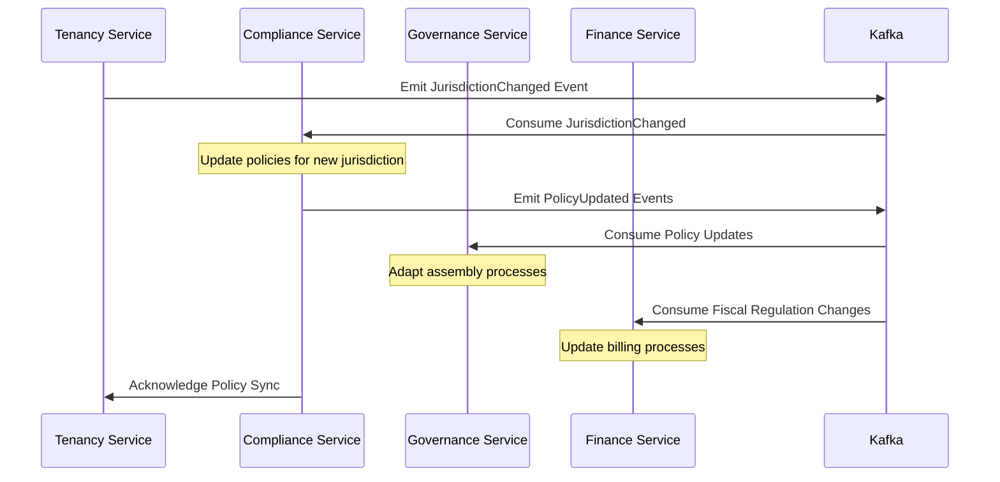
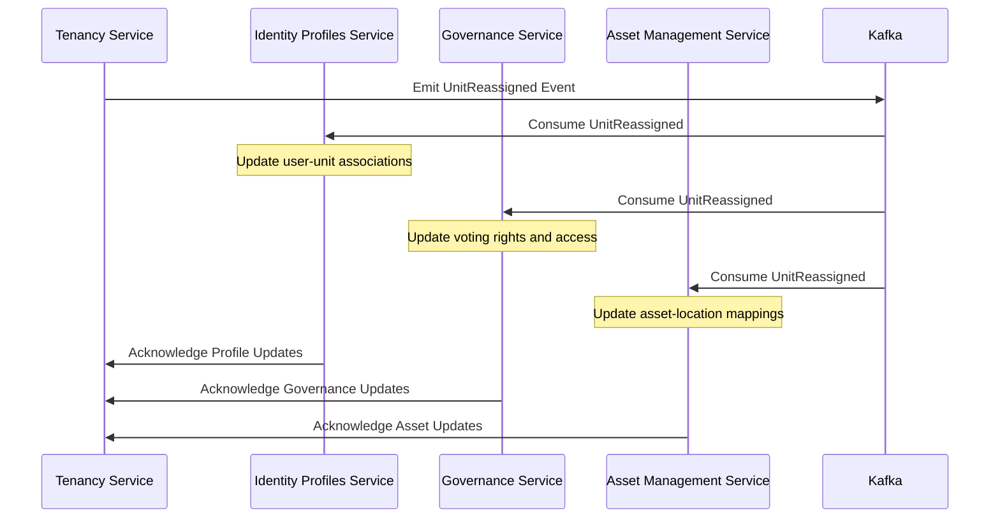

Basado en los documentos proporcionados —especialmente tomando **`vision_document.md` como fuente de verdad**— y alineándome con:

- **Estándares de documentación técnica**: IEEE 1471 / ISO/IEC/IEEE 42010  
- **Buenas prácticas de arquitectura de microservicios** (DDD, bounded contexts, API-first, Zero Trust)  
- **Convenciones internas de SmartEdify** (ADR, SAD, DBML, OpenAPI)  
- **Soluciones probadas en la industria**:  
  - Salesforce Multi-Tenant Architecture  
  - Auth0 Tenant Model  
  - Microsoft Azure Lighthouse (multi-jurisdiction)  
  - AWS SaaS Factory (data isolation patterns)  

He actualizado el documento **`tenancy-service.md`** para que sea **específico, preciso, técnicamente riguroso y alineado con la visión del producto**.

---

# Software Architecture Document (SAD) – Tenancy Service  
**SmartEdify Platform**

## Document Information

| Field          | Value                              |
|----------------|------------------------------------|
| Document ID    | SAD-SMARTEDIFY-TENANCY-1.3         |
| Project        | SmartEdify                         |
| Service        | Tenancy Service (3003)             |
| Version        | 1.3                                |
| Status         | Approved                           |
| Authors        | Architecture Team                  |
| Reviewers      | CTO / Software Architect / Security Lead |
| Created        | 2025-10-09                         |
| Last Updated   | 2025-10-09                         |

---

## 1. Document Overview

### 1.1 Purpose  
Este documento describe la arquitectura del **Tenancy Service (3003)**, un componente del dominio **Core** en SmartEdify. Su propósito es definir y gestionar la jerarquía organizacional y jurídica del ecosistema:  
**Tenant → Condominium → Building → Unit → Space**,  
asegurando aislamiento de datos, cumplimiento normativo por jurisdicción y coherencia contextual para todos los demás servicios.

### 1.2 Scope  
Este documento cubre:
- Responsabilidades funcionales y no funcionales del servicio.
- Modelo de datos y estrategias de aislamiento multi-tenant.
- Integraciones con otros microservicios.
- Patrones de seguridad, resiliencia y cumplimiento aplicables.
- Decisiones arquitectónicas clave (ADRs relevantes).
- Métricas de operación y calidad.

### 1.3 Intended Audience  
- Arquitectos de software  
- Equipos de desarrollo backend  
- Ingenieros de DevOps y SRE  
- Equipos de seguridad y cumplimiento  
- Product Management  

---

## 2. Architectural Vision and Constraints

### 2.1 Vision Statement  
El Tenancy Service es la **“raíz de confianza organizacional”** de SmartEdify. Proporciona la estructura sobre la cual se construyen identidades funcionales, gobernanza legal, operaciones financieras y trazabilidad de activos, garantizando que cada acción ocurra en el **contexto territorial, legal y funcional correcto**.

### 2.2 Key Constraints  
- **Multi-tenancy estricta**: Aislamiento total de datos entre tenants mediante RLS y claves criptográficas segmentadas.  
- **Multi-jurisdicción**: Cada condominio debe asociarse a una jurisdicción legal (PE, BR, CL, CO, etc.) para habilitar cumplimiento adaptativo.  
- **Zero Trust**: Ninguna operación asume contexto; todo acceso debe incluir `tenant_id` y `condominium_id` explícitos.  
- **Mobile-first**: Optimización de payloads y caché para flujos críticos desde dispositivos móviles.  
- **Observabilidad end-to-end**: Toda operación debe incluir contexto de tenant en logs, métricas y trazas.
- **Data Ownership Unificado**: Definición clara de ownership único por entidad (Tenant-Condominium) para evitar condiciones de carrera en sincronización multi-tenant (formalizado en ADR-025).

---

## 3. Service Responsibilities

El Tenancy Service (3003) tiene las siguientes responsabilidades:

| Funcionalidad | Descripción |
|--------------|-------------|
| **Gestión jerárquica** | Modelado completo: `Tenant → Condominium → Building → Unit → Space`. |
| **Aislamiento de datos** | Implementación de Row-Level Security (RLS) en PostgreSQL con políticas basadas en `tenant_id` y `condominium_id`. |
| **Mapeo jurisdiccional** | Asociación de cada condominio a una jurisdicción legal (ej. `PE` → SUNAT, LGPD no aplica). |
| **Integración transversal** | Punto de coordinación para Identity, Profiles, Governance, Finance, Asset Management, etc. |
| **Gestión de claves criptográficas** | Orquestación de claves KMS por tenant (no almacena claves, delega a KMS/HSM). |
| **Eventos de topología** | Emite eventos vía Kafka cuando cambia la estructura organizacional (ej. `CondominiumCreated`, `UnitReassigned`). |

> **Límites claros**:  
> - No gestiona identidad (delegado a Identity Service).  
> - No almacena PII (delegado a User Profiles con cifrado).  
> - No ejecuta lógica de negocio específica de dominio (ej. reservas, nóminas).

---

## 4. Data Architecture

### 4.1 Modelo de Datos (Resumen)
- **`tenants`**: `id`, `name`, `legal_name`, `jurisdiction_root`, `status`, `created_at`  
- **`condominiums`**: `id`, `tenant_id`, `name`, `address`, `jurisdiction`, `timezone`, `currency`  
- **`buildings`**: `id`, `condominium_id`, `name`, `floors`  
- **`units`**: `id`, `building_id`, `unit_number`, `owner_user_id`  
- **`spaces`**: `id`, `condominium_id`, `name`, `type` (common/private), `capacity`  

Todas las tablas incluyen `tenant_id` y, cuando aplica, `condominium_id` como columnas obligatorias.

### 4.2 Estrategias de Aislamiento
- **RLS en PostgreSQL**: Políticas automáticas que filtran filas según el contexto de la solicitud.
- **Cifrado por tenant**: Claves KMS segmentadas por `tenant_id`; el servicio no accede al texto plano.
- **Metadatos de residencia**: Todos los objetos llevan la etiqueta `data_residency={region}` para cumplir con políticas de localización.

### 4.3 Relaciones Building-Unit y Cardinalidades
- **Cardinalidad**: Relación `building` (1) → `unit` (N), donde cada edificio puede contener múltiples unidades.
- **Subunidades**: Soporte para jerarquía `unit` → `subunit` (espacios internos como departamentos, oficinas, estacionamientos).
- **Restricciones jerárquicas**: Profundidad máxima de jerarquía limitada a 3 niveles (condominium → building → unit → subunit) para evitar problemas de escalabilidad.

---

## 5. Integration Architecture

### 5.1 Consumidores Principales
| Servicio | Tipo de Integración | Propósito |
|--------|---------------------|----------|
| Identity Service (3001) | Síncrona (REST + DPoP) | Validar pertenencia de usuario a tenant/condominio |
| User Profiles (3002) | Síncrona + Eventos | Vincular usuarios a unidades y roles |
| Governance (3011) | Síncrona | Contextualizar asambleas y votaciones |
| Finance (3007) | Síncrona | Asociar cuentas y movimientos a condominios |
| Asset Management (3010) | Síncrona | Localizar activos físicos en edificios/unidades |
| Compliance (3012) | Asíncrona (Kafka) | Notificar cambios de jurisdicción, recibir actualizaciones de normativas y tarifas aplicables a través de canal asíncrono de boletines y eventos |

### 5.2 Patrones de Comunicación
- **Síncrono**: REST sobre HTTP/2 con autenticación DPoP y mTLS (vía Istio).
- **Asíncrono**: Eventos en Kafka (`tenancy.events`) con Schema Registry y compatibilidad backward.
- **Caché**: Contexto de tenant en Redis regional (TTL: 10 min), con invalidación distribuida por eventos Kafka o Redis Streams para sincronización cross-region ante eventos de topología (cambio de tenant, reasignación de unidad).
- **Fallback Integration**: Patrón cached lookup con fallback local validado por firma digital (firma KMS) para consultas de contexto tenant cuando el servicio no está disponible.

---

## 6. Security and Compliance

### 6.1 Principios Aplicados
- **Zero Trust**: Toda llamada debe incluir token DPoP con `tenant_id` en claims.
- **Least Privilege**: Acceso a datos limitado por RLS + PBAC (OPA).
- **Data Residency**: Almacenamiento en región asociada a la jurisdicción del tenant.
- **Auditoría**: Todas las mutaciones se loguean en WORM con hash-chain.
- **Compliance Adaptativo**: Mecanismos de actualización asíncrona de normativas y tarifas aplicables desde Compliance-Service a través de boletines de eventos.
- **TTL Operativo**: Validación de sincronización con TTL definido para datos críticos de jurisdicción.
- **Identidad Digital**: Implementación alineada con NIST 800-63-4 para autenticación y gestión de credenciales digitales.

### 6.2 ADRs Relevantes
- **ADR-008**: Estrategia de residencia de datos y cifrado.
- **ADR-016**: Modelo de entidad Condominium (aprobado).
- **ADR-003**: Implementación de Service Mesh (Istio para mTLS).
- **ADR-025**: Modelo de ownership único por entidad Tenant-Condominium para evitar condiciones de carrera.
- **ADR-026**: Política declarativa de residencia de datos.
- **ADR-027**: Política de sincronización de eventos multi-región. [Runbook: /02-Shared-Docs/runbooks/adr_027_multiregion_sync.md](../../../02-Shared-Docs/runbooks/adr_027_multiregion_sync.md)

---

## 7. Quality Attributes

| Atributo | Requisito |
|--------|----------|
| Disponibilidad | ≥ 99.95% (SLA Tier 1) |
| Latencia de lectura | ≤ 100 ms (P95) |
| Latencia de escritura | ≤ 500 ms (P95) - Ajustado para operaciones multijurisdiccionales con cifrado KMS regional |
| RTO / RPO | ≤ 30 min / ≤ 10 min |
| Cache Hit Rate | ≥ 85% para contexto de tenant |
| Error Rate | ≤ 0.1% en operaciones críticas |
| Global Cache Invalidation Rate | ≥ 95% para eventos de topología |

---

## 8. Observability

### 8.1 Métricas Clave (Prometheus)
- `tenancy_context_lookup_latency_p95`
- `tenancy_rls_policy_violation_count`
- `tenancy_kafka_event_publish_success_rate`
- `tenancy_data_residency_compliance_status`
- `tenancy_cache_invalidation_global_rate`
- `tenancy_event_processing_latency_p95`

### 8.2 Métricas Operacionales KRI/KPI

#### Key Risk Indicators (KRI)
| Métrica | Umbral Crítico | Umbral Advertencia | Descripción |
|--------|---------------|-------------------|-------------|
| `tenancy_unauthorized_access_attempts_per_hour` | > 100 | > 50 | Intentos de acceso no autorizados por hora |
| `tenancy_data_residency_violation_count` | > 0 | > 0 | Violaciones de residencia de datos detectadas |
| `tenancy_cross_region_sync_delay_seconds` | > 300 | > 60 | Retraso en sincronización cross-region |
| `tenancy_certificate_expiration_days` | < 7 | < 30 | Días hasta expiración de certificados más cercana |
| `tenancy_kafka_consumer_lag_messages` | > 10000 | > 1000 | Atraso en consumo de mensajes Kafka |

#### Key Performance Indicators (KPI)
| Métrica | Objetivo | Meta Mínima | Descripción |
|--------|----------|-------------|-------------|
| `tenancy_availability_percentage` | ≥ 99.95% | ≥ 99.9% | Disponibilidad del servicio |
| `tenancy_read_latency_p95_ms` | ≤ 100ms | ≤ 150ms | Latencia de lectura P95 |
| `tenancy_write_latency_p95_ms` | ≤ 500ms | ≤ 750ms | Latencia de escritura P95 |
| `tenancy_cache_hit_ratio` | ≥ 85% | ≥ 80% | Ratio de aciertos en caché |
| `tenancy_global_cache_invalidation_success_rate` | ≥ 95% | ≥ 90% | Éxito en invalidación de caché global |
| `tenancy_event_processing_latency_p95_ms` | ≤ 200ms | ≤ 300ms | Latencia P95 de procesamiento de eventos |

#### Indicadores de Calidad del Servicio
| Métrica | Objetivo | Meta Mínima | Descripción |
|--------|----------|-------------|-------------|
| `tenancy_api_error_rate_percentage` | ≤ 0.1% | ≤ 0.5% | Porcentaje de errores en API |
| `tenancy_database_connection_pool_usage` | ≤ 80% | ≤ 90% | Uso del pool de conexiones a BD |
| `tenancy_memory_heap_utilization` | ≤ 75% | ≤ 85% | Utilización de memoria heap |
| `tenancy_thread_pool_active_threads` | ≤ 80% | ≤ 90% | Hilos activos en pool |
| `tenancy_gc_pause_time_p95_ms` | ≤ 50ms | ≤ 100ms | Tiempo de pausa GC P95 |

### 8.3 Logs y Trazas
- Logs estructurados en OpenSearch con campos: `tenant_id`, `condominium_id`, `user_id`, `operation`.
- Trazas distribuidas con OpenTelemetry (W3C Trace Context).

### 8.4 Eventos de Auditoría y Tenancy
- **Eventos críticos emitidos**:
  - `TenantCreated`: Empleado cuando se crea un nuevo tenant
  - `TenantUpdated`: Cambios en la configuración del tenant
  - `CondominiumCreated`: Nuevo condominio asociado
  - `CondominiumUpdated`: Cambios en datos del condominio
  - `UnitAssigned`: Asignación de unidad a usuario
  - `UnitReassigned`: Reasignación de unidad entre usuarios
  - `UnitDeleted`: Eliminación de unidad del sistema
  - `JurisdictionChanged`: Cambio de jurisdicción legal
  - `TenantSuspended`: Suspensión temporal de tenant

### 8.5 Contratos de Eventos Kafka (tenancy.events)
- **Formato**: JSON Schema con Schema Registry
- **Compatibilidad**: Backward compatible para mantenimiento sin interrupciones
- **Estructura de ejemplo**:
  ```json
  {
    "eventId": "uuid",
    "eventType": "TenantCreated",
    "timestamp": "2025-10-09T10:00:00Z",
    "tenantId": "tenant-123",
    "condominiumId": "condo-456",
    "userId": "user-789",
    "data": {
      "tenantName": "Nombre del Tenant",
      "jurisdiction": "PE",
      "status": "ACTIVE",
      "region": "us-east-1"
    },
    "version": "1.0"
  }
  ```

#### Ejemplos de Eventos en Formato Avro

##### UnitReassigned Event (Avro Schema)
```avro
{
  "type": "record",
  "name": "UnitReassigned",
  "namespace": "smartedify.tenancy.events",
  "fields": [
    {"name": "eventId", "type": "string"},
    {"name": "eventType", "type": "string", "default": "UnitReassigned"},
    {"name": "timestamp", "type": "long"},
    {"name": "tenantId", "type": "string"},
    {"name": "condominiumId", "type": "string"},
    {"name": "buildingId", "type": "string"},
    {"name": "unitId", "type": "string"},
    {"name": "previousOwnerId", "type": ["null", "string"], "default": null},
    {"name": "newOwnerId", "type": "string"},
    {"name": "userId", "type": "string"},
    {"name": "data", "type": {
      "type": "record",
      "name": "UnitReassignData",
      "fields": [
        {"name": "unitNumber", "type": "string"},
        {"name": "previousOwnerName", "type": ["null", "string"], "default": null},
        {"name": "newOwnerName", "type": "string"},
        {"name": "reason", "type": "string"},
        {"name": "reassignmentDate", "type": "long"}
      ]
    }},
    {"name": "version", "type": "string", "default": "1.0"}
  ]
}
```

##### JurisdictionChanged Event (Avro Schema)
```avro
{
  "type": "record",
  "name": "JurisdictionChanged",
  "namespace": "smartedify.tenancy.events",
  "fields": [
    {"name": "eventId", "type": "string"},
    {"name": "eventType", "type": "string", "default": "JurisdictionChanged"},
    {"name": "timestamp", "type": "long"},
    {"name": "tenantId", "type": "string"},
    {"name": "condominiumId", "type": "string"},
    {"name": "userId", "type": "string"},
    {"name": "data", "type": {
      "type": "record",
      "name": "JurisdictionChangeData",
      "fields": [
        {"name": "condominiumName", "type": "string"},
        {"name": "oldJurisdiction", "type": "string"},
        {"name": "newJurisdiction", "type": "string"},
        {"name": "oldCurrency", "type": "string"},
        {"name": "newCurrency", "type": "string"},
        {"name": "changeReason", "type": "string"},
        {"name": "effectiveDate", "type": "long"},
        {"name": "impactedServices", "type": {"type": "array", "items": "string"}}
      ]
    }},
    {"name": "version", "type": "string", "default": "1.0"}
  ]
}
```

---

## 9. Deployment and Operations

- **Runtime**: Java 21 + Spring Boot con Kotlin (JVM optimizado).
- **Base de datos**: PostgreSQL 15 con RLS habilitado.
- **Despliegue**: Multi-región, con réplicas activas en regiones de residencia de datos.
- **CI/CD**: GitLab CI con validación de políticas de residencia antes del deploy.
- **Chaos Engineering**: Pruebas mensuales de fallo de región y recuperación cruzada.
- **Política de Rotación de Certificados**: Los certificados mTLS se rotan cada 90 días como parte del flujo de operaciones estándar.
- **Política de Fallback**: Modo degradado con caché local firmado digitalmente para operaciones de lectura cuando el servicio principal no está disponible.

### 9.1 Pruebas de Resiliencia Detalladas

#### Escenarios de Prueba Cross-Region
1. **Fallo Total de Región Primaria**:
   - Simulación: Desactivación completa de servicios en `sa-east-1`
   - Verificación: Redirección automática a `us-east-1` en <30 segundos
   - Métrica: Tiempo de conmutación por error < 1 minuto

2. **Latencia Cruzada Elevada**:
   - Simulación: Introducción de latencia de 500ms+ entre regiones
   - Verificación: Operaciones continúan con degradación controlada
   - Métrica: Tasa de éxito > 95% bajo condiciones de alta latencia

3. **Partición de Red entre Regiones**:
   - Simulación: Bloqueo de comunicación entre `sa-east-1` y `us-east-1`
   - Verificación: Operación en modo degradado con caché local
   - Métrica: Disponibilidad mantenida > 99% durante partición

4. **Fallo de Servicio de KMS Regional**:
   - Simulación: Indisponibilidad de KMS en región primaria
   - Verificación: Uso de claves de respaldo y caché de claves recientes
   - Métrica: Operaciones no bloqueadas por más de 30 segundos

#### Programa de Pruebas de Caos
- **Frecuencia**: Semanal (pruebas menores), Mensual (pruebas mayores)
- **Herramientas**: Gremlin para simulación de fallos, Istio fault injection
- **Ventana de Prueba**: Horario de menor actividad (2:00-4:00 AM)
- **Monitoreo**: Alertas automáticas durante pruebas, rollback en caso de fallo crítico
- **Documentación**: Reporte post-prueba con hallazgos y acciones correctivas

#### Escenarios de Prueba Extendidos para Infraestructura de Eventos
1. **Fallo de Schema Registry**:
   - Simulación: Indisponibilidad del Schema Registry de Confluent
   - Verificación: Uso de schemas cacheados y fallback a JSON sin validación
   - Métrica: Tiempo de degradación < 5 segundos, reintento automático

2. **Latencia en Kafka Connect**:
   - Simulación: Introducción de latencia de 1000ms+ en conectores de Kafka
   - Verificación: Buffering local de eventos y reintento con backoff exponencial
   - Métrica: Pérdida de eventos < 0.01%, buffer máximo 10,000 mensajes

3. **Fallo de MirrorMaker (Replicación Cross-Region)**:
   - Simulación: Interrupción de replicación entre clusters Kafka regionales
   - Verificación: Operación en modo local con cola de replicación diferida
   - Métrica: Recuperación automática en < 60 segundos tras restablecerse la conexión

---

## 10. Evolution and Versioning

- **API**: Versionado en URL (`/v1/tenants/...`).
- **Eventos**: Schema Registry con compatibilidad backward.
- **Migraciones**: Flyway con rollback automático.
- **Roadmap**: Fase 1 (Core Backbone) – entregado en Sprint 4 (Q4 2025).
- **Versionado de Jurisdicciones**: Política de versionado semántico para cambios de jurisdicción y regulaciones aplicables.
- **Política de Errores**: Estandarización con RFC 7807 para respuestas de error consistentes.

## 11. Integration Patterns and Sequences

### 11.1 Secuencia TenantCreated → Compliance → Identity → Profiles
```
1. Tenancy Service: Crea nuevo tenant y condominio
2. Emite evento: TenantCreated(tenantId, jurisdiction)
3. Compliance Service: Recibe evento y actualiza políticas para jurisdicción
4. Identity Service: Recibe notificación de nuevo contexto
5. User Profiles: Se actualiza para aceptar usuarios en nuevo tenant
6. Notificación: Se envía a otros servicios para actualizar contexto
```

### 11.2 Correlación de Eventos
- **trace_id**: Campo estándar W3C Trace Context en todos los eventos cruzados
- **causation_id**: ID del evento que originó la operación
- **correlation_id**: ID para seguimiento de flujos completos de negocio

### 11.3 Secuencia JurisdictionChanged → Compliance → Governance → Finance
```
1. Tenancy Service: Detecta cambio de jurisdicción en condominio
2. Emite evento: JurisdictionChanged(condominiumId, oldJurisdiction, newJurisdiction)
3. Compliance Service: Recibe evento y actualiza políticas/regulaciones aplicables
4. Compliance Service: Emite eventos de políticas actualizadas
5. Governance Service: Recibe políticas actualizadas y adapta procesos de asamblea
6. Finance Service: Recibe cambios en regulaciones fiscales y actualiza procesos de facturación
7. Notificación: Se envía a otros servicios para actualizar contexto jurisdiccional
```

### 11.4 Diagramas de Secuencia Visual

#### JurisdictionChanged Flow


#### UnitReassigned Flow


---

## 12. Appendices

### 12.1 Glossary
- **Tenant**: Entidad administradora (ej. empresa de gestión de condominios).
- **Condominium**: Comunidad residencial/comercial gestionada bajo un mismo reglamento.
- **RLS**: Row-Level Security – mecanismo de PostgreSQL para filtrar filas por contexto.
- **Data Residency**: Práctica de almacenar datos en ubicaciones geográficas específicas para cumplir con regulaciones locales.
- **Subunit**: Espacio interno dentro de una unidad (departamento, oficina, estacionamiento).

### 12.2 References
- `vision_document.md` – SmartEdify Vision (2025-10-08)
- ADR-016 – Condominium Entity Model
- PostgreSQL RLS Documentation
- NIST SP 800-207 (Zero Trust Architecture)
- NIST SP 800-63-4 (Digital Identity Guidelines)

### 12.3 DBML Schema - Relaciones Building-Unit
```
Table tenants {
  id varchar [pk, not null]
  name varchar [not null]
  legal_name varchar [not null]
  jurisdiction_root varchar [not null]
  status varchar [default: 'ACTIVE']
  data_residency varchar [not null] // region_code 'us-east-1', 'sa-east-1', etc.
  created_at timestamp [not null]
  updated_at timestamp [not null]
}

Table condominiums {
  id varchar [pk, not null]
  tenant_id varchar [ref: > tenants.id, not null]
  name varchar [not null]
  address jsonb [not null] // {street, city, country, postal_code}
  jurisdiction varchar [not null] // 'PE', 'BR', 'CL', 'CO', etc.
  timezone varchar [not null]
  currency varchar [not null]
  status varchar [default: 'ACTIVE']
  created_at timestamp [not null]
  updated_at timestamp [not null]
}

Table buildings {
  id varchar [pk, not null]
  condominium_id varchar [ref: > condominiums.id, not null]
  name varchar [not null]
  floors integer [not null]
  address_override jsonb // direccion específica del edificio si es diferente al condominio
  created_at timestamp [not null]
  updated_at timestamp [not null]
}

Table units {
  id varchar [pk, not null]
  building_id varchar [ref: > buildings.id, not null]
  unit_number varchar [not null]
  owner_user_id varchar [not null] // referencia a User Profiles Service
  type varchar [default: 'RESIDENTIAL'] // 'RESIDENTIAL', 'COMMERCIAL', 'PARKING', 'STORAGE'
  area_sqm decimal
  bedrooms integer
  bathrooms integer
  status varchar [default: 'ACTIVE']
  created_at timestamp [not null]
  updated_at timestamp [not null]
}

Table subunits {
  id varchar [pk, not null]
  unit_id varchar [ref: > units.id, not null]
  subunit_number varchar [not null]
  description varchar
  area_sqm decimal
  type varchar [default: 'INTERNAL'] // 'INTERNAL', 'BALCONY', 'TERRACE', 'PATIO'
  created_at timestamp [not null]
  updated_at timestamp [not null]
}

// Jerarquía: Tenant → Condominium → Building → Unit → Subunit (máximo 3 niveles de profundidad)
```

### 12.4 OpenAPI Contracts (Resumen)

#### Endpoints Principales

##### GET /v1/tenants
**Request:**
```
GET /v1/tenants?jurisdiction=PE&status=ACTIVE&page=1&size=20
Authorization: Bearer {jwt}
DPoP: {dpop_proof}
```

**Response (200 OK):**
```json
{
  "tenants": [
    {
      "id": "tenant-123",
      "name": "Gestión Condominios SAC",
      "legalName": "Gestión de Condominios S.A.C.",
      "jurisdictionRoot": "PE",
      "status": "ACTIVE",
      "createdAt": "2025-10-01T10:00:00Z",
      "updatedAt": "2025-10-01T10:00:00Z",
      "dataResidency": {
        "regionCode": "sa-east-1",
        "jurisdiction": "PE",
        "complianceFrameworks": ["LGPD"],
        "retentionPolicy": "7_years"
      }
    }
  ],
  "pagination": {
    "page": 1,
    "size": 20,
    "total": 1,
    "hasNext": false,
    "hasPrevious": false
  }
}
```

##### POST /v1/tenants
**Request:**
```
POST /v1/tenants
Authorization: Bearer {jwt}
DPoP: {dpop_proof}
Content-Type: application/json

{
  "name": "Nuevo Tenant",
  "legalName": "Nuevo Tenant S.A.C.",
  "jurisdictionRoot": "PE",
  "dataResidency": {
    "regionCode": "sa-east-1",
    "jurisdiction": "PE"
  }
}
```

**Response (201 Created):**
```json
{
  "id": "tenant-456",
  "name": "Nuevo Tenant",
  "legalName": "Nuevo Tenant S.A.C.",
  "jurisdictionRoot": "PE",
  "status": "ACTIVE",
  "createdAt": "2025-10-09T15:30:00Z",
  "updatedAt": "2025-10-09T15:30:00Z",
  "dataResidency": {
    "regionCode": "sa-east-1",
    "jurisdiction": "PE",
    "complianceFrameworks": ["LGPD"],
    "retentionPolicy": "7_years"
  }
}
```

##### Manejo de Errores (RFC 7807)
**Error de Validación (400 Bad Request):**
```json
{
  "type": "https://smartedify.global/problems/validation-error",
  "title": "Error de validación",
  "status": 400,
  "detail": "El campo 'name' es requerido",
  "instance": "/v1/tenants",
  "invalidParams": [
    {
      "name": "name",
      "reason": "El campo 'name' es requerido"
    }
  ]
}
```

**Error de Autorización (403 Forbidden):**
```json
{
  "type": "https://smartedify.global/problems/authorization-error",
  "title": "Acceso no autorizado",
  "status": 403,
  "detail": "No tiene permisos para crear tenants",
  "instance": "/v1/tenants"
}
```

**Error de Conflicto (409 Conflict):**
```json
{
  "type": "https://smartedify.global/problems/conflict-error",
  "title": "Conflicto de datos",
  "status": 409,
  "detail": "Ya existe un tenant con ese nombre",
  "instance": "/v1/tenants"
}
```

### 12.5 Data Residency Metadata Structure
```
{
  "data_residency": {
    "region_code": "us-east-1",     // Código de región AWS/Azure/GCP
    "jurisdiction": "PE",           // Código de jurisdicción ISO 3166-1
    "compliance_frameworks": ["GDPR", "LGPD"], // Frameworks aplicables
    "retention_policy": "7_years",  // Política de retención
    "replication_regions": ["us-west-2"] // Regiones de réplica para DR
  }
}
```

### 12.6 Mapa de Dependencias y Ownership de Datos
| Servicio | Datos Propietario | Datos Referenciados | Tipo de Acceso |
|----------|-------------------|---------------------|----------------|
| Tenancy Service | tenants, condominiums, buildings, units, subunits | - | Lectura/Escritura |
| Identity Service | users, sessions | tenant_id, condominium_id | Solo lectura |
| User Profiles | user profiles, roles | tenant_id, condominium_id | Solo lectura |
| Compliance Service | policies, regulations | jurisdiction, tenant_id | Event-driven |
| Governance Service | assemblies, votes | condominium_id | Consulta contextual |
| Finance Service | transactions, accounts | condominium_id | Consulta contextual |

### 12.7 Enlaces a Documentación Operacional
- **Service Level Objectives (SLO)**: [tenancy-service-slo](../../../04-Operations/service_catalog.md#tenancy-service-slo)
- **Playbook de Recuperación Regional**: [tenancy_service_dr_recovery.md](../../../04-Operations/dr_playbooks/tenancy_service_dr_recovery.md)
- **Procedimientos de Operación Estándar**: [tenancy-service](../../../02-Shared-Docs/runbooks/service_checklist.md#tenancy-service)
- **Políticas de Seguridad**: [data-isolation-tenancy](../../../00-Governance/security_policies.md#data-isolation-tenancy)
- **Pruebas de Integración con Servicios Externos**: 
  - [Governance Integration Testing](../../../02-Shared-Docs/testing/governance_integration_tests.md)
  - [Finance Integration Testing](../../../02-Shared-Docs/testing/finance_integration_tests.md)
  - [Compliance Integration Testing](../../../02-Shared-Docs/testing/compliance_integration_tests.md)

---

## 13. Document Change History

| Version | Date       | Author               | Changes                     |
|--------|------------|----------------------|-----------------------------|
| 1.0    | 2025-10-09 | Architecture Team    | Initial version aligned with vision_document.md |
| 1.1    | 2025-10-09 | CTO Office            | Added formal ADR references, expanded OpenAPI with examples and RFC 7807 errors, detailed resilience testing, operational KRI/KPI metrics, and links to SLO/playbook |
| 1.2    | 2025-10-09 | CTO Office            | Added sequence diagram for JurisdictionChanged flow, referenced NIST 800-63-4, formalized ADR-027, added Avro event examples, extended observability metrics |
| 1.3    | 2025-10-09 | CTO Office            | Linked ADR-027 with operational runbook, expanded chaos testing scenarios, added integration testing references, included visual sequence diagrams for event flows |
