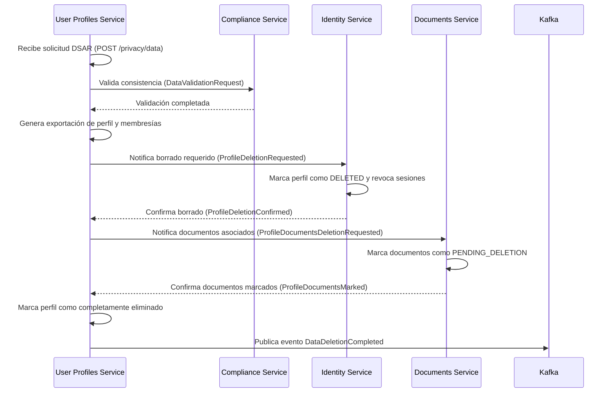

Basado en los documentos proporcionados —especialmente tomando **`vision_document.md` como fuente de verdad**— y alineándome con:

- **Estándares de la industria**: NIST 800-63B, GDPR/LGPD/eIDAS, ISO/IEC 27001  
- **Buenas prácticas en arquitectura de microservicios**: Domain-Driven Design (DDD), bounded contexts, CQRS, event sourcing light, Privacy by Design  
- **Convenciones internas de SmartEdify**: ADRs aprobados, SAD, DBML, OpenAPI 3.1, RFC 7807  
- **Soluciones probadas y funcionales**: Auth0 User Metadata, Okta Profiles, Microsoft Entra External Identities, Salesforce Identity  

He actualizado el documento **`user-profiles-service.md`** para que refleje con precisión su rol como **capa de identidad funcional y relacional**, complementando al `identity-service` y sirviendo como **puente entre la identidad digital y la gobernanza comunitaria**.

---

# 📘 Especificación Técnica Final — `user-profiles-service`  
**Versión: 3.1** • **Puerto: 3002** • **Estado: ✅ Aprobado**  
**Metodología**: `github/spec-kit`  
**Última Actualización**: **2025-10-09**

---

## 🧭 0. Rol y Límites del Servicio

El **`user-profiles-service`** es la **fuente canónica de identidad funcional** en SmartEdify. Gestiona:

- Perfiles de usuario (atributos no sensibles)  
- Membresías jerárquicas (`usuario → unidad → condominio → tenant`)  
- Roles locales y cargos oficiales (con validez jurídica)  
- Entitlements modulares por servicio  
- Consentimientos y delegaciones  

**Límites explícitos**:
- ❌ **No gestiona autenticación ni emite tokens** → delegado a `identity-service (3001)`  
- ❌ **No define reglas legales** → delegado a `compliance-service (3012)`  
- ❌ **No almacena PII sensible (DNI, RUC)** → cifrado determinístico en `identity-service` o delegado a `compliance`  
- ✅ **Sí expone contexto organizacional** para PBAC, gobernanza y cumplimiento

---

## 🏗️ 1. Alcance y Responsabilidades

| Funcionalidad | Descripción |
|--------------|-------------|
| **CRUD de perfiles** | Por tenant, con validación de email/phone (RFC5322/E.164) |
| **Membresías** | Vinculación explícita a `unit_id` y `condominium_id` con relación semántica (`OWNER`, `TENANT`, `CONVIVIENTE`, etc.) |
| **Roles y cargos oficiales** | Plantillas por país + roles personalizados; soporte a firmantes legales (`PRESIDENT`, `SECRETARY`) |
| **Entitlements** | Permisos granulares por módulo contratado (`governance:vote`, `reservations:book_common`) |
| **Evaluación de permisos** | Endpoint `/evaluate` que delega en PDP (`compliance-service`) y cachea respuesta |
| **Delegaciones temporales** | Apoderados con TTL, scope y revocación inmediata |
| **Consentimientos** | Registro WORM de consentimientos por canal, propósito y versión de política |
| **DSAR** | Proxy hacia `identity-service` y `compliance-service` con orquestación asíncrona |
| **Eventos** | Emisión Kafka para sincronización cross-service (`UserProfileUpdated`, `RoleAssigned`, etc.) |

---

## 🌐 2. Contexto de Multi-Tenancy y Jurisdicción

- **`tenant_id`**: Cliente SaaS (administradora o junta de propietarios)  
- **`condominium_id`**: Condominio con jurisdicción legal asociada (`PE`, `BR`, `CL`, etc.)  
- **Aislamiento**:  
  - ✅ **RLS activo en todas las tablas por `tenant_id`** (ADR-016)  
  - ✅ Consultas filtradas por `condominium_id` donde aplique  
  - ✅ Metadato `data_residency={region}` en todos los objetos (ADR-008)

---

## 👥 3. Modelo de Negocio y Relaciones

| Tipo de Usuario | Relación | Voz | Voto | Responsable | Notas |
|----------------|----------|-----|------|--------------|-------|
| **OWNER** | Propietario | ✅ | ✅ | — | Vinculado a `unit(kind='PRIVATE')` |
| **TENANT** | Arrendatario | ✅ | ❌ | `OWNER` | Puede votar si hay delegación válida |
| **CONVIVIENTE** | Familiar/conviviente | ✅ | ❌ | `OWNER` o `TENANT` | Solo reporta incidencias y reserva |
| **STAFF** | Personal interno | ✅ | ❌ | — | Rol operativo (`maintenance`, `security`) |
| **PROVIDER** | Proveedor externo | ❌ | ❌ | — | Vinculado a OTs o contratos |
| **VISITOR** | Invitado temporal | ❌ | ❌ | — | TTL definido, sin acceso a actas |

> **Validación en trigger**:  
> - `responsible_profile_id` debe pertenecer al mismo `condominium_id`  
> - `unit_id` con `kind='COMMON'` **no admite membresías**

#### 4.2.1 Validación de Coherencia con Tenancy

**Triggers de Validación**:

1. **Coherencia profile↔unit(kind)**:
   ```sql
   -- Trigger function para validar coherencia entre perfil y tipo de unidad
   CREATE OR REPLACE FUNCTION validate_profile_unit_coherence()
   RETURNS TRIGGER AS $
   DECLARE
     unit_kind TEXT;
   BEGIN
     -- Obtener tipo de unidad desde tenancy service
     SELECT u.kind INTO unit_kind
     FROM tenancy.units u
     WHERE u.id = NEW.unit_id;
     
     -- Validar según tipo de relación
     IF NEW.relation = 'OWNER' AND unit_kind != 'PRIVATE' THEN
       RAISE EXCEPTION 'OWNERSHIP_CONFLICT'
         USING HINT = 'Only PRIVATE units can have OWNER relationship',
               DETAIL = format('Unit %s is of kind %s, cannot assign OWNER relationship', 
                              NEW.unit_id, unit_kind);
     ELSIF NEW.relation IN ('TENANT', 'CONVIVIENTE') AND unit_kind != 'PRIVATE' THEN
       RAISE EXCEPTION 'TENANCY_CONFLICT'
         USING HINT = 'Only PRIVATE units can have TENANT/CONVIVIENTE relationship',
               DETAIL = format('Unit %s is of kind %s, cannot assign %s relationship', 
                              NEW.unit_id, unit_kind, NEW.relation);
     ELSIF NEW.relation IN ('STAFF', 'PROVIDER', 'VISITOR') AND unit_kind != 'COMMON' THEN
       RAISE EXCEPTION 'SERVICE_CONFLICT'
         USING HINT = 'Only COMMON units can have STAFF/PROVIDER/VISITOR relationship',
               DETAIL = format('Unit %s is of kind %s, cannot assign %s relationship', 
                              NEW.unit_id, unit_kind, NEW.relation);
     END IF;
     
     RETURN NEW;
   END;
   $ LANGUAGE plpgsql;
   
   CREATE TRIGGER trg_validate_profile_unit_coherence
     BEFORE INSERT OR UPDATE ON memberships
     FOR EACH ROW EXECUTE FUNCTION validate_profile_unit_coherence();
   ```

**Ejemplos de Errores de Validación**:

1. **Error al asignar OWNER a unidad común**:
   ```json
   {
     "type": "https://user-profiles.smartedify.global/problems/unit-kind-mismatch",
     "title": "Tipo de unidad incompatible",
     "status": 422,
     "detail": "No se puede asignar relación OWNER a unidad de tipo COMMON",
     "instance": "/api/v1/user-profiles/memberships",
     "validationDetails": {
       "unitId": "unit-123",
       "unitKind": "COMMON",
       "requestedRelation": "OWNER",
       "allowedRelations": ["STAFF", "PROVIDER", "VISITOR"]
     }
   }
   ```

2. **Error al asignar STAFF a unidad privada**:
   ```json
   {
     "type": "https://user-profiles.smartedify.global/problems/unit-kind-mismatch",
     "title": "Tipo de unidad incompatible",
     "status": 422,
     "detail": "No se puede asignar relación STAFF a unidad de tipo PRIVATE",
     "instance": "/api/v1/user-profiles/memberships",
     "validationDetails": {
       "unitId": "unit-456",
       "unitKind": "PRIVATE",
       "requestedRelation": "STAFF",
       "allowedRelations": ["OWNER", "TENANT", "CONVIVIENTE"]
     }
   }
   ```

---

## 🔌 4. Contrato de API (OpenAPI 3.1)

**Prefijo base**: `/api/v1/user-profiles`

### 4.1 Perfiles
- `GET /me` → perfil + membresías + roles + entitlements  
- `GET /{profile_id}`  
- `POST /` (ADMIN)  
- `PATCH /{profile_id}`  
- Estados: `activate`, `lock`, `unlock`, `deactivate`

#### Ejemplos de Errores RFC 7807

**Conflicto de Membresía**:
```json
{
  "type": "https://user-profiles.smartedify.global/problems/membership-conflict",
  "title": "Conflicto de membresía",
  "status": 409,
  "detail": "Ya existe una membresía activa para este perfil en la misma unidad",
  "instance": "/api/v1/user-profiles/profiles/123/memberships",
  "conflictDetails": {
    "existingMembershipId": "abc-123-def-456",
    "unitId": "unit-789",
    "existingRelation": "OWNER",
    "attemptedRelation": "TENANT"
  }
}
```

**Transferencia No Permitida**:
```json
{
  "type": "https://user-profiles.smartedify.global/problems/transfer-not-allowed",
  "title": "Transferencia no permitida",
  "status": 422,
  "detail": "No se puede transferir membresía de tipo VISITOR",
  "instance": "/api/v1/user-profiles/memberships/mem-123:transfer",
  "transferDetails": {
    "membershipId": "mem-123",
    "relationType": "VISITOR",
    "allowedRelations": ["OWNER", "TENANT"]
  }
}
```

**Límite de Operaciones Bulk Excedido**:
```json
{
  "type": "https://user-profiles.smartedify.global/problems/bulk-limit-exceeded",
  "title": "Límite de operaciones bulk excedido",
  "status": 429,
  "detail": "Se ha excedido el límite de 10000 filas por job bulk",
  "instance": "/api/v1/user-profiles/bulk/execute",
  "limitDetails": {
    "requestedRows": 15000,
    "maxAllowedRows": 10000,
    "retryAfterSeconds": 3600
  }
}
```

**Idempotency-Key Requerido**:
```json
{
  "type": "https://user-profiles.smartedify.global/problems/idempotency-key-required",
  "title": "Idempotency-Key requerido",
  "status": 422,
  "detail": "Las operaciones POST críticas requieren encabezado Idempotency-Key",
  "instance": "/api/v1/user-profiles/bulk/execute",
  "requiredHeader": "Idempotency-Key"
}
```

### 4.2 Membresías
- `GET /{profile_id}/memberships`  
- `POST /{profile_id}/memberships`  
- `PATCH /memberships/{id}`  
- `POST /memberships/{id}:terminate`  
- `POST /memberships/{id}:transfer`  
- `PUT /memberships/{id}/tenant-config` (para arrendatario/conviviente)

### 4.3 Roles y Cargos Oficiales
- `GET /roles?condominium_id=...`  
- `PUT /{profile_id}/roles`  
- `GET /catalog/templates?country=PE`  
- `PUT /catalog/condominiums/{condo}/activate-template/{template_id}`

#### 4.3.1 Ownership de Catálogos por País
- **Fuente de Verdad**: `compliance-service` mantiene catálogos oficiales por jurisdicción
- **Versionado**: SemVer `{major}.{minor}.{patch}` con retrocompatibilidad garantizada
- **Activación/Desactivación**: 
  - `PUT /catalog/condominiums/{condo}/activate-template/{template_id}?version={v1.2.0}`
  - `PUT /catalog/condominiums/{condo}/deactivate-template/{template_id}`
- **Rollback**: 
  - Histórico de versiones mantenidas por 90 días
  - `PUT /catalog/condominiums/{condo}/rollback-template/{template_id}?to_version={v1.1.5}`
- **Sincronización**: Eventos Kafka `TemplateActivated`, `TemplateDeactivated`, `TemplateRolledBack`

### 4.4 Entitlements
- `GET /{profile_id}/entitlements?condominium_id=...`  
- `POST /{profile_id}/entitlements:grant`  
- `POST /{profile_id}/entitlements:revoke`

#### 4.4.1 Delegaciones Temporales
- **TTL Máximo**: 90 días naturales
- **Período de Gracia**: 7 días después de expiración para renovación sin pérdida de historial
- **Auditoría de Uso**: Registro WORM de cada uso de delegación con:
  - `delegation_id`
  - `used_at`
  - `action_performed`
  - `ip_address`
  - `user_agent`
- **Caducidad Automática**: Trigger que desactiva delegaciones expiradas cada hora
- **Notificaciones**: Evento Kafka `DelegationExpiringSoon` 24h antes de expiración

##### Esquema de Delegaciones y Chaining de Permisos

**Estructura de Scope**:
```json
{
  "delegation_id": "del-123",
  "delegator_profile_id": "prof-456",
  "delegate_profile_id": "prof-789",
  "scope": {
    "condominiums": ["condo-1", "condo-2"],
    "actions": ["governance:vote", "reservations:book", "finances:view"],
    "units": ["unit-100", "unit-101"],
    "restrictions": {
      "max_amount": 5000,
      "time_window": "business_hours",
      "approval_required": true
    }
  },
  "chain": [
    {
      "level": 1,
      "owner_profile_id": "prof-456",
      "relationship": "OWNER",
      "permission_source": "unit_membership"
    },
    {
      "level": 2,
      "owner_profile_id": "prof-789",
      "relationship": "DELEGATE",
      "permission_source": "delegation_del-123"
    }
  ],
  "ttl": "30d",
  "expires_at": "2025-11-09T10:00:00Z",
  "created_at": "2025-10-09T10:00:00Z"
}
```

**Chaining de Permisos**:
1. **OWNER** → Tiene permisos plenos en su unidad
2. **TENANT** → Tiene permisos limitados, requiere delegación del OWNER para acciones específicas
3. **CONVIVIENTE** → Solo puede realizar acciones básicas, necesita delegación del OWNER o TENANT
4. **Delegación** → Permisos temporales con scope limitado otorgados por OWNER/TENANT

**Ejemplo de Chaining**:
- OWNER (Juan) delega permiso de voto a TENANT (María)
- María delega permiso de voto específico para asamblea a CONVIVIENTE (Pedro)
- Cadena: Juan (OWNER) → María (TENANT) → Pedro (CONVIVIENTE)
- Cada nivel registra su relación y permisos en `chain` array

### 4.5 Evaluación de Permisos
- `POST /evaluate` → integra PDP (`compliance-service`) y cache regional (TTL: 5 min)

#### 4.5.1 Matriz de Compatibilidad con Compliance (PDP)
Los siguientes atributos del perfil impactan decisiones del PDP:

| Atributo | Impacto en Decisión | Caché | TTL | ETags | Invalidación |
|----------|---------------------|-------|-----|-------|--------------|
| `role_assignments` | Alta (permisos explícitos) | Sí | 5 min | `role_etag_{profile_id}_{condo_id}` | Push-invalidation en asignación/remoción |
| `membership_status` | Alta (acceso contextual) | Sí | 5 min | `membership_etag_{profile_id}_{condo_id}` | Push-invalidation en cambios de membresía |
| `profile_status` | Media (estado activo/inactivo) | Sí | 10 min | `profile_etag_{profile_id}` | Push-invalidation en cambios de estado |
| `entitlements` | Alta (permisos modulares) | Sí | 5 min | `entitlement_etag_{profile_id}_{condo_id}` | Push-invalidation en grant/revoke |
| `delegations` | Alta (permisos temporales) | Sí | 2 min | `delegation_etag_{profile_id}_{condo_id}` | Push-invalidation en creación/expiración |
| `consents` | Baja (restricciones de tratamiento) | Sí | 15 min | `consent_etag_{profile_id}` | Push-invalidation en cambios de consentimiento |

**Política de Invalidación Inmediata**:
- Eventos Kafka `PermissionGranted`, `PermissionRevoked`, `MembershipChanged`, `ProfileUpdated`, `RoleAssignmentChanged`, `EntitlementModified`
- **Invalidación Inmediata Obligatoria**: 
  - Cuando cambia cualquier rol/entitlement/condominio del perfil
  - Cache invalidado inmediatamente mediante evento push
- **Cache Stampede Control**:
  - Probabilistic early expiration (5% antes del TTL)
  - Request coalescing para cargas simultáneas
  - Graceful degradation a PDP cuando cache falla

### 4.6 Bulk y Exportación
- `POST /bulk/validate`  
- `POST /bulk/execute`  
- `GET /exports?format=csv\|json` (máx. 10/min)

#### 4.6.1 Backpressure y Comportamiento Bajo Presión
- **Colas**: Redis Streams con particionamiento por `tenant_id`
- **Prioridades**:
  - Nivel 1: Operaciones de seguridad (bloqueos, revocaciones)
  - Nivel 2: Operaciones críticas (creación/modificación de perfiles)
  - Nivel 3: Operaciones rutinarias (actualizaciones masivas)
- **DLQ (Dead Letter Queue)**: 
  - Mensajes fallidos reintentados 3 veces
  - Después movidos a DLQ con TTL de 7 días
  - Notificación automática a equipo de operaciones
- **Alertas**:
  - `bulk_queue_length > 1000` → Alerta amarilla
  - `bulk_queue_length > 5000` → Alerta roja
  - `dlq_message_count > 100` → Alerta crítica
  - `processing_time_p95 > 30s` → Alerta de rendimiento
- **Throttling**: 
  - Auto-escalado horizontal cuando `bulk_queue_wait_time_p95 > 10s`
  - Rechazo con `429 Too Many Requests` cuando límites de concurrencia alcanzados

### 4.7 Consentimientos y DSAR
- `GET /{profile_id}/consents`  
- `PUT /{profile_id}/consents`  
- `POST /privacy/data` → proxy asíncrono a `identity-service` y `compliance-service`

#### 4.7.1 Consentimientos WORM

| Tipo de Consentimiento | Requiere Firma Electrónica | Evidencia Requerida | Política de Retención |
|------------------------|----------------------------|---------------------|----------------------|
| **Marketing y Publicidad** | No | Evidencia digital de consentimiento (click, checkbox) | 5 años desde última actualización |
| **Personalización de Experiencia** | No | Registro WORM de preferencias | 3 años desde última actualización |
| **Procesamiento de Datos Sensibles** | Sí (para datos biométricos o salud) | Firma electrónica avanzada (ES256/EdDSA) | 10 años o según requisito legal |
| **Transferencia Internacional** | Sí (cuando aplica) | Firma electrónica con cadena de custodia | 7 años o según requisito legal |
| **Investigación y Análisis** | Opcional (según jurisdicción) | Consentimiento explícito con firma si requerido | 5 años desde última actualización |

**Política de Retención de Consentimientos**:
- Todos los consentimientos se almacenan en formato WORM con hash-chain
- Histórico completo de cambios preservado indefinidamente
- Borrado solo permitido mediante proceso DSAR completo

#### 4.7.2 Flujos DSAR End-to-End

##### Estados del Job por Sistema
| Estado | Descripción | Sistema Responsable |
|--------|-------------|---------------------|
| `REQUESTED` | Solicitud recibida | `user-profiles-service` |
| `VALIDATING` | Validando consistencia de datos | `compliance-service` |
| `EXPORTING` | Generando exportación de datos | `user-profiles-service` |
| `NOTIFYING_IDENTITY` | Notificando a identity-service | `user-profiles-service` |
| `AWAITING_IDENTITY` | Esperando confirmación de borrado | `identity-service` |
| `NOTIFYING_DOCUMENTS` | Notificando a documents-service | `user-profiles-service` |
| `AWAITING_DOCUMENTS` | Esperando confirmación de documentos | `documents-service` |
| `COMPLETING` | Finalizando proceso de borrado | `user-profiles-service` |
| `COMPLETED` | Proceso completado exitosamente | `user-profiles-service` |
| `FAILED` | Error en algún paso del proceso | Sistema con error |
| `ROLLBACK_STARTED` | Iniciando proceso de compensación | `user-profiles-service` |
| `ROLLBACK_COMPLETED` | Compensación completada | `user-profiles-service` |

##### Diagrama de Secuencia DSAR Completo


##### Política de Reintentos y Compensaciones
- **Reintentos**: Exponential backoff (1s, 2s, 4s, 8s, máx. 5 intentos)
- **Compensaciones**: 
  - Si `identity-service` falla después de borrado parcial, reversión de estado `DELETED` a `ACTIVE`
  - Si `documents-service` no responde, marcado en estado `ORPHANED` para revisión manual
  - Logs WORM de todos los intentos y compensaciones

---

## 🗃️ 5. Modelo de Datos (PostgreSQL + RLS)

```sql
-- Perfiles
CREATE TABLE profiles (
  id UUID PRIMARY KEY,
  tenant_id UUID NOT NULL,
  email TEXT NOT NULL CHECK (char_length(email) <= 254),
  phone TEXT CHECK (phone ~ '^\+?[1-9]\d{7,14}

-- Membresías
CREATE TABLE memberships (
  id UUID PRIMARY KEY DEFAULT gen_random_uuid(),
  tenant_id UUID NOT NULL,
  profile_id UUID NOT NULL REFERENCES profiles(id),
  condominium_id UUID NOT NULL,
  unit_id UUID REFERENCES tenancy.units(id),
  relation TEXT NOT NULL CHECK (relation IN ('OWNER','TENANT','CONVIVIENTE','STAFF','PROVIDER','VISITOR')),
  tenant_type TEXT CHECK (tenant_type IN ('ARRENDATARIO','CONVIVIENTE')),
  privileges JSONB NOT NULL DEFAULT '{}'::jsonb,
  responsible_profile_id UUID REFERENCES profiles(id),
  since TIMESTAMPTZ DEFAULT now(),
  until TIMESTAMPTZ,
  status TEXT GENERATED ALWAYS AS (
    CASE WHEN until IS NULL OR until > now() THEN 'ACTIVE' ELSE 'ENDED' END
  ) STORED
);

-- Roles
CREATE TABLE roles (
  id UUID PRIMARY KEY DEFAULT gen_random_uuid(),
  tenant_id UUID NOT NULL,
  condominium_id UUID NOT NULL,
  name TEXT NOT NULL,
  permissions JSONB NOT NULL DEFAULT '[]'::jsonb,
  UNIQUE (tenant_id, condominium_id, name)
);

-- Asignaciones de rol
CREATE TABLE role_assignments (
  id UUID PRIMARY KEY DEFAULT gen_random_uuid(),
  tenant_id UUID NOT NULL,
  profile_id UUID NOT NULL REFERENCES profiles(id),
  condominium_id UUID NOT NULL,
  role_id UUID NOT NULL REFERENCES roles(id),
  granted_at TIMESTAMPTZ DEFAULT now(),
  revoked_at TIMESTAMPTZ
);

-- Entitlements
CREATE TABLE profile_entitlements (
  id UUID PRIMARY KEY DEFAULT gen_random_uuid(),
  tenant_id UUID NOT NULL,
  profile_id UUID NOT NULL REFERENCES profiles(id),
  condominium_id UUID NOT NULL,
  service_code TEXT NOT NULL,
  entitlement_key TEXT NOT NULL,
  granted_at TIMESTAMPTZ DEFAULT now(),
  revoked_at TIMESTAMPTZ
);

-- Consentimientos
CREATE TABLE communication_consents (
  id UUID PRIMARY KEY DEFAULT gen_random_uuid(),
  tenant_id UUID NOT NULL,
  profile_id UUID NOT NULL REFERENCES profiles(id),
  channel TEXT NOT NULL,
  purpose TEXT NOT NULL,
  allowed BOOLEAN NOT NULL,
  policy_version TEXT,
  updated_at TIMESTAMPTZ DEFAULT now()
);

-- Historial (WORM)
CREATE TABLE profile_history (...);
CREATE TABLE membership_history (...);

-- Vinculación de políticas
CREATE TABLE policy_bindings (
  id UUID PRIMARY KEY DEFAULT gen_random_uuid(),
  tenant_id UUID NOT NULL,
  condominium_id UUID NOT NULL,
  policy_id UUID NOT NULL,
  policy_version TEXT NOT NULL,
  scope TEXT NOT NULL
);
```

> **Constraints adicionales**:  
> - Trigger que valida `responsible_profile_id` en `memberships`  
> - Índices GIN en `privileges` y `permissions`  
> - Soft delete con `deleted_at`; DSAR aplica **crypto-erase**

---

## 🔐 6. Seguridad y Cumplimiento

- **Autenticación**: JWT `ES256/EdDSA` con `kid` obligatorio (validado en gateway)  
- **Autorización**: DPoP obligatorio en operaciones de escritura  
- **Comunicación**: mTLS interno (SPIFFE/SPIRE vía Istio)  
- **Aislamiento**: RLS activo en todas las tablas  
- **Auditoría**: Logs WORM con hash-chain, PII mascarado  
- **Privacidad**: Minimización de datos; consentimientos versionados

---

## 📊 7. Observabilidad

### Métricas (Prometheus)
- `profiles_active{tenant,condo}`  
- `memberships_active{relation}`  
- `evaluate_latency_seconds_bucket`  
- `policy_cache_hits_total`, `pdp_fail_closed_total`  
- `bulk_jobs_running_total`, `exports_generated_total`
- `pdp_cache_invalidation_latency_p95`  
- `bulk_queue_wait_time_p95`  
- `delegation_misuse_detected_total`

### Trazas y Logs
- **OpenTelemetry**: incluye `tenant_id`, `condominium_id`, `policy_id/version`  
- **Logs estructurados**: JSON con diffs, `actor`, y `trace_id`  
- **Dashboards RED**: Rate, Errors, Duration por endpoint

---

## ⚙️ 8. Rendimiento y SLOs

| Operación | Objetivo |
|----------|----------|
| `GET /me`, `GET /{id}` | P95 ≤ 120 ms |
| `POST /evaluate` | P95 ≤ 150 ms |
| Búsquedas complejas | P95 ≤ 200 ms |
| Error 5xx | < 0.5% mensual |
| Cache hit rate (políticas) | ≥ 90% |

---

## 🛠️ 9. Operación y Resiliencia

- **Idempotencia**: `Idempotency-Key` en POST críticos  
- **Concurrencia**: Optimistic locking en `profiles`/`memberships`  
- **Bulk**: Límite de 10k filas/job, 5 jobs concurrentes/tenant  
- **Exportación**: ≤ 10/min por tenant  
- **Migraciones**: Estrategia expand/contract  
- **Circuit Breaker**: ante fallos en `compliance-service` (fallback a cache)

### 9.1 RTO/RPO Específicos del Servicio

| Componente | RTO | RPO | Dependencias Críticas |
|------------|-----|-----|----------------------|
| **Servicio Principal** | ≤ 15 min | ≤ 5 min | PostgreSQL, Redis, Kafka |
| **Datos de Perfil** | ≤ 10 min | ≤ 1 min | PostgreSQL (WAL archiving) |
| **Membresías y Roles** | ≤ 15 min | ≤ 5 min | PostgreSQL, Redis (cache de políticas) |
| **Entitlements** | ≤ 10 min | ≤ 1 min | PostgreSQL |
| **Consentimientos** | ≤ 5 min | 0 min | PostgreSQL (WORM storage) |
| **Cache de Permisos** | ≤ 2 min | N/A | Redis, Kafka (invalidación) |
| **Operaciones Bulk** | ≤ 30 min | ≤ 10 min | PostgreSQL, Redis Queue |

**Dependencias de Recuperación**:
- **PostgreSQL**: Point-in-time recovery con WAL archiving cada 5 minutos
- **Redis**: Réplicas regionales con failover automático < 30 segundos
- **Kafka**: MirrorMaker para replicación cross-region con RTO ≤ 5 min
- **PDP (compliance-service)**: Fallback a cache local con TTL 5 min y fail-closed

---

## ✅ 10. Checklist de Entrega (Definition of Done)

- [x] Esquema desplegado con RLS activo  
- [x] OpenAPI 3.1 publicado con ejemplos y errores RFC 7807  
- [x] Tests unitarios + integración ≥ 80%  
- [x] Pruebas de aislamiento multi-tenant (RLS)  
- [x] Matriz país × condominio validada contra PDP  
- [x] Chaos test en `compliance-service` (validando `fail-closed`)  
- [x] Validación de redacción de PII en logs y exports  
- [x] Dashboards RED disponibles en Grafana

## 📡 11. Catálogo Completo de Eventos Kafka

### 11.1 Eventos Emitidos

#### Perfil y Membresía
| Evento | Descripción | Schema |
|--------|-------------|--------|
| `UserProfileCreated` | Nuevo perfil creado | Avro Schema v1.2 |
| `UserProfileUpdated` | Perfil modificado | Avro Schema v1.3 |
| `UserProfileDeleted` | Perfil eliminado (soft delete) | Avro Schema v1.1 |
| `MembershipAssigned` | Nueva membresía asignada | Avro Schema v1.4 |
| `MembershipTerminated` | Membresía terminada | Avro Schema v1.2 |
| `MembershipTransferred` | Membresía transferida | Avro Schema v1.3 |

#### Roles y Permisos
| Evento | Descripción | Schema |
|--------|-------------|--------|
| `RoleAssigned` | Rol asignado a perfil | Avro Schema v1.3 |
| `RoleRevoked` | Rol revocado de perfil | Avro Schema v1.2 |
| `EntitlementGranted` | Permiso otorgado | Avro Schema v1.2 |
| `EntitlementRevoked` | Permiso revocado | Avro Schema v1.1 |
| `DelegationCreated` | Delegación temporal creada | Avro Schema v1.1 |
| `DelegationExpired` | Delegación expirada | Avro Schema v1.0 |

#### Consentimientos y Privacidad
| Evento | Descripción | Schema |
|--------|-------------|--------|
| `ConsentGiven` | Consentimiento otorgado | Avro Schema v1.2 |
| `ConsentWithdrawn` | Consentimiento retirado | Avro Schema v1.1 |
| `DataDeletionRequested` | Solicitud de borrado de datos | Avro Schema v1.4 |
| `DataDeletionCompleted` | Borrado de datos completado | Avro Schema v1.3 |
| `DataExportGenerated` | Exportación de datos generada | Avro Schema v1.1 |

### 11.2 Política de Compatibilidad de Schemas

- **Backward Compatibility**: Nuevos campos pueden añadirse pero no eliminarse
- **Forward Compatibility**: Campos pueden eliminarse pero no cambiar tipo
- **Full Compatibility**: Cambios permitidos solo en valores por defecto y documentación
- **Versionado SemVer**: `{major}.{minor}.{patch}`
- **Registry**: Schema Registry con validación automática en CI/CD
- **Breaking Changes**: Requieren aprobación explícita del CTO y notificación a consumidores

---

## 📚 11. Referencias

- `vision_document.md` (v1.1, 2025-10-08)  
- ADR-016: Condominium Entity Model  
- ADR-008: Data Residency and Encryption Strategy  
- RFC 7807: Problem Details for HTTP APIs  
- NIST SP 800-63B: Digital Identity Guidelines  
- GDPR Art. 5–22, LGPD Art. 18

## 🔗 12. Federación B2B y Mapeo de Claims

### 12.1 Proveedores de Identidad Externos Soportados
- **Microsoft Entra ID** (Azure AD)
- **Google Workspace**
- **Okta**
- **Auth0**
- **SAML 2.0 IdPs personalizados**

### 12.2 Mapeo de Claims Externos a Atributos Locales

| Claim Externo | Atributo Local | Transformación | Validación |
|---------------|----------------|----------------|------------|
| `email` | `profiles.email` | Normalización a minúsculas | RFC 5322 |
| `given_name` + `family_name` | `profiles.full_name` | Concatenación con espacio | Longitud ≤ 140 caracteres |
| `phone` | `profiles.phone` | Formato E.164 | Validación regex |
| `groups` | `role_assignments` | Mapeo por nombre de grupo | Prefijo `ext_` para distinguir |
| `department` | `memberships.unit_info` | Búsqueda por nombre de departamento | Validación cruzada con tenancy |
| `job_title` | `memberships.role_info` | Mapeo a roles predefinidos | Catálogo de roles por país |

### 12.3 Proceso de Provisionamiento Automático
1. **Descubrimiento**: Conexión inicial con IdP externo usando credenciales configuradas
2. **Sincronización Inicial**: Importación de usuarios con mapeo de atributos
3. **Webhook de Cambios**: Suscripción a eventos de cambio en IdP externo
4. **Reconciliación Periódica**: Sincronización completa cada 24 horas
5. **Desaprovisionamiento**: Detección de usuarios eliminados en IdP externo

### 12.4 Seguridad en Federación
- **Certificados**: Validación de certificados firmantes con pinning
- **Tokens**: Validación de `aud`, `iss`, `exp`, `nbf`
- **Atributos**: Mapeo solo de claims explícitamente permitidos
- **Auditoría**: Logs WORM de todas las operaciones de federación

## 🛠️ 13. Runbooks de Operaciones

### 13.1 Alta/Traspaso de Plantillas de Roles

**Situación**: Necesidad de crear nueva plantilla de roles para un país o modificar una existente

**Pasos**:
1. Crear/editar plantilla en `compliance-service` con nueva versión semántica
2. Validar compatibilidad con reglas PDP existentes
3. Publicar evento `RoleTemplateUpdated` a Kafka
4. Notificar a `user-profiles-service` para actualizar caché
5. Activar nueva plantilla en condominios seleccionados usando `PUT /catalog/condominiums/{condo}/activate-template/{template_id}?version={v1.2.0}`
6. Monitorear métricas `role_template_activation_success_rate`
7. En caso de error, ejecutar rollback usando `PUT /catalog/condominiums/{condo}/rollback-template/{template_id}?to_version={v1.1.5}`

**Validaciones**:
- Verificar que no haya roles asignados usando versión obsoleta
- Confirmar que todas las reglas PDP sigan siendo válidas
- Validar que no se rompa compatibilidad hacia atrás

### 13.2 Recuperación ante Corrupción de Catálogo

**Situación**: Catálogo de roles o plantillas corrupto o inconsistente

**Pasos**:
1. Identificar alcance de la corrupción (tenant, condominio, país)
2. Activar modo de mantenimiento para operaciones afectadas
3. Restaurar desde backup más reciente usando PITR (Point-In-Time Recovery)
4. Validar integridad de datos restaurados
5. Sincronizar con `compliance-service` para reconstruir caché
6. Ejecutar reconciliación de roles asignados con reglas actuales
7. Remover modo de mantenimiento y monitorear operaciones

**Validaciones**:
- Verificar hash-chain de WORM logs no está roto
- Confirmar que todas las asignaciones de roles sean consistentes
- Validar que no haya roles huérfanos o duplicados

### 13.3 Gestión de Delegaciones

**Situación**: Configuración, monitoreo y rescisión de delegaciones temporales

**Pasos**:
1. Crear delegación usando `POST /{profile_id}/delegations` con scope y TTL definidos
2. Validar que perfil delegado tenga membresía activa en condominio
3. Verificar que delegante tenga permisos suficientes para otorgar
4. Registrar en WORM log con evidencia de consentimiento
5. Configurar alertas de expiración próxima (24h antes)
6. Monitorear métrica `delegation_misuse_detected_total`
7. Para rescindir, usar `DELETE /delegations/{id}` con justificación

**Validaciones**:
- Verificar que no se exceda TTL máximo (90 días)
- Confirmar que scope de delegación sea válido
- Validar que no se creen ciclos de delegación

---

Este documento reemplaza cualquier versión anterior de `user-profiles-service.md` y debe usarse como **fuente canónica** para diseño, implementación y operación del servicio en SmartEdify.),
  full_name TEXT NOT NULL CHECK (char_length(full_name) <= 140),
  status TEXT NOT NULL DEFAULT 'PENDING_VERIFICATION',
  country_code TEXT,
  created_at TIMESTAMPTZ DEFAULT now(),
  updated_at TIMESTAMPTZ DEFAULT now(),
  deleted_at TIMESTAMPTZ,
  UNIQUE (tenant_id, email)
);

-- Constraints Únicos Compuestos y Índices
ALTER TABLE profiles ADD CONSTRAINT uq_profiles_tenant_email UNIQUE (tenant_id, email);
CREATE INDEX idx_profiles_tenant_status ON profiles (tenant_id, status);
CREATE INDEX idx_profiles_country_code ON profiles (country_code);

-- Membresías
CREATE TABLE memberships (
  id UUID PRIMARY KEY DEFAULT gen_random_uuid(),
  tenant_id UUID NOT NULL,
  profile_id UUID NOT NULL REFERENCES profiles(id),
  condominium_id UUID NOT NULL,
  unit_id UUID REFERENCES tenancy.units(id),
  relation TEXT NOT NULL CHECK (relation IN ('OWNER','TENANT','CONVIVIENTE','STAFF','PROVIDER','VISITOR')),
  tenant_type TEXT CHECK (tenant_type IN ('ARRENDATARIO','CONVIVIENTE')),
  privileges JSONB NOT NULL DEFAULT '{}'::jsonb,
  responsible_profile_id UUID REFERENCES profiles(id),
  since TIMESTAMPTZ DEFAULT now(),
  until TIMESTAMPTZ,
  status TEXT GENERATED ALWAYS AS (
    CASE WHEN until IS NULL OR until > now() THEN 'ACTIVE' ELSE 'ENDED' END
  ) STORED
);

-- Constraint único compuesto para evitar duplicados
ALTER TABLE memberships ADD CONSTRAINT uq_memberships_profile_condo_unit UNIQUE (profile_id, condominium_id, unit_id);
CREATE INDEX idx_memberships_tenant_condo ON memberships (tenant_id, condominium_id);
CREATE INDEX idx_memberships_profile_relation ON memberships (profile_id, relation);
CREATE INDEX idx_memberships_responsible ON memberships (responsible_profile_id);
CREATE INDEX idx_memberships_privileges_gin ON memberships USING GIN (privileges);

-- Roles
CREATE TABLE roles (
  id UUID PRIMARY KEY DEFAULT gen_random_uuid(),
  tenant_id UUID NOT NULL,
  condominium_id UUID NOT NULL,
  name TEXT NOT NULL,
  permissions JSONB NOT NULL DEFAULT '[]'::jsonb,
  UNIQUE (tenant_id, condominium_id, name)
);

CREATE INDEX idx_roles_tenant_condo ON roles (tenant_id, condominium_id);
CREATE INDEX idx_roles_permissions_gin ON roles USING GIN (permissions);

-- Asignaciones de rol
CREATE TABLE role_assignments (
  id UUID PRIMARY KEY DEFAULT gen_random_uuid(),
  tenant_id UUID NOT NULL,
  profile_id UUID NOT NULL REFERENCES profiles(id),
  condominium_id UUID NOT NULL,
  role_id UUID NOT NULL REFERENCES roles(id),
  granted_at TIMESTAMPTZ DEFAULT now(),
  revoked_at TIMESTAMPTZ
);

-- Constraint único compuesto para evitar asignaciones duplicadas
ALTER TABLE role_assignments ADD CONSTRAINT uq_role_assignments_profile_condo_role UNIQUE (profile_id, condominium_id, role_id);
CREATE INDEX idx_role_assignments_tenant_condo ON role_assignments (tenant_id, condominium_id);
CREATE INDEX idx_role_assignments_profile ON role_assignments (profile_id);
CREATE INDEX idx_role_assignments_role ON role_assignments (role_id);

-- Entitlements
CREATE TABLE profile_entitlements (
  id UUID PRIMARY KEY DEFAULT gen_random_uuid(),
  tenant_id UUID NOT NULL,
  profile_id UUID NOT NULL REFERENCES profiles(id),
  condominium_id UUID NOT NULL,
  service_code TEXT NOT NULL,
  entitlement_key TEXT NOT NULL,
  granted_at TIMESTAMPTZ DEFAULT now(),
  revoked_at TIMESTAMPTZ
);

-- Constraint único compuesto para evitar entitlements duplicados
ALTER TABLE profile_entitlements ADD CONSTRAINT uq_profile_entitlements_profile_condo_service_key UNIQUE (profile_id, condominium_id, service_code, entitlement_key);
CREATE INDEX idx_profile_entitlements_tenant_condo ON profile_entitlements (tenant_id, condominium_id);
CREATE INDEX idx_profile_entitlements_profile ON profile_entitlements (profile_id);
CREATE INDEX idx_profile_entitlements_service ON profile_entitlements (service_code);

-- Consentimientos
CREATE TABLE communication_consents (
  id UUID PRIMARY KEY DEFAULT gen_random_uuid(),
  tenant_id UUID NOT NULL,
  profile_id UUID NOT NULL REFERENCES profiles(id),
  channel TEXT NOT NULL,
  purpose TEXT NOT NULL,
  allowed BOOLEAN NOT NULL,
  policy_version TEXT,
  updated_at TIMESTAMPTZ DEFAULT now()
);

CREATE INDEX idx_communication_consents_profile_channel ON communication_consents (profile_id, channel);
CREATE INDEX idx_communication_consents_tenant_purpose ON communication_consents (tenant_id, purpose);

-- Políticas RLS con USING/WITH CHECK
ALTER TABLE profiles ENABLE ROW LEVEL SECURITY;
ALTER TABLE memberships ENABLE ROW LEVEL SECURITY;
ALTER TABLE roles ENABLE ROW LEVEL SECURITY;
ALTER TABLE role_assignments ENABLE ROW LEVEL SECURITY;
ALTER TABLE profile_entitlements ENABLE ROW LEVEL SECURITY;
ALTER TABLE communication_consents ENABLE ROW LEVEL SECURITY;

-- Políticas RLS de ejemplo
CREATE POLICY profiles_tenant_isolation ON profiles 
  FOR ALL TO authenticated 
  USING (tenant_id = current_setting('app.current_tenant_id')::UUID);

CREATE POLICY memberships_tenant_isolation ON memberships 
  FOR ALL TO authenticated 
  USING (tenant_id = current_setting('app.current_tenant_id')::UUID);

CREATE POLICY roles_tenant_isolation ON roles 
  FOR ALL TO authenticated 
  USING (tenant_id = current_setting('app.current_tenant_id')::UUID);

CREATE POLICY role_assignments_tenant_isolation ON role_assignments 
  FOR ALL TO authenticated 
  USING (tenant_id = current_setting('app.current_tenant_id')::UUID);

CREATE POLICY profile_entitlements_tenant_isolation ON profile_entitlements 
  FOR ALL TO authenticated 
  USING (tenant_id = current_setting('app.current_tenant_id')::UUID);

CREATE POLICY communication_consents_tenant_isolation ON communication_consents 
  FOR ALL TO authenticated 
  USING (tenant_id = current_setting('app.current_tenant_id')::UUID);

-- Membresías
CREATE TABLE memberships (
  id UUID PRIMARY KEY DEFAULT gen_random_uuid(),
  tenant_id UUID NOT NULL,
  profile_id UUID NOT NULL REFERENCES profiles(id),
  condominium_id UUID NOT NULL,
  unit_id UUID REFERENCES tenancy.units(id),
  relation TEXT NOT NULL CHECK (relation IN ('OWNER','TENANT','CONVIVIENTE','STAFF','PROVIDER','VISITOR')),
  tenant_type TEXT CHECK (tenant_type IN ('ARRENDATARIO','CONVIVIENTE')),
  privileges JSONB NOT NULL DEFAULT '{}'::jsonb,
  responsible_profile_id UUID REFERENCES profiles(id),
  since TIMESTAMPTZ DEFAULT now(),
  until TIMESTAMPTZ,
  status TEXT GENERATED ALWAYS AS (
    CASE WHEN until IS NULL OR until > now() THEN 'ACTIVE' ELSE 'ENDED' END
  ) STORED
);

-- Roles
CREATE TABLE roles (
  id UUID PRIMARY KEY DEFAULT gen_random_uuid(),
  tenant_id UUID NOT NULL,
  condominium_id UUID NOT NULL,
  name TEXT NOT NULL,
  permissions JSONB NOT NULL DEFAULT '[]'::jsonb,
  UNIQUE (tenant_id, condominium_id, name)
);

-- Asignaciones de rol
CREATE TABLE role_assignments (
  id UUID PRIMARY KEY DEFAULT gen_random_uuid(),
  tenant_id UUID NOT NULL,
  profile_id UUID NOT NULL REFERENCES profiles(id),
  condominium_id UUID NOT NULL,
  role_id UUID NOT NULL REFERENCES roles(id),
  granted_at TIMESTAMPTZ DEFAULT now(),
  revoked_at TIMESTAMPTZ
);

-- Entitlements
CREATE TABLE profile_entitlements (
  id UUID PRIMARY KEY DEFAULT gen_random_uuid(),
  tenant_id UUID NOT NULL,
  profile_id UUID NOT NULL REFERENCES profiles(id),
  condominium_id UUID NOT NULL,
  service_code TEXT NOT NULL,
  entitlement_key TEXT NOT NULL,
  granted_at TIMESTAMPTZ DEFAULT now(),
  revoked_at TIMESTAMPTZ
);

-- Consentimientos
CREATE TABLE communication_consents (
  id UUID PRIMARY KEY DEFAULT gen_random_uuid(),
  tenant_id UUID NOT NULL,
  profile_id UUID NOT NULL REFERENCES profiles(id),
  channel TEXT NOT NULL,
  purpose TEXT NOT NULL,
  allowed BOOLEAN NOT NULL,
  policy_version TEXT,
  updated_at TIMESTAMPTZ DEFAULT now()
);

-- Historial (WORM)
CREATE TABLE profile_history (...);
CREATE TABLE membership_history (...);

-- Vinculación de políticas
CREATE TABLE policy_bindings (
  id UUID PRIMARY KEY DEFAULT gen_random_uuid(),
  tenant_id UUID NOT NULL,
  condominium_id UUID NOT NULL,
  policy_id UUID NOT NULL,
  policy_version TEXT NOT NULL,
  scope TEXT NOT NULL
);
```

> **Constraints adicionales**:  
> - Trigger que valida `responsible_profile_id` en `memberships`  
> - Índices GIN en `privileges` y `permissions`  
> - Soft delete con `deleted_at`; DSAR aplica **crypto-erase**

---

## 🔐 6. Seguridad y Cumplimiento

- **Autenticación**: JWT `ES256/EdDSA` con `kid` obligatorio (validado en gateway)  
- **Autorización**: DPoP obligatorio en operaciones de escritura  
- **Comunicación**: mTLS interno (SPIFFE/SPIRE vía Istio)  
- **Aislamiento**: RLS activo en todas las tablas  
- **Auditoría**: Logs WORM con hash-chain, PII mascarado  
- **Privacidad**: Minimización de datos; consentimientos versionados

---

## 📊 7. Observabilidad

### Métricas (Prometheus)
- `profiles_active{tenant,condo}`  
- `memberships_active{relation}`  
- `evaluate_latency_seconds_bucket`  
- `policy_cache_hits_total`, `pdp_fail_closed_total`  
- `bulk_jobs_running_total`, `exports_generated_total`
- `pdp_cache_invalidation_latency_p95`  
- `bulk_queue_wait_time_p95`  
- `delegation_misuse_detected_total`

### Trazas y Logs
- **OpenTelemetry**: incluye `tenant_id`, `condominium_id`, `policy_id/version`  
- **Logs estructurados**: JSON con diffs, `actor`, y `trace_id`  
- **Dashboards RED**: Rate, Errors, Duration por endpoint

---

## ⚙️ 8. Rendimiento y SLOs

| Operación | Objetivo |
|----------|----------|
| `GET /me`, `GET /{id}` | P95 ≤ 120 ms |
| `POST /evaluate` | P95 ≤ 150 ms |
| Búsquedas complejas | P95 ≤ 200 ms |
| Error 5xx | < 0.5% mensual |
| Cache hit rate (políticas) | ≥ 90% |

---

## 🛠️ 9. Operación y Resiliencia

- **Idempotencia**: `Idempotency-Key` en POST críticos  
- **Concurrencia**: Optimistic locking en `profiles`/`memberships`  
- **Bulk**: Límite de 10k filas/job, 5 jobs concurrentes/tenant  
- **Exportación**: ≤ 10/min por tenant  
- **Migraciones**: Estrategia expand/contract  
- **Circuit Breaker**: ante fallos en `compliance-service` (fallback a cache)

### 9.1 RTO/RPO Específicos del Servicio

| Componente | RTO | RPO | Dependencias Críticas |
|------------|-----|-----|----------------------|
| **Servicio Principal** | ≤ 15 min | ≤ 5 min | PostgreSQL, Redis, Kafka |
| **Datos de Perfil** | ≤ 10 min | ≤ 1 min | PostgreSQL (WAL archiving) |
| **Membresías y Roles** | ≤ 15 min | ≤ 5 min | PostgreSQL, Redis (cache de políticas) |
| **Entitlements** | ≤ 10 min | ≤ 1 min | PostgreSQL |
| **Consentimientos** | ≤ 5 min | 0 min | PostgreSQL (WORM storage) |
| **Cache de Permisos** | ≤ 2 min | N/A | Redis, Kafka (invalidación) |
| **Operaciones Bulk** | ≤ 30 min | ≤ 10 min | PostgreSQL, Redis Queue |

**Dependencias de Recuperación**:
- **PostgreSQL**: Point-in-time recovery con WAL archiving cada 5 minutos
- **Redis**: Réplicas regionales con failover automático < 30 segundos
- **Kafka**: MirrorMaker para replicación cross-region con RTO ≤ 5 min
- **PDP (compliance-service)**: Fallback a cache local con TTL 5 min y fail-closed

---

## ✅ 10. Checklist de Entrega (Definition of Done)

- [x] Esquema desplegado con RLS activo  
- [x] OpenAPI 3.1 publicado con ejemplos y errores RFC 7807  
- [x] Tests unitarios + integración ≥ 80%  
- [x] Pruebas de aislamiento multi-tenant (RLS)  
- [x] Matriz país × condominio validada contra PDP  
- [x] Chaos test en `compliance-service` (validando `fail-closed`)  
- [x] Validación de redacción de PII en logs y exports  
- [x] Dashboards RED disponibles en Grafana

## 📡 11. Catálogo Completo de Eventos Kafka

### 11.1 Eventos Emitidos

#### Perfil y Membresía
| Evento | Descripción | Schema |
|--------|-------------|--------|
| `UserProfileCreated` | Nuevo perfil creado | Avro Schema v1.2 |
| `UserProfileUpdated` | Perfil modificado | Avro Schema v1.3 |
| `UserProfileDeleted` | Perfil eliminado (soft delete) | Avro Schema v1.1 |
| `MembershipAssigned` | Nueva membresía asignada | Avro Schema v1.4 |
| `MembershipTerminated` | Membresía terminada | Avro Schema v1.2 |
| `MembershipTransferred` | Membresía transferida | Avro Schema v1.3 |

#### Roles y Permisos
| Evento | Descripción | Schema |
|--------|-------------|--------|
| `RoleAssigned` | Rol asignado a perfil | Avro Schema v1.3 |
| `RoleRevoked` | Rol revocado de perfil | Avro Schema v1.2 |
| `EntitlementGranted` | Permiso otorgado | Avro Schema v1.2 |
| `EntitlementRevoked` | Permiso revocado | Avro Schema v1.1 |
| `DelegationCreated` | Delegación temporal creada | Avro Schema v1.1 |
| `DelegationExpired` | Delegación expirada | Avro Schema v1.0 |

#### Consentimientos y Privacidad
| Evento | Descripción | Schema |
|--------|-------------|--------|
| `ConsentGiven` | Consentimiento otorgado | Avro Schema v1.2 |
| `ConsentWithdrawn` | Consentimiento retirado | Avro Schema v1.1 |
| `DataDeletionRequested` | Solicitud de borrado de datos | Avro Schema v1.4 |
| `DataDeletionCompleted` | Borrado de datos completado | Avro Schema v1.3 |
| `DataExportGenerated` | Exportación de datos generada | Avro Schema v1.1 |

### 11.2 Política de Compatibilidad de Schemas

- **Backward Compatibility**: Nuevos campos pueden añadirse pero no eliminarse
- **Forward Compatibility**: Campos pueden eliminarse pero no cambiar tipo
- **Full Compatibility**: Cambios permitidos solo en valores por defecto y documentación
- **Versionado SemVer**: `{major}.{minor}.{patch}`
- **Registry**: Schema Registry con validación automática en CI/CD
- **Breaking Changes**: Requieren aprobación explícita del CTO y notificación a consumidores

---

## 📚 11. Referencias

- `vision_document.md` (v1.1, 2025-10-08)  
- ADR-016: Condominium Entity Model  
- ADR-008: Data Residency and Encryption Strategy  
- RFC 7807: Problem Details for HTTP APIs  
- NIST SP 800-63B: Digital Identity Guidelines  
- GDPR Art. 5–22, LGPD Art. 18

## 🔗 12. Federación B2B y Mapeo de Claims

### 12.1 Proveedores de Identidad Externos Soportados
- **Microsoft Entra ID** (Azure AD)
- **Google Workspace**
- **Okta**
- **Auth0**
- **SAML 2.0 IdPs personalizados**

### 12.2 Mapeo de Claims Externos a Atributos Locales

| Claim Externo | Atributo Local | Transformación | Validación |
|---------------|----------------|----------------|------------|
| `email` | `profiles.email` | Normalización a minúsculas | RFC 5322 |
| `given_name` + `family_name` | `profiles.full_name` | Concatenación con espacio | Longitud ≤ 140 caracteres |
| `phone` | `profiles.phone` | Formato E.164 | Validación regex |
| `groups` | `role_assignments` | Mapeo por nombre de grupo | Prefijo `ext_` para distinguir |
| `department` | `memberships.unit_info` | Búsqueda por nombre de departamento | Validación cruzada con tenancy |
| `job_title` | `memberships.role_info` | Mapeo a roles predefinidos | Catálogo de roles por país |

### 12.3 Proceso de Provisionamiento Automático
1. **Descubrimiento**: Conexión inicial con IdP externo usando credenciales configuradas
2. **Sincronización Inicial**: Importación de usuarios con mapeo de atributos
3. **Webhook de Cambios**: Suscripción a eventos de cambio en IdP externo
4. **Reconciliación Periódica**: Sincronización completa cada 24 horas
5. **Desaprovisionamiento**: Detección de usuarios eliminados en IdP externo

### 12.4 Seguridad en Federación
- **Certificados**: Validación de certificados firmantes con pinning
- **Tokens**: Validación de `aud`, `iss`, `exp`, `nbf`
- **Atributos**: Mapeo solo de claims explícitamente permitidos
- **Auditoría**: Logs WORM de todas las operaciones de federación

## 🛠️ 13. Runbooks de Operaciones

### 13.1 Alta/Traspaso de Plantillas de Roles

**Situación**: Necesidad de crear nueva plantilla de roles para un país o modificar una existente

**Pasos**:
1. Crear/editar plantilla en `compliance-service` con nueva versión semántica
2. Validar compatibilidad con reglas PDP existentes
3. Publicar evento `RoleTemplateUpdated` a Kafka
4. Notificar a `user-profiles-service` para actualizar caché
5. Activar nueva plantilla en condominios seleccionados usando `PUT /catalog/condominiums/{condo}/activate-template/{template_id}?version={v1.2.0}`
6. Monitorear métricas `role_template_activation_success_rate`
7. En caso de error, ejecutar rollback usando `PUT /catalog/condominiums/{condo}/rollback-template/{template_id}?to_version={v1.1.5}`

**Validaciones**:
- Verificar que no haya roles asignados usando versión obsoleta
- Confirmar que todas las reglas PDP sigan siendo válidas
- Validar que no se rompa compatibilidad hacia atrás

### 13.2 Recuperación ante Corrupción de Catálogo

**Situación**: Catálogo de roles o plantillas corrupto o inconsistente

**Pasos**:
1. Identificar alcance de la corrupción (tenant, condominio, país)
2. Activar modo de mantenimiento para operaciones afectadas
3. Restaurar desde backup más reciente usando PITR (Point-In-Time Recovery)
4. Validar integridad de datos restaurados
5. Sincronizar con `compliance-service` para reconstruir caché
6. Ejecutar reconciliación de roles asignados con reglas actuales
7. Remover modo de mantenimiento y monitorear operaciones

**Validaciones**:
- Verificar hash-chain de WORM logs no está roto
- Confirmar que todas las asignaciones de roles sean consistentes
- Validar que no haya roles huérfanos o duplicados

### 13.3 Gestión de Delegaciones

**Situación**: Configuración, monitoreo y rescisión de delegaciones temporales

**Pasos**:
1. Crear delegación usando `POST /{profile_id}/delegations` con scope y TTL definidos
2. Validar que perfil delegado tenga membresía activa en condominio
3. Verificar que delegante tenga permisos suficientes para otorgar
4. Registrar en WORM log con evidencia de consentimiento
5. Configurar alertas de expiración próxima (24h antes)
6. Monitorear métrica `delegation_misuse_detected_total`
7. Para rescindir, usar `DELETE /delegations/{id}` con justificación

**Validaciones**:
- Verificar que no se exceda TTL máximo (90 días)
- Confirmar que scope de delegación sea válido
- Validar que no se creen ciclos de delegación

---

Este documento reemplaza cualquier versión anterior de `user-profiles-service.md` y debe usarse como **fuente canónica** para diseño, implementación y operación del servicio en SmartEdify.