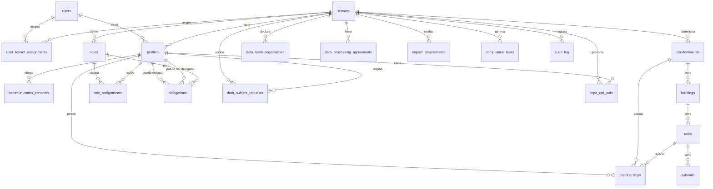

# **Diagrama Entidad-Relación (DER) — SmartEdify Fase 1**

## **1. Introducción**

Este DER describe la estructura lógica y relacional de la base de datos para la Fase 1 de SmartEdify. Su propósito es asegurar **integridad de datos**, **aislamiento multi-tenant** y **cumplimiento normativo** desde la raíz del modelo.

---

## **2. Entidades Principales y Relaciones**

### **A. Identidad y Tenancy**

* **users**

  * *PK*: id (UUID)
  * email (único)
  * global_status → status_t
  * 1 usuario → N asignaciones a tenants (`user_tenant_assignments`)

* **tenants**

  * *PK*: id (UUID)
  * status → status_t
  * 1 tenant → N condominiums
  * 1 tenant → N users (a través de user_tenant_assignments)

* **user_tenant_assignments**

  * *PK*: id (UUID)
  * user_id → users
  * tenant_id → tenants
  * status → status_t
  * Relación N:M (usuarios pueden pertenecer a varios tenants y viceversa)

* **sessions**

  * *PK*: id (UUID)
  * user_id → users
  * tenant_id → tenants
  * Relación 1:N (usuario puede tener muchas sesiones por tenant)
  * 1 session → N refresh_tokens

* **refresh_tokens**

  * *PK*: id (UUID)
  * session_id → sessions

---

### **B. Perfiles y Consentimientos**

* **profiles**

  * *PK*: id (UUID)
  * user_id → users
  * tenant_id → tenants
  * status → status_t
  * country_code → country_code_t
  * Relación 1:1 (cada user_id por tenant_id es único; enforced en lógica de negocio)
  * 1 profile → N communication_consents
  * 1 profile → N memberships

* **communication_consents**

  * *PK*: id (UUID)
  * profile_id → profiles

---

### **C. Estructura Organizacional**

* **condominiums**

  * *PK*: id (UUID)
  * tenant_id → tenants
  * status → status_t
  * 1 condominium → N buildings

* **buildings**

  * *PK*: id (UUID)
  * condominium_id → condominiums
  * status → status_t
  * 1 building → N units

* **units**

  * *PK*: id (UUID)
  * building_id → buildings
  * status → status_t
  * 1 unit → N subunits

* **subunits**

  * *PK*: id (UUID)
  * unit_id → units
  * status → status_t

---

### **D. Roles, Membresías y Delegaciones**

* **roles**

  * *PK*: id (UUID)
  * tenant_id → tenants
  * 1 role → N role_assignments

* **memberships**

  * *PK*: id (UUID)
  * tenant_id → tenants
  * profile_id → profiles
  * condominium_id → condominiums
  * unit_id → units (opcional)
  * responsible_profile_id → profiles (opcional)
  * status → status_t

* **role_assignments**

  * *PK*: id (UUID)
  * profile_id → profiles
  * role_id → roles
  * status → status_t

* **delegations**

  * *PK*: id (UUID)
  * delegator_profile_id → profiles
  * delegate_profile_id → profiles
  * role_id → roles
  * status → status_t

---

### **E. Compliance**

* **data_subject_requests**

  * *PK*: id (UUID)
  * tenant_id → tenants
  * profile_id → profiles
  * request_type → request_type_t
  * status → status_t

* **data_bank_registrations**

  * *PK*: id (UUID)
  * tenant_id → tenants
  * status → status_t

* **data_processing_agreements**

  * *PK*: id (UUID)
  * tenant_id → tenants
  * status → status_t

* **impact_assessments**

  * *PK*: id (UUID)
  * tenant_id → tenants
  * status → status_t

* **compliance_tasks**

  * *PK*: id (UUID)
  * tenant_id → tenants
  * status → status_t

* **ccpa_opt_outs**

  * *PK*: id (UUID)
  * tenant_id → tenants
  * profile_id → profiles

---

### **F. Auditoría**

* **audit_log**

  * *PK*: (tenant_id, seq)
  * tenant_id → tenants
  * Cubre toda acción relevante, particionado por fecha
  * Relación 1:N: un tenant tiene muchos registros de auditoría

---

## **3. Diagrama Visual (formato texto/mermaid)**

> Si requieres el DER en formato visual, este ejemplo es compatible con herramientas como [dbdiagram.io](https://dbdiagram.io) o cualquier editor Mermaid.

---

## **4. Notas de Cumplimiento y Seguridad**

* **Multi-tenancy:** Todas las entidades clave están relacionadas por `tenant_id` y protegidas por RLS a nivel de base de datos.
* **PII y privacidad:** Datos sensibles en `profiles` sólo accedidos por lógica autorizada; el cifrado AEAD impide exposición accidental.
* **Integridad:** ON DELETE CASCADE/SET NULL en relaciones para evitar huérfanos y mantener coherencia ante bajas lógicas o físicas.
* **Auditoría:** Toda modificación relevante genera un registro en `audit_log` (cumplimiento WORM).
* **Dominio normalizado:** Tablas como `status_t`, `country_code_t`, `request_type_t` evitan valores mágicos.

---

## **5. Resumen de Relaciones Clave**

* Un **usuario** puede estar en **muchos tenants** y viceversa.
* Un **perfil** pertenece a 1 usuario y 1 tenant; puede tener muchas membresías y roles.
* Un **tenant** puede tener muchos condominios, buildings, unidades, y usuarios.
* **Membresías** y **roles** permiten modelar jerarquía y permisos dentro de un condominio/tenant.
* **Cumplimiento** y **auditoría** están siempre anclados al tenant y, cuando aplica, al perfil.

---

¿O deseas ver alguna sección en formato tabular para una especificación funcional más detallada?
Puedo generar la imagen o el archivo fuente compatible con Lucidchart, Draw.io, dbdiagram.io o Mermaid según tu preferencia. ¡Indícame cuál necesitas!
