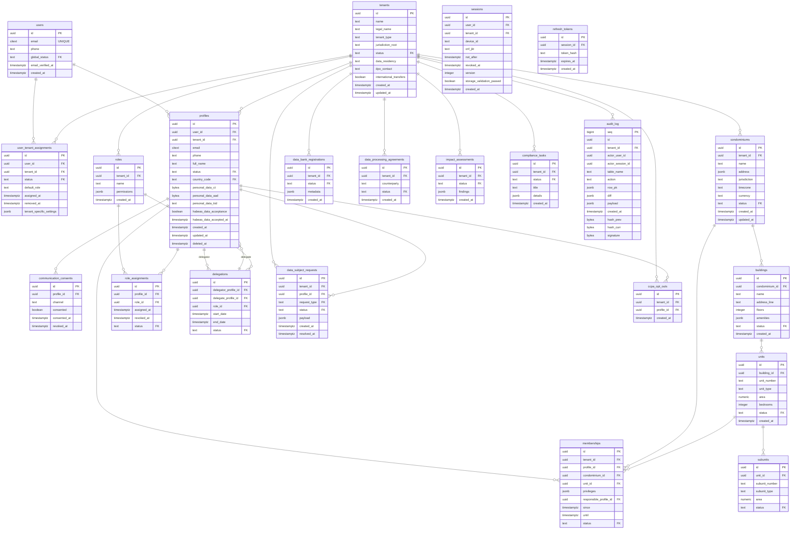
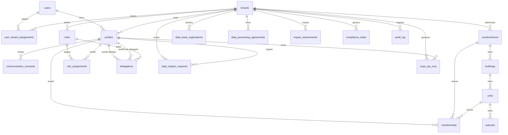

# **Diagrama Entidad-Relación (DER) — SmartEdify Fase 1**

## **1. Introducción**

Este DER describe la estructura lógica y relacional de la base de datos para la Fase 1 de SmartEdify. Su propósito es asegurar **integridad de datos**, **aislamiento multi-tenant** y **cumplimiento normativo** desde la raíz del modelo.

---
### Diagrama entidad-relación

```mermaid
erDiagram
    users {
        uuid id "PK"
        citext email "UNIQUE"
        text phone
        text global_status "FK"
        timestamptz email_verified_at
        timestamptz created_at
    }
    tenants {
        uuid id "PK"
        text name
        text legal_name
        text tenant_type
        text jurisdiction_root
        text status "FK"
        text data_residency
        text dpo_contact
        boolean international_transfers
        timestamptz created_at
        timestamptz updated_at
    }
    user_tenant_assignments {
        uuid id "PK"
        uuid user_id "FK"
        uuid tenant_id "FK"
        text status "FK"
        text default_role
        timestamptz assigned_at
        timestamptz removed_at
        jsonb tenant_specific_settings
    }
    sessions {
        uuid id "PK"
        uuid user_id "FK"
        uuid tenant_id "FK"
        text device_id
        text cnf_jkt
        timestamptz not_after
        timestamptz revoked_at
        integer version
        boolean storage_validation_passed
        timestamptz created_at
    }
    refresh_tokens {
        uuid id "PK"
        uuid session_id "FK"
        text token_hash
        timestamptz expires_at
        timestamptz created_at
    }
    profiles {
        uuid id "PK"
        uuid user_id "FK"
        uuid tenant_id "FK"
        citext email
        text phone
        text full_name
        text status "FK"
        text country_code "FK"
        bytea personal_data_ct
        bytea personal_data_aad
        text personal_data_kid
        boolean habeas_data_acceptance
        timestamptz habeas_data_accepted_at
        timestamptz created_at
        timestamptz updated_at
        timestamptz deleted_at
    }
    communication_consents {
        uuid id "PK"
        uuid profile_id "FK"
        text channel
        boolean consented
        timestamptz consented_at
        timestamptz revoked_at
    }
    condominiums {
        uuid id "PK"
        uuid tenant_id "FK"
        text name
        jsonb address
        text jurisdiction
        text timezone
        text currency
        text status "FK"
        timestamptz created_at
        timestamptz updated_at
    }
    buildings {
        uuid id "PK"
        uuid condominium_id "FK"
        text name
        text address_line
        integer floors
        jsonb amenities
        text status "FK"
        timestamptz created_at
    }
    units {
        uuid id "PK"
        uuid building_id "FK"
        text unit_number
        text unit_type
        numeric area
        integer bedrooms
        text status "FK"
        timestamptz created_at
    }
    subunits {
        uuid id "PK"
        uuid unit_id "FK"
        text subunit_number
        text subunit_type
        numeric area
        text status "FK"
    }
    roles {
        uuid id "PK"
        uuid tenant_id "FK"
        text name
        jsonb permissions
        timestamptz created_at
    }
    memberships {
        uuid id "PK"
        uuid tenant_id "FK"
        uuid profile_id "FK"
        uuid condominium_id "FK"
        uuid unit_id "FK"
        jsonb privileges
        uuid responsible_profile_id "FK"
        timestamptz since
        timestamptz until
        text status "FK"
    }
    role_assignments {
        uuid id "PK"
        uuid profile_id "FK"
        uuid role_id "FK"
        timestamptz assigned_at
        timestamptz revoked_at
        text status "FK"
    }
    delegations {
        uuid id "PK"
        uuid delegator_profile_id "FK"
        uuid delegate_profile_id "FK"
        uuid role_id "FK"
        timestamptz start_date
        timestamptz end_date
        text status "FK"
    }
    data_subject_requests {
        uuid id "PK"
        uuid tenant_id "FK"
        uuid profile_id "FK"
        text request_type "FK"
        text status "FK"
        jsonb payload
        timestamptz created_at
        timestamptz resolved_at
    }
    data_bank_registrations {
        uuid id "PK"
        uuid tenant_id "FK"
        text status "FK"
        jsonb metadata
        timestamptz created_at
    }
    data_processing_agreements {
        uuid id "PK"
        uuid tenant_id "FK"
        text counterparty
        text status "FK"
        timestamptz created_at
    }
    impact_assessments {
        uuid id "PK"
        uuid tenant_id "FK"
        text status "FK"
        jsonb findings
        timestamptz created_at
    }
    compliance_tasks {
        uuid id "PK"
        uuid tenant_id "FK"
        text status "FK"
        text title
        jsonb details
        timestamptz created_at
    }
    ccpa_opt_outs {
        uuid id "PK"
        uuid tenant_id "FK"
        uuid profile_id "FK"
        timestamptz created_at
    }
    audit_log {
        bigint seq "PK"
        uuid id
        uuid tenant_id "FK"
        uuid actor_user_id
        uuid actor_session_id
        text table_name
        text action
        jsonb row_pk
        jsonb diff
        jsonb payload
        timestamptz created_at
        bytea hash_prev
        bytea hash_curr
        bytea signature
    }

    users ||--o{ user_tenant_assignments : ""
    tenants ||--o{ user_tenant_assignments : ""
    users ||--o{ profiles : ""
    tenants ||--o{ profiles : ""
    profiles ||--o{ communication_consents : ""
    tenants ||--o{ condominiums : ""
    condominiums ||--o{ buildings : ""
    buildings ||--o{ units : ""
    units ||--o{ subunits : ""
    tenants ||--o{ roles : ""
    profiles ||--o{ memberships : ""
    condominiums ||--o{ memberships : ""
    units ||--o{ memberships : ""
    roles ||--o{ role_assignments : ""
    profiles ||--o{ role_assignments : ""
    profiles ||--o{ delegations : "delegator"
    profiles }o--|| delegations : "delegate"
    roles ||--o{ delegations : ""
    tenants ||--o{ data_subject_requests : ""
    profiles ||--o{ data_subject_requests : ""
    tenants ||--o{ data_bank_registrations : ""
    tenants ||--o{ data_processing_agreements : ""
    tenants ||--o{ impact_assessments : ""
    tenants ||--o{ compliance_tasks : ""
    tenants ||--o{ ccpa_opt_outs : ""
    profiles ||--o{ ccpa_opt_outs : ""
    tenants ||--o{ audit_log : ""
```
### Diagrama flowchart
---
flowchart TD
    %% === Definición de estilos por dominio ===
    classDef auth fill:#e6f7ff,stroke:#1890ff,color:#003366;
    classDef profile fill:#fff7e6,stroke:#fa8c16,color:#592d00;
    classDef property fill:#f6ffed,stroke:#52c41a,color:#165200;
    classDef rbac fill:#f9f0ff,stroke:#722ed1,color:#2e0d59;
    classDef compliance fill:#fff0f6,stroke:#eb2f96,color:#590d3d;
    classDef audit fill:#f0f5ff,stroke:#2f54eb,color:#001529;

    %% === Entidades por dominio ===
    %% Auth & Identity
    users["👤 users"]:::auth
    tenants["🏢 tenants"]:::auth
    user_tenant_assignments["üß© user_tenant_assignments"]:::auth
    sessions["üì± sessions"]:::auth
    refresh_tokens["🔄 refresh_tokens"]:::auth

    %% Perfil & Consentimiento
    profiles["ü™™ profiles"]:::profile
    communication_consents["‚úÖ communication_consents"]:::profile

    %% Propiedades
    condominiums["🏘️ condominiums"]:::property
    buildings["🏢 buildings"]:::property
    units["🏠 units"]:::property
    subunits["üö™ subunits"]:::property
    memberships["üîë memberships"]:::property

    %% RBAC (Roles y Acceso)
    roles["üé≠ roles"]:::rbac
    role_assignments["üìé role_assignments"]:::rbac
    delegations["🤝 delegations"]:::rbac

    %% Cumplimiento
    data_subject_requests["üì© data_subject_requests"]:::compliance
    ccpa_opt_outs["üö´ ccpa_opt_outs"]:::compliance
    data_bank_registrations["🏦 data_bank_registrations"]:::compliance
    data_processing_agreements["üìë data_processing_agreements"]:::compliance
    impact_assessments["üìä impact_assessments"]:::compliance
    compliance_tasks["‚úÖ compliance_tasks"]:::compliance

    %% Auditoría
    audit_log["üìú audit_log"]:::audit

    %% === Relaciones (flechas con etiquetas) ===
    %% Auth
    users -->|asigna| user_tenant_assignments
    tenants -->|asigna| user_tenant_assignments
    users -->|tiene| profiles
    tenants -->|tiene| profiles
    users -->|inicia| sessions
    sessions -->|genera| refresh_tokens

    %% Perfil
    profiles -->|otorga| communication_consents
    profiles -->|posee| memberships

    %% Propiedades
    tenants -->|administra| condominiums
    condominiums -->|tiene| buildings
    buildings -->|tiene| units
    units -->|tiene| subunits
    condominiums -->|asocia| memberships
    units -->|asocia| memberships

    %% RBAC
    tenants -->|define| roles
    roles -->|asigna| role_assignments
    profiles -->|recibe| role_assignments
    profiles -->|delega| delegations
    roles -->|para| delegations
    profiles -->|es delegado en| delegations

    %% Cumplimiento
    tenants -->|recibe| data_subject_requests
    profiles -->|origina| data_subject_requests
    tenants -->|gestiona| ccpa_opt_outs
    profiles -->|inicia| ccpa_opt_outs
    tenants -->|declara| data_bank_registrations
    tenants -->|firma| data_processing_agreements
    tenants -->|eval√∫a| impact_assessments
    tenants -->|genera| compliance_tasks

    %% Auditoría
    tenants -->|registra| audit_log
---
---

## **2. Entidades Principales y Relaciones**

### **A. Identidad y Tenancy**

* **users**

  * *PK*: id (UUID)
  * email (√∫nico)
  * global_status ‚Üí status_t
  * 1 usuario ‚Üí N asignaciones a tenants (`user_tenant_assignments`)

* **tenants**

  * *PK*: id (UUID)
  * status ‚Üí status_t
  * 1 tenant ‚Üí N condominiums
  * 1 tenant → N users (a través de user_tenant_assignments)

* **user_tenant_assignments**

  * *PK*: id (UUID)
  * user_id ‚Üí users
  * tenant_id ‚Üí tenants
  * status ‚Üí status_t
  * Relación N:M (usuarios pueden pertenecer a varios tenants y viceversa)

* **sessions**

  * *PK*: id (UUID)
  * user_id ‚Üí users
  * tenant_id ‚Üí tenants
  * Relación 1:N (usuario puede tener muchas sesiones por tenant)
  * 1 session ‚Üí N refresh_tokens

* **refresh_tokens**

  * *PK*: id (UUID)
  * session_id ‚Üí sessions

---

### **B. Perfiles y Consentimientos**

* **profiles**

  * *PK*: id (UUID)
  * user_id ‚Üí users
  * tenant_id ‚Üí tenants
  * status ‚Üí status_t
  * country_code ‚Üí country_code_t
  * Relación 1:1 (cada user_id por tenant_id es único; enforced en lógica de negocio)
  * 1 profile ‚Üí N communication_consents
  * 1 profile ‚Üí N memberships

* **communication_consents**

  * *PK*: id (UUID)
  * profile_id ‚Üí profiles

---

### **C. Estructura Organizacional**

* **condominiums**

  * *PK*: id (UUID)
  * tenant_id ‚Üí tenants
  * status ‚Üí status_t
  * 1 condominium ‚Üí N buildings

* **buildings**

  * *PK*: id (UUID)
  * condominium_id ‚Üí condominiums
  * status ‚Üí status_t
  * 1 building ‚Üí N units

* **units**

  * *PK*: id (UUID)
  * building_id ‚Üí buildings
  * status ‚Üí status_t
  * 1 unit ‚Üí N subunits

* **subunits**

  * *PK*: id (UUID)
  * unit_id ‚Üí units
  * status ‚Üí status_t

---

### **D. Roles, Membresías y Delegaciones**

* **roles**

  * *PK*: id (UUID)
  * tenant_id ‚Üí tenants
  * 1 role ‚Üí N role_assignments

* **memberships**

  * *PK*: id (UUID)
  * tenant_id ‚Üí tenants
  * profile_id ‚Üí profiles
  * condominium_id ‚Üí condominiums
  * unit_id ‚Üí units (opcional)
  * responsible_profile_id ‚Üí profiles (opcional)
  * status ‚Üí status_t

* **role_assignments**

  * *PK*: id (UUID)
  * profile_id ‚Üí profiles
  * role_id ‚Üí roles
  * status ‚Üí status_t

* **delegations**

  * *PK*: id (UUID)
  * delegator_profile_id ‚Üí profiles
  * delegate_profile_id ‚Üí profiles
  * role_id ‚Üí roles
  * status ‚Üí status_t

---

### **E. Compliance**

* **data_subject_requests**

  * *PK*: id (UUID)
  * tenant_id ‚Üí tenants
  * profile_id ‚Üí profiles
  * request_type ‚Üí request_type_t
  * status ‚Üí status_t

* **data_bank_registrations**

  * *PK*: id (UUID)
  * tenant_id ‚Üí tenants
  * status ‚Üí status_t

* **data_processing_agreements**

  * *PK*: id (UUID)
  * tenant_id ‚Üí tenants
  * status ‚Üí status_t

* **impact_assessments**

  * *PK*: id (UUID)
  * tenant_id ‚Üí tenants
  * status ‚Üí status_t

* **compliance_tasks**

  * *PK*: id (UUID)
  * tenant_id ‚Üí tenants
  * status ‚Üí status_t

* **ccpa_opt_outs**

  * *PK*: id (UUID)
  * tenant_id ‚Üí tenants
  * profile_id ‚Üí profiles

---

### **F. Auditoría**

* **audit_log**

  * *PK*: (tenant_id, seq)
  * tenant_id ‚Üí tenants
  * Cubre toda acción relevante, particionado por fecha
  * Relación 1:N: un tenant tiene muchos registros de auditoría

---

## **3. Diagrama Visual (formato texto/mermaid)**

> Si requieres el DER en formato visual, este ejemplo es compatible con herramientas como [dbdiagram.io](https://dbdiagram.io) o cualquier editor Mermaid.

```mermaid
erDiagram

users ||--o{ user_tenant_assignments : "asigna"
tenants ||--o{ user_tenant_assignments : "asigna"
users ||--o{ profiles : "tiene"
tenants ||--o{ profiles : "tiene"
profiles ||--o{ communication_consents : "otorga"
tenants ||--o{ condominiums : "administra"
condominiums ||--o{ buildings : "tiene"
buildings ||--o{ units : "tiene"
units ||--o{ subunits : "tiene"
tenants ||--o{ roles : "define"
profiles ||--o{ memberships : "posee"
condominiums ||--o{ memberships : "asocia"
units ||--o{ memberships : "asocia"
roles ||--o{ role_assignments : "asigna"
profiles ||--o{ role_assignments : "recibe"
profiles ||--o{ delegations : "puede delegar"
profiles ||--o{ delegations : "puede ser delegado"
roles ||--o{ delegations : "para"
tenants ||--o{ data_subject_requests : "recibe"
profiles ||--o{ data_subject_requests : "origina"
tenants ||--o{ data_bank_registrations : "declara"
tenants ||--o{ data_processing_agreements : "firma"
tenants ||--o{ impact_assessments : "evalua"
tenants ||--o{ compliance_tasks : "genera"
tenants ||--o{ ccpa_opt_outs : "gestiona"
profiles ||--o{ ccpa_opt_outs : "inicia"
tenants ||--o{ audit_log : "registra"
```

---

## **4. Notas de Cumplimiento y Seguridad**

* **Multi-tenancy:** Todas las entidades clave est√°n relacionadas por `tenant_id` y protegidas por RLS a nivel de base de datos.
* **PII y privacidad:** Datos sensibles en `profiles` sólo accedidos por lógica autorizada; el cifrado AEAD impide exposición accidental.
* **Integridad:** ON DELETE CASCADE/SET NULL en relaciones para evitar huérfanos y mantener coherencia ante bajas lógicas o físicas.
* **Auditoría:** Toda modificación relevante genera un registro en `audit_log` (cumplimiento WORM).
* **Dominio normalizado:** Tablas como `status_t`, `country_code_t`, `request_type_t` evitan valores m√°gicos.

---

## **5. Resumen de Relaciones Clave**

* Un **usuario** puede estar en **muchos tenants** y viceversa.
* Un **perfil** pertenece a 1 usuario y 1 tenant; puede tener muchas membresías y roles.
* Un **tenant** puede tener muchos condominios, buildings, unidades, y usuarios.
* **Membresías** y **roles** permiten modelar jerarquía y permisos dentro de un condominio/tenant.
* **Cumplimiento** y **auditoría** están siempre anclados al tenant y, cuando aplica, al perfil.

---

¿O deseas ver alguna sección en formato tabular para una especificación funcional más detallada?
Puedo generar la imagen o el archivo fuente compatible con Lucidchart, Draw.io, dbdiagram.io o Mermaid según tu preferencia. ¡Indícame cuál necesitas!
