### 📄 F-01: Registro y Activación Delegada

```mermaid
sequenceDiagram
    participant Admin as Administrador
    participant UPS as User Profiles Service
    participant NS as Notifications Service
    participant Usuario as Usuario Final
    participant IS as Identity Service
    participant CS as Compliance Service
    participant WORM as WORM Logs

    Admin->>UPS: POST /profiles (crear perfil)
    UPS->>UPS: Asigna roles, unidad, condominio, tenant
    UPS->>NS: Enviar enlace de activación
    NS-->>Usuario: Email/SMS con link seguro

    Usuario->>IS: POST /identity/register (registro WebAuthn)
    IS->>IS: Genera credenciales WebAuthn + DPoP
    IS->>UPS: Confirma identidad y sesión
    UPS->>CS: Solicita auditoría de consentimiento
    CS->>CS: Verifica política vigente, jurisdicción, rol
    CS->>WORM: Registra resultado con metadatos legales
    CS-->>UPS: Resultado de auditoría (válido/no válido)
    UPS-->>IS: Activación final del usuario
```

---
###🧩 Artefactos técnicos vinculados
**OpenAPI endpoints:**
- POST /profiles
- POST /identity/register
**Modelo DBML:** tabla memberships
**Métrica:** activation_success_rate
**Threat Model:** STRIDE para activación
**Convenciones:**

Privacy by Design (PDR-4)
WORM logging (SAD §9.3)
Consent versioning (GDPR/LGPD)
RLS por `tenant_id`
