### 📄 F-02: Autenticación Segura

```mermaid
sequenceDiagram
    participant Usuario as Usuario Final
    participant BFF as BFF Layer (Web/Mobile)
    participant GW as API Gateway
    participant IS as Identity Service
    participant Redis as JWKS Cache
    participant KMS as Key Management Service
    participant CS as Compliance Service
    participant WORM as WORM Logs

    Usuario->>BFF: Inicia sesión (WebAuthn/Passkey)
    BFF->>GW: Solicita autorización (PKCE/OIDC)
    GW->>IS: /authorize con DPoP headers
    IS->>IS: Verifica credenciales WebAuthn
    IS->>Redis: Consulta JWKS (kid)
    Redis-->>IS: Clave pública firmante
    IS->>KMS: Verifica firma y attestation
    IS->>CS: Valida política de sesión y contexto legal
    CS-->>IS: Resultado de validación
    IS->>WORM: Registra sesión y attestation en logs WORM
    IS-->>GW: Emite JWT + DPoP token
    GW-->>BFF: Token de acceso
    BFF-->>Usuario: Sesión activa (device-bound)
```

### 🧩 Artefactos técnicos vinculados

**OpenAPI endpoints:**
- /authorize
- /token
- /userinfo
  
**Especificaciones:**
- DPoP headers, nonce, clock skew
- JWKS rotation y cache
- WebAuthn AAL3 con attestation

**Métricas clave:**
- webauthn_assertion_latency_p95
- dpop_replay_block_rate
- token_validation_error_rate

**Convenciones aplicadas:**
- Zero Trust (PDR-3)
- OAuth 2.1 + PKCE
- DPoP obligatorio (SAD §9.2)
- Rate limiting + proof-of-work (ADR-017)
- Observabilidad end-to-end (SAD §11.1)
