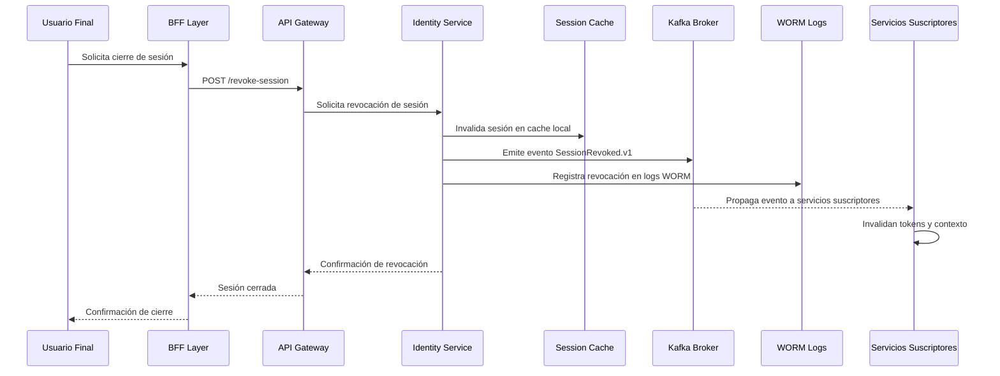

### 📄 F-03: Revocación Global de Sesión

### 🧩 Artefactos técnicos vinculados

**OpenAPI endpoint:**
- POST /revoke-session
**Evento Kafka:** SessionRevoked.v1
**Métrica clave:** revocation_latency_p95 ≤ 30s
**Runbook:** revocación de dispositivo
**Convenciones aplicadas:**
- Fail-fast (SAD §6.4)
- Event-driven (PDR-7)
- Observabilidad end-to-end (SAD §11.1)
- WORM logging para trazabilidad legal
