### 📄 F-03: Revocación Global de Sesión

```mermaid
sequenceDiagram
    participant Usuario as Usuario Final
    participant BFF as BFF Layer
    participant GW as API Gateway
    participant IS as Identity Service
    participant Redis as Session Cache
    participant Kafka as Kafka Broker
    participant WORM as WORM Logs
    participant Subsystems as Servicios Suscriptores

    Usuario->>BFF: Solicita cierre de sesión
    BFF->>GW: POST /revoke-session
    GW->>IS: Solicita revocación de sesión
    IS->>Redis: Invalida sesión en cache local
    IS->>Kafka: Emite evento SessionRevoked.v1
    IS->>WORM: Registra revocación en logs WORM
    Kafka-->>Subsystems: Propaga evento a servicios suscriptores
    Subsystems->>Subsystems: Invalidan tokens y contexto
    IS-->>GW: Confirmación de revocación
    GW-->>BFF: Sesión cerrada
    BFF-->>Usuario: Confirmación de cierre
```

### 🧩 Artefactos técnicos vinculados

**OpenAPI endpoint:**
- POST /revoke-session
**Evento Kafka:** SessionRevoked.v1
**Métrica clave:** revocation_latency_p95 ≤ 30s
**Runbook:** revocación de dispositivo
**Convenciones aplicadas:**
- Fail-fast (SAD §6.4)
- Event-driven (PDR-7)
- Observabilidad end-to-end (SAD §11.1)
- WORM logging para trazabilidad legal
