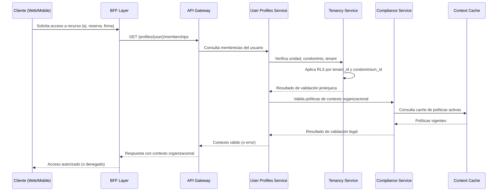

### 📄 F-04: Validación de Membresía y Contexto

---

### 🧩 Artefactos técnicos vinculados

**OpenAPI endpoint:** GET /profiles/{user}/memberships
**Modelo de datos:** relación user ↔ unit ↔ condominium ↔ tenant
**Métrica clave:** pdp_latency_p95
**Convenciones aplicadas:**
- PBAC con OPA (SAD §6.1)
- RLS por tenant_id y condominium_id
- Clean Architecture (PDR-2)
- Privacy by Design (PDR-4)

---
### 📊 Activación Condicional — F-04

| Tipo de Operación                            | ¿Requiere F-04? | Justificación Técnica                                                                 |
|---------------------------------------------|------------------|----------------------------------------------------------------------------------------|
| **Participación en Asamblea**               | ✅ Sí            | Validación de quórum y rol oficial; contexto legal y organizacional requerido.        |
| **Firma de Actas o Resoluciones**           | ✅ Sí            | Firma electrónica vinculada a cargo oficial; requiere validación jerárquica.          |
| **Gestión de Pagos / Caja / Cuotas**        | ✅ Sí            | Acceso a operaciones financieras sensibles; requiere trazabilidad legal.              |
| **Reservas de Espacios Comunes**            | ✅ Sí            | Validación de elegibilidad por unidad, morosidad, convivencia de eventos.             |
| **Acceso a Nómina / RRHH / Exportes**       | ✅ Sí            | Operaciones con impacto fiscal y laboral; requiere contexto organizacional válido.    |
| **Visualización de contenido público**      | ❌ No            | No requiere validación jerárquica ni legal; acceso general permitido.                 |
| **Actualización de preferencias personales**| ❌ No            | No afecta contexto legal ni jerárquico; operación local del perfil.                   |
| **Acceso a notificaciones o mensajes**      | ❌ No            | No requiere validación de membresía; uso general del canal de comunicación.           |
| **Activación de cuenta (registro inicial)** | ❌ No            | Validación ocurre en F-01; aún no se requiere contexto organizacional completo.       |

---

### 🔐 Observaciones

- El flujo F-04 se activa **solo cuando la operación depende del contexto organizacional y legal del usuario**.
- Está diseñado para proteger operaciones que requieren **trazabilidad, cumplimiento normativo y control jerárquico**.
- Se apoya en:
  - **RLS por `tenant_id` y `condominium_id`**
  - **PBAC con OPA**
  - **Validación de políticas activas vía Compliance Service**

