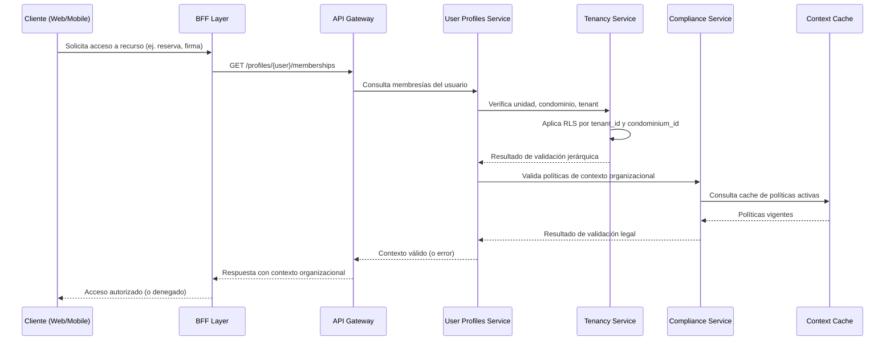

### 📄 F-04: Validación de Membresía y Contexto

### 🧩 Artefactos técnicos vinculados

**OpenAPI endpoint:** GET /profiles/{user}/memberships
**Modelo de datos:** relación user ↔ unit ↔ condominium ↔ tenant
**Métrica clave:** pdp_latency_p95
**Convenciones aplicadas:**
- PBAC con OPA (SAD §6.1)
- RLS por tenant_id y condominium_id
- Clean Architecture (PDR-2)
- Privacy by Design (PDR-4)
