### 📄 F-04: Validación de Membresía y Contexto

```mermaid
sequenceDiagram
    participant Cliente as Cliente (Web/Mobile)
    participant BFF as BFF Layer
    participant GW as API Gateway
    participant UPS as User Profiles Service
    participant TS as Tenancy Service
    participant CS as Compliance Service
    participant Redis as Context Cache

    Cliente->>BFF: Solicita acceso a recurso (ej. reserva, firma)
    BFF->>GW: GET /profiles/{user}/memberships
    GW->>UPS: Consulta membresías del usuario
    UPS->>TS: Verifica unidad, condominio, tenant
    TS->>TS: Aplica RLS por tenant_id y condominium_id
    TS-->>UPS: Resultado de validación jerárquica
    UPS->>CS: Valida políticas de contexto organizacional
    CS->>Redis: Consulta cache de políticas activas
    Redis-->>CS: Políticas vigentes
    CS-->>UPS: Resultado de validación legal
    UPS-->>GW: Contexto válido (o error)
    GW-->>BFF: Respuesta con contexto organizacional
    BFF-->>Cliente: Acceso autorizado (o denegado)
```

### 🧩 Artefactos técnicos vinculados

**OpenAPI endpoint:** GET /profiles/{user}/memberships
**Modelo de datos:** relación user ↔ unit ↔ condominium ↔ tenant
**Métrica clave:** pdp_latency_p95
**Convenciones aplicadas:**
- PBAC con OPA (SAD §6.1)
- RLS por tenant_id y condominium_id
- Clean Architecture (PDR-2)
- Privacy by Design (PDR-4)
