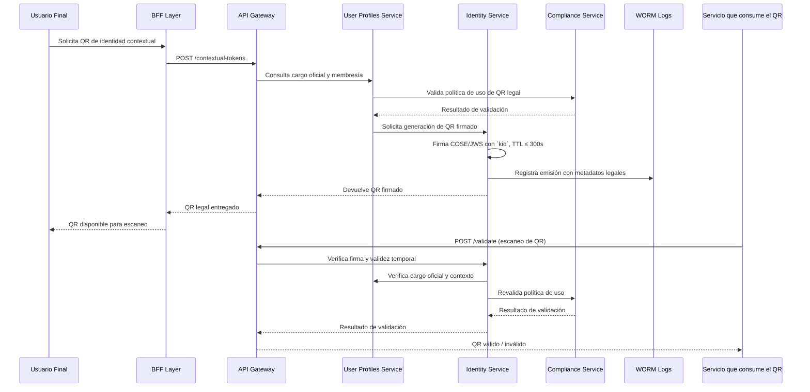

### 📄 **F-05: Generación y Validación de QR de Identidad**

### 🧩 Artefactos técnicos vinculados

*   **OpenAPI endpoints**:
    *   `POST /contextual-tokens`
    *   `POST /validate`
*   **Especificación COSE/JWS**:
    *   Claims: `user_id`, `role`, `unit_id`, `condominium_id`, `tenant_id`
    *   TTL ≤ 300s
    *   `kid` para firma con clave rotativa
*   **Métricas clave**:
    *   `qr_generation_latency_p95 ≤ 500ms`
    *   `qr_validation_error_rate`
*   **Convenciones aplicadas**:
    *   Firma electrónica avanzada (Vision Doc §4.1)
    *   Device binding (SAD §9.4)
    *   Uso exclusivo para fines legales (ADR-014)
    *   WORM logging para trazabilidad
***

¿Te gustaría que lo exporte como archivo `.mmd` o que prepare también el flujo **F-06**? También puedo ayudarte a definir el esquema COSE/JWS o los headers estándar para validación de QR.
