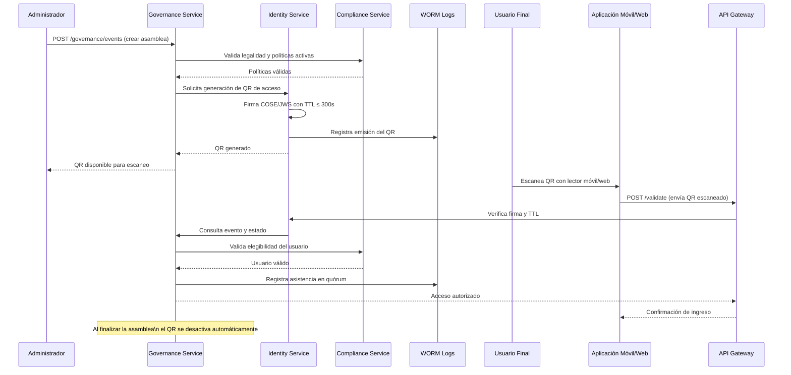

### 📄 Archivo 1: F-05_QR_Asamblea

# Artefactos Técnicos — F-05: QR de Asamblea

## 🧩 Endpoints OpenAPI
- `POST /governance/events/{id}/qr` → Genera QR legal por evento
- `POST /validate` → Valida QR escaneado y registra asistencia

## 🔐 Especificación COSE/JWS
- Claims: `event_id`, `tenant_id`, `condominium_id`, `issued_at`, `expires_at`, `kid`
- Firma: ES256 (clave rotativa)
- TTL: ≤ 300 segundos

## 📊 Métricas
- `qr_generation_latency_p95 ≤ 500ms`
- `qr_validation_error_rate`
- `attendance_registered_total`

## 📦 Evento Kafka
- `AttendanceRegistered.v1`
  - Payload: `{ event_id, user_id, timestamp, policy_version }`
  - Topic: `governance.attendance`
  - Schema: registrado en Schema Registry

## 📁 Registro Legal
- WORM + hash-chain
- Firma verificable
- Trazabilidad completa

## ✅ Convenciones Aplicadas
- Privacy by Design (sin datos personales en QR)
- Zero Trust (validación contextual)
- Fail-closed ante expiración o firma inválida
- JWT/COSE conforme a RFC 8392, RFC 9052
