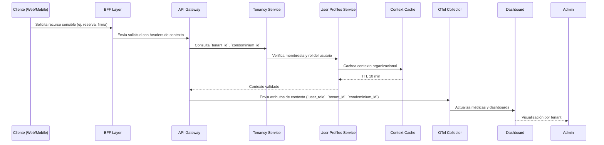

### 📄 F-06_Propagacion_Contexto

# Artefactos Técnicos — F-06: Propagación de Contexto y Observabilidad por Tenant

## 🧩 Endpoints OpenAPI
- `GET /profiles/{user}/memberships`
- Headers propagados: `x-tenant-id`, `x-condominium-id`, `x-user-role`

## 📊 Métricas y Observabilidad
- `policy_version_skew > 1`
- `pdp_latency_p95`
- `context_cache_hit_rate`
- Dashboards por tenant en Grafana

## 📦 Cache Layer
- Redis regional
- TTL: 10 minutos
- Invalidación por `session_refresh` o `event-driven`

## 📁 OpenTelemetry
- Semantic Conventions aplicadas
- Atributos enriquecidos: `tenant_id`, `condominium_id`, `user_role`
- Exportación a Prometheus + Grafana

## ✅ Convenciones Aplicadas
- Observabilidad por tenant (PDR-6)
- Clean Architecture (PDR-2)
- RLS por `tenant_id` y `condominium_id`
- SLO monitoring (SAD §11.1)
