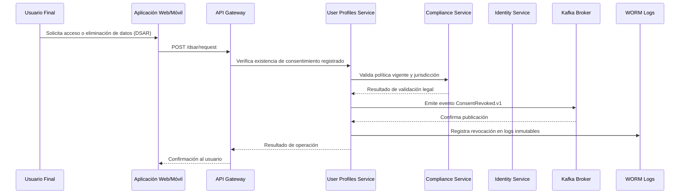

### 📄 F-07_Consentimiento_DSAR

# Artefactos Técnicos — F-07: Gestión de Consentimiento y DSAR

## 🧩 Endpoints OpenAPI
- `POST /dsar/request` → Solicitud de acceso o eliminación de datos personales
- `GET /profiles/{user}/consents` → Consulta de consentimientos registrados

## 📦 Evento Kafka
- `ConsentRevoked.v1`
  - Payload: `{ user_id, tenant_id, timestamp, reason, policy_version }`
  - Topic: `privacy.consent`
  - Schema: registrado en Schema Registry

## 📁 Registro Legal
- WORM + hash-chain
- Registro de revocación con metadatos legales
- Trazabilidad completa para auditoría

## 🔐 Seguridad y Privacidad
- Validación de políticas por jurisdicción (GDPR Art. 7, LGPD Art. 8)
- TTL corto en cache de políticas (5 min)
- Cifrado de PII por tenant (KMS/HSM)
- No se almacenan datos sensibles en eventos

## 📊 Métricas
- `dsar_response_time ≤ 72h`
- `consent_revocation_latency_p95`
- `consent_revoked_total`

## ✅ Convenciones Aplicadas
- Privacy by Design (PDR-4)
- Cifrado de PII (SAD §6.2)
- Event-driven architecture
- WORM compliance
