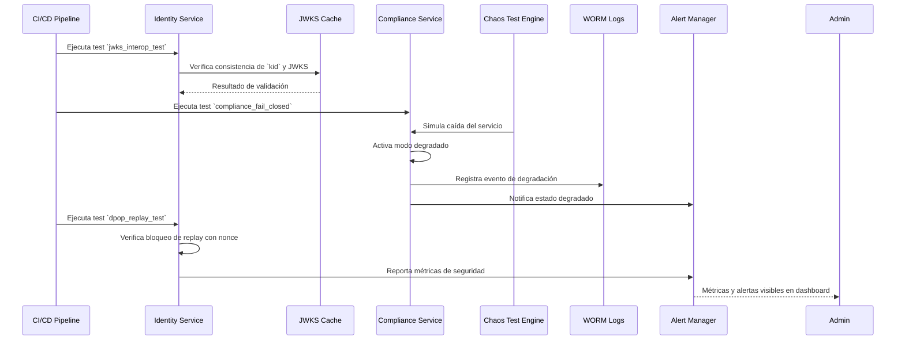

### 📄 F-08_Resiliencia_Hardening

# Artefactos Técnicos — F-08: Resiliencia y Hardening Técnico

## 🧪 Pruebas de Caos y Seguridad
- `jwks_interop_test`: Verifica consistencia de claves rotativas
- `compliance_fail_closed`: Simula caída del Compliance Service
- `dpop_replay_test`: Verifica bloqueo de ataques de replay

## 📦 Métricas y Observabilidad
- `compliance_fail_closed_trigger_count`
- `kid_mismatch_detected_total`
- `dpop_replay_block_rate`
- `revocation_latency_p95`

## 📁 Registro Legal
- WORM + hash-chain para eventos de degradación
- Alertas distribuidas vía Alert Manager

## 🔐 Seguridad y Resiliencia
- Circuit Breaker (Vision Doc §6.1)
- Fail-closed ante caída de servicios críticos
- TTL en cache y fallback automático
- Validación de `kid` y JWKS rotativo

## ✅ Convenciones Aplicadas
- Chaos Engineering (SAD §11.2)
- Event-driven architecture
- Observabilidad por servicio
- Privacy by Design
