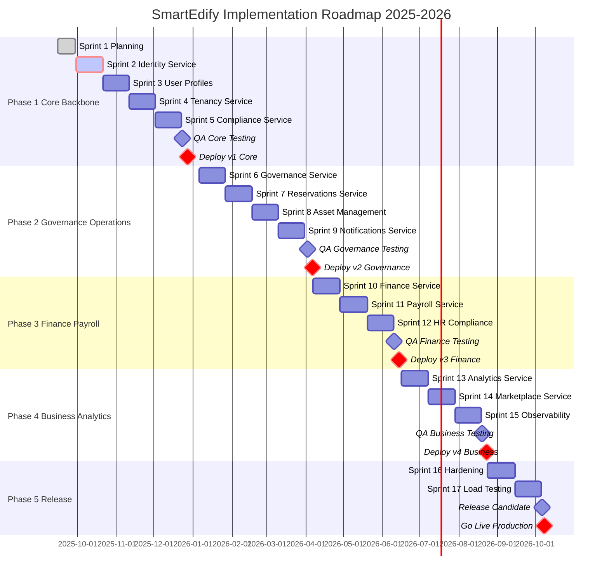

# SmartEdify

<div align="center">
  
  <p><em>Construyendo infraestructura crítica para la gobernanza comunitaria del futuro.</em></p>
</div>

---

**SmartEdify** es una plataforma SaaS multi-tenant diseñada para la gestión integral de comunidades y condominios, con enfoque **mobile-first**, **Zero Trust**, cumplimiento normativo transnacional y observabilidad end-to-end.

Su propósito es **transformar la gobernanza, administración, seguridad y prestación de servicios comunes en entornos residenciales y comerciales mediante una solución digital unificada, segura y escalable.**

---

## 🎯 Objetivo Estratégico

SmartEdify se centra en convertirse en el **sistema operativo digital para comunidades**, garantizando:

- **Transparencia operativa** con trazabilidad inmutable (logs WORM, firma electrónica avanzada con respaldo criptográfico y vinculación a cargos oficiales, actas con respaldo jurídico).
- **Cumplimiento legal adaptativo** mediante un `Compliance Service` que valida en tiempo real regulaciones locales e internacionales (GDPR, LGPD, eIDAS, SUNAT, etc.).
- **Participación comunitaria inteligente** con asambleas digitales híbridas, votaciones seguras y reservas automatizadas.
- **Experiencia de usuario unificada** para propietarios, administradores, trabajadores y auditores, accesible por web y móvil.

Cada tenant puede administrar múltiples condominios, con reglas de cumplimiento y políticas jurídicas independientes. La arquitectura se basa en **microservicios modulares** bajo principios de **Clean Architecture**, **API-First** y **Privacy by Design**, priorizando resiliencia, seguridad criptográfica (WebAuthn, DPoP, ES256/EdDSA), eficiencia en costos y despliegue multi-región.

En su madurez plena, cada acción dentro de SmartEdify será auditable, legalmente defendible y medible en términos de confianza, eficiencia y cumplimiento.

---

## 🏗️ Arquitectura Global del Sistema

```mermaid
flowchart TB
 subgraph FE["Frontend Applications (Mobile-First)"]
        WA["Web Admin 
        (4000)"]
        WU["Web User 
        (3000)"]
        MA["Mobile App 
        (8081)"]
  end
 subgraph BFF["BFF Layer"]
        BFF_A["BFF Admin 
        (4001)"]
        BFF_U["BFF User 
        (3007)"]
        BFF_M["BFF Mobile 
        (8082)"]
  end
 subgraph EDGE["Edge Security"]
        WAF["WAF / DDoS Shield"]
  end
 subgraph GWY["API Gateway (8080)"]
        GW["Gateway Service + PEP (DPoP/JWT/JWKS Cache)"]
  end
 subgraph CORE["Core Services"]
        IS["Identity Service:
        (3001)
        OIDC/OAuth2.1 
        WebAuthn 
        DPoP"]
        UPS["User Profiles Service :
        (3002)
        Atributos 
        Grupos 
        Cargos oficiales"]
        TS["Tenancy Service :
        (3003)
        Tenants
        Condominiums 
        Jurisdicciones"]
        NS["Notifications Service :
        (3005)
        Email-SMS-Push
        Plantillas"]
        DS["Documents Service :(3006)
        PDF • WORM • Firma electrónica
        (cuando aplica)"]
  end
 subgraph GOV["Governance Services"]
        GS["Governance Service 
        (3011)
        Convocatorias
        Quórum
        Votos
        Actas"]
        CS["Compliance Service 
        (3012)
        Modo Consulta (runtime)
        Boletines (updates)"]
        RS["Reservation Service 
        (3013)
        Espacios
        Reglas
        Tarifas efectivas"]
        SS["Streaming Service 
        (3014)
        Asambleas híbridas • Presencia/Marcas de tiempo"]
  end
 subgraph OPS["Operations Services"]
        AMS["Asset Mgmt Service 
        (3010)
        Activos
        Incidencias
        OT
        Asset-QR (no cifrado)"]
        FS["Finance Service 
        (3007)
        GL 
        AR/AP 
        FX 
        NIC + Fiscal"]
        PS["Payroll Service 
        (3008)
        Cálculo 
        Payslips 
        Exportes regulatorios"]
        HCS["HR Compliance Service
        (3009)
        Reglas laborales por país
        Elegibilidad"]
        PSS["Physical Security (Futuro)
        (3004)
        ACS 
        Visión por computador"]
  end
 subgraph BUS["Business Services"]
        MS["Marketplace Service (3015)
        Proveedores 
        Pagos integrados"]
        AS["Analytics Service (3016)
        KPIs
        Dashboards
        Anonimización"]
  end
 subgraph MSG["Messaging & Streaming"]
        KAFKA["Apache Kafka 
        (9092)"]
        SR["Schema Registry"]
        KC["Kafka Connect / CDC"]
        DLQ["Dead Letter Queue"]
        REDIS["Redis (Regional) (6379)
        JWKS • DPoP-Nonce • Antireplay • Caches políticas"]
  end
 subgraph DATA["Storage & Crypto"]
        PG[("PostgreSQL 
        (5432)
        RLS {tenant, condominium}")]
        S3[("S3 Object Storage")]
        WORM[("S3 Object Lock / WORM\nHash-chain / Evidencias")]
        KMS[("KMS / HSM\nRotación 90d + Rollover 7d")]
        SEC[("Secrets Manager")]
  end
 subgraph POLI["Policy Distribution"]
        POL["Policy CDN (OPA bundles firmados)"]
  end
 subgraph OBS["Observability"]
        OTEL["OTel Collector 
        (4317)"]
        TRC["Tracing Backend (Tempo/Jaeger)"]
        LOGS["Logs Backend (OpenSearch/ELK)"]
        PROM["Prometheus 
        (9090)"]
        GRAF["Grafana 
        (3000)"]
       ALERTS["Alert Manager
       SLO Monitoring
       Business Metrics"]
  end
 subgraph PLT["Platform Layer"]
        MSG
        DATA
        POLI
        OBS
  end
    WA --> BFF_A
    BFF_A --> WAF
    WAF --> GW & GW
    WU --> BFF_U
    BFF_U --> WAF
    MA --> BFF_M
    BFF_M --> WAF
    GW --> IS & UPS & TS & NS & DS & GS & CS & RS & SS & AMS & FS & PS & HCS & MS & AS
    IS --> PG & REDIS
    IS -.-> KAFKA & OTEL
    IS --- KMS & POL
    UPS --> PG
    TS --> PG
    GS --> PG
    FS --> PG
    RS --> PG
    AMS --> PG
    DS --> S3
    DS --- WORM
    KAFKA --- SR & DLQ
    KC -.-> KAFKA
    TS -.-> KC
    OTEL --- TRC & LOGS
    PROM --- GRAF
    GW -.-> PROM
    GW --- SEC
    CS -. Boletines: RoleUpdate / TariffSchedule / EligibilityRule .-> KAFKA
    KAFKA -.-> GS & RS & FS & HCS & AMS
    GS -. "Solicita Identity-QR (COSE/JWS, TTL≤300s, kid)" .-> IS
    AMS -. "Escanea Asset-QR (no cifrado)" .-> AMS
     WA:::frontend
     WU:::frontend
     MA:::frontend
     BFF_A:::bff
     BFF_U:::bff
     BFF_M:::bff
     WAF:::edge
     GW:::gateway
     IS:::core
     UPS:::core
     TS:::core
     NS:::core
     DS:::core
     GS:::governance
     CS:::governance
     RS:::governance
     SS:::governance
     AMS:::operations
     FS:::operations
     PS:::operations
     HCS:::operations
     PSS:::operations
     MS:::business
     AS:::business
     KAFKA:::platform
     SR:::platform
     KC:::platform
     DLQ:::platform
     REDIS:::platform
     PG:::platform
     S3:::platform
     WORM:::platform
     KMS:::platform
     SEC:::platform
     POL:::platform
     OTEL:::platform
     TRC:::platform
     LOGS:::platform
     PROM:::platform
     GRAF:::platform
    classDef frontend fill:#e1f5fe,stroke:#01579b,color:#000
    classDef bff fill:#f3e5f5,stroke:#4a148c,color:#000
    classDef edge fill:#fff8e1,stroke:#ef6c00,color:#000
    classDef gateway fill:#e8f5e8,stroke:#1b5e20,color:#000
    classDef core fill:#fff3e0,stroke:#e65100,color:#000
    classDef governance fill:#fce4ec,stroke:#880e4f,color:#000
    classDef operations fill:#f1f8e9,stroke:#33691e,color:#000
    classDef business fill:#e0f2f1,stroke:#004d40,color:#000
    classDef platform fill:#f5f5f5,stroke:#424242,color:#000
    style MSG fill:#FFD600
    style DATA fill:#757575,color:#FFFFFF
    style OBS fill:#FF6D00
    style CORE fill:#BBDEFB
    style OPS fill:#FFCDD2
    style GOV fill:#C8E6C9
    style FE fill:#00C853,stroke:#2962FF
```



---

## 👥 Usuarios y Personas

| Rol / Persona                           | Descripción funcional                                                                   | Método de acceso principal                 |
| --------------------------------------- | --------------------------------------------------------------------------------------- | ------------------------------------------ |
| **Administrador General del Tenant**    | Superusuario que gestiona múltiples condominios y políticas globales del tenant.        | Web Admin (Passkey + MFA)                  |
| **Administrador de Condominio**         | Responsable operativo y legal de un condominio. Gestiona asambleas, tarifas y reservas. | Web Admin / Mobile (Passkey o TOTP)        |
| **Miembro de Junta (Cargo Oficial)**    | Representante legal que firma actas y resoluciones.                                     | Web Admin (Passkey con attestation)        |
| **Residente / Propietario**             | Usuario final que participa en asambleas, realiza reservas y pagos.                     | **Mobile App** / Web User (Passkey o TOTP) |
| **Usuario Delegado / Apoderado**        | Persona autorizada temporalmente para representar a un residente.                       | Mobile / Web (Passkey o TOTP)              |
| **Técnico de Mantenimiento**            | Personal interno o tercerizado que ejecuta órdenes de trabajo.                          | Mobile (TOTP / Passkey)                    |
| **Proveedor / Prestador de Servicios**  | Entidad externa que ejecuta tareas o factura servicios.                                 | Web / Mobile (OAuth2 B2B o Passkey)        |
| **Analista de Finanzas**                | Responsable de conciliaciones, cargos y reportes fiscales.                              | Web Admin (Passkey + MFA)                  |
| **Especialista de RRHH / Nómina**       | Administra nóminas, obligaciones laborales y exportes regulatorios.                     | Web Admin (Passkey + MFA)                  |
| **Oficial de Cumplimiento / Legal**     | Supervisa cumplimiento legal, genera boletines y valida documentos.                     | Web Admin (Passkey con attestation)        |
| **Auditor / Fiscalizador Externo**      | Entidad independiente que revisa evidencias y cumplimiento.                             | Web (Acceso federado o temporal read-only) |
| **Operador de Soporte / Mesa de Ayuda** | Da soporte técnico y revoca sesiones bajo procedimientos auditados.                     | Web Admin (Passkey)                        |
| **Integrador Externo (API/B2B)**        | Sistema externo que interactúa mediante integraciones seguras.                          | API (OAuth2.1 + mTLS + DPoP opcional)      |

---

## 📦 Microservicios y Alcance Funcional

### 1. Core Services

#### Identity Service (3001)

El **Identity Service** es la autoridad central de identidad de SmartEdify, diseñado bajo los principios de **Zero Trust**, **multi-tenancy** y **cumplimiento normativo transnacional**. Va más allá de la autenticación tradicional: actúa como pilar de **validez jurídica y trazabilidad criptográfica** para todas las acciones en la plataforma.

Ofrece **autenticación fuerte (WebAuthn/Passkeys)**, emite **tokens con Proof-of-Possession (DPoP)** y genera **evidencia inmutable (WORM + hash-chain)** para auditorías.

+ **Optimización de QR jurídicos**:
+   - **Cache de claves frecuentes**: Almacena claves de firma para eventos recurrentes (asambleas mensuales)
+   - **Pre-generación batch**: Genera lote de QR para eventos masivos (>100 participantes)
+   - **Compresión JWS**: Reduce tamaño payload en 40% para mobile optimization

+ **Métricas ampliadas**:
+   - **Latencia QR generation**: ≤500ms (P95)
+   - **Throughput auth requests**: ≥1000 RPM por instancia
+   - **Cache hit rate**: ≥85% para JWKS

#### User Profiles Service (3002)

El **User Profiles Service (UPS)** es el microservicio que gestiona la **identidad funcional y relacional** de los usuarios en SmartEdify, complementando al `Identity Service` con información contextual, jerárquica y normativa. Actúa como la **capa organizacional** que vincula a cada usuario con sus roles, unidades, condominios y tenants.
Sus funciones clave incluyen:
- **Gestión de atributos no sensibles** (nombre, preferencias, idioma) y **protección criptográfica de PII** (como DNI).
- **Asignación de roles y cargos oficiales** (`ADMIN`, `BOARD_MEMBER`, etc.), con soporte para **delegaciones temporales** y **grupos funcionales**.
- **Modelado jerárquico** `usuario → unidad → condominio → tenant`, con aislamiento garantizado mediante **Row-Level Security (RLS)**.
- **Registro y auditoría de consentimientos** para cumplir con normativas como **GDPR, LGPD** y leyes locales de Latinoamérica.
Se integra estrechamente con `Identity Service`, `Tenancy Service`, `Governance Service` y `Compliance Service`, asegurando que toda acción en la plataforma —votar, firmar, reservar, gestionar activos— se realice desde un **contexto legal y organizacional válido**.
En esencia, el UPS es el **puente entre la identidad digital y la gobernanza comunitaria**, garantizando coherencia, trazabilidad y cumplimiento en entornos multi-tenant y multi-jurisdicción.
El modelo de datos incluye una tabla de membresías explícita (memberships) que vincula user_id con múltiples condominium_id y unit_id bajo un mismo tenant_id, garantizando aislamiento mediante RLS y coherencia organizacional.

#### Tenancy Service (3003)

El **Tenancy Service (TS)** es la **columna vertebral organizacional y jurídica** de SmartEdify. Define y gestiona la jerarquía completa del ecosistema:  
**Tenant → Condominio → Edificio → Unidad → Espacio**,  
proporcionando la estructura sobre la cual operan todos los demás microservicios.
Sus funciones clave incluyen:
- **Creación y gestión de tenants** (como administradoras) y sus múltiples condominios.
- **Modelado detallado de edificios, unidades privadas y espacios comunes**.
- **Aislamiento total de datos** mediante *Row-Level Security (RLS)* por `tenant_id` y `condominium_id`.
- **Asociación con jurisdicciones legales**, permitiendo el cumplimiento normativo local (GDPR, LGPD, leyes de Perú, Chile, etc.).
- **Integración criptográfica y de eventos** con servicios como *Identity*, *User Profiles*, *Governance*, *Finance* y *Asset Management*.
El TS actúa como la **“raíz de confianza organizacional”**, asegurando que cada operación en la plataforma —desde una votación hasta un pago o una orden de mantenimiento— ocurra dentro del **contexto legal, territorial y funcional correcto**.
En resumen, es el fundamento que permite a SmartEdify escalar globalmente mientras mantiene **aislamiento seguro, trazabilidad legal y gobernanza contextual** en entornos multi-condominio y multi-jurisdicción.

#### Notifications Service (3005)
Orquestador de notificaciones push, correo y mensajería interna por tenant.

#### Documents Service (3006)
Gestión documental con firma electrónica avanzada basada en estándares criptográficos (ES256/EdDSA), aplicable únicamente a documentos con requerimientos legales (actas, resoluciones). La firma se vincula a cargos oficiales vigentes (presidente, secretario, etc.) validados por User Profiles y Compliance, y se respalda con hash-chain y almacenamiento WORM, versionado, cifrado y almacenamiento WORM.  
Firma válida solo en documentos con requerimientos legales.

### 2. Governance Services

#### Governance Service (3011)

El **`Governance Service`** es el núcleo de **gobernanza digital** de SmartEdify. Orquesta todo el ciclo de vida de las decisiones comunitarias —desde la convocatoria hasta la publicación del acta— con **validez jurídica, trazabilidad inmutable y cumplimiento en tiempo real**.
Sus funciones esenciales incluyen:
Opera bajo límites claros: **no gestiona identidad, roles, finanzas ni almacenamiento de documentos**, sino que se integra con los servicios especializados correspondientes.
Se apoya en **eventos asíncronos (Kafka)**, **políticas dinámicas (Compliance)** y **controles de seguridad estrictos (DPoP, JWKS, PBAC)** para garantizar que cada decisión sea **procesalmente correcta, auditada y legalmente defendible**. 
 **Manejo de indisponibilidad del Compliance-Service**:
- Para operaciones no críticas, se utiliza una versión cacheada de las políticas (con TTL de 5 minutos).
- Para operaciones críticas (como la convocatoria de asambleas o la validación de quórum), si el Compliance-Service no está disponible, se puede activar un **modo de emergencia** que permite la realización de la asamblea con validación posterior por parte del Compliance-Service (dentro de las 24 horas) y con la obligación de notificar a los participantes de la situación excepcional. Toda operación en modo de emergencia queda registrada en WORM para auditoría.

En resumen, el `Governance Service` transforma la gobernanza condominial tradicional en un **proceso digital, seguro, transparente y normativamente robusto**.

#### Compliance Service (3012)

El **Compliance-Service** es el **cerebro normativo central** de SmartEdify. Garantiza que toda operación del ecosistema —desde un login hasta una asamblea, una nómina o una solicitud de privacidad— se ejecute conforme a las leyes, estatutos y políticas vigentes en cada jurisdicción, con **evidencia auditable, trazabilidad inmutable y cumplimiento en tiempo real**.
Sus funciones esenciales incluyen:
**Modo degradado con cache de políticas**: En caso de indisponibilidad del servicio, se puede utilizar una versión cacheada de las políticas (con un TTL de 5 minutos) para operaciones que no sean críticas. Para operaciones críticas (como asambleas o firmas) se requiere una validación en tiempo real y, si el servicio no está disponible, se puede permitir un modo de emergencia con aprobación manual posterior (auditada).
El Compliance-Service **no autentica usuarios, no genera actas, no contabiliza ni almacena documentos**. Opera bajo límites claros: **define reglas, no ejecuta lógica de negocio**. Se integra con todos los dominios mediante **eventos asíncronos (Kafka)**, **políticas firmadas y distribuidas (Policy CDN)** y **consultas síncronas con caché efímero y validación criptográfica**.
**Estrategia de Resiliencia**:
- **Cache local de políticas**: Cada servicio que consume el Compliance-Service mantiene un cache local de las políticas (con TTL de 5 minutos) para operaciones no críticas y para reducir la latencia.
- **Circuit Breaker**: Los clientes del Compliance-Service implementan un circuit breaker para evitar llamadas cuando el servicio está caído.
- **Reintentos con backoff exponencial**: Para errores transitorios.
- **Modo de emergencia**: Para operaciones críticas, si el Compliance-Service no está disponible, se puede activar un modo de emergencia que requiere aprobación manual posterior (registrada en WORM) para operaciones que lo permitan.
Todas sus decisiones incluyen metadatos jurídicos (`policy_version`, `law_ref`, `effective_from`), y se registran en **logs WORM con hash-chain**, asegurando auditoría forense.
En resumen, el **Compliance-Service transforma el cumplimiento legal de una obligación estática en un servicio dinámico, distribuido y técnicamente robusto**, convirtiendo a SmartEdify en una plataforma donde **lo permitido por ley es también lo posible en el sistema**.

#### Reservations Service (3013)

El **`Reservations Service`** es el microservicio responsable de la **gestión integral de reservas de espacios y recursos comunes** en SmartEdify. Opera en entornos **multi-tenant y multi-condominio**, garantizando que cada reserva sea **legalmente válida, operativamente coherente y financieramente trazable**.
Sus funciones esenciales incluyen:
- **Catálogo dinámico de espacios**: define capacidad, horarios, fechas bloqueadas y reglas por condominio.
- **Elegibilidad en tiempo real**: consulta al **`Compliance Service`** para validar límites por unidad, morosidad, aforo, edad o convivencia de eventos.
- **Tarifas efectivas y automáticas**: aplica boletines de tarifas (`TariffScheduleUpdated`) con vigencia y prorrateo, sin lógica hardcodeada.
- **Flujo completo de reserva**: desde búsqueda y *hold* temporal hasta confirmación, cancelación, penalidades y reembolsos, con notificaciones automáticas vía **`Notifications Service`**.
- **Check-in opcional con token contextual**: genera y valida un token efímero emitido por **`Identity Service`** para verificar presencia en el slot reservado (sin usar Asset-QR, que pertenece a Asset Management).
- **Auditoría inmutable**: registra todo el ciclo de vida de la reserva (`Requested`, `Confirmed`, `Cancelled`, `CheckedIn`, etc.) en Kafka, con contexto completo `{tenant, condominium, unit, user}`.
El servicio **no autentica usuarios, no cobra directamente ni gestiona activos físicos**. Opera dentro de límites claros:  
- La **identidad** la gestiona **`Identity Service` (3001)**.  
- El **cobro y reembolso** los ejecuta **`Finance Service` (3007)**.  
- Las **reglas y tarifas** las define **`Compliance Service` (3012)**.  
Se integra mediante **eventos asíncronos (Kafka)**, **consultas síncronas con DPoP** y **boletines normativos**, todo bajo principios de **Zero Trust**, **PBAC con OPA** y **Privacidad por Diseño**.
En resumen, el **Reservations Service transforma la gestión de espacios comunes en un proceso digital, justo, auditado y alineado con la normativa vigente**, sin duplicar responsabilidades de otros dominios.

#### Streaming Service (3014)
Transmisión en vivo de asambleas híbridas con registro legal de participación y timestamp certificado.

### 3. Operations Services

#### Asset Management Service (3010)
Gestión de activos, incidencias, mantenimiento y trazabilidad mediante QR no encriptados.  
Permite asociar inspecciones y órdenes de trabajo a ubicaciones físicas.

#### Finance Service (3007)
Contabilidad, flujo de caja, tarifas, cuotas, conciliaciones y reportes fiscales bajo estándares NIC y normativa nacional.

#### Payroll Service (3008)
Gestión de nóminas, beneficios y obligaciones laborales. Genera recibos de pago y se integra con APIs fiscales (SUNAT, IVSS, etc.).

#### HR Compliance Service (3009)
Validación de cumplimiento laboral, contratos y normativas por país. Monitoreo continuo de obligaciones legales del empleador.

#### Physical Security Service (3004) - Futuro
Sistema de control de acceso, circuito cerrado de televisión (CCTV) y visión por computador para seguridad física de propiedades. Incluye integración con proveedores de seguridad y alertas automatizadas.

### 4. Business Services

#### Marketplace Service (3015)
Integración de proveedores y contratación digital de servicios comunitarios y mantenimiento.

#### Analytics Service (3016)
Consolidación de métricas y KPIs de gestión condominial, con funcionalidades de anonimización de datos sensibles.

---

## ⚙️ Flujos Principales

### CU-01 — Registro y Activación Delegada
1. Administrador registra usuario en User Profiles.  
2. Se envía enlace de activación vía Notifications.  
3. Identity valida y completa el registro.  
4. Compliance audita consentimiento.

### CU-02 — Autenticación Segura
1. Usuario inicia sesión (WebAuthn o Passkey).  
2. Identity genera JWT + DPoP.  
3. Sesión válida 10 min, asociada al dispositivo.

### CU-03 — Asamblea Digital
1. Governance crea evento con roles firmantes.  
2. Identity genera QR firmado para acceso.  
3. Compliance valida legalidad.
- Si Compliance no está disponible, se usa el cache de políticas (para operaciones no críticas) o se activa el modo de emergencia (para operaciones críticas).  
4. Streaming registra asistencia y votos.
5. (Modo de emergencia) Posterior a la asamblea, se debe realizar la validación de cumplimiento por parte del Compliance-Service y, en caso de irregularidades, se notifica a los participantes y se toman las acciones correctivas necesarias, registrándose todo en WORM.

---

## 🛡️ Seguridad y Cumplimiento

| Mecanismo | Descripción |
|------------|-------------|
| TLS 1.3 + mTLS | Canal seguro interservicios. |
| AES-256 at rest | Cifrado en base de datos y backups. |
| DPoP obligatorio | Prevención de replay attacks. |
| JWKS rotación 90d | Claves firmantes actualizadas periódicamente. |
| Logs WORM | Evidencia inmutable de auditoría. |
| GDPR / LGPD / eIDAS | Cumplimiento normativo multinacional. |

### Estrategia de Caching y Resiliencia
 
| Capa | Tecnología | TTL | Invalidación |
|------|------------|-----|---------------|
| **Policy Cache** | Redis Cluster | 5 min | Eventos Kafka + Webhook |
| **JWKS Cache** | Redis Regional | 1 hora | Rotación programada |
| **User Context** | Local Memory | 10 min | Session refresh |
| **QR Pre-compute** | Redis + Local | 24h | Event cancellation |

**Circuit Breaker Patterns**:
- Compliance Service: 3 failures → open → 30s timeout → half-open
- Identity Service: 5 failures → open → 60s timeout → half-open  
- Tenancy Service: 2 failures → open → 15s timeout → half-open

Para garantizar la disponibilidad y robustez del sistema, se implementan las siguientes estrategias:
- **Reintentos con backoff exponencial**: Para manejar errores transitorios.
- **Cache de políticas**: Los servicios que dependen del Compliance-Service mantienen un cache local de políticas con TTL corto (5 minutos) para operaciones no críticas.
- **Modo de emergencia**: Para operaciones críticas, cuando el Compliance-Service no está disponible, se permite un modo de emergencia que requiere validación posterior y queda registrado en WORM.
- **Timeouts y fallas rápidas**: Todas las llamadas interservicios tienen timeouts configurados para evitar bloqueos.
- **Monitorización y alertas**: Se monitoriza la salud de todos los servicios y se alerta cuando un servicio está en estado degradado.

---

## 📊 Métricas Clave

| Indicador | Objetivo |
|------------|----------|
| Disponibilidad global | ≥ 99.95% |
| Latencia autenticación | ≤ 3 s (P95) |
| Tiempo revocación sesión | ≤ 30 s |
| Cumplimiento auditorías | 100% |
| Adopción WebAuthn | ≥ 80% |
| **SLO Compliance Service** | ≤ 2s latency, ≥99.9% uptime |
| **Cache Hit Rate Policies** | ≥ 90% |
| **Error Rate Cross-Service** | ≤ 1% |
| **Time to Recovery (TTR)** | ≤ 5 minutos |
| **Circuit Breaker Events** | ≤ 2 por día por servicio |

---

## 🗓️ Roadmap Estratégico

### Fase 1 — Core Backbone (Autenticación, Perfiles, Tenants, Compliance)
* **Objetivo**: Base de autenticación, identidad y cumplimiento legal.  
* **Servicios**: Identity (3001), Profiles (3002), Tenancy (3003), Compliance (3012)  
* **Entregables**: ADRs, DBML, OpenAPI, pruebas SSO, RLS.

### Fase 2 — Governance & Operations (PMV)
* **Objetivo**: Primer MVP funcional del ecosistema.  
* **Servicios**: Governance (3011), Asset Mgmt (3010), Reservations (3013), Notifications (3005)  
* **Entregables**: Actas, asambleas híbridas, incidencias, reservas.

### Fase 3 — Finance & Payroll
* **Objetivo**: Módulos contables y laborales.  
* **Servicios**: Finance (3007), Payroll (3008), HR Compliance (3009)  
* **Entregables**: Integración fiscal, cálculos multijurisdiccionales.

### Fase 4 — Business & Observability
* **Objetivo**: Inteligencia operativa y ecosistema comercial.  
* **Servicios**: Marketplace (3015), Analytics (3016), Observabilidad (Prometheus/Grafana)  
* **Entregables**: KPIs, dashboards, monitoreo global.

### Fase 5 — Stabilization & Release
* **Objetivo**: Hardening, optimización y certificaciones.  
* **Servicios**: Todos los anteriores  
* **Entregables**: Auditorías, cumplimiento, RC y despliegue global.



---

## 📂 Estructura del Repositorio

```
smartedify_spec/
├─ branding/                          # Recursos visuales (logos, iconos, etc.)
│  └─ Logo_smartedify.jpg
├─ reference/                         # Recursos de referencia (UI mockups, ejemplos de código, etc.)
├─ 00-Governance/
│  ├─ vision_document.md
│  ├─ software_architecture.md         # SAD
│  ├─ system_scope.md                  # SCOPE global
│  ├─ roadmap_gantt.md
│  ├─ threat_model.md
│  ├─ security_policies.md
│  └─ adr/
│     ├─ ADR-001-Architecture-Base.md
│     ├─ ADR-002-Passkey-Recovery.md
│     ├─ ADR-003-Service-Mesh-Implementation.md
│     ├─ ADR-004-OPA-Bundle-Signing.md
│     ├─ ADR-005-EdDSA-Support.md
│     ├─ ADR-006-API-Gateway-Authentication-Patterns.md
│     ├─ ADR-007-Cache-Strategy-and-Layering.md
│     ├─ ADR-008-Data-Residency-and-Encryption-Strategy.md
│     ├─ ADR-009-Federated-Identity-Integration.md
│     ├─ ADR-010-Attestation-and-Device-Binding-Controls.md
│     ├─ ADR-011-Validation-Metrics.md
│     ├─ ADR-012-Compliance-Degraded-Mode-Operation.md
│     ├─ ADR-013-Observability-Metrics-Standardization.md
│     ├─ ADR-014-QR-Use-Cases-and-Security-Levels.md
│     ├─ ADR-015-Physical-Security-Service-Architecture.md
│     ├─ ADR-016-Condominium-Entity-Model.md
│     └─ ...
│
├─ 01-Sprints/
│  ├─ Sprint01-Core-Planning/
│  │  ├─ planificacion/
│  │  │  ├─ sprint_goal.md
│  │  │  ├─ backlog.md
│  │  │  ├─ team_roles.md
│  │  │  └─ risk_matrix.md
│  │  ├─ desarrollo/
│  │  │  ├─ identity-service/
│  │  │  │  ├─ scope-identity.md
│  │  │  │  ├─ openapi.yaml
│  │  │  │  ├─ dbml-schema.dbml
│  │  │  │  └─ test-plan.md
│  │  │  ├─ user-profiles-service/
│  │  │  ├─ tenancy-service/
│  │  │  └─ compliance-service/
│  │  ├─ pruebas/
│  │  │  ├─ unit-tests/report-summary.md
│  │  │  ├─ integration-tests/
│  │  │  └─ qa_checklist.md
│  │  └─ despliegue/
│  │     ├─ deploy-guide.md
│  │     ├─ rollback-plan.md
│  │     ├─ pipeline-config.yaml
│  │     └─ changelog.md
│  └─ SprintXX-.../
│
├─ 02-Shared-Docs/
│  ├─ templates/                      # Plantillas estándar
│  │  ├─ scope-template.md
│  │  ├─ sprint-plan-template.md
│  │  ├─ test-plan-template.md
│  │  └─ deployment-checklist.md
│  ├─ schemas/
│  │  ├─ dbml/
│  │  ├─ openapi/
│  │  └─ kafka-schemas/
│  ├─ diagrams/
│  │  ├─ architecture/
│  │  ├─ sequence-flows/
│  │  ├─ entity-relationships/
│  │  └─ gantt-roadmaps/
│  ├─ runbooks/
│  │  ├─ backup_restore.md
│  │  ├─ incident_response.md
│  │  ├─ drp_strategy.md
│  │  └─ service_checklist.md
│  ├─ legal/
│  │  ├─ compliance_matrix.md
│  │  ├─ regulatory_mapping.md
│  │  └─ privacy_by_design.md
│  └─ observability/
│     ├─ metrics_definitions.md
│     ├─ alert_rules.yaml
│     ├─ dashboards_grafana.json
│     └─ tracing_guidelines.md
│
├─ 03-Deliverables/
│  ├─ pmv_release_notes/
│  ├─ qa_reports/
│  ├─ penetration_tests/
│  ├─ audit_artifacts/
│  └─ certification_packages/
│
└─ 04-Operations/
   ├─ preprod_environment.md
   ├─ production_environment.md
   ├─ service_catalog.md
   ├─ monitoring_guide.md
   ├─ security_incident_register.md
   └─ change_management.md
```

---

## 🧩 Convenciones

* **Niveles documentales**

  * N0: Visión.
  * N1: SAD.
  * N2: SCOPE global.
  * N3: `Scope-[service].md` + OpenAPI + DBML + Test Plan.
  * N4: ADRs.
* **Códigos de artefactos**

  * Documentos: `DOC-*`
  * Servicios: `SRV-<alias>-<port>`
  * QA: `QA-*`
  * Release/Deploy: `REL-*`
* **Mobile-first**: flujos críticos priorizados en móvil (asambleas, reservas, incidencias, notificaciones, QR).
* **Multi-tenant/condominio**: todo lo operativo se contextualiza con `(tenant_id, condominium_id, jurisdiction, policy_version)`.

---

## 📜 Cómo agregar un nuevo servicio

1. Crear `01-Sprints/SprintYY-.../desarrollo/<service-name>/`.
2. Copiar plantilla `02-Shared-Docs/templates/scope-template.md` → `scope-<service>.md`.
3. Añadir `openapi.yaml` y `dbml-schema.dbml` en la carpeta del servicio.
4. Registrar eventos en `02-Shared-Docs/schemas/kafka-schemas/`.
5. Añadir pruebas en `test-plan.md` y checklist QA.
6. Si hay decisiones clave, crear ADR en `00-Governance/adr/`.

---

## 🔁 Flujo de cambio (PR)

1. **Actualizar**: Scope del servicio + OpenAPI + DBML.
2. **Vincular**: ADRs afectados.
3. **CI documental** valida:

   * OpenAPI 3.1 (lint y breaking changes).
   * DBML (schema y relaciones).
   * Enlaces internos y tablas de contenido.
4. **Revisión**: Arquitectura y Seguridad.
5. **Merge** cuando todas las comprobaciones aprueben.

---

## ✅ Definición de Hecho (DoD) documental por servicio

* `scope-<service>.md` actualizado y consistente con SCOPE global.
* `openapi.yaml` y `dbml-schema.dbml` validados en CI.
* Eventos en Schema Registry con *compatibility=BACKWARD*.
* `test-plan.md` con criterios funcionales, seguridad y SLOs.
* Runbook mínimo en `02-Shared-Docs/runbooks/service_checklist.md`.

---

## 📈 Observabilidad

* Métricas mínimas por servicio en `02-Shared-Docs/observability/metrics_definitions.md`.
* Reglas de alertas en `alert_rules.yaml`.
* Dashboards base Grafana.

---

## 🤝 Contribuciones

* Estándar de PR: título claro, scope afectado, ADRs relacionados, checklist DoD.
* Issues con etiquetas: `scope`, `openapi`, `dbml`, `adr`, `qa`, `security`, `observability`.
* Propuestas de cambio mayor requieren ADR.

---

## 📬 Contacto

* **CTO / Arquitectura**: [arquitectura@smartedify.global](mailto:arquitectura@smartedify.global)
* **Seguridad**: [security@smartedify.global](mailto:security@smartedify.global)
* **PMO**: [pmo@smartedify.global](mailto:pmo@smartedify.global)

---

## 📝 Licencia

Documentación interna de SmartEdify. Uso sujeto a políticas corporativas.
